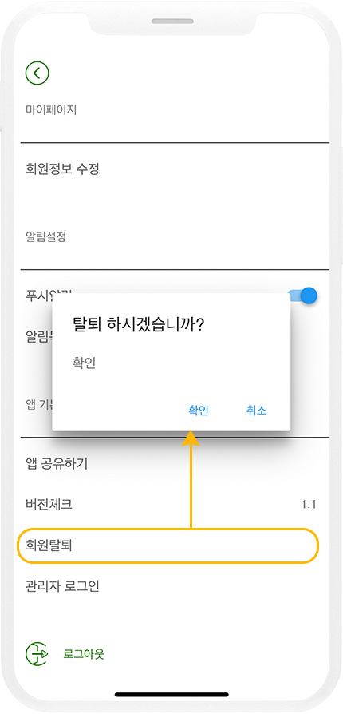

# 플레이스토어 앱 심사 거절 사례

***

**플레이스토어 앱 심사 거절 사례 (자주 발생되는 심사 거절 사유)**

안녕하세요 스윙투앱입니다.

플레이스토어 앱 심사에서 자주 발생되는 심사 거절 사례를 알려드립니다.

플레이스토어 심사 거절 사유는 너무나 다양하여, 모든 심사 사례를 다 알려드릴 수 없는 점 양해 부탁드려요.

알려드리는 사항은 대표적인 심사 거절 사례입니다.

스윙투앱으로 앱제작 한 뒤, 플레이스토어 업로드 대행 신청하신 분들은 심사 거절 사유에 맞는 조치사항을 알려드리구요.

정상적으로 앱 출시가 될 때까지 심사를 계속 진행해드리니 걱정하지 않으셔도 됩니다.

아래 본문을 통해 플레이스토어에서 자주 발생되는 심사 사유(사례)를 확인해주세요.&#x20;

<figure><figcaption></figcaption></figure>

### **1.앱 로그인 계정 정보**

**–거절사례: 로그인 계정 정보를 제출하지 않는 경우**&#x20;

앱에 로그인 기능이 있을 경우 반드시 테스트용 로그인 계정(아이디, 비밀번호) 제출해야 합니다.

스윙투앱으로 제작한 앱에서도 회원가입, 로그인 기능을 제공하고 있구요.

웹사이트를 연결한 웹뷰, 푸시앱에서도 로그인 기능이 있을 경우 애플에 제출한 데모계정을 제공해주셔야 합니다.

해당 계정은 애플에서 직접 로그인하여 앱의 모든 메뉴를 확인하고 검수하는데 이용되므로 실제 로그인 가능한 계정으로 제출해주셔야 하구요.

관리자 권한이 아닌 사용자 계정으로 제출해주세요. 테스트용으로 따로 가입한 뒤 제공 해주셔도 좋습니다.&#x20;

이미지 참고) 스윙투앱 앱 로그인 화면

<figure><figcaption></figcaption></figure>

***

### **2.회원탈퇴(계정삭제) 기능**

**-거절사례: 로그인 기능이 있는 앱에서 "계정삭제(회원탈퇴)"기능을 제공하지 않을 경우**

일반 프로토타입앱에서는 설정 메뉴에 회원탈퇴 기능이 자동 셋팅되어 제공되고 있습니다.

웹사이트를 연결한 웹앱- 웹뷰, 푸시앱 사용자분들은 사용자분의 웹사이트 내에 "계정삭제(회원탈퇴)" 기능을 반드시 추가해주셔야 합니다.

이미지 참고) 스윙투앱 앱에서 제공되는 회원 탈퇴 기능&#x20;

<figure><figcaption></figcaption></figure>

***

### **3.개인정보처리방침, 이용약관**

**–거절사례: 개인정보처리방침 미등록, 내용 미기재**&#x20;

플레이스토어 앱 제출시 개인정보 처리방침 URL을 입력하게 되는데요.

웹사이트를 연결한 웹앱 – 웹뷰, 푸시앱은 사용자의 웹사이트에서 제공하는 개인정보 처리방침 URL 입력하시면 되구요.

스윙투앱 일반 프로토타입으로 제작한 분들은 자체적으로 이용약관이 기본 셋팅되며, URL이 제공됩니다. 따라서 일반 앱제작 사용자분들은 스윙투앱에서 제공하는 개인정보 처리방침 URL로 제출하시면 됩니다.

단, 내용은 샘플 내용으로 제공되기 때문에 상호명 등은 반드시 수정해서 사용해주셔야 합니다.

☞ [이용약관 이용방법 보러가기](https://wp.swing2app.co.kr/documentation/appmanage/service/terms-of-app/)

플레이스토어 앱 등록시 해당 URL을 제출하지 않을 경우 심사가 거절되구요.\
&#x20;또한 URL을 제출했으나 약관에 아무런 내용이 없거나, 잘못된 내용이 입력되어 있을 경우도 심사가 거절됩니다.&#x20;

\*해당 내용은 애플 앱스토어도 동일하게 적용됩니다.&#x20;

<mark style="color:green;">이미지 참고) 스윙투앱 앱에서 제공되는 이용약관 및 개인정보 처리방침 화면</mark>&#x20;

<figure><figcaption></figcaption></figure>

<mark style="color:green;">이미지 참고) 앱 가입 정책 – 서비스 이용약관 URL 제공</mark>

<figure><figcaption></figcaption></figure>

***

### **4.사용자 제작 컨텐츠 – 신고 기능**

**–거절사례: 게시판 기능에서 신고 기능이 제공되지 않는 경우**

커뮤니티 – 게시판 작성, 댓글 작성의 기능을 제공하는 앱은 사용자 컨텐츠 정책에 따라 신고 기능을 제공해야 합니다.

\*사용자 정책: 게시물 신고, 사용자 신고, 사용자 차단 해당 기능을 제공해야 합니다.

사용자 신고시 해당 글은 즉시 삭제 처리되어야 하며 신고를 받은 사용자 역시 웹에서 블락((제거)처리되어야 합니다.

스윙투앱 일반 프로토타입으로 제작한 앱에서는 게시판에 신고 기능이 기본 셋팅되어 제공되기 때문에 사용자분들이 추가적으로 해야할 것은 없습니다.

웹사이트를 연결한 웹앱- 푸시, 웹뷰앱 사용자분들은 앱에 연결한 웹사이트에 신고 기능이 있는지 확인해주세요.

신고 기능이 없다면, 위에서 안내드린 것처럼 신고/차단 기능을 모두 제공해주셔야 합니다.

\*해당 내용은 애플 앱스토어도 동일하게 적용됩니다.&#x20;

<mark style="color:green;">이미지 참고) 앱 게시판-게시물 신고&사용자 신고&차단 기능 제공</mark>&#x20;

<figure><figcaption></figcaption></figure>

<figure><figcaption></figcaption></figure>

***

### **5.웹뷰, 푸시앱 – 웹뷰 스팸 정책 위반(사전고지 문서 제출)**

**–거절사유: 웹뷰 스팸 정책에 따른 증빙 서류 미제출**

<mark style="color:red;">\*해당 정책은 웹사이트 연결한 웹앱 - 웹뷰, 푸시앱만 해당 됩니다.</mark>&#x20;

웹뷰 or 푸시 앱으로 플레이스토어에 출시할 경우 해당 웹사이트의 사업자 정보를 확인할 수 있는 웹사이트 도메인 등록정보 서류를 함께 제출해야 합니다.&#x20;

> **-웹 도메인 등록 확인증 제출 : 도메인 이름, 등록인, 사업자 정보 등이 기재된 내용**.
>
> **\*웹사이트 도메인 등록정보란?**
>
> **웹 도메인 소유자를 증빙하는 서류로 웹사이트 제작한 호스팅 및 도메인 업체에서 발급받을 수 있습니다.**

**\*웹뷰 스팸 정책은 앱에 연동한 웹사이트가 사용자의 소유가 맞는지 다른 사람의 웹사이트를 허가 없이 쓰는 것이 아닌지를 판단하는 정책입니다.**

따라서 앱 심사 제출에서부터 위의 증명 서류를 제출하면 문제없이 앱 출시가 가능합니다. &#x20;

스윙투앱으로 업로드 대행을 하시는 분들은 저희가 서류를 받아서 함께 제출해드리며, 직접 업로드 하시는 분들은 스토어 등록정보에서 서류를 제출해주시기 바랍니다.&#x20;

<mark style="color:green;">이미지 참고) 사전고지 문서: 웹 도메인 등록 확인서 예시</mark> &#x20;

<figure><figcaption></figcaption></figure>

도메인 서류는, 웹사이트를 만든 호스팅 업체에서 발급받을 수 있습니다.

만약 도메인 등록증 발급이 어렵다면, 웹사이트 도메인 관리자 화면 캡쳐 or 도메인 구매 비용 영수증 등으로 대체하여 제출 가능합니다.

이러한 서류를 제출하지 않았을때 웹뷰 스팸 정책으로 심사가 거절됩니다.

만약 해당 내용으로 심사가 거절 된다면, 사전고지 문서로 증빙서류만 제출하시면 되요.

이와 관련된 상세 내용은 아래 매뉴얼로 확인해주세요.

[플레이스토어 사전고지 문서 제출하기](https://blog.naver.com/swing2app/221831938284)

\*네이버, 다음 등 포털에서 제공되는 사이트, sns, 유튜브, 블로그 등은 도메인을 증명할 수 없기 때문에 출시가 불가할 수 있습니다.&#x20;

\*또한 다른 사람의 웹사이트를 허가 없이 걸 경우 웹뷰 도메인 소유권 위반으로 플레이스토어 출시 불가합니다.

***

### **6.소프트 업데이트 금지**

**–거절사례: 앱 실행시 소프트 업데이트 창이 뜨는 경우**&#x20;

스윙투앱 내 소프트 업데이트(재실행) 은 앱 내에서 업데이트가 되는 기능으로, 스토어에 출시하지 않은 경우는 편리하게 사용이 가능합니다.

단, 구글은 앱 내 자동 업데이트를 금지하고 있습니다.

따라서 플레이스토어/앱스토어에 앱이 출시되었거나 출시할 앱은 소프트 업데이트를 이용하지 않도록 해주셔야 합니다.&#x20;

-플레이스토어 앱 이용중에는 소프트 업데이트 금지, 하드 업데이트(앱 재설치)로 선택해서 업데이트 진행해주세요.

-플레이스토어 심사 중에는 앱 업데이트를 이용하지 않도록해주세요.(심사 중 앱 버전이 다를 경우 앱 심사가 거절됩니다)

-플레이스토어 앱 출시 후에 업데이트를 할 경우, 플레이스토어에도 해당 버전 앱으로 업데이트를 해주셔야 합니다.&#x20;

***

### **7.**&#xC9C0;적재산권 정책 위반

**–거절사유: 명품 모조품(레플리카) 판매 , 유명 브랜드 컨텐츠/로고 이용, 저작권이 있는 컨텐츠 및 이미지 사용**&#x20;

위의 내용은 모두 비슷한 유형의 정책 위반 사유이기 때문에 함께 설명하겠습니다.

#### 1)모조품, 이미테이션 제품 판매 

플레이스토어는 모조품을 판매하거나 홍보하는 앱을 허용하지 않습니다.

명품 브랜드를 위조 및 모방하여 만든 제품을 판매하는 쇼핑몰이 대표적입니다.

속칭 짝퉁(레플리카, 이미테이션)이라는 불리는 상품을 판매하는 앱은 출시 불가합니다.

이러한 상품을 판매하는 앱일 경우 출시는 되고 있지만 이용자들의 신고가 접수되면 가차없이 앱 삭제 및 계정이 삭제될 수 있습니다.

#### 2)저작권이 있는 콘텐츠 무단 사용 

앱 아이콘 이미지나 스샷이미지, 랜딩이미지 등에 저작권이 있는 이미지를 사용한 경우에요

당연할 수 있는 내용이나, 생각보다 많은 앱이 이 케이스로 심사에서 거절이 되요.

아무래도 인터넷 검색시 무분별하게 나오는 콘텐츠를 확인하지 않고 그대로 사용할 경우 저작권을 인식하지 못하고 사용할 수 있습니다.

아래 내용은 구글에서 제시하는 저작원 콘텐츠 무단 사례의 예시입니다.


-유명 연예인의 이미지(사진), 영화, TV 프로그램, 뮤직비디오 등의 이미지 &#x20;

-음악 앨범, 비디오 게임, 책의 커버 이미지입니다.

-대학 및 특정 기관의 로고 이미지&#x20;

-영화, TV 프로그램, 비디오 게임의 마케팅 이미지입니다.

-만화책, 만화, 영화, 뮤직비디오, TV 프로그램의 포스터 또는 이미지입니다.

-대학 및 프로 스포츠 팀 로고입니다.

-유명 인사의 소셜 미디어 계정에서 가져온 사진입니다.

-유명 인사를 전문 사진사가 촬영한 이미지입니다.

-저작권 보호를 받는 원본과 구별할 수 없는 복제물 즉, '팬아트'입니다.

-앱이 저작권 보호를 받는 콘텐츠의 오디오 클립을 재생하는 사운드보드를 포함합니다.

-공개 도메인에 없는 책의 전체 복제물 또는 번역물입니다.


***

### **8.허위 설명 – 사기 행위**

**–거절사례: 사실이 아닌 내용을 왜곡되게 설명하는 경우**

설명, 제목, 아이콘, 스크린샷 등에 잘못되거나 오해의 소지가 있는 정보 또는 주장이 포함된 앱은 허용되지 않습니다.

1\)실적, 수상을 나타내는 컨텐츠 및 이미지 금지 (ex:금메달 수상, 이달의 브랜드상 수상 등의 언급도 금지)

2\)등수(1등, 2등..) No.1, TOP 등의 컨텐츠 사용 금지

<figure><figcaption></figcaption></figure>

3\)가격과 관련된 컨텐츠: 세일(sale), 무료(free) / 프로모션 정보

<figure><figcaption></figcaption></figure>

4\)영문 앱이름 제출시 ‘대문자’로만 입력하는 이름 금지 \*소문자와 혼용

5\)오해를 불러일으키는 의료 또는 건강 관련 주장

<mark style="color:green;">예시) 암이 100% 치료 된다는 내용</mark>

<figure><figcaption></figcaption></figure>

6\)앱과 관계가 없는 브랜드, 정부기관을 언급한 경우

예시) 사칭: “건강보험 공단 제휴앱” , “아이유 팬클럽 공식 앱”

***

### 9.메타 데이터 정책 위반

**리젝사유: 외부 앱 설치 연결, 유튜브 광고 정책**

메타 데이터 정책 위반에 해당 되는 다양한 심사 사례들을 알려드립니다.

#### 1)장치 및 네트워크 남용 

Google Play를 통해 배포되는 앱은 Google Play의 업데이트 메커니즘 이외의 방법을 이용하여 자체적으로 수정, 교체 또는 업데이트할 수 없습니다.

마찬가지로 앱은 Google Play가 아닌 소스에서 실행 가능한 코드(예: dex, JAR, .so 파일)를 다운로드할 수 없습니다.

즉, 앱 내에 다른 앱을 다운받도록 유도하거나 구글 플레이스토어가 아닌 다른 경로(APK파일 다운 등)로 앱을 올려놓은 경우입니다.

(1)플레이스토어를 거치지 않고, 앱 자체 업데이트를 제공하는 경우 입니다.

예)"앱 파일 혹은 앱 설치가 가능한 링크(URL)을 올려놓고, 다운받도록 유도"

(2)앱 내에 다른 앱을 다운 받도록 유도, 앱 플레이스토어 링크를 걸어놓은 경우입니다.

예)"플레이스토어에서 OOO앱을 다운받으세요"

​

#### 2)기기 및 네트워크 악용 정책 위반 

앱이 서비스 약관을 위반하는 방식으로 서비스 또는 API에 액세스하거나 이를 이용해서는 안됩니다.

예를 들어 YouTube 서비스 약관을 위반하는 방식의 YouTube 동영상 다운로드, 수익 창출, 액세스는 허용되지 않습니다.

유튜브 영상과 광고를 적용한 웹앱에서 자주 위반 되는 내용 중 하나 입니다.

이미지 참고)

유튜브 영상이 기사 내에서 재생이 되고 있는데요.

영상 시청시 첨부된 이미지에서 보이는 것처럼 영상 아래 광고 배너가 함께 보이고 있어요,

유튜브 정책상 영상시 수익을 창출하는 것은 허용되지 않기 때문에 고객님의 앱이 위반 사유에 해당됩니다. (광고로 인한 수익창출)

따라서 이렇게 웹사이트 내에 광고를 제공하고 있다면,

유튜브 영상이 재생되는 곳에는 광고 제거(숨김 처리)해주시기 바랍니다.

### 10.스팸 정책 위반 

**거절사유: 플레이스토어에 제출된 앱과 동일한 앱을 계속 만들어내는 경우**

#### 1)중복되는 콘텐츠 

기능이나 콘텐츠, 디자인이 매우 유사한 여러앱을 제작하여 배포하는 경우 입니다.

예시)

좋은글알림1, 좋은글알림2, 좋은글알림3

이렇게 비슷한 앱을 여러 개 배포할 경우 스팸 정책- 중복되는 콘텐츠 위반을 받게 되요.

하나의 앱으로만 배포해야 합니다.

<figure><figcaption>
중복컨텐츠 앱 예시
</figcaption></figure>

#### 2)웹앱 혼동 

(1)웹사이트 내에 다른 웹사이트 연결을 숨겨놓은 경우

예시) 정부에서 지원되는 보조금 등 사용자들에게 정보를 제공하는 웹사이트로 제출,

\[자세히보기] 버튼을 클릭하면 개인정보 수집을 위한 페이지로 이동합니다.

​

(2)혹은 여러 웹사이트 링크를 혼합하여 제공하는 경우

예시) 'OTT 프로그램 가이드 제공'이라고 앱을 만들었으나, 웹사이트가 본인이 만든 사이트가 아니며

넷플리스, 디즈니, 티빙, 웨이브 등 모든 OTT 플랫폼 공식 사이트를 연결한 경우 입니다.

<figure><figcaption></figcaption></figure>

***

### 11.컨텐츠 위반 

**거절사유: 구글에서 규정한 컨텐츠 정책에 위반한 경우**

#### 1)부적절한 콘텐츠 

성적인 콘텐츠 및 욕설

음란물을 비롯한 성적인 콘텐츠를 제공하거나 서비스를 홍보하는 앱을 출시 불가합니다.

* 대상이 옷을 입지 않고 있거나 흐리게 처리되어 있거나 최소한의 옷만을 입고 있거나 공공장소에 적합하지 않은 옷을 입고 있는 성적인 노출 또는 선정적인 자세의 묘사
* 성행위 또는 선정적인 자세를 묘사하거나 신체 부위를 성적으로 묘사하는 애니메이션 또는 삽화

#### 2)민감한 사건 

국가 내 비상사태, 자연재해, 테러, 전쟁 등에 관련된 앱도 허용되지 않습니다.

코로나와 같은 국가 질병정보를 다루는 앱도 안되요!

#### 3)불법 활동 

담배 및 주류를 판매하거나 홍보를 조장하는 앱은 허용되지 않습니다.

#### 4)현금 도박, 현금 게임, 토너먼트 앱 

사용자가 실제 금전적 가치가 있는 상품을 획득하기 위해 실제 현금(현금으로 구매한 인앱 상품 포함)으로 내기를 하거나 돈을 걸거나 이에 참여하도록 지원하거나 조장하는 콘텐츠 또는 서비스는 허용되지 않습니다.

여기에는 온라인 카지노, 스포츠 베팅, 복권, 돈을 받고 현금 또는 기타 실물 가치를 상품으로 제공하는 모든 컨텐츠가 포함됩니다.

<figure><figcaption></figcaption></figure>

**그 외 플레이스토어 심사 정책 내용은 아래 내용으로 참고해주세요.**&#x20;

1\)저작권 보호를 받는 콘텐츠를 무단으로 사용하거나, 시중에 출시된 앱과 동일한 이름으로 명의를 도용하는 경우, 상표권을 도용하는 경우 (출시 불가)&#x20;

2\)구글 플레이스토어 정책상 온라인 카지노, 스포츠 베팅, 복권 또는 현금이나 기타 상품을 상으로 제공하는 사행성 게임 등 온라인 도박을 조장하는 콘텐츠나 서비스는 허용되지 않습니다.(출시 불가)&#x20;

3\) 술, 담배, 니코틴, 전자 담배를 판매하거나 관련 컨텐츠를 포함하는 앱은 허용되지 않습니다. (출시 불가)&#x20;

4\) 포르노와 같은 음란물을 포함하거나 홍보하는 앱은 허용되지 않습니다. 일반적으로 성적 만족을 주기 위한 콘텐츠는 허용되지 않습니다. (출시 불가)&#x20;

5\)상품권, 핸드폰 소액결제 상품화, 소액결제현금화 등의 앱은 정보통신법 및 금융법 관련하여 구글에서 금지한 앱입니다. (출시 불가)&#x20;

6\) 금융상품, 재무 컨설팅, 대출, 암호화폐, 바이너리 옵션을 판매하거나 관련된 상품 및 서비스를 제공하는 앱은 허용되지 않습니다.&#x20;

7\) 저작권/지적재산권 위반: 제3자 혹은 타업체의 지적재산권을 무단 사용하는 경우. 특히 제3자의 컨텐츠, 영상을 올리고 앱에서 광고 수익을 창출하는 경우 승인 불가합니다.&#x20;

8\)웹뷰 및 푸시버전앱(웹사이트를 연결한 웹앱)은 구글 웹뷰 정책에 따라 증빙서류(사전고지 문서)를 제출해야 합니다.

앱에 연결한 사이트가 본인 혹은 업체(회사) 소유라는 것을 증명할 수 있도록 사업자등록증 혹은 웹사이트 도메인 등록 확인서 등의 사전고지 문서 제출해야 합니다.

본인 소유가 아닌 타 웹사이트를 웹앱으로 연결할 경우 플레이스토어 출시가 불가합니다.&#x20;

9\)웹앱-웹뷰,푸시앱 제작시 본인 소유의 홈페이지 외에 유명 브랜드 타 소유권의 웹링크(URL)만 연결해서 제작한 앱은 심사가 거절될 확률이 높습니다.&#x20;

<mark style="color:red;">\*중요\*</mark>&#x20;

웹뷰앱 정책 위반 \_특히 타 웹사이트, 네이버 등 포털사이트, sns, 유튜브, 다른 사람의 웹사이트를 허가 없이 걸 경우 소유권 위반으로 심사시 거절됩니다.&#x20;

10\) 실물상품을 제외한 상품 판매 – 디지털제품, 기부,후원,구독 등은 구글 플레이 결제시스템(인앱 결제모듈)을 탑재해야 합니다.

단, 카드 결제/ 무통장입금 등의 일반 결제모듈을 함께 적용할 수 있습니다. (일반 결제모듈만 적용하는 것은 안되며, 반드시 구글 인앱 결제와 함께 적용되어야 합니다.)

구글 플레이 결제 시스템 수수료: 15% , 개발자 제공 결제시스템 수수료 :11%

\*인앱 수수료: 1년 매출액이 10억 이하는 인앱 결제 수수료 15%, 10억 이상은 30% 수수료 발생

웹앱은 사용자분의 웹사이트에 직접 탑재해주셔야 하며, 일반 프로토타입으로 제작한 앱은 스윙투앱 개발로 작업해드릴 수 있으나 앱 내부 볼륨에 따라 개발 비용은 달라집니다.&#x20;

상담 후 비용 안내가 가능합니다.

플레이스토어 앱 제출시 참고해주세요.

감사합니다.&#x20;
