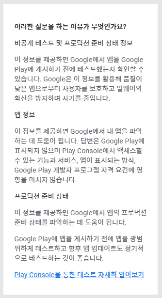
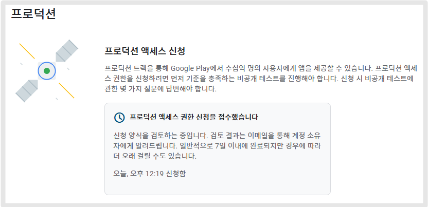
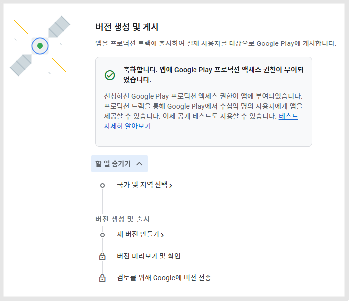

# 비공개 테스트 가이드 및 주의사항

***

이제 구글 개발자 '개인' 계정 사용자들은 앱을 바로 프로덕션에 출시할 수 없으며,

구글에서 제공하는 비공개 테스트에 통과한 뒤 -스토어 배포를 허용하고 있습니다.

앱을 프로덕션에 게시하기 전에는 반드시 비공개 테스트를 진행해야 합니다.

프로덕션 액세스 권한을 신청하려면 12명 이상의 테스터가 비공개 테스트에 참여하겠다고 선택해야 합니다.

이 테스터들은 최근 14일 동안 지속적으로 비공개 테스트에 참여하겠다고 선택한 상태여야 합니다.


\[신규 개인 개발자 정책 내용]

2023년 11월 13일 이후 구글 개발자 ‘개인’으로 신규 등록 하신 분들은 플레이스토어 앱 출시 할 수 없습니다. \*조직은 바로 등록 가능

1\)신규 개발자는 프로덕션에 앱 게시를 바로 할 수 없습니다.

2\)앱은 비공개 테스트 등록으로 제출하고 12명의 테스터 계정을 연결 해주셔야 합니다.

3\)테스트는 14일간 진행되어야 합니다.

4\)12명의 앱 실행 및 14일 기간이 종료된 후 프로덕션으로 전환하여 앱 제출을 요청할 수 있습니다.


***

## 📢비공개 테스트 진행 과정 정리

1.구글플레이 콘솔에서 기본적인 앱 등록 모두 진행 (스토어 등록정보, 스토어 설정, 앱 컨텐츠 항목 등)

2.비공개 테스트에서 테스트 트랙 만들고 앱 업로드 (AAB파일 등록)

3.테스트 할 12명 사용자 등록 \*이메일 등록

4.앱 게시 바로 되지 않으며 —> 심사 후 3-4일 후 이용 가능

5.앱 게시가 시작되면, 12명 테스터들에게 앱설치 링크 전달&#x20;

6.14일간 앱 테스트 진행

6.테스트 동안 모든 테스터는 앱 설치 후 앱 실행 기능 이용을 전부 다 진행해봐야 합니다.

7.테스트 기간 동안, 앱 업데이트도 해주세요. 버전 올려서 업데이트 제출

8.테스터들은 비공개 의견(리뷰)남기기, 개발자 메일로 의견 전달 등 의견을 남기고 개발자는 의견을 수집해야 합니다.

9.14일 이상 비공개 테스트 통과하면, 프로덕션 신청 버튼이 활성화 됩니다.

10.프로덕션 신청 전 구글에서 제공하는 질문에 대한 답변을 작성합니다.  —> 심사 3\~4일 소요

11.프로덕션에서 출시할 앱을 다시 올려주세요. \*기존 비공개 테스트에 올린 앱 동일하게 프로덕션에서 올려주시면 됩니다.&#x20;

12.프로덕션 앱심사 \~7일 소요 , 심사 완료시 앱은 플레이스토어에 출시됩니다.&#x20;


출시까지의 기간 짧게는 20일 \~ 길게는 30일이 소요됩니다.

비공개 테스트 통과가 되지 않을 경우, 14일 테스트를 다시 진행해야 하기 때문에 불합격시 시간은 더 소요될 수 있습니다.&#x20;


***

## 📢새로운 테스트 요구 사항

​

<mark style="color:green;">**구글 비공개 테스트 인원수가 변경되었습니다.**</mark>

<mark style="color:green;">**20명 ->12명으로 감소**</mark>

​

2024년 12월 기준으로, Google은 2023년 11월 13일 이후 생성된 개인 계정 개발자들이 14일 동안 최소 12명의 테스터와의 폐쇄 테스트를 수행해야 한다고 요구합니다.

이는 이전의 20명 테스터에서 대폭 줄어든 인원 수 입니다.

아무래도 현실적으로 20명의 테스터를 모집하기가 쉽지 않기 때문에 개발자들의 의견을 수렴하여 12명으로 다시 수정이 되었습니다.

따라서 비공개 테스를 진행할 때는 이제 (24년 12월 이후 기준) 12명의 테스터&14일간 테스트를 진행하면 되겠습니다.

***

## 📢비공개 테스트 권장사항

### 1.테스터와 소통하기

베타 테스터 그룹을 모집했다면 앱을 테스트하고 버그를 신고하는 방법에 관한 명확한 안내를 제공하는 것이 중요합니다.

테스터에게 개발자가 어떤 유형의 의견을 원하는지 알리세요.

테스터들로부터 전반적인 의견을 받을 수 있도록 앱의 기능을 최대한 많이 사용해 보라고 독려하세요.

의견 채널을 제공하거나 사용자에게 의견을 보내는 방법(예: 이메일, 웹사이트, 메시지 포럼 등)을 알려주세요.

테스터는 Google Play를 통해 비공개 의견을 제공할 수도 있습니다.

​

### 2.사용자 의견 수집 및 확인하기

앱을 테스트하는 중에 Play Console에서 사용자 의견에 액세스하고 답변을 작성할 수 있습니다.

사용자의 베타 의견은 나만 확인할 수 있으며 Google Play에 표시되지 않습니다.

<figure><figcaption></figcaption></figure>

앱 test를 하는 동안 테스터는 의견을 남길 수 있습니다.

이렇게 남긴 의견에 대해서 개발자는 답변을 달아주세요.

구글 플레이 콘솔- 앱 선택 - 모니터링 및 개선 - 평점 및 리뷰: 테스트 의견 선택시 의견을 확인할 수 있습니다.

개발자가 답변을 입력해주시면 됩니다.

<mark style="color:red;">\*의견이 작성이 안될 경우도 비공개 테스트 승인이 불가하오니, 꼭 테스터들에게 전달해서 의견을 남겨달라고 해주세요.</mark>

​

### 3.사용자 의견 반영하기

앱 테스트 기간 동안 테스터의 의견에 응답해야 하며 발견된 버그를 수정해야 합니다.

이 작업으로 인해 나타날 수 있는 결과는 다음과 같습니다.

* 앱의 사용자 환경 개선 지원
* 프로덕션 액세스 신청 승인 가능성 향상
* Google Play에서 앱을 배포하기 시작할 때 부정적인 리뷰를 피할 가능성 개선

***

​

## 📢프로덕션 신청 전! 인터뷰에 답변해야 합니다.

​

프로덕션 액세스 승인이 떨어져도, 바로 앱을 출시할 수 있는 것이 아니구요.&#x20;

**또 한번의 과제가 있어요.**&#x20;

바로 구글플레이에서 제공하는 인터뷰 - 질문에 대한 답변을 입력해야 합니다.&#x20;


질문에 얼마나 성의있게, 상세히 답변하는지에 따라서도 프로덕션 승인 여부가 달려있습니다.

담당자가 직접 내용을 보고 판단하기 때문에, 최대한 상세히 성의 있게 기재해주세요.


<figure><figcaption></figcaption></figure>

**✅구글에서 나오는 질문 및 작성해야 하는 답변 정보는 아래 가이드를 통해 확인해주세요.**



<figure><figcaption></figcaption></figure>

신청 양식 접수를 완료했습니다.

구글에서 검토 후 계정 소유자의 이메일로 전송합니다. 7일 이내 완료된다고 기재되어 있는데요.

**평일 기준은 3일 정도 소요되는 것 같아요.**

**주말이나 공휴일에는 7일 정도 소요될 수 있으니 참고해서 진행해주세요.**

​

***

## 📢어떤 경우 비공개 테스트가 거절되나요?


1\)테스트 참여를 선택한 테스터가 12명이 되지 않거나 비공개 테스트 중 테스터가 참여하지 않는 경우가 여기에 해당합니다.

2\)테스터 피드백(의견)이 없을 경우

3\)테스트 동안 앱 업데이트가 한번도 진행되지 않은 경우

4\)앱에 장애가 있거나 실행 불가 등의 이슈가 있었으나, 해결이 되지 않은 경우

5\)프로덕션 액세스 신청 전 제출한 질문에 대한 답변이 부족하거나, 정확하지 않은 경우&#x20;


<mark style="color:red;">승인이 거절되면, 다시 처음부터 12명의 테스터를 14일간 진행해야 합니다.</mark>

굉장히 시간이 오래 소요될 수 있으니 처음 진행시부터 문제가 없도록 가이드대로 잘 진행해주시는 것이 좋습니다.

***

## 📢프로덕션 액세스 권한부여 - 앱 출시 진행

​

프로덕션 액세스 요청을 완료하면 Google에서 제출 내용을 검토합니다.

검토가 완료되면 계정 소유자에게 업데이트 소식을 이메일로 보내드립니다.

<figure><figcaption></figcaption></figure>

신청이 승인되면 프로덕션(테스트 및 출시 > 프로덕션)에 액세스하여, 앱 출시를 진행합니다.

<mark style="color:red;">\*바로 되는 것이 아니며, 또 심사가 들어갑니다.</mark>

<mark style="color:red;">일반적으로 7일 이내에 완료되지만 경우에 따라 더 오래 걸릴 수도 있습니다.</mark>

**✅비공개 테스트 승인 후, 프로덕션 앱 제출하는 방법은 아래 가이드에서 확인해주세요.**&#x20;




플레이스토어 출시를 희망한다면, 가장 좋은 방법은 구글 '조직' 개발자 계정으로 등록하는 것이 좋구요.

사업자가 없어서 개인 개발자 계정 밖에 만들 수 없다면, 어쩔 수 없이 비공개 테스트 진행 후 프로덕션 출시를 진행해야 합니다.

스윙투앱에서는 비공개 테스트와 출시까지의 모든 과정을 대행해드리는 서비스가 오픈되었습니다.

유료 서비스 업체에서는 보통 비공개 테스트까지만 진행해드리는데요.

저희는 테스트와 프로덕션 출시까지의 과정 전체를 모두 다 해드리기 때문에, 사용자분은 전혀 신경 쓸 것 없습니다.

작업이 필요하실 경우 스윙투앱 실시간 상담 채팅으로 문의주시면 상세히 안내 도와드리겠습니다.

\*고객지원팀 이메일 : help@swing2app.co.kr

\*실시간 채팅 상담: [https://direct.lc.chat/12036120/](https://direct.lc.chat/12036120/)

(운영시간: 평일 오전 10시\~오후5시, 점심 12시\~1시제외)


***

