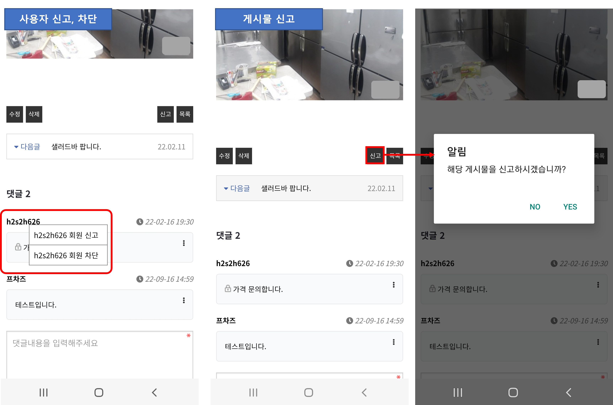

# 구글 플레이 정책 - 사용자 제작 콘텐츠(UGC)

구**글 플레이스토어 정책 - 사용자 제작 콘텐츠(UGC)에 대해 알려드립니다.**

구글 플레이스토어 신규 정책 중 많은 사용자분들이 혼란을 느끼고 어려워 하는 사항이 바로 사용자 제작 콘텐츠 정책인데요.

어떤 내용이고, 또 어떻게 앱에 반영해야 되는지 알려드릴게요.

### **1.사용자 제작 콘텐츠(UGC) 정책 이란?**

사용자들이 앱 내에 글을 작성할 수 있는 경우 사용자가 제작하는 콘텐츠라고 하여 UGC라고 부르는데요.

**\*UGC = User Generated Content**

사용자가 제작하여 앱에 제공하는 콘텐츠로, 일부 또는 전체 앱 사용자가 보거나 접근할 수 있습니다.

따라서 UGC를 포함하거나 제공하는 앱은 구글에서 요구하는 정책사항을 따라야 합니다.

\-2021년 10월 기점으로 플레이스토어 신규 앱 등록시에는 해당 정책사항이 적용되어서 심사를 받고 있구요.

\-기존 출시된 앱들은 2021년 11월을 기준으로 해당 정책이 마련되어 있지 않을 경우 앱이 스토어에 삭제 되는 등의 제재를 받고 있습니다.

### **2.사용자 제작 콘텐츠 정책 조치사항 안내**

해당 정책에 대한 조치 사항을 알려드립니다!

**-스윙투앱 일반 프로토타입(슬라이드, 탑, 푸터 등) 제작 앱**

**스윙투앱 일반 프로토타입으로 제작한 앱은 신고하기 기능이 앱 내에 모두 탑재되어 자동 제공됩니다.**

따라서 업데이트 이후에 앱을 출시한 분들은 해당 정책에 위반되지 않습니다.

단, 21년 11월 2일 이전에 만든 앱은 해당 기능이 탑재되어 있지 않기 때문에 업데이트를 한번 해주세요.

스윙투앱 앱제작 화면으로 이동하여 \[앱 업데이트] 버튼만 눌러서 새 버전으로 재제작 해주시면 됩니다.

업데이트 된 버전의 앱으로 플레이스토어에 다시 업데이트 해서 심사 받아주세요.

**-웹사이트를 연결한 웹앱**

웹사이트를 연결한 웹앱 - 웹뷰, 푸시 앱 사용자분들은 웹사이트 내에 신고 기능을 추가해주셔야 합니다.

본문 "**웹뷰, 푸시앱 신고 기능** " 내용을 참고해서 넣어주세요.

\--새로 앱을 출시하는 분들은 신고 기능이 모두 들어갔는지 체크 후 플레이스토어에 등록해주시면 되구요.

\--출시 후 해당 정책으로 앱이 삭제되거나, 경고를 받았다면 사이트에 신고 기능을 넣어서 수정해주시구요.

스윙투앱 앱제작 화면으로 이동하여 \[앱 업데이트] 버튼 눌러서 새 버전으로 재제작 해주세요.

업데이트 된 버전의 앱으로 플레이스토어에 다시 업데이트 해서 심사를 받아주시면 됩니다.



### **3.UGC 정책 요건**

UGC를 포함하거나 제공하는 앱은 다음 요건을 충족해야 합니다.

\-사용자가 UGC를 제작하거나 업로드하기 전에 앱의 이용약관 또는 사용자 정책을 수락하도록 해야 합니다.

\-Play의 개발자 프로그램 정책을 준수하는 방식으로 불쾌감을 주는 콘텐츠와 행동을 규정하고 앱의 이용약관 또는 사용자 정책을 통해 그러한 콘텐츠와 행동을 금지해야 합니다.

\-앱을 통해 호스팅되는 UGC의 유형에 부합하며 합리적인 방식으로 확고하고 효과적이며 지속적인 UGC 검토 방식을 도입해야 합니다.

\-실시간 스트리밍 앱의 경우 불쾌감을 주는 UGC가 최대한 실시간에 가까운 속도로 삭제되어야 합니다.

\-증강 현실(AR) 앱의 경우 UGC 검토(앱 내 신고 시스템 포함)에는 불쾌감을 주는 AR UGC(예: 외설적인 AR 이미지)와 민감한 AR 고정 위치(예: 군사 기지 또는 AR 고정으로 인해 소유자에게 문제가 발생할 수 있는 사유 재산과 같은 제한된 지역에 고정된 AR 콘텐츠)가 모두 고려되어야 합니다.

\-불쾌감을 주는 UGC를 신고할 수 있는 사용자 친화적인 앱 내 시스템을 제공하고 필요한 경우 UGC를 대상으로 조치를 취해야 합니다.

\-앱의 이용약관 또는 사용자 정책을 위반하는 불량 사용자를 삭제하거나 차단해야 합니다.

\-불쾌감을 주는 사용자 행동을 조장하여 인앱 수익을 창출하는 것을 방지하기 위한 보호 수단을 제공해야 합니다.


**쉽게 설명해드리면요,,**

​

1\)사용자가 UGC를 제작하거나 업로드하기 전에 앱의 이용약관 또는 사용자 정책을 수락하도록 요구해야 합니다.

<mark style="background-color:yellow;">**=앱에 이용약관, 개인정보처리방침을 적용해야 합니다.**</mark>

**​**

2\)불쾌감을 주는 UGC를 신고할 수 있는 사용자 친화적인 앱 내 시스템을 제공하고 필요한 경우 UGC에 조치를 취해야 합니다.

<mark style="background-color:yellow;">**=앱에 글 신고하기 기능을 적용해야 합니다.**</mark>

3\)앱의 이용약관 또는 사용자 정책을 위반하는 불량 사용자를 삭제하거나 차단해야 합니다.

<mark style="background-color:yellow;">**=앱에 사용자 신고 or 사용자 차단 기능을 적용해야 합니다.**</mark>

<mark style="background-color:yellow;">**​**</mark>

즉, 사용자가 글을 작성하는 콘텐츠를 제공하는 앱은

<mark style="background-color:yellow;">**=> 이용약관& 개인정보처리방침 적용, 게시물(글) 삭제하기, 사용자 신고하기 or 차단하기를 적용해야 합니다.**</mark>

**​**

**글 신고, 차단 &사용자 신고, 차단 기능을 넣어주세요!**


​

### **4.어떤 앱이 사용자 제작 콘텐츠 앱인가요?**

<mark style="color:blue;">앱을 이용하는 사용자가 앱 내에서 글을 작성할 수 있다면 모두 해당됩니다.</mark>

**예시) 커뮤니티 게시판 글 작성, 댓글, 쇼핑몰 앱 상품 후기 ..**

그 외 앱에서 사용자들이 글을 작성하여 콘텐츠를 생성할 수 있는 모든 기능에서는 UGC정책이 반영됩니다.

​

스윙투앱에서 일반 프로토타입으로 앱을 제작하는 사용자분들은 거의 대부분 해당 콘텐츠 앱이구요.

(게시판 등의 기능이 제공되고 있기 때문이에요.)

웹사이트를 연결한 웹뷰, 푸시앱 사용자 분들 역시 해당 웹사이트 내에서 사용자들이 글을 작성, 커뮤니티 개념으로 콘텐츠를 제공, 쇼핑몰 상품 후기 등을 작성한다면 모두 해당 됩니다.

​

### **5.스윙투앱 일반 프로토타입 앱은, 어떻게 조치할 수 있나요?**

<mark style="color:blue;">**스윙투앱에서 제작하는 앱은 위의 정책사항에 대한 조치가 모두 셋팅되어서 제공되기 때문에 별도 추가 조치할 것이 없습니다.**</mark>

**앱제작시 모두 반영되어 셋팅됩니다.**

문제 없이 패쓰\~! 심사 승인되어 출시됩니다.

​

<mark style="color:red;">\*단! 해당 기능은2021년 11월 2일 업데이트된 기능으로, 이전에 제작한 앱이라면 앱제작(업데이트)이 다시 필요해요.</mark>

앱제작하기(앱 업데이트) 다시 하신 뒤, 새 버전으로 앱 확인하셔야 업데이트 기능이 반영됩니다.

스토어 출시된 앱은 각 스토어별 업데이트 다시 해주셔야 합니다.

***

### **6.스윙투앱에서 제공하는 신고 기능**

.png>)

게시판과 댓글에서 신고 및 작성자 신고 기능이 제공됩니다.

\-게시판은 게시물 상단 오른쪽 점 세개 버튼을 누르면 신고하기 or 차단하기 or 작성자 신고하기를 확인할 수 있습니다.

\-댓글 역시 댓글을 작성한 사용자의 오른쪽 상단 점 세개 버튼을 누르면 선택할 수 있습니다.

**​**

**-게시물 신고 하기 선택시 게시물은 즉시 삭제되며, 관리자가 신고글에서 삭제시 영구 삭제됩니다.**

**-작성자(사용자)를 신고하면 신고를 받은 사용자는 앱에서 블락(block)처리 되며 해당 사용자가 작성한 글 역시 삭제됩니다.**

**관리자가 해당 사용자를 삭제하면 해당 회원은 앱에서 완전히 차단됩니다.**

***

### **7.웹뷰, 푸시앱 신고 기능**

웹사이트를 연결한 웹앱- 푸시, 웹뷰앱 사용자분 역시 동일하게 해당 정책이 적용됩니다.

웹사이트에 신고, 차 기능을 추가해주셔야 합니다.

​

**참고 이미지)**

<figure><figcaption></figcaption></figure>

이런식으로 상품 후기, 리뷰 등의 메뉴에 **사용자 신고하기, 차단하기 & 글 신고하기, 차단하기** 기능을 추가해주셔야 합니다.

<mark style="color:red;">\*</mark>​<mark style="color:red;">**\*주의사항\*\***</mark>

신고하기 선택시 신고된 글은 즉시 삭제되어야 하구요.

사용자 신고하기 선택시에도 신고를 받은 사용자가 작성된 글은 보이지 않도록 설정해주셔야 합니다.

관리자가 확인 후 삭제하는 시스템은 적합하지 않습니다. 신고 즉시 해당 글 및 사용자가 웹에서 삭제되어 안보이도록 처리해주세요.


<mark style="color:orange;">**안내**</mark>

**\*해당 정책을 반영하지 않았다면, 즉시 업데이트를 해주셔야 합니다.**

출시된 앱들에 대해서 필터링 검수시 해당 정책이 반영되어 있지 않은 앱은 플레이스토어에서 삭제조치합니다.

따라서 앱이 스토어에서 내려가기 전 위의 내용을 확인하여 앱에 반영해주시기 바랍니다.

​

**\*구글 경고 후, 앱을 다시 업데이트 했다면 앱은 다시 업데이트 심사에 들어갑니다.**

앱에 적용된 신고 기능이 적합한지 구글에서 판단해서 업데이트를 적용해주거나, 적합하지 않을 경우 심사를 거절합니다.

따라서 신고 기능이 정상적으로 운영되는지 확인하고 업데이트 제출을 해주세요.


