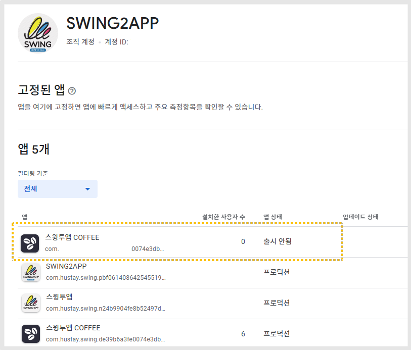

# 플레이스토어 등록된 앱 삭제


**플레이스토어 앱 삭제는 아래 조건이 충족되어야 합니다.**

1.앱에 아무런 문제가 없어야 합니다. 출시가 된 상태여야 하고, 삭제되거나 정지된 앱이 아니어야 합니다.

2.앱의 설치 수가 0이어야 합니다. \*설치된 적이 없어야 함

3.앱이 24시간 동안 게시 취소 상태여야 합니다. \*설치수를 0으로 유지하기 위해 게시 취소된 상태여야 합니다.&#x20;


***

<figure><figcaption></figcaption></figure>

출시된 앱 중 위의 앱을 삭제 요청해보도록 하겠습니다.&#x20;

***

**\*앱 삭제 요청은 구글 고객센터 링크를 타고 들어가서 양식을 작성해주시면 됩니다.**&#x20;

### <mark style="color:blue;">앱 게시 관련 문제 고객센터 링크 이동</mark>



<figure><figcaption></figcaption></figure>

<figure><figcaption></figcaption></figure>

이름과 성, 이메일주소, 내 위치는 자동으로 입력되어 들어가 있구요.

개발자 이름, 개발자 계정 ID, 앱 이름, 앱 패키지 이름을 입력해주시면 됩니다.

? 물음표 버튼을 선택하면 어떤 경로에서 정보 가져와서 입력할 수 있는지 확인 가능합니다.&#x20;

<figure><figcaption></figcaption></figure>

신청서에 "앱 삭제를 요청하고 싶음"에 체크해주세요.


앱이 다음 조건을 충족하는지 확인하세요.

* 앱에 아무런 문제가 없어야 함(Google에서 삭제되거나 정지되지 않음)
* 앱의 전체 기간 설치 수가 0이어야 함
* 앱이 24시간 동안 게시 취소 상태여야 함(설치 수를 0으로 유지하기 위해)


"무엇을 도와드릴까요?"본문 내용에는 모든 조건을 충족하며, 앱 삭제를 요청한다는 내용으로 기재해주세요.

\[제출하기] 버튼을 눌러서 신청을 완료합니다.&#x20;

<figure><figcaption></figcaption></figure>

신청서 작성 2일 후에 앱 삭제가 완료되었다는 메일을 받을 수 있습니다.

이렇게 조건에 문제가 없으면 구글 플레이 고객센터에서 콘솔에 있는 앱을 삭제해줍니다.

해당 방법을 이용하여 앱을 삭제해주시기 바랍니다.&#x20;

