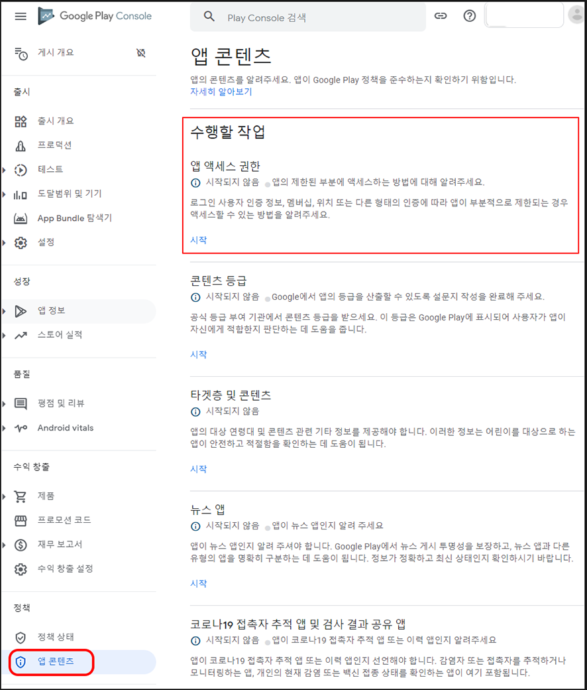
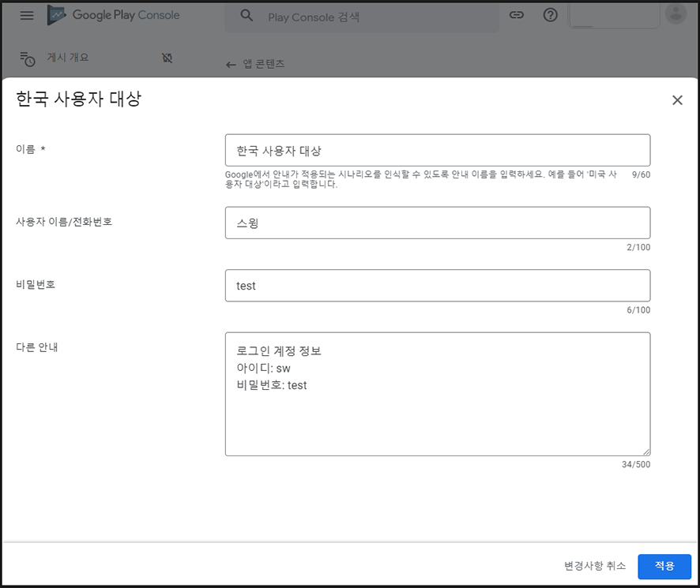
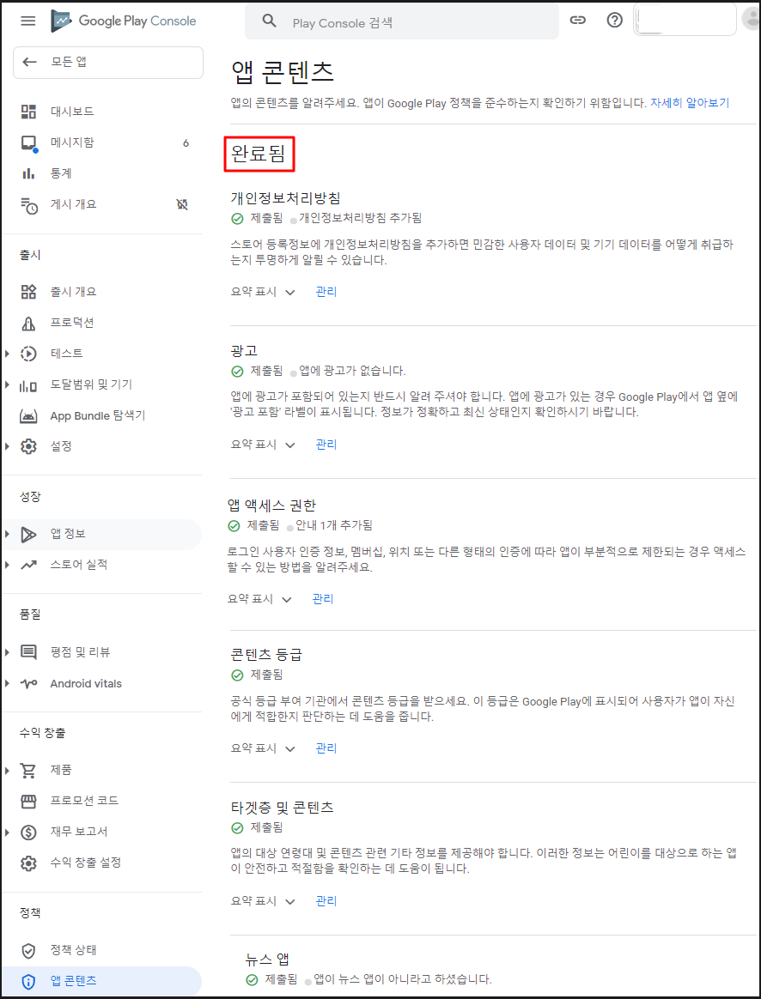

# 구글 플레이 정책 - 앱 액세스 권한

### **구글 플레이스토어 - 앱 액세스 권한 입력방법**

> **앱 액세스 권한이란?**
>
> 앱 액세스 권한은 로그인 사용자 인증 정보를 제출하는 메뉴입니다.
>
> 즉, 앱에 접근할 때 로그인이 필요할 경우 해당 로그인 정보를 제출하거나, 그외 다른 인증 형태가 있을 경우 해당 인증방법을 제출하는 것입니다.
>
> 제출한 정보로 구글에서 앱 심사시 로그인하여 메뉴들을 확인하는데 이용됩니다.

\-신규 앱을 등록하는 사용자분들은 프로세스에 따라 등록해주시면 되구요.

\-기존 앱 출시 사용자분들은 앱 콘텐츠 메뉴로 이동하시면, '앱 엑세스 권한' 메뉴를 확인할 수 있습니다.

​

**\*해당 정책은 플레이스토어에 앱을 출시했거나, 출시하고자 하는 분들은 필수!! 입력해야 하는 사항입니다.**

**따라서 기존 앱 출시 사용자분들은 해당 정책사항을 확인하시어 '액세스 권한' 메뉴를 필스 입력 완료해주세요!!**

**'액세스 권한' 메뉴가 정상적으로 입력되어 있지 않을 경우 앱이 플레이스토어에서 삭제될 수 있습니다.**

****

## **1. 앱 콘텐츠 메뉴 - 앱 액세스 권한**

**​**

**구글 플레이 콘솔 사이트 접속 후 로그인**

[**https://play.google.com/console/developers**](https://play.google.com/console/u/0/developers)

**정책 -\[앱 콘텐츠]메뉴 이동 - \[앱 엑세스 권한] 시작 버튼 선택**

\*기존 앱이 출시되어 있고, 업데이트 하는 분들은 앱 선택 후 이동해주세요.

\*신규로 앱을 출시하는 분들은 프로세스 단계별로 입력 후 이동해주시면 됩니다.

***

## **2. 앱 액세스 권한 입력**

**​**

<mark style="color:red;">**\*중요 안내**</mark>

기존 앱이 출시되어 업데이트 하는 분들은 대부분 앱 액세스 권한에 체크가 되어 있을 것입니다.

**그러나 체크된 항목이 "특수한 액세스 권한 없이 모든 기능 이용 가능"이 아닌, → "전체 또는 일부 기능이 제한됨"으로 체크한 뒤 새 안내 추가를 해주셔야 합니다.**

아래 방법으로 수정하여 제출해주세요.

\-앱 내에 회원가입, 로그인 메뉴가 있다면 **"전체 또는 일부 기능이 제한됨"**으로 체크해주셔야 합니다.

\-앱 내에 로그인 기능이 없다면(회원가입 포함) "특수한 액세스 권한 없이 모든 기능 이용 가능"에 체크해주세요.

거의 대부분의 앱이 로그인 메뉴를 제공하고 있기 때문에 **"전체 또는 일부 기능이 제한됨"에 체크한 뒤 \[+새 안내 추가]를 선택합니다.**

<mark style="color:green;">**\*\*웹사이트를 연결한 웹앱 - 푸시앱, 웹뷰앱 역시 해당 웹사이트에서 로그인 기능을 제공하고 있다면 동일하게 "전체 또는 일부 기능이 제한됨" 체크해주세요.**</mark>

**​**

### **앱 액세스 권한 : 안내 추가**

**\[ + 새 안내 추가]** 선택시 로그인 정보 입력창이 뜹니다.

**해당 정보는 모두 앱에서 로그인 가능한 정보를 입력해주세요\~!**

> **1)이름: 구글에서 제시한 시나리오 "대한민국 사용자 대상" 이라고 입력해주세요.**
>
> <mark style="color:red;">**단, 영문 앱이나 다른나라를 대상으로 한다면 해당 국가에 맞게 수정해서 입력합니다.**</mark>
>
>
>
> **2)사용자 이름/ 전화번호: 제출하는 계정의 사용자 이름과 전화번호를 입력합니다.**
>
> <mark style="color:red;">전화번호는 로그인(회원가입)에 필요한 정보가 아니라면 입력할 필요 없습니다.</mark>
>
> **​**
>
> **3)비밀번호: 로그인에 필요한 계정 -비밀번호를 입력합니다.**
>
> **​**
>
> **4)다른 안내: 로그인에 필요한 정보를 입력해주세요.**
>
> <mark style="color:red;">예시) 아이디, 비밀번호 입력</mark>

입력 후 \[저장] 버튼을 누르면 완료됩니다.

***

## **3. 앱 액세스 권한 입력완료**

**앱 콘텐츠 항목은 앱 액세스 권한 입력 외에 모든 메뉴 입력이 완료되어야 합니다.**

'완료됨'으로 표시되어야 앱 콘텐츠 항목 입력이 완료됩니다.

​

<mark style="color:green;">\*해당 정책은 플레이스토어에 앱을 출시했거나, 출시하고자 하는 분들은 필수!! 입력해야 하는 사항입니다.</mark>

<mark style="color:green;">따라서 기존 앱 출시 사용자분들은 해당 정책사항을 확인하시어 '액세스 권한' 메뉴를 필스 입력 완료해주세요!!</mark>

<mark style="color:green;">'액세스 권한' 메뉴가 정상적으로 입력되어 있지 않을 경우 앱이 플레이스토어에서 삭제될 수 있습니다.</mark>

\

