# 비공개 테스트 등록

***

구글 정책 변경으로 2023년 11월 이후 생성된 '개인' 개발자 계정은 앱 출시가 바로 불가해요.

반드시 일정기간, 일정 인원 수의 테스트를 거쳐야만 프로덕션 전환으로 승인을 하고 있습니다.

따라서 개인 개발자 계정으로 비공개 테스트 등록이 필요하신 분들은, 매뉴얼을 보시고 비공개 테스트 앱등록 방법을 확인해주세요.


<mark style="color:blue;">**\[신규 개인 개발자 정책 내용]**</mark>

1\)신규 개발자는 프로덕션에 앱 게시를 바로 할 수 없습니다.

2\)앱은 비공개 TEST 등록으로 제출하고 12명의 테스트 계정을 연결 해주셔야 합니다.

3\)테스트는 14일간 진행되어야 합니다.

4\)12명의 테스트, 14일 기간이 종료된 후 프로덕션으로 전환하여 앱 제출을 요청할 수 있습니다.

<mark style="color:red;">​2023년 11월 13일 이후 구글 개발자 ‘개인’으로 만드신 분들은 플레이스토어 앱 출시 할 수 없습니다.</mark>&#x20;

\*조직은 바로 등록 가능

\*개인 개발자 계정이라도 2023년 11월 이전에 생성했다면 앱 등록 바로 가능합니다.&#x20;


***

## 📢비공개 테스트 진행 과정 정리 

1.구글플레이 콘솔에서 기본적인 앱 등록 모두 진행 (스토어 등록정보, 스토어 설정, 앱 컨텐츠 항목 등)

2.비공개 테스트에서 테스트 트랙 만들고 앱 업로드 (AAB파일 등록)

3.테스트 할 12명 사용자 등록 \*이메일 등록

4.앱 게시 바로 되지 않으며 —> 심사 후 3-4일 후 이용 가능

5.앱 게시가 시작되면, 12명 테스터들에게 앱설치 링크 전달

6.14일간 앱 테스트 진행

6.테스트 동안 모든 테스터는 앱 설치 후 앱 실행 기능 이용을 전부 다 진행해봐야 합니다.

7.테스트 기간 동안, 앱 업데이트도 해주세요. 버전 올려서 업데이트 제출

8.테스터들은 비공개 의견(리뷰)남기기, 개발자 메일로 의견 전달 등 의견을 남기고 개발자는 의견을 수집해야 합니다.

9.14일 이상 비공개 테스트 통과하면, 프로덕션 신청 버튼이 활성화 됩니다.

10.프로덕션 신청 전 구글에서 제공하는 질문에 대한 답변을 작성합니다. —> 심사 3\~4일 소요

11.프로덕션에서 출시할 앱을 다시 올려주세요. \*기존 비공개 테스트에 올린 앱 동일하게 프로덕션에서 올려주시면 됩니다.

12.프로덕션 앱심사 \~7일 소요 , 심사 완료시 앱은 플레이스토어에 출시됩니다.


출시까지의 기간 짧게는 20일 \~ 길게는 30일이 소요됩니다.

비공개 테스트 통과가 되지 않을 경우, 14일 테스트를 다시 진행해야 하기 때문에 불합격시 시간은 더 소요될 수 있습니다.


***

## 1.플레이스토어 기본 정보 입력 하기

비공개 테스트 등록 전, 일반적인 플레이스토어 앱 등록에 필요한 모든 항목은 동일하게 넣어주셔야 합니다.

플레이스토어 모든 앱 등록 과정은 아래 매뉴얼 확인해주세요.



<mark style="color:red;">테스트 등록은 플레이스토어 모든 입력 항목(스토어 등록정보, 앱 콘텐츠)이 완료된 후 마지막 단계에서 진행을 해주세요!</mark>

<mark style="color:red;">위에 등록해드린 앱 등록 방법을보고, 다른 항목들은 모두 입력 완료해주세요.</mark>

***

​


&#x20;비공개 테스트 등록은, 플레이스토어 모든 입력 항목이 입력 완료된 후 마지막에 진행합니다.

위의 등록 매뉴얼을 보고, 등록 완료 후 비공개 테스트로 들어와서 테스트 등록을 해주세요.&#x20;


[**구글플레이 콘솔 접속** ](https://play.google.com/console/u/0/developers)



## 2.비공개 테스트-트랙 만들기

<figure>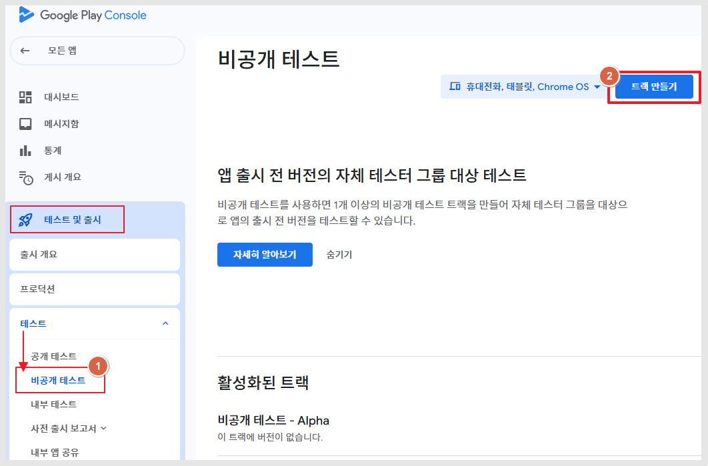<figcaption></figcaption></figure>

1\)왼쪽 메뉴 테스트 및 출시 카테고리

테스트 > 비공개 테스트 선택

2\)페이지 오른쪽 상단에서 \[트랙 만들기]를 선택합니다.

<figure>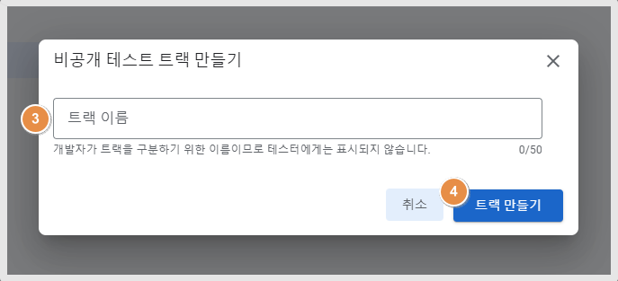<figcaption></figcaption></figure>

3\)트랙 이름을 입력합니다.

\*트랙 제목은 Play Console 및 Google Play Developer API에서 트랙 이름으로 사용됩니다.

4\)\[트랙 만들기] 선택합니다.

***

​

## 3.국가선택

<figure>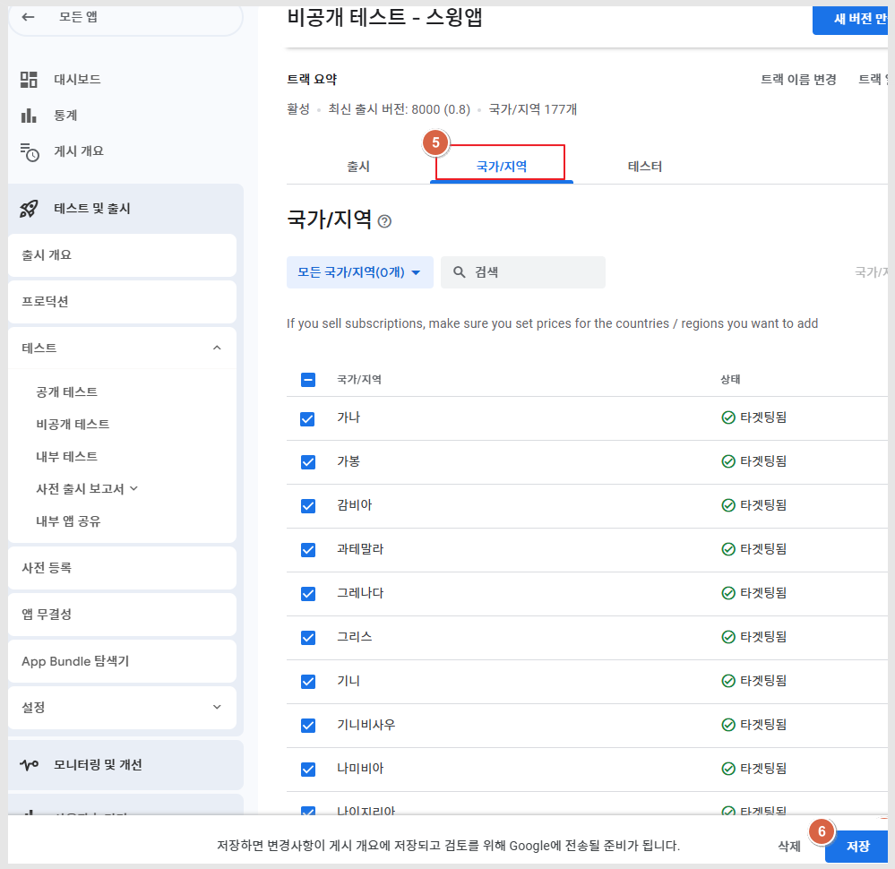<figcaption></figcaption></figure>

5\)국가/지역 탭

6\)배포할 국가를 선택한 뒤 '저장' 버튼

\* 테스트 할때는 대한민국으로만 배포하거나 전체 국가 모두 선택하셔도 됩니다. 원하는 국가로 저장 가능!

***

​

## 4.테스터 선택

<figure>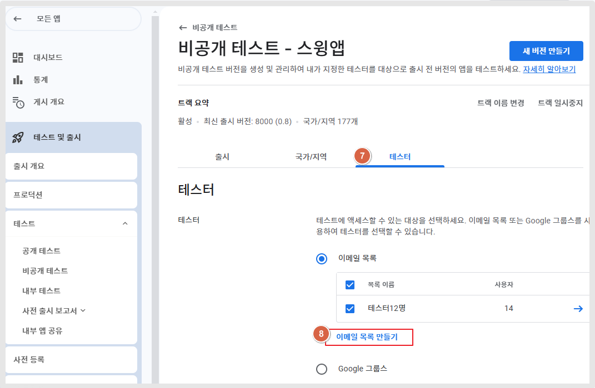<figcaption></figcaption></figure>

7\)테스터 선택

8\)이메일 목록 만들기 선택

<figure>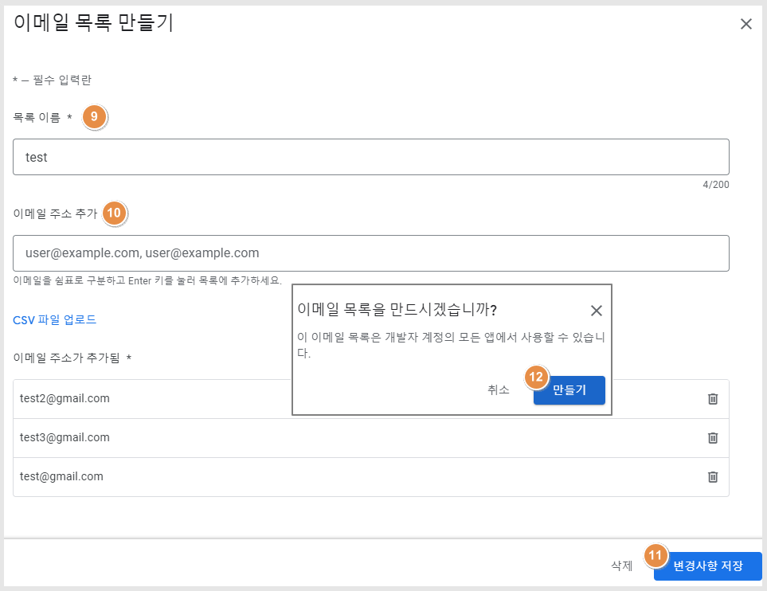<figcaption></figcaption></figure>

9\)목록 이름 \*어디에 노출되는 정보는 아닙니다. 관리자 화면에서만 확인

10\)이메일 주소 추가

이메일을 쉼표로 구분한 뒤, Enter 키 누르면 목록에 추가됩니다.


비공개 테스트는 12명의 테스터를 등록해야 하기 때문에 총 12개의 이메일주소를 입력해주셔야 합니다.

이메일은 구글 계정만 가능하며, 실제 이용이 가능한 계정이어야 합니다.

Google 그룹 이메일 주소를 입력합니다. 사용자가 입력한 Google 그룹스의 멤버인 경우에만 테스트에 참여할 수 있습니다.


<figure>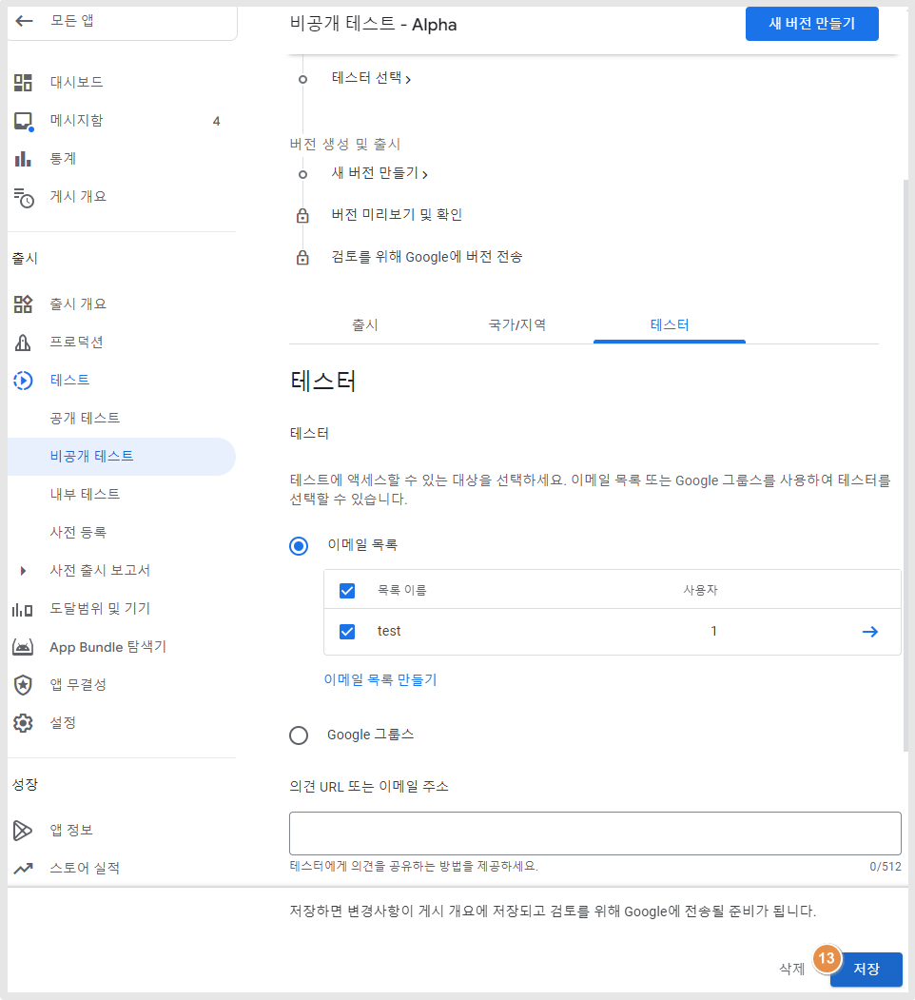<figcaption></figcaption></figure>

13\) 입력 완료 후 저장 선택

***

​

## 5.비공개 테스트 앱 등록

<figure>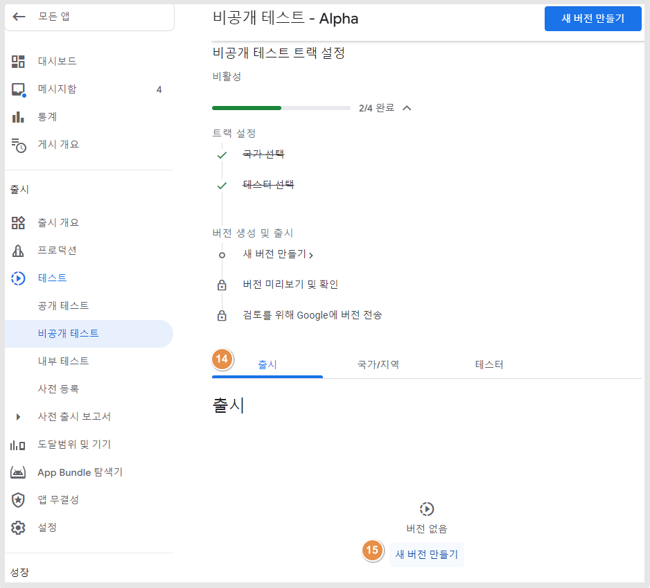<figcaption></figcaption></figure>

14\)출시

15\)새 버전 만들기 선택

​

<figure>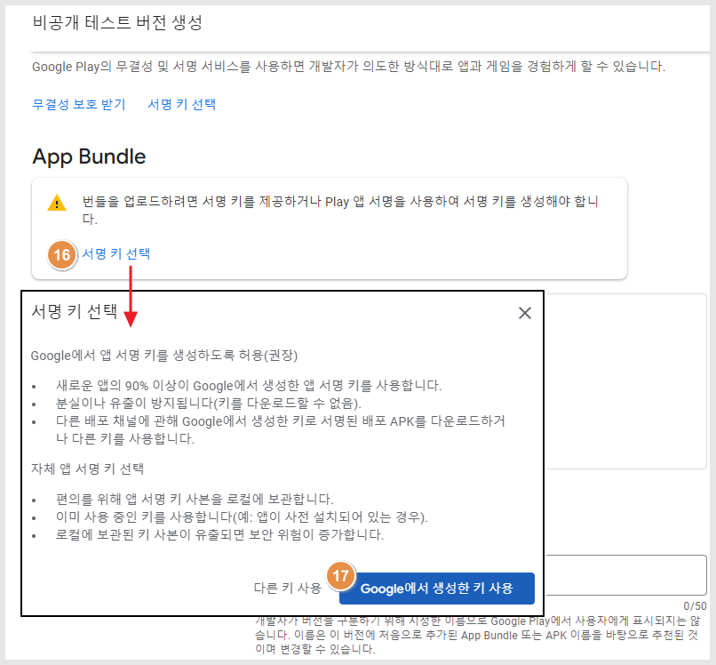<figcaption></figcaption></figure>

16\)서명 키 선택

17\)\[Google에서 생성한 키 사용] 버튼

​

<figure>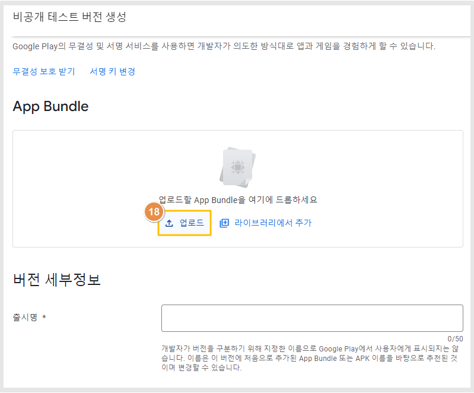<figcaption></figcaption></figure>

18\)업로드 버튼을 선택해서 aab파일을 등록해주세요.

​

<mark style="color:orange;">**\*AAB파일은 어디서 가져 올 수 있나요?**</mark>

<figure><figcaption></figcaption></figure>

스윙투앱 앱제작이 완료된 후 앱운영→ 버전관리→앱제작이력 에서 AAB파일을 받을 수 있습니다.

\*이용권 구매 후 앱 업데이트 한번 더 해주셔야 AAB파일이 생성됩니다.

\[AAB파일 받기] 버튼을 선택하면 사용자의 PC로 파일이 다운되요. (파일을 열지 말고, 다운받은 파일 그대로 업로드 해주세요)

다운된 AAB파일을 위의 구글 플레이 콘솔 App Bundle 파일로 업로드 해주시면 됩니다.

​

<figure>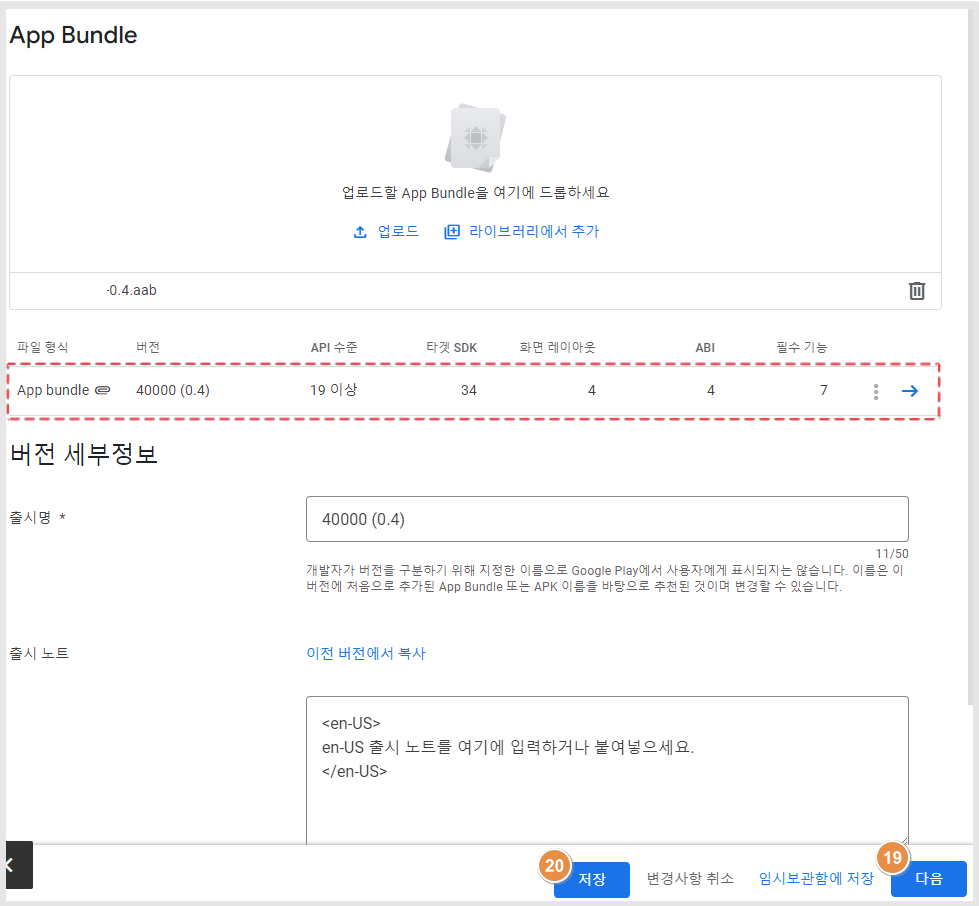<figcaption></figcaption></figure>

19\)파일 등록 후 \[다음] 버튼

20\)저장 버튼 차례로 탭 해주세요.

​

<figure>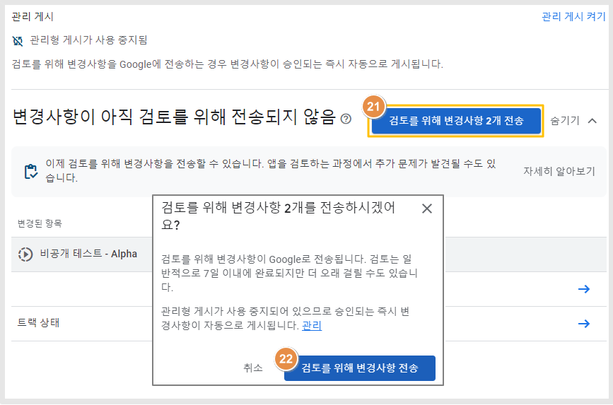<figcaption></figcaption></figure>

21\)'검토를 위해 변경사항 2개 전송' 버튼 탭

22\)'검토를 위해 변경사항 전송' 버튼

​

<figure>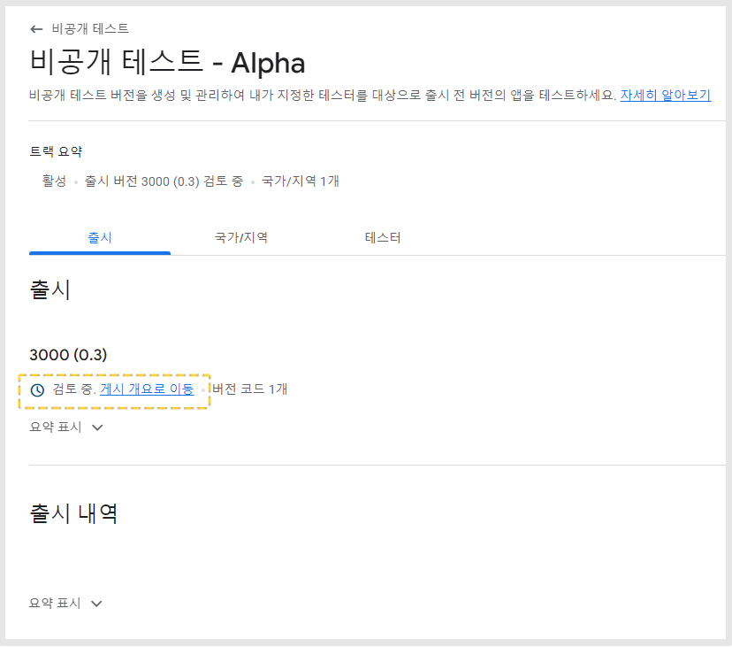<figcaption></figcaption></figure>

앱 등록이 완료되었구요.

비공개 테스트 페이지 확인시 "검토중" 임을 확인할 수 있습니다.


비공개 TEST도 앱 검토가 들어가기 때문에 일정시간 후에 앱을 다운 받을 수 있어요.

보통 3\~4일 정도 소요됩니다.

해당 시간 후에 검토완료로 변경되면, 테스터에서 앱을 다운받을 수 있는 링크가 생성됩니다.

해당 링크를 복사해서 테스터들에게 공유할 수 있습니다.


​

<mark style="color:orange;">**앱을 다운 받는 링크는 어디서 확인할 수 있나요?**</mark>

<figure>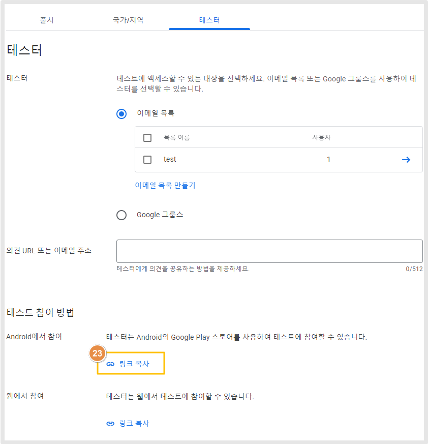<figcaption></figcaption></figure>

'테스트 참여방법' 챕터에서

23\)\[링크 복사] 버튼을 탭하면, 앱을 설치할 수 있는 플레이스토어 링크가 복사됩니다.

해당 링크를 사용자(앱 테스터)들에게 공유하여, 설치를 할 수 있습니다.

앱은 실제 12명의 사용자가 앱을 설치받아 테스트를 해야 합니다.&#x20;


**\*앱 설치시 주의해주세요.**

반드시 테스터로 등록된 이메일주소에서 앱을 다운받아 주셔야 합니다.

계정과 연동이 되기 때문에 플레이스토어 어플에 로그인 된 계정을 잘 확인한 뒤 앱을 다운받아 TEST 해주세요.

12명의 테스터가 실제 앱 다운(설치)을 모두 받아야 합니다.&#x20;

동일인 1명이 여러 구글 계정을 만들어서 하는 것은 설치수로  전혀 집계되지 않습니다.&#x20;


***

## 6.프로덕션 액세스 신청하기

<figure>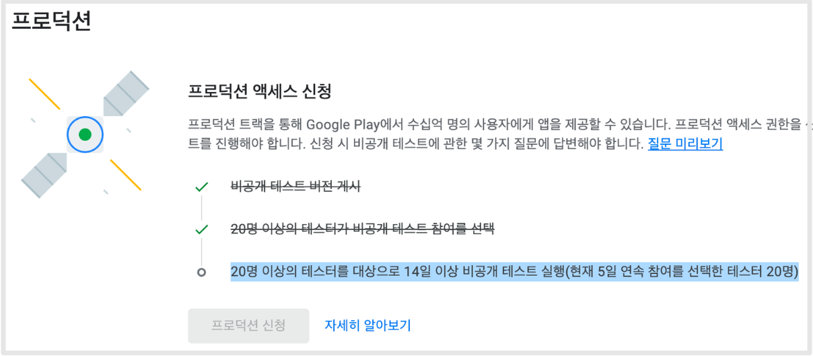<figcaption></figcaption></figure>

비공개 테스트 동안 하나씩 임무가 완수되는 것을 볼 수 있습니다.

<figure>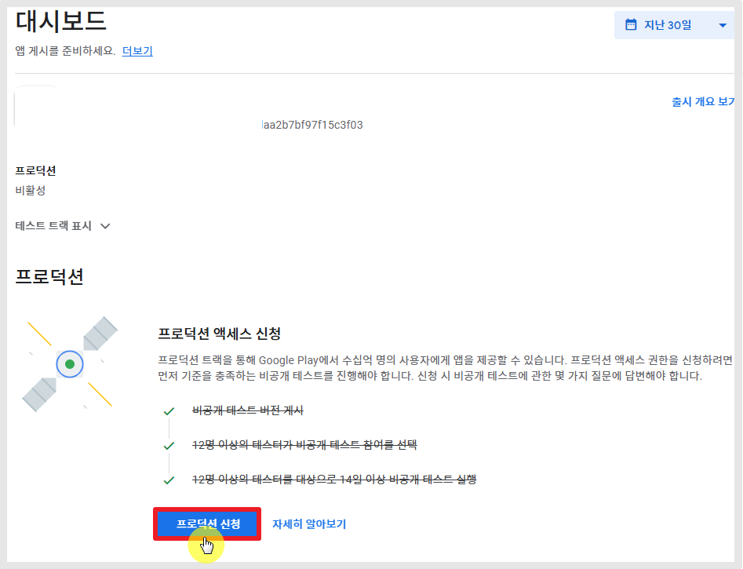<figcaption></figcaption></figure>

2주간의 12명 이상의 앱 테스트가 완료되면, 프로덕션을 신청할 수 있게 됩니다.

프로덕션 신청 버튼을 선택하면 구글에서 제공하는 질문(인터뷰지)에 답변을 하게 됩니다.&#x20;

해당 답변 까지 작성 완료해야 신청이 완료됩니다.

**--프로덕션 액세스 신청 접수 완료**

<figure>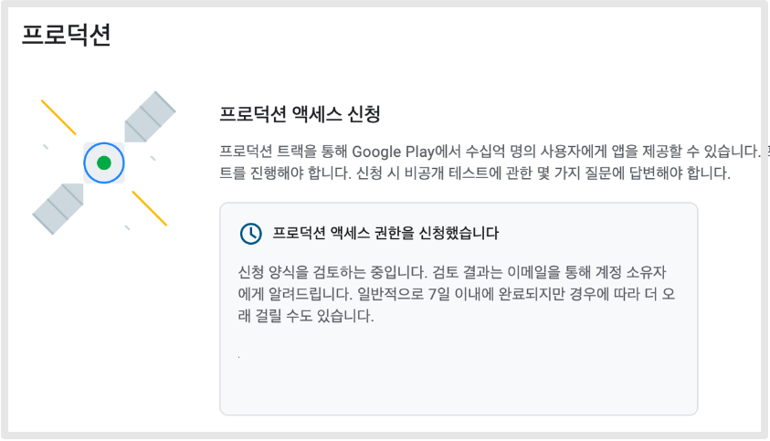<figcaption></figcaption></figure>

프로덕션 배포 역시 검수 시간이 들어가구요. (일주일 이내)

TEST에서 통과했으니 프로덕션은 심사 거절 없이 다 출시가 되겠죠? 할 수 있지만,, 그렇지는 않습니다. ^^

프로덕션도 다시 심사가 들어가고 심사에서 거절이 될 수 있어요.

정상적으로 출시가 완료되면 이제 플레이스토어에 공식 배포가 되어 앱을 다운받고, 검색할 수 있게 됩니다.


보시는 것처럼 개인 개발자 계정 - 플레이스토어 앱 등록은 시간과 노력이 많이 들어갑니다.

혹시 사업자가 있으면 구글 개발자 계정은 꼭 '조직'으로 등록을 해주세요.

조직 개발자 계정이 있으시면, 스윙투앱으로 플레이스토어 업로드 대행도 가능합니다\~!

프로덕션으로 앱 출시 바로 진행해드릴 수 있습니다.



플레이스토어 출시를 희망한다면, 가장 좋은 방법은 구글 '조직' 개발자 계정으로 등록하는 것이 좋구요.

사업자가 없어서 개인 개발자 계정 밖에 만들 수 없다면, 어쩔 수 없이 비공개 테스트 진행 후 프로덕션 출시를 진행해야 합니다.

스윙투앱에서는 비공개 테스트와 출시까지의 모든 과정을 대행해드리는 서비스가 오픈되었습니다.

유료 서비스 업체에서는 보통 비공개 테스트까지만 진행해드리는데요.

저희는 테스트와 프로덕션 출시까지의 과정 전체를 모두 다 해드리기 때문에, 사용자분은 전혀 신경 쓸 것 없습니다.

작업이 필요하실 경우 스윙투앱 실시간 상담 채팅으로 문의주시면 상세히 안내 도와드리겠습니다.

\*고객지원팀 이메일 : help@swing2app.co.kr

\*실시간 채팅 상담: [https://direct.lc.chat/12036120/](https://direct.lc.chat/12036120/)

(운영시간: 평일 오전 10시\~오후5시, 점심 12시\~1시제외)


