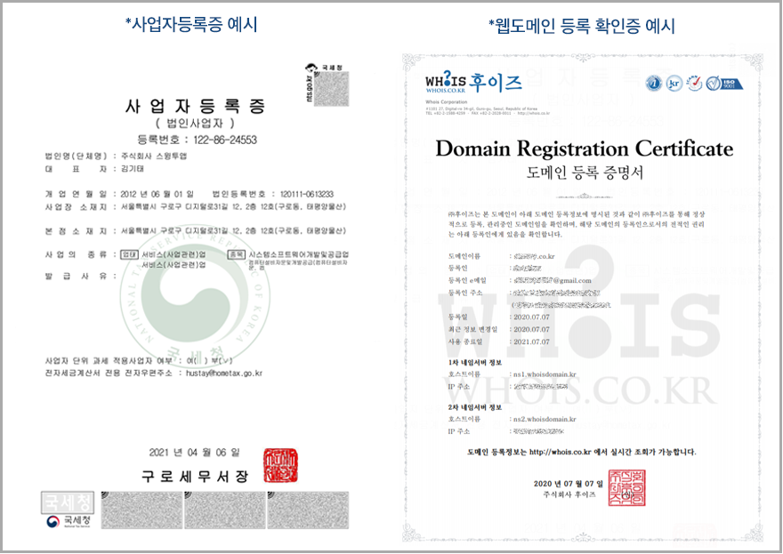

# 웹앱(푸시,웹뷰앱) 플레이스토어 출시 방법

<figure><figcaption></figcaption></figure>

웹앱(웹사이트를 연동한 앱) – 웹뷰, 푸시앱은 플레이스토어 앱 등록시 추가 요청사항이 있습니다.

바로 사전고지 문서를 제출하는 것인데요.

일반 프로토타입으로 제작한 앱과 플레이스토어 등록방법은 모두 동일하되, 웹앱은 사전고지 문서를 추가로 제출해야 합니다.

<mark style="color:green;">**사전고지 문서란?**</mark>

플레이스토어에 앱을 등록할 때, **앱이 구글 정책에 위반될 수 있는 항목이 아님을 증명하는 서류를 제출하는 것입니다.**

**따라서 사전고지 문서란 앱 심사에 미리 서류를 제출하여 앱이 문제가 없음을 증명하여 정상 출시 될 수 있도록 하는 것입니다.**

<mark style="color:green;">**플레이스토어에 웹뷰앱, 푸시앱을 등록할 때는 반드시 사전고지 문서를 함께 제출해야 합니다.**</mark>

스윙투앱으로 앱을 제작한 분들 중 \***웹뷰 앱, 푸시버전앱(웹사이트를 그대로 앱에 연동한 웹브라우저 앱 형태)**으로 제작한 사용자분들은 플레이스토어 앱 등록시 위의 사전고지 문서를 제출해야 합니다.

**앱에 연결된 웹사이트가 업체 혹은 본인의 소유가 맞는지 증빙서류를 제출해야 하며, 일반적으로 사업자등록증, 웹사이트 도메인 등록 확인서를 제출하시면 됩니다.**

아래 매뉴얼을 통해서 플레이스토어 웹앱(웹뷰,푸시)앱 등록방법을 확인해주세요.

&#x20;

앱을 등록하는 과정은 일반프로토타입 앱 등록과 모두 동일합니다.

> **구글 플레이 콘솔 접속**

[https://play.google.com/console/developers](https://play.google.com/console/developers)

<mark style="color:red;">구글 개발자 계정을 등록하지 않았다면, 개발자 등록 먼저 해주세요. (25달러 등록비 결제 후 이용 가능)</mark>

<mark style="color:blue;">**\[앱 만들기]**</mark>** ** 버튼을 선택합니다.

&#x20;

1\)앱이름 (플레이스토어 출시되는 이름)

2\)기본언어: 한국어 선택 (특정 국가에 배포되어야 한다면 해당 언어로 선택합니다. 예)미국)

3\)앱 또는 게임 선택: 앱으로 선택해주세요.

4\)유료 또는 무료 선택 (앱을 유료로 판매할 경우 ‘유료’ 선택, 무료 선택시 이후에 유료로 변경할 수 없습니다)

5\)개발자 프로그램 정책 체크

6\)미국 수출법규 체크

7\)\[앱 만들기] 버튼 선택합니다.

<figure><figcaption></figcaption></figure>

###  **** STEP.1 대시보드: 앱 설정

대시보드 선택 – \[앱 설정] 메뉴를 보시면 입력해야 할 정보가 단계별 메뉴가 순서대로 기재되어 있어요.

하나씩 선택해서 입력을 완료해주시면 됩니다.

> **각 단계별 상세 내용은 아래 매뉴얼을 참고해주세요.**
>
> [https://wp.swing2app.co.kr/knowledgebase/playstore-apprelease](playstore-apprelease.md)

<figure><figcaption></figcaption></figure>

### <mark style="color:blue;"></mark> <mark style="color:blue;">****</mark> STEP.2 스토어 설정 단계

앱 콘텐츠 단계 입력이 끝났으면, 왼쪽 메뉴의 앱정보 : 스토어 설정으로 이동합니다.

&#x20;

<mark style="color:blue;">**1.앱 카테고리 선택 및 연락처 세부정보 제공**</mark>

1\)앱 선택

2\)카테고리 선택

3\)이메일 주소 입력

4\)외부마케팅 여부 체크

5\)\[저장] 버튼을 선택합니다.

<mark style="color:red;">\* 필수 입력 항목이며, 그외 항목 입력은 선택사항입니다.</mark>

앱 카테고리 선택 및 연락처 세부정보 제공 입력도 완료되었구요.

**다음은 \[스토어 등록정보 설정]을 선택해주세요.**

&#x20;

<mark style="color:blue;">**2. 기본 스토어 등록정보 설정**</mark>

1\) 앱 이름 입력 (플레이스토어에 표시되는 앱 이름)

2\) 간단한 설명 (앱소개 내용으로 80자 이내로 작성)

<mark style="color:red;">\*주의: 단어 반복, 키워드 형식 나열은 안되요. 예시) 강아지, 개, 고양이, 애완견, 애완묘… # 해시태그 입력 금지</mark>

3\) 자세한 설명 (앱소개 내용으로 보다 상세히 기재하며 4000자 이내로 작성)

<mark style="color:red;">\*주의: 단어 반복, 키워드 형식 나열은 안되요. 예시) 강아지, 개, 고양이, 애완견, 애완묘… # 해시태그 입력 금지</mark>

&#x20;

​

4\) 앱 아이콘 이미지 등록 (플레이스토어에 표시되는 앱 아이콘 이미지, 512px\*512px )

5\)그래픽 이미지 (출시된 앱을 공유했을 때 표시되는 섬네일 이미지 1024px\*500px)

\*그래픽 이미지는 어떻게 보여지나요?

 ** **<mark style="color:blue;">**그래픽 이미지의 용도?**</mark>

<figure><figcaption></figcaption></figure>

프로모션 동영상 URL을 제출하였을 경우 맨 앞에 영상이 보여지는데, 그래픽 이미지가 영상의 표지 이미지로 사용이 됩니다.

그리고 게임 앱의 경우 미리보기 동영상 및 스크린샷을 포함하여 추천 게임 그룹을 크게 표시할 때 그래픽 이미지를 사용합니다.

프로모션 동영상 URL을 제출하지 않을 경우 표시될 영상이 없기 때문에 그래픽 이미지는 어디서도 노출이 되지 않습니다.&#x20;

&#x20;

**6,7,8) 스크린샷 이미지 등록**

6,7,8 항목 모두 스크린샷 이미지를 등록하는 항목이에요. 동일한 이미지로 등록해주시면 됩니다.

<mark style="color:red;">\*스크린샷은 앱 실행화면을 캡쳐한 이미지로 등록애주셔야 합니다. 앱과 관계 없는 이미지는 안되요\~!</mark>

이미지 사이즈는 가로 기준 최소 320px\~최대 3840px 사이로 제작해주셔야 합니다.

가로 세로 비율은 16:9 입니다. (가로모드 스크린샷 적용시)

&#x20;

9\) **\[저장]** 버튼을 누르면 스토어 정보 입력이 완료됩니다.

**플레이스토어 기본정보에 입력해야 하는 내용은 모두 완료되었구요.**

**프로덕션으로 이동하셔서 앱(APK파일)을 업로드 해주세요!**

****

<figure><figcaption></figcaption></figure>

### <mark style="color:blue;"></mark> <mark style="color:purple;">****</mark> STEP.3 프로덕션 – 앱 등록하기

다시 대시보드로 이동해주시구요. 구글플레이에 앱 게시를 선택합니다.

&#x20;

<mark style="color:blue;">**1.국가/지역 선택**</mark>

파란색 글자로 된 <mark style="color:blue;">**국가/지역 추가**</mark> 를 선택합니다.

&#x20;

어떤 국가에 출시를 할지 선택을 하는데요. 전체 국가를 선택해주시면 되구요.

만약 특정 국가에만 출시한다면 해당 국가를 검색해서 선택해주세요.

<mark style="color:blue;">**\[국가/지역 추가]**</mark> 버튼을 선택해주세요.

&#x20;

<mark style="color:blue;">**2. 프로덕션-AAB 파일 등록**</mark>

다음으로 프로덕션 화면에서 \[출시] 를 선택합니다.

<mark style="color:blue;">**\[새 버전 만들기]**</mark>버튼을 선택합니다.

\*상단의 \[새 버전 만들기] 버튼을 선택해도 되구요. 본문 가운데 있는 버튼을 선택해도 상관없습니다.

&#x20;

업로드 버튼을 선택한 뒤, 스윙투앱에서 제작완료한 AAB 파일을 해당 화면으로 업로드 해주세요.

파일 업로드가 완료되면, **화면 하단의 \[저장]버튼 선택 → \[버전검토]버튼을 선택합니다.**

<mark style="color:red;">**\*AAB파일은 어디서 다운받나요??**</mark>

AAB파일은 스윙투앱에서 앱제작 요청 후 이메일로 발송된 AAB파일을 이곳에 첨부하면 되구요.

[**스윙투앱 홈페이지 → 앱운영→ 버전관리→앱제작이력**](http://www.swing2app.co.kr/view/app\_work\_history) **페이지**에서 AAB파일을 직접 다운받을 수 있습니다.

**\*AAB파일은 유료버전앱에서만 다운 가능하며 무료버전앱에서는 제공되지 않습니다.**&#x20;

**\*AAB파일은 유료앱 이용권 등의 상품 구매 후, 앱제작을 한번 더 해주셔야 새로 제작되는 버전부터 AAB파일이 생성됩니다.**

<mark style="color:red;">이용권 구매 후 꼭! 앱제작하기(업데이트)를 해주세요.</mark>

앱제작이 완료된 후 [**앱운영→ 버전관리→앱제작이력**](http://www.swing2app.co.kr/view/app\_work\_history) **** 에서 AAB파일을 받을 수 있습니다. (이용권 구매 후 앱제작 한번 더 해주세요)

\[AAB파일 받기] 버튼을 선택하면 사용자의 PC로 파일이 다운되요.

다운된 AAB파일을 위의 구글 플레이 – 프로덕션 – App Bundle 파일로 업로드 해주시면 됩니다.&#x20;

<mark style="color:red;">\*인터넷 브라우저 Chrome 으로 이용해주세요</mark>

&#x20;

> **\*중요안내**:플레이스토어 앱 등록 시스템 업데이트로 기존 앱 등록 파일인  APK파일에서 →  AAB파일로 변경되었습니다.
>
> AAB파일은 스윙투앱에서 21년 8월 9일 이후에 제작된 앱부터 생성이 됩니다.
>
> 따라서 21.08.09 이전에 제작된 앱은 앱제작V2로 이동하셔서 앱제작하기 버튼 선택하여 새 버전으로 앱제작 다시 해주세요.
>
> 새로 제작된 앱부터 AAB파일을 받을 수 있습니다.
>
> 만약 파일을 올리는데 번들 취약 등의 메시지가 뜬다면, 앱 최초 버전이 업데이트 이전 버전이라 그럴 수 있습니다.
>
> 스윙투앱 문의게시판으로 문의 남겨주시면 새 버전으로 제작해드립니다.&#x20;

***

<figure><figcaption></figcaption></figure>


<mark style="color:orange;"><mark style="color:red;">**\*\*중요\*\***<mark style="color:red;"></mark>

버전검토 까지만 작업해놓은 뒤, 다시 앱정보- 기본 스토어 등록정보로 이동해주세요.

앱 최종 등록전!! 스토어 등록정보에서 사전고지 문서를 먼저 제출해야 합니다.


### <mark style="color:blue;"></mark> **** STEP.4 사전고지 문서 제출하기  <mark style="color:blue;">****</mark> &#x20;

<mark style="color:blue;">**1. 스토어 등록정보- 사전고지 대상**</mark>** **<mark style="color:orange;">****</mark>&#x20;

**사전고지 문서 제출은 기본 스토어 등록정보에서 제출할 수 있습니다.**

왼쪽 앱 정보 → 기본 스토어 등록정보 페이지로 이동합니다.

\[앱 세부정보] 밑에  <mark style="color:blue;">파란색으로 된 ‘사전고지 대상’</mark> 내용을 클릭해주세요. &#x20;

<mark style="color:blue;">**2. 구글 앱 검토팀에 사전고지 제공하기**</mark>

플레이 콘솔 고객센터 페이지로 이동합니다.&#x20;

본문 내용 확인해주신 뒤  아래 ** **<mark style="color:blue;">**\[문서 제출하기]**</mark>** ** 버튼을 눌러주세요.

<mark style="color:blue;">**3. 사전고지 내용 입력하기**</mark>&#x20;

**계정 로그인되어 있으면 이름, 성, 이메일주소는 자동으로 입력되기 때문에 따로 입력할 필요 없습니다.**

\*이메일은 만약 다른 메일로 결과를 받길 원하면 메일주소를 다시 기재해주시면 됩니다.

**1)애플리케이션 패키지 이름**&#x20;

제출하고자 하는 앱의 패키지 이름을 제출합니다. (패키지 이름 확인은 아래에서 설명드릴게요)

**2)적절한 시나리오 선택**&#x20;

‘하나를 선택하세요’를 선택하면 아래로 선택할 수 있는 항목 보기창이 열립니다. 알맞은 항목을 선택해주세요.

<mark style="color:red;">\*웹뷰,푸시앱 제출은 첫번째 내용인 ‘지적 재산권 사용권 증빙서류’ 에 해당됩니다.</mark>

<mark style="color:red;">\*만약 웹뷰앱 외에 다른 시나리오를 제출한다면 항목 중 필요한 시나리오를 선택해주시면 됩니다.</mark>

**3) 문서를 첨부하세요: 증명할 수 있는 서류를 반드시 제출합니다.**

본인의 웹사이트(홈페이지) 등을 앱에 적용하여 만든 웹뷰 앱은 해당 웹이 다른 소유자가 아니며, 본인이 소유자 및 등록자임을 증명할 수 있어야 합니다.

따라서 아래의 서류를 제출해야 합니다.

<mark style="color:purple;">-웹 도메인 등록 확인증 제출 : 도메인 이름, 등록인, 사업자 정보 등이 기재된 내용</mark>

<mark style="color:purple;">-사업자 등록증 제출 : 반드시 사업자등록증과 웹사이트에 기재된 사업주 정보와 일치해야 합니다.</mark>

\*사업자등록이 안되어 있다면 웹사이트 도메인 등록정보만 제출해도 됩니다.

<mark style="color:red;">**\*웹사이트 도메인 등록정보란?**</mark>

웹 도메인 소유자를 증빙하는 서류로 웹사이트 제작한 호스팅 및 도메인 업체에서 발급받을 수 있습니다.&#x20;

<figure><figcaption></figcaption></figure>

**4)이 고지와 관련된 추가 정보 : 해당 사전고지에 대한 부가설명 즉, 합당한 내용을 입력합니다.**

> <mark style="color:purple;">**★내용 예시**</mark>
>
> 앱이 당사에서 제작한 웹사이트임을 증명하며, 당사의 웹을 앱으로 연동하여 웹뷰앱으로 플레이스토어에 제출합니다.
>
> 증명할 수 있는 사업자등록증, 웹사이트 도메인 등록정보를 제출합니다.
>
> or
>
> 저희 앱은 OOO타사의 지적 재산권을 사용할 수 있는 권리가 있으며 이를 증명하는 증명하는 서류를 제출합니다.
>
> 계약 서류 확인 시 모든 컨텐츠 및 이미지 등의 사용을 저희가 이용할 수 있다는 내용을 포함하고 있습니다.

5\) \[제출] 버튼을 누르면 등록완료 됩니다.

&#x20;

<mark style="color:orange;">**★ 앱 패키지 네임(이름)은 어디서 확인할 수 있나요?**</mark>

\*앱제작 V3, V2 화면 디자인만 다를 뿐 확인하는 경로는 모두 동일합니다.

<mark style="color:blue;">**앱제작 V3 버전 이용시)**</mark>

<figure><figcaption></figcaption></figure>

**V3 앱제작 화면**

1\)고급설정 → 2)설정: 앱제작 설정 → 3)안드로이드 패키지 아이디 \[EDIT] 버튼 선택→ 4)설정값에서 전체 아이디 확인할 수 있습니다. 해당 아이디를 복사해서 위의 패키지 네임에 붙여넣기 해주세요.

****

**V2 앱제작 화면**

1\)고급설정 → 2)설정: 앱제작 설정 → 3)안드로이드 패키지 아이디 \[EDIT] 버튼 선택→ 4)설정값에서 전체 아이디 확인할 수 있습니다. 해당 아이디를 복사해서 위의 패키지 네임에 붙여넣기 해주세요.

<mark style="color:purple;"><mark style="color:blue;">com.hustay.\~ 로 시작하는 값이 패키지 아이디이며, 해당 아이디를 복사해서 위의 패키지 이름에 붙여넣기 해주세요.<mark style="color:blue;"></mark>

해당 패키지 아이디가 앱 패키지 이름으로 사용됩니다.

<mark style="color:orange;">****</mark>

<mark style="color:blue;">**4. 제출 완료 및 서류 승인 완료**</mark>

제출 버튼을 누르면 정상적으로 서류 제출이 완료된 것입니다.

승인 여부는 2일 이내 메일로 답장을 보내줍니다.&#x20;

증빙서류가 승인되었으며 앱에 적용했다는 내용으로 구글 메일을 받게 되구요.&#x20;

**해당 메일을 받으시면, 다시 구글 플레이 콘솔로 이동하셔서 최종 앱 제출을 완료해주시면 됩니다.**

<figure><figcaption></figcaption></figure>

### &#x20;<mark style="color:blue;"></mark> STEP.5 프로덕션 앱 최종 출시하기 <mark style="color:blue;">****</mark>&#x20;

다시 구글 플레이 콘솔 접속하여, 앱 선택 해주시구요.

1\)왼쪽 메뉴 \[프로덕션]을 선택합니다.

2\)\[출시] 선택하구요.

3\)\[버전수정] 버튼을 선택합니다.&#x20;

&#x20;

4\)\[버전검토] 버튼선택&#x20;

5\)<mark style="color:blue;">**\[프로덕션 트랙으로 출시 시작]**</mark> 버튼 선택

6\) 프로덕션 트랙 출시 메시지 창에서 <mark style="color:blue;">**\[출시]**</mark> 버튼을 선택해주세요.

&#x20;

<mark style="color:red;">**★ 잠깐!**</mark>

해당 경고 메시지가 뜨는 분들도 있을 거에요.

해당 내용은 앱출시와는 관계가 없기 때문에 무시하셔도 되구요.

관련 내용은 저희 스윙투앱에서 정책을 만들고 있으니 곧 제공이 될 것입니다.

**\* 플레이스토어 등록은 유료버전으로 전환된 앱만 등록가능하다는 것!! 아시죠? ^^**

***

<figure><figcaption></figcaption></figure>

### <mark style="color:blue;"></mark> <mark style="color:blue;"></mark> STEP.6 앱 출시완료 (심사기간 7일 이내)&#x20;

**\*출시는 바로 되는 것이 아니라, 구글 심사를 거친 뒤 승인이 되는 것이라서 기다려주셔야 해요\~!**

**플레이스토어 심사 기간은 7일 정도 소요됩니다.**

심사에서 문제가 없으면 해당 심사 기간 후 출시됩니다

심사가 통과되어 정상적으로 승인이 완료되면, 해당 앱의 상태는 **‘출시됨’**으로 변경됩니다.

만약 심사가 거절될 경우, 거절 사유가 사용자의 구글 개발자 메일로 발송되오니 메일을 꼭 확인해주세요!

&#x20;

**1)앱 출시 후 앱이름으로 검색 안됩니다.**

**플레이스토어에 앱이 정상 출시되어도 앱 이름으로 검색시 스토어에 바로 노출이 되지 않습니다.** \*중요!\*

\*2019년 9월 구글 알고리즘 변경으로 출시된 앱의 활성화 정도(앱설치수)를 파악한 뒤, 검색 노출을 전환하고 있습니다.

앱이 정상 출시되었으면 문제가 있는 것이 아니기 때문에 앱 출시후에는 출시 링크로 들어가서 앱 설치를 많이 받아주시고, 리뷰, 평점 등도 올려서 관리해주시기 바랍니다.

앱 출시가 되었는데 앱을 이용하는 활성화 수치가 적을 경우 그만큼 앱 노출이 늦어집니다.

설치 및 활성화를 진행했는데도 2주일 이상 앱이름으로 검색이 잘 되지 않는다면 구글 개발자 고객센터로 문의주시면 도움을 받을 수 있습니다.

\*앱 검색에 어려움이 있으실 경우 [구글 개발자 지원팀(고객센터)](https://support.google.com/googleplay/android-developer/answer/7218994?hl=ko)로 문의 부탁드립니다.

★앱 검색이 안되는데 플레이스토어에서 어떻게 앱을 다운 받나요?

\=앱 출시 후 플레이스토어 출시링크(URL)가 생성됩니다.

해당 URL로 접속을 하면 바로 플레이스토어 앱다운페이지로 이동을합니다.

따라서 앱 이름 검색전까지는 다른 사용자들에게 출시 링크를 공유하여 플레이스토어에서 직접 앱을 다운받도록 유도할 수 있습니다.

&#x20;

**2)플레이스토어 앱 업로드 대행 가능**

매뉴얼을 보고 직접 진행 하는게 어렵다면, 스윙투앱으로 업로드 신청주시면 플레이스토어 업로드 대행해드립니다.

**\*\*스윙투앱 사용자분들만 해당 됩니다. (스윙투앱으로 제작한 앱만 업로드 가능)**

플레이스토어 업로드티켓(10,000원/1회 비용) 구매 후 업로드 신청 남겨주시면, 사용자분의 앱을 플레이스토어에 등록 및 출시해드립니다.

플레이스토어 업로드 신청방법은 아래 매뉴얼을 참고해주세요.



**★ 플레이스토어 앱 업데이트를 해야 할 경우는 아래 링크를 확인해주세요!**



이상으로 앱제작 스윙투앱에서 구글 플레이스토어에 웹뷰 앱 제출시 함께 등록해야 하는 사전고지 문서 제출방법을 알려드렸습니다.

<figure><figcaption></figcaption></figure>


&#x20;<mark style="color:red;">**주의 사항**</mark>&#x20;

<mark style="color:red;">****</mark>

1\) 사전고지 문서 제출은 웹브라우저를 그대로 연동한 앱(웹뷰앱, 푸시앱) 심사시 참고할 수 있도록 플레이스토어 앱 등록시(초기 등록) 함께 제출해야 합니다.

2\) **웹뷰,푸시로 제작한 앱은 플레이스토어 앱 심사시 사전고지 문서를 제출해야 합니다.(필수)**

서류를 제출하지 않아도 심사는 가능하지만 웹사이트를 증명할 수 있는 서류를 제출하지 않을 경우 앱 심사가 거절됩니다.

따라서 앱 심사시 미리 서류를 제출하는 것이 좋습니다.&#x20;

3\) 만약 서류를 제출하지 않고, 최종 심사에서 웹뷰 앱 스팸정책으로 위반이 되면 앱이 삭제가 됩니다.

이의제기를 통해 증빙서류를 제출하고 다시 앱을 다시 복원받을 수 있지만, 그 과정이 까다롭고 출시되기까지의 시간이 훨씬 더 많이 소요될 수 있습니다.

4\) 따라서 스윙투앱으로 제작한 웹뷰 앱, 푸시버전 앱 사용자분들은 플레이스토어에 앱을 등록할 때 사전고지 문서를 함께 제출하기를 권장드리구요.

5\) 스윙투앱으로 플레이스토어 업로드 대행을 맡기신 분들 역시 본인이 만든 앱이 웹뷰앱, 푸시버전앱이라면 따로 스윙투앱 메일로 사업자 등록증, 웹사이트 도메인 등록정보 파일을 제출해주시기 바랍니다.

\*업로드 신청한 분들은 담당자가 업로드 안내 메일드리면서 위의 서류 제출하도록 안내드립니다. 그때 메일로 회신주시면 됩니다.

6\) 웹뷰앱이나 푸시버전앱이 아니더라도 일반프로토타입으로 제작한 앱 중에서도 위의 시나리오에 해당 되는 내용이 있다면 사전고지 문서를 제출해주셔야 합니다. (예: 타사 지적재산권 사용 증빙 등)


<mark style="color:red;">****</mark>

<mark style="color:red;">****</mark>
