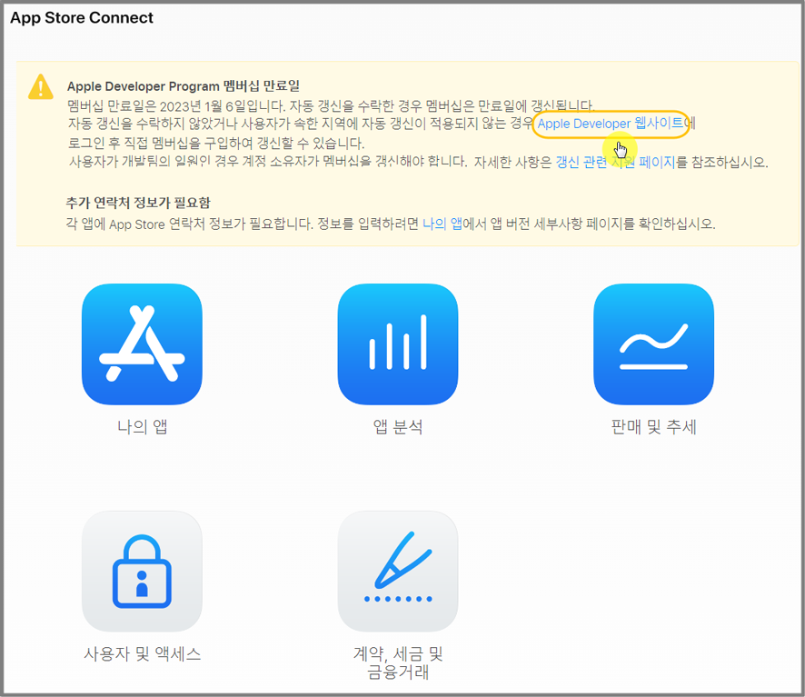

# 애플 개발자 계정 갱신(멤버십 연장)

***


애플 개발자 계정은 연간 멤버십 형태로 매년 갱신이 필요해요.

**멤버십이 만료되면 앱이 삭제가** 됩니다.&#x20;

따라서 앱스토어 애플 개발자 계정은 매년 멤버십 연장을 통해 갱신해주셔야 앱 이용이 가능합니다.&#x20;

&#x20;

또한 애플 내 새로운 서비스 또는 정책 변경이 있을 경우 프로그램 사용권 계약에 동의해야 해요.

약관 동의를 하지 않으면 **앱 업데이트를 할수 없어 계약 동의**를 꼭 해주어야 해요.

**평균 1년에 3회 정도 사용권 계약 및 업데이트 계약 승인건이 발생됩니다.**&#x20;


***

## 1.애플 개발자 계정 갱신 

<figure><figcaption></figcaption></figure>

애플 개발자 계정 멤버십 만료일은 [Appstore Connect 사이트](https://appstoreconnect.apple.com/)에 접속하시면 확인이 가능합니다.

멤버십 만료일이 임박했을 경우(통상적으로 만료일 한달 전 표시), 위의 이미지처럼 노란색 박스로 만료일 안내 메시지가 떠있구요.

Apple Developer 웹사이트로 이동하여 멤버십 구입이 가능합니다.

파란색으로 된 \[[Apple Developer 웹사이트](https://developer.apple.com/)] 를 클릭하여, 멤버십 연장 결제를 하실 수 있습니다.&#x20;

애플 개발자 계정 멤버십 연장 방법은 아래 가이드를 통해 상세히 확인 가능합니다.&#x20;



***

## 2.애플 프로그램 사용권 계약

<figure><figcaption></figcaption></figure>

앱스토어 애플 개발자 계약 관련 업데이트 승인 방법은 아래 가이드로 상세히 확인 가능합니다.&#x20;



