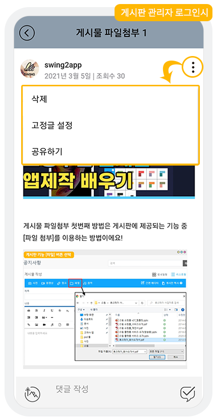

# 게시판 관리자 설정

<figure><figcaption></figcaption></figure>

**게시판 관리자란?**

앱 전체 운영이 아닌, 특정 게시판을 관리할 수 있는 권한을 주는 것으로 게시판에서 특정회원을 선택한 후 관리자로 설정할 수 있습니다.

게시판 관리자로 설정이 되면 다른 사용자가 작성한 게시물을 삭제하거나 고정글로 설정할 수 있는 권한을 가집니다.

해당 매뉴얼에서는 게시판 관리자를 설정하는 방법과 앱실행화면을 통해서 어떻게 관리자가 적용되는지 안내해드리겠습니다.

<figure><figcaption></figcaption></figure>

## 1. 게시판 관리

스윙 홈페이지 접속 후 [**앱운영 페이지 → 서비스관리 → 게시판 관리**](http://www.swing2app.co.kr/view/board\_edit) 메뉴로 이동합니다.

<figure><figcaption></figcaption></figure>

## 2. 게시판 생성 및 설정    &#x20;

**1)게시판관리 페이지에서 \[게시판 생성] 버튼 혹은 \[설정] 버튼을 선택합니다.**

\*게시판을 새로 만들 경우 =게시판 생성

\*만들어놓은 게시판에서 적용하는 경우 =설정 버튼

**2)게시판 및 기능설정 창에서 3번째 메뉴인 \[관리자설정] 메뉴를 확인할 수 있습니다.**

**3)해당 메뉴에서 \[관리자설정] 버튼을 확인할 수 있어요.**

\*새글 알람 설정 방법은 해당 포스팅 참고해주세요 .



<figure><figcaption></figcaption></figure>

## 3. 게시판 관리자 설정

1\) \[관리자설정] 버튼을 선택합니다.

2\) 회원그룹 창이 열리구요. 앱에 가입된 회원 중에서 관리자로 적용할 회원을 선택합니다.

​3) 회원 선택이 완료되면 \[선택완료] 버튼을 눌러주세요.

4\) 관리자로 설정된 회원이 잘 추가되었는지 확인 후 \[저장]버튼을 눌러주세요.

<figure><figcaption></figcaption></figure>

## 4. 앱에 게시판 적용하기

<mark style="color:blue;">**-앱제작 V3버전 이용시**</mark>

<figure><figcaption></figcaption></figure>

1\)앱제작 화면 STEP3 페이지 선택

2\)메뉴 선택

\*메뉴를 만들기 전이라면, 새 메뉴를 만들어주세요. (+ 모양 버튼 선택하여 메뉴 추가)

3\) 메뉴 이름을 입력해주세요.

4\) 페이지 디자인에서 \[UI KIT] 선택

5\)\[게시판]을 선택해주세요.&#x20;

6\) 등록할 게시판을 확인한 뒤 \[적용하기] 버튼을 선택해주세요. (페이지에 마우스 커서를 가져다 대면 적용하기 버튼이 열립니다)

7\) 화면 상단 \[저장]버튼을 누르면 앱에 적용됩니다.

\*아이콘은 선택사항이며, 메뉴 앞에 아이콘을 적용할 경우만 선택해주세요.&#x20;

<mark style="color:blue;">**-앱제작 V2버전 이용시**</mark>

**스윙 앱제작 페이지에서 →  페이지 메뉴 로 이동합니다.**&#x20;

1\. \[카테고리 추가] 버튼을 선택해서 게시판을 적용할 메뉴를 추가합니다.&#x20;

2\. 메뉴 이름을 입력해주세요.

3\. 메뉴 유형: \[게시판]을 선택해주세요.

4\. \[링크마법사] 버튼을 선택해주세요.

5\. 메뉴에 적용할 게시판을 선택한 뒤 \[반영] 버튼 선택

6\. \[적용] 버튼

7\. \[저장] 버튼을 누르면 완료됩니다.

\*아이콘은 선택사항이며, 메뉴 앞에 아이콘을 적용할 경우만 선택해주세요.&#x20;


<mark style="color:red;">**주의사항​**</mark>

선택한 게시판에서만 관리자 권한이 생깁니다. (모든 게시판에 다 적용이 되는 것이 아니에요)

모든 게시판을 다 관리하고 싶다면, 앱에 적용된 모든 게시판 설정에 들어가서 해당 회원을 선택한 후 저장해주셔야 합니다.


이렇게 하면 게시판 관리자 설정이 완료되구요.

게시판 관리자는 여러 명의 회원들을 두셔도 됩니다. (제한 없습니다.)

그리고 관리자 설정은 앱에 자동 반영되니, 바로 앱을 실행해서 보시면 반영이 되어있답니다\~!

앱을 실행하실 때는 반드시,, 관리자로 지정된 계정으로 로그인하셔야 합니다!

<figure><figcaption></figcaption></figure>

## 5.앱 실행화면) 게시판 관리자 확인

앱을 실행하여 관리자가 적용된 해당 게시판을 확인해볼게요.

<figure><figcaption></figcaption></figure>

앱에서 해당 관리자 계정으로 로그한 뒤, 관리자로 지정된 게시판으로 이동해주세요.

다른 사용자가 작성한 게시물에서, **상단의 점 세개 버튼을 선택하면 **<mark style="color:blue;">**\[삭제, 고정글 설정, 공유하기]**</mark>** 메뉴를 확인할 수 있습니다.**

**관리자로 적용된 게시판에서는 다른 사용자가 등록한 게시글을 삭제하거나 고정글로 설정 하실 수 있습니다.**

**우선순위 고정글 기능은 게시판 헤더가 적용되어 있어야 이용가능합니다.**

게시판 헤더 기능 이용방법은 아래 매뉴얼을 확인해주세요&#x20;



<mark style="color:blue;">**만약 게시판 관리자가 아닌 일반 사용자로 접속시, 어떻게 보여지나요?**</mark>

<figure><figcaption></figcaption></figure>

일반 사용자 혹은 게시판관리자가 아닌 일반 관리자의 경우는 **\[신고하기, 차단, 공유하기]** 메뉴만 확인할 수 있어요!

**게시판 관리자는 특정 게시판에서만 관리자 권한을 주는 것으로 사용이 되구요.**

**앱을 전체 관리하는 관리자, 부관리자와는 다르게 운영되니 이용에 참고해주세요 \~!**

**앱운영 관리자를 두고 싶다면 부관리자로 적용하여 이용해주시기 바랍니다.**
