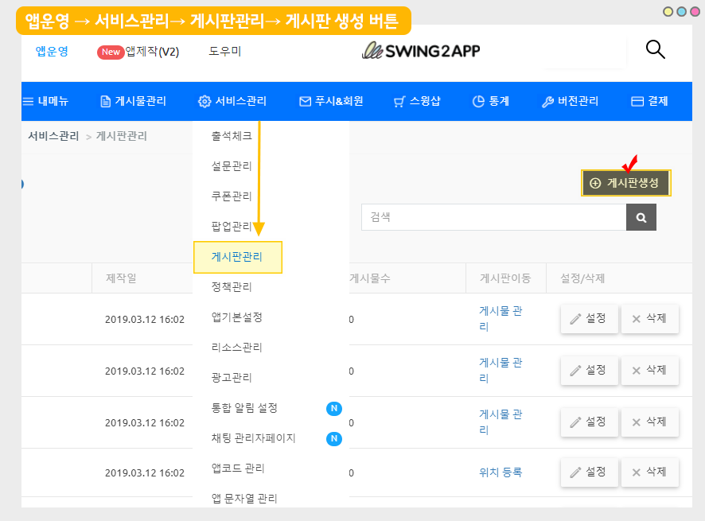
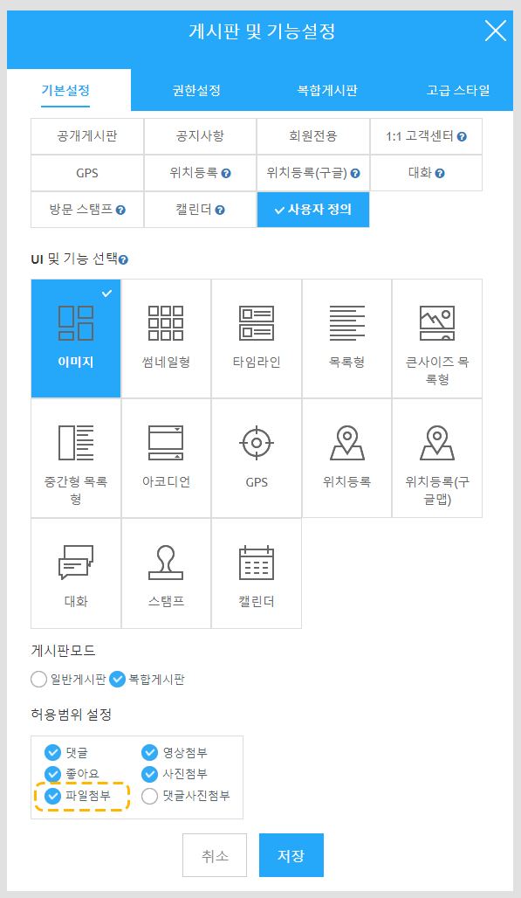
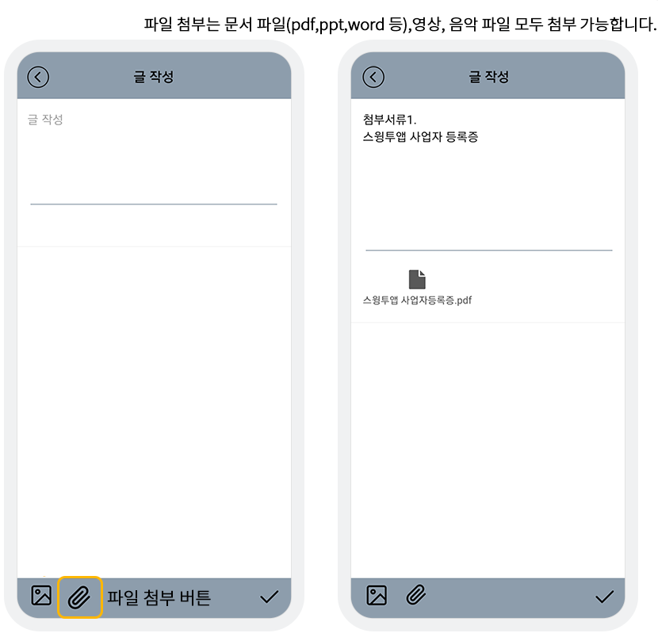

# 앱에서 게시판 파일 첨부하기

<figure><figcaption></figcaption></figure>

게시판을 만들 때 첨부파일 허용 여부를 체크할 수 있습니다.

첨부파일 허용에 체크할 경우, 게시판 글 작성시 첨부 파일을 등록할 수 있습니다.

첨부파일은 앱운영 대시보드에서 관리자 글 작성시에도 가능하며,

일반 앱 사용자들이 앱 내에서 게시물 등록시에도 첨부파일을 등록할 수 있습니다.

앱에서 첨부파일을 등록하는 방법을 알려드립니다.&#x20;

**\*관리자용 - 대시보드에서 게시물 파일 첨부하는 방법은 아래 매뉴얼로 확인해주세요.**



<figure><figcaption></figcaption></figure>

## 1.게시판 만들기

파일첨부는 게시판이 있어야 이용이 가능하기 때문에, 게시판을 먼저 만들어주세요!

<figure><figcaption></figcaption></figure>

[앱운영페이지 → 서비스관리 → 게시판관리](http://www.swing2app.co.kr/view/board\_edit) →\[게시판 생성] 버튼 선택하여 게시판 만들어주세요.

만들어놓은 게시판을 수정할 경우 게시판 옆에 \[설정] 버튼을 선택해주세요.&#x20;

게시판 만드는 방법은 [게시판  제작 상세 매뉴얼](https://documentation.swing2app.co.kr/manual/appmanage/board/boardeditor)을 참고해주시구요.

게시판 이름, UI 선택은 일반 게시판 만드는 것과 동일하게 진행합니다.

중요

게시판기본설정 탭 허용범위 설정에서 "파일첨부"에 체크하고 저장해주세요.

<figure><figcaption></figcaption></figure>

스크롤하여 내려보면, 허용범위 설정 메뉴 확인할 수 있습니다.

\[파일첨부]에 체크하고 저장해주세요.

<figure><figcaption></figcaption></figure>

## 2.앱에 게시판적용하기

만든 게시판을 앱제작에서 적용해주세요.&#x20;

<figure><figcaption></figcaption></figure>

1\)앱제작 화면 - STEP3 페이지 선택

2\)메뉴 선택

\*메뉴를 만들기 전이라면, 새 메뉴를 만들어주세요. (+ 모양 버튼 선택하여 메뉴 추가)

3\)메뉴 이름을 입력해주세요.

4\) 페이지 디자인에서 \[UI KIT] 선택

5\)\[게시판]을 선택해주세요.&#x20;

6\) 등록할 게시판을 확인한 뒤 \[적용하기] 버튼을 선택해주세요.&#x20;

(페이지에 마우스 커서를 가져다 대면 적용하기 버튼이 열립니다)

7\) 화면 상단 \[저장]버튼을 누르면 앱에 적용됩니다.

<figure><figcaption></figcaption></figure>

## 3.앱 실행화면

<figure><figcaption></figcaption></figure>

앱 실행 후 - 게시판 글 작성 선택시 - 왼쪽 하단에 파일첨부 버튼을 확인할 수 있습니다.

파일 첨부는 문서 파일, 영상 등 모두 첨부 가능합니다.&#x20;

단, 파일 등록시 한번에 등록 가능한 용량은 5MB이오니 해당 용량이 넘어가면 등록이 불가합니다.&#x20;

<figure><figcaption></figcaption></figure>

## **4.안내사항**


1\)앱 파일첨부 등록 기능은 신규 업데이트 된 기능으로, <mark style="color:red;">23년 4월 11일 이전 제작 앱은 앱 업데이트가 필요합니다.</mark>&#x20;

V3 버전에서만 이용 가능하며, 앱제작 화면 이동 후 ‘앱 업데이트’ 버튼 선택해주시면 됩니다

23년 4월 11일 이후새로 제작되는 앱은 업데이트 필요 없이, 바로 이용 가능합니다.&#x20;

2\)앱 파일 첨부시, 한 번에 첨부하는 파일 용량은 5MB를 초과할 수 없습니다.

파일 첨부의 경우 첨부된 용량만큼 앱 저장용량으로 집계됩니다.

스윙투앱 서비스에서 제공되는 용량이 정해져있기 때문에 한 번에 첨부할 수 있는 파일 용량은 5MB로 제한해두었습니다.

3\)앱 내 게시판 파일첨부를 사용하는 분들은 반드시! 앱 저장 용량을 체크해주세요.

관리자만 올리는 것이 아니라, 앱을 이용하는 사용자들도 올릴 수 있는 만큼 저장용량이 단시간에 많이 올라갈 수 있습니다.&#x20;

4\)스토어에 앱이 출시된 분들은, 앱이 업데이트가 되었기 때문에 각 스토어에도 새 버전으로 업데이트 해주셔야 합니다.

스토어에 업데이트를 해야 사용자들이 앱 업데이트를 받고 해당 기능을 이용할 수 있습니다.&#x20;


