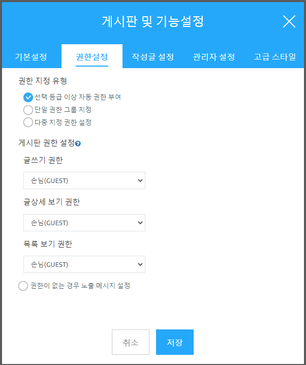
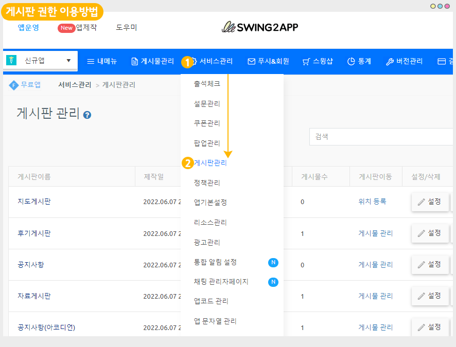
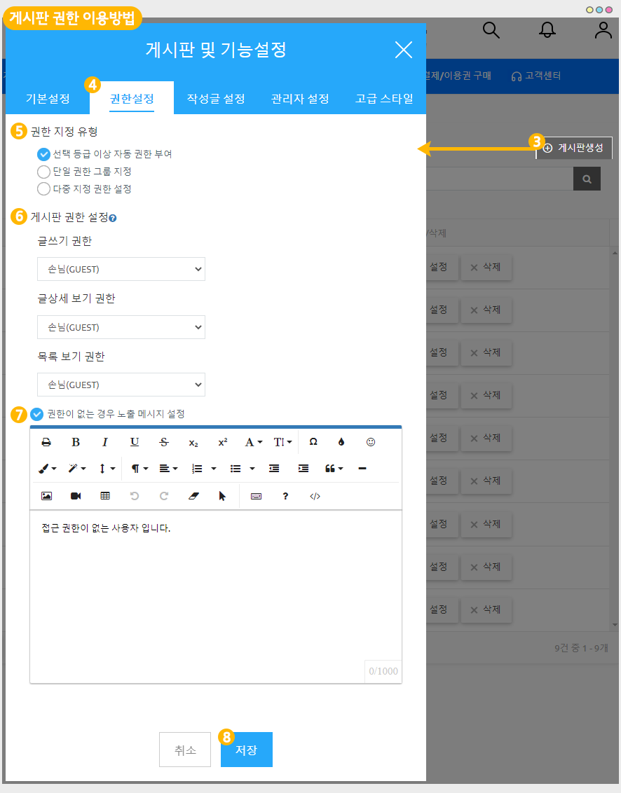
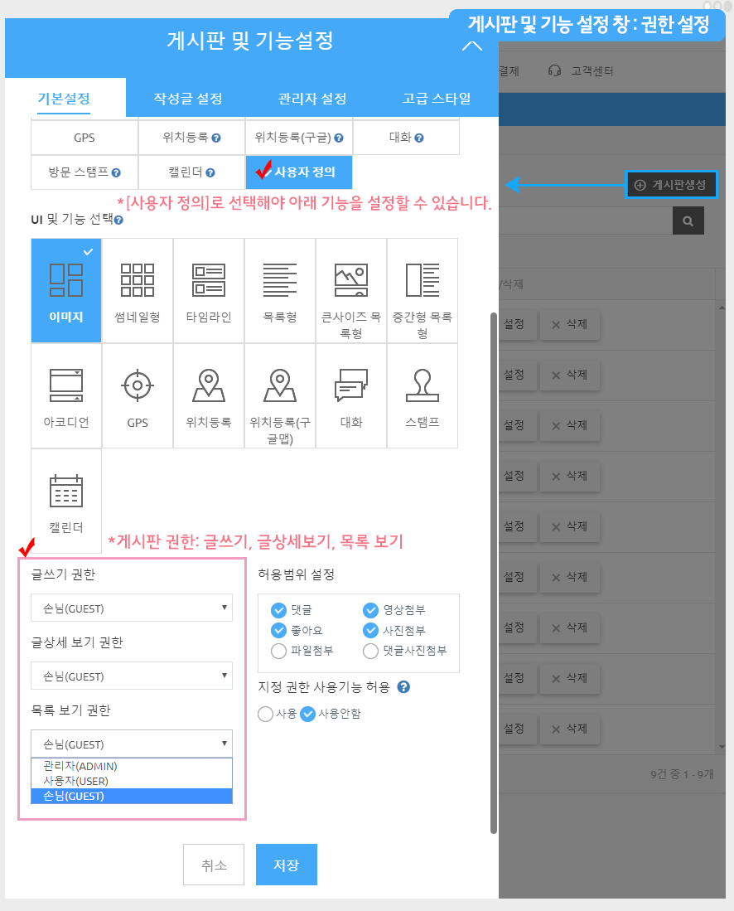
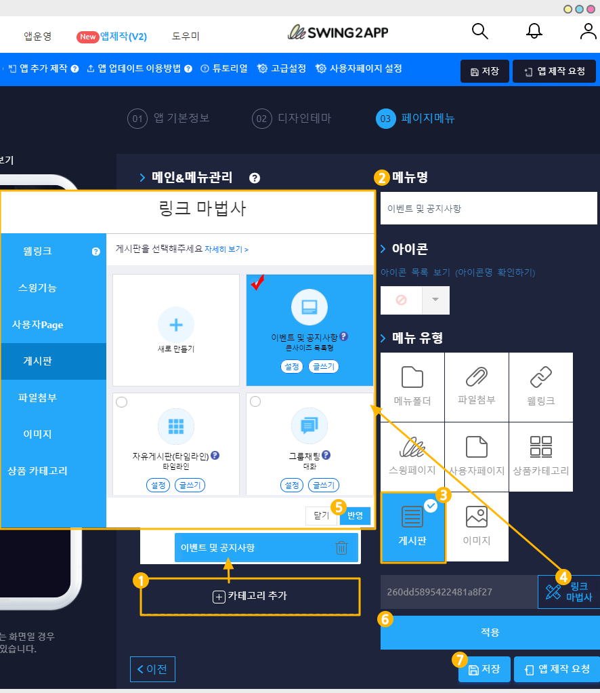

# 게시판 권한 설정 이용방법

<figure><figcaption></figcaption></figure>

<mark style="color:blue;">**게시판 권한 설정 이용용도?**</mark>

<figure><figcaption></figcaption></figure>

게시판에 접근할 수 있는 권한 – 글쓰기, 글상세보기, 목록보기에 각각 다른 이용자를 설정할 수 있습니다.

앱 이용자 모두가 게시판 이용이 가능하게끔 만들 수도 있지만!! 앱에 따라 게시판 이용에 그룹별 차등 이용을 설정해야 할 경우도 있죠!

> **예를 들어**
>
> **글쓰기= 관리자만 가능/ 게시판 목록보기,글 상세보기= 사용자만 가능**
>
> **글쓰기= 사용자만 가능/ 게시판 목록보기,글 상세보기= 손님만 가능**

이런식으로 게시판에 따라 이용 그룹을 다르게 지정할 수 있습니다.

**\*스윙투앱에서는 사용자 그룹 외에 총 9등급의 권한을 이용해서 신규 그룹을 만들 수 있기 때문에 원하는 그룹을 만든 뒤 게시판 권한에 적용할 수도 있답니다\~!!**

**\*게시판 권한은 앱제작 V3버전으로 전환해주셔야 이용가능합니다. V2 버전을 이용하고 있다면 앱제작에서 V3로 전환하여 업데이트 한뒤 이용해주세요.**

게시판 권한을 설정하는 방법은 아주 간단하오니!! 이용방법을 확인해주세요.

<figure><figcaption></figcaption></figure>

## <mark style="color:blue;"></mark> <mark style="color:blue;"></mark> STEP**1. 게시판 권한 이용방법**

<figure><figcaption></figcaption></figure>

1\)앱운영-서비스관리 선택

2\)게시판 관리 선택

<figure><figcaption></figcaption></figure>

3\)게시판 생성 버튼 선택

\*기존 만들어놓은 게시판에 이용하실 경우 작업하고자 하는 게시판의 \[설정] 버튼 선택해주세요.

4\)게시판 및 기능 설정 창 \[권한 설정] 메뉴 선택

5\)권한 지정 유형 체크

6\)게시판 권한 설정 체크

7\)노출 메시지 설정 (필수 입력 항목 아님)

8\)저장 선택

**+게시판을 새로 만들 경우 \[게시판생성] 버튼을 선택하구요.**

**+기존에 만들어놓은 게시판을 수정할 경우 \[설정] 버튼을 선택해주세요.**

****

<mark style="color:red;">★ 권한 설정 전 기본설정- 서비스 용도 '사용자 정의' 선택</mark>

게시판 기능 등 옵션을 설정하기 위해서는 반드시! 서비스용도에서 \[사용자 정의]로 선택해주셔야 합니다.

사용자 정의로 선택되지 않으면 설정값이 모두 고정으로 제공되기 때문에 사용자정의 선택 후 옵션값을 자유롭게 수정해주세요.

&#x20;


**\*중요 – 이용조건\***

1\)해당 기능은 V3버전에서 제작한 앱에서만 제공됩니다.

앱제작 V2 버전을 이용하고 있다면, V3으로 전환하여 이용해주세요.

2\)앱 업데이트를 먼저해주세요. 해당 기능은 앱 업데이트를 먼저 한 뒤 이용할 수 있습니다.

\*앱제작 이동 – \[앱 업데이트] 버튼 선택  \*업데이트 유형:하드 업데이트, 업데이트 표시옵션: 필수, 권장 등 원하는 옵션으로 선택

위의 2가지 이용조건을 모두 충족해야 게시판 권한설정 기능을 이용할 수 있습니다.

충족하지 못할 경우 권한 설정 메뉴가 뜨지 않습니다.

\*2022년 11월 17일 이후 제작한 신규앱은 바로 이용 가능합니다.


****

<figure><figcaption></figcaption></figure>

<mark style="color:blue;">**\*앱제작 V2버전 이용) 사용자분들은 아래 가이드로 확인해주세요.**</mark>&#x20;



### **1.게시판 및 기능 설정 창: 권한 설정하기**

<figure><figcaption></figcaption></figure>

\+게시판을 새로 만들 경우 \[게시판생성] 버튼을 선택하구요.

\+기존에 만들어놓은 게시판을 수정할 경우 \[설정] 버튼을 선택해주세요.

&#x20;★게시판 기능 등 옵션을 설정하기 위해서는 반드시! 서비스용도에서 \[사용자 정의]로 선택해주셔야 합니다.

사용자 정의로 선택되지 않으면 설정값이 모두 고정으로 제공되기 때문에 사용자정의 선택 후 옵션값을 자유롭게 수정해주세요.

게시판 기능 창-\[기본설정 메뉴]에서 제일 밑으로 내리면 게시판 권한을 설정할 수 있는 메뉴를 확인할 수 있어요.

V2 버전 이용시) 권한은 해당 방법으로 적용 가능하구요. <mark style="color:red;"></mark>&#x20;

<mark style="color:red;">V3에서 제공되는 권한 지정 유형, 노출 메시지는 제공되지 않습니다.</mark>&#x20;

게시판 항목별 권한만 설정할 수 있습니다.

### &#x20;2.앱에 게시판 적용하기

<figure><figcaption></figcaption></figure>

스윙 앱제작 페이지에서 → 페이지 메뉴 로 이동합니다.

1\. \[카테고리 추가] 버튼을 선택해서 게시판을 적용할 메뉴를 추가합니다.

2\. 메뉴 이름을 입력해주세요.

3\. 메뉴 유형: \[게시판]을 선택해주세요.

4\. \[링크마법사] 버튼을 선택해주세요.

5\. 메뉴에 적용할 게시판을 선택한 뒤 \[반영] 버튼 선택

6\. \[적용] 버튼

7\. \[저장] 버튼을 누르면 완료됩니다.

\*아이콘은 선택사항이며, 메뉴 앞에 아이콘을 적용할 경우만 선택해주세요.



<figure><figcaption></figcaption></figure>

## <mark style="color:blue;"></mark> <mark style="color:blue;">****</mark>** STEP.2 게시판 권한 설정 안내 및 주의사항**

****

<mark style="color:blue;">**1.권한 지정 유형별 옵션**</mark>

<figure><figcaption></figcaption></figure>

1\)선택 등급 이상 자동 권한 부여: 선택한 등급 포함 그 이상의 등급 이용자 모두 이용 가능합니다.&#x20;

예시)3등급 그룹 설정시 해당 등급을 포함하여 등급이 더 높은 2등급, 1등급 사용자가 모두 접근 가능합니다.&#x20;

2\)단일 권한 그룹 지정: 특정 등급의 이용자만 접근 가능하도록 설정할 수 있습니다.&#x20;

예시)글 목록 보기를 “3등급” 그룹으로 설정시, 등급이 더 높은 2등급, 1등급 사용자도 접근이 불가합니다.&#x20;

지정된 해당 그룹만 이용하도록 설정합니다.&#x20;

3\)다중 지정 권한 설정: 특정 그룹이나, 특정 사용자를 다중으로 지정할 수 있습니다. &#x20;

<mark style="color:blue;">**2.게시판 권한별 옵션**</mark>

글쓰기 권한, 글상세보기 권한, 목록 보기 권한으로 제공됩니다.

&#x20;

<mark style="color:blue;">**3.권한이 없는 경우 노출 메시지 설정**</mark>

권한이 없는 사용자가 게시판 접근 시, 안내 메시지 창을 띄울 수 있는 기능입니다.

HTML에디터 글 작성이 제공되며 글자 폰트나 색상 등의 옵션을 입힐 수 있습니다.&#x20;

노출메시지는 선택 사항으로, 설정을 하지 않을 경우 기본 메시지가 노출됩니다.&#x20;

**앱 실행화면 이미지)**

**1)기본 셋팅 메시지-노출메시지 설정하지 않았을 경우**

&#x20;

**2)노출 메시지 설정시- 입력한 내용으로 노출**

&#x20;

<mark style="color:blue;">**4.앱 이용 그룹**</mark>

스윙투앱에서 제작한 앱의 기본 그룹은

**관리자, 사용자(앱에서 회원가입을 한 이용자), 손님(앱을 설치한, 회원가입은 하지 않은)**으로 제공 됩니다.

따라서 게시판 권한: 글쓰기에는 어떤 그룹으로 권한을 정할지, 글 상세보기, 글 목록보기 등을 나눠서 설정할 수 있습니다.

&#x20;

<mark style="color:blue;">**5.주의사항**</mark>

<figure><figcaption></figcaption></figure>

게시판 기능 등 옵션을 설정하기 위해서는 반드시! **서비스용도에서 \[사용자 정의]로 선택해주셔야 합니다.**

‘사용자 정의’로 선택되지 않으면 설정값이 모두 고정으로 제공되기 때문에 사용자정의 선택 후 옵션값을 자유롭게 수정해주세요.

<figure><figcaption></figcaption></figure>

<figure><figcaption></figcaption></figure>

## <mark style="color:blue;"></mark> <mark style="color:blue;">****</mark>** STEP3. 그룹 운영 TIP**

**앱에서 기본 제공되는 그룹(관리자, 사용자, 손님)외에 운영자는 새로운 그룹을 만들어서 추가할 수 있습니다.**

그룹을 만드는 방법과 게시판에 그룹을 적용하는 방법은 아래 링크로 확인해주시기 바랍니다.

 **** [**권한 그룹 설정(그룹만들고 분류하기) 바로가기**](../pushmember/member-group.md)

 권한그룹을 만들고 게시판에 권한을 반영하는 방법을 확인해주세요!

<figure><figcaption></figcaption></figure>

## <mark style="color:blue;"></mark> <mark style="color:blue;">****</mark> STEP4. 앱에 게시판 적용하기

위에서 제작한 게시판을 앱에 적용해야 앱에서 이용 가능하겠죠?

**앱제작 V3버전)**

<figure><figcaption></figcaption></figure>

1\)앱제작 – STEP3 페이지 선택

2\)메뉴 선택

\*메뉴를 만들기 전이라면, 새 메뉴를 만들어주세요. (+ 모양 버튼 선택하여 메뉴 추가)

3\) 메뉴 이름을 입력해주세요.

4\) 페이지 디자인에서 **\[UI KIT]** 선택

5\)**\[게시판]**을 선택해주세요.&#x20;

6\) 등록할 게시판을 확인한 뒤 \[적용하기] 버튼을 선택해주세요. (페이지에 마우스 커서를 가져다 대면 적용하기 버튼이 열립니다)

7\) 화면 상단 \[저장]버튼을 누르면 앱에 적용됩니다.

<figure><figcaption></figcaption></figure>

## <mark style="color:blue;"></mark> <mark style="color:blue;">****</mark> STEP5.앱 실행화면

<mark style="color:blue;">**1. 목록보기 : 사용자 권한 설정**</mark>

게시판 목록보기를 사용자 권한으로 설정했구요.

앱에는 손님으로 접근을 하면, 게시판 선택시 바로 위의 이미지처럼 로그인이 필요하다는 팝업 창이 열립니다.

​

<mark style="color:blue;">**2.글 상세보기 : 사용자 권한 설정**</mark>

마찬가지로 앱에서는 손님으로 실행했구요.게시물 글 상세보기에 ‘사용자’ 권한으로 설정했어요.

이 경우는 게시판 목록은 제한없이 볼 수 있지만 게시물을 선택해서 상세글을 보려고 하면 접근을 막고 로그인이 필요하다는 팝업창이 뜹니다.

​

<mark style="color:blue;">**3.신규 그룹 설정**</mark>

손님, 사용자, 관리자 그룹외에 추가로 여러 그룹을 만들었구요.

그룹에 따라서 접근할 수 있는 권한을 다 다르게 설정할 수 있습니다.

