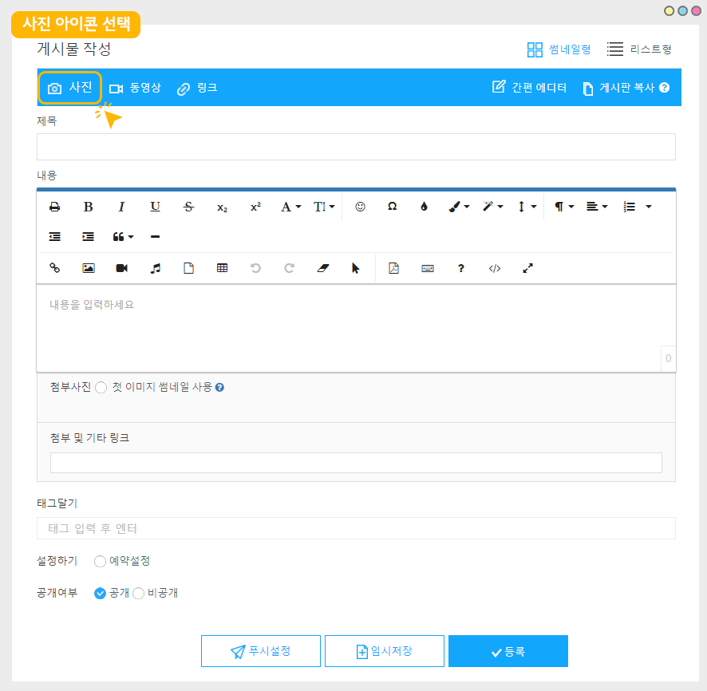

# 게시판 만들기

<figure><figcaption></figcaption></figure>

<mark style="color:blue;">**\*게시판 제작방법**</mark>

[앱운영페이지 → 서비스관리 → 게시판관리](http://www.swing2app.co.kr/view/board\_edit) →\[게시판 생성] 버튼 선택하여 게시판 제작 \*게시판 UI, 사용용도, 옵션 등 내용 설정

<mark style="color:blue;">**\*앱에 적용하는 방법**</mark>

앱제작페이지 → 페이지메뉴 → 메뉴 추가 → 메뉴 \[게시판] 선택 → \[불러오기] 선택 → 만들어놓은 게시판 선택한 뒤 → 적용 후 저장

<mark style="color:blue;">**\***</mark>[**게시물 입력방법 보러가기**](post-write.md)

<mark style="color:orange;">**앱 실행화면) 게시판 적용 화면**</mark>

<figure><figcaption></figcaption></figure>

## STEP1.게시판 생성하기

### <mark style="color:blue;">**1. 게시판 생성**</mark>

게시판을 만드는 방법을 알려드릴게요!

게시판은  [**앱운영페이지→서비스관리 → 게시판관리**](http://www.swing2app.co.kr/view/board\_edit)메뉴로 이동해주세요.

게시판 관리 페이지의 <mark style="color:blue;">**\[게시판 생성]**</mark> 버튼을 선택하면<mark style="color:blue;">**\[게시판 및 기능설정]**</mark> 창이 뜹니다.

> \*게시판관리 페이지에 보시면, 내가 만들지 않은 게시판들이 있는 것을 확인할 수 있는데요. \
> 이 게시판들은 스윙에서 기본 셋팅해놓은 게시판으로, 해당 게시판을 사용하셔도 되구요\
> 필요 없다면 다 삭제하시고, 원하는 게시판을 새로 만드셔도 됩니다.

### <mark style="color:blue;">**2. 게시판 및 기능설정: 기본설정**</mark>

게시판 제작 전 확인해주세요!

\*서비스 용도에서 \[사용자정의]로 체크하면 회색 고정 영역이 풀리게 됩니다.

아래 상세설정 내용을 수정해야 한다면 <mark style="color:red;">‘사용자정의’</mark>를 선택하시고 게시판을 설정해주세요.

1\)게시판 및 기능이름: 게시판 이름을 입력합니다.

2\)서비스용도: 게시판 용도를 선택합니다.

<mark style="color:red;">\*\[사용자 정의]를 선택해주세요! 사용자 정의를 선택해야 아래 고정된 회색영역이 풀리게 되며, UI를 선택할 수 있습니다.</mark>

3\)UI 및 기능 선택: 위의 서비스 용도를 선택하면 UI도 자동으로 서비스용도에 맞게 설정됩니다.

<mark style="color:red;">위에서 \[사용자 정의] 를 선택하면, UI를 자유롭게 선택해서 적용할 수 있습니다.</mark>

**☞** [**게시판 UI스타일 보러가기**](design.md)

\*위에서 생략한 \[게시판 및 기능설명]은 고급스타일에서 게시판 헤더를 적용했을때 나타나는 소개 멘트입니다.

따라서 헤더를 적용하지 않는다면 설명을 작성하지 않아도 되구요. 헤더를 설정할 때만 소개 멘트를 기재해주세요.

**4) 글쓰기 권한**

**5) 글상세 보기 권한**

**6) 목록 보기 권한**

3가지 항목은 게시판을 이용할 수 있는 권한을 설정하는 항목이에요. 글쓰기, 글 상세보기, 목록보기 권한을 설정할 수 있구요.

별도 그룹을 만들지 않을 경우에 위의 이미지처럼 관리자, 사용자, 손님으로만 표시됩니다.

관리자는 글을 쓰게 하는 권한을 앱을 이용하는 회원 모두 (손님 포함)을 할 것인지 특정 사용자만 이용하게 할 것인지를 설정할 수 있습니다.

☞[**게시판 권한 설정하기 보러가기**](board-authority.md)

**7)허용 범위 설정**

댓글, 좋아요, 사진첨부, 영상첨부, 파일첨부, 댓글사진첨부 등의 옵션항목이 있구요.​

앱 운영방법에 따라서 필요한 옵션에 선택해서 체크해주시면 됩니다.

<mark style="color:red;">\*댓글, 좋아요, 댓글 사진 첨부, 사진첨부 = 앱에서 사용자들이 이용할 수 있는 항목</mark>

<mark style="color:red;">\*영상첨부, 파일첨부= 관리자가 웹에서만 등록 및 운영하는 항목으로, 앱에서는 사용할 수 없습니다.</mark>

**8)지정 권한 사용기능 허용**

관리자가 지정하는 특정 회원그룹만 해당 게시판을 이용하게 할지 선택하는 옵션입니다.

\*\* 지정권한 사용방법은 해당 매뉴얼을 참고해주세요.

☞[ **게시판 지정권한 사용하기**](broken-reference)

***

### <mark style="color:blue;">**3. 게시판 및 기능설정: 고급 스타일**</mark>

<mark style="color:red;">★게시판 기본설정 항목은 모두 입력이 되었는데요. 마지막 하나만 더 입력하고 저장해주세요!</mark>

<mark style="color:red;">상단의 \[고급 스타일] 항목으로 이동합니다.</mark>

**9) 고급스타일 – 게시물 옵션 설정​**

고급스타일의 게시물 옵션 설정은 게시물 목록과 상세보기에서 글을 작성한 등록자 이름을 표시할 것인지, 등록일시를 표시할 것인지, 조회수를 표시할 것인지 등의 게시물 옵션을 설정하는 메뉴에요.

그대로 제작하실 경우, 셋팅된 값 그대로 놔두고 저장해주시면 되구요.

앱 운영에 따라 필요한 항목들을 수정해서 체크해주시면 됩니다.

\*게시물 옵션을 운영하는 방법은 아래 매뉴얼을 확인해주세요!

**☞** [**\[게시물 옵션 설정 상세 매뉴얼 보러가기\]**](post-options.md)

**10) \[저장] 버튼을 누르면 게시판 생성이 완료됩니다.**

**\[게시판 생성 완료]**

저장이 완료되면 게시판 관리 목록에 생성된 게시판을 확인할 수 있습니다.

이러한 방법으로 필요한 게시판만큼 계속 추가해서 만들 수 있습니다.

**-무료, 유료버전앱 게시판 제작 갯수-**

\*무료버전앱: 30개 까지 제작 가능

\*유료버전앱: 기본형) 100개, 확장형) 300개, 프리미엄) 무제한 제작 가능

**\[움짤 이미지로 게시판 생성 방법 확인하기]**

게시판은 생성하시고, 또 원하는 스타일과 이용 용도로 자유롭게 수정하여 사용할 수 있으시니깐 걱정하지 마시고!!

막 만드셔도 되구요 ^^

앱에서 어떻게 보이는지 확인하고 원하는 스타일로 수정해주세요 !

### <mark style="color:blue;">4. 그외 게시판 기능 알아보기</mark>

일반 게시판 생성 외에 게시판에 사용되는 다양한 기능들이 많아요.​

해당 기능들은 모두 매뉴얼로 제공하고 있으니 운영시 함께 확인해주세요!


**각 메뉴 옆에는 **<mark style="color:blue;">**파란색 ? 물음표 아이콘**</mark>**이 모두 기재되어있습니다. 버튼을 누르면 바로 해당 메뉴 이용방법 매뉴얼로 이동해요\~!**


<mark style="color:orange;">**1)작성글 설정**</mark>

**(1)작성글**

모든 사용자들에게 동일하게 받아야 할 답변 목록이 있을 경우, 관리자가 미리 해당 질문지를 게시판에 작성하여 사용자들에게 제공할 수 있어요.

&#x20;[**게시판 작성글 이용방법**](write-bulletin-board.md)

**(2)작성폼**

게시판 폼이 셋팅되어서 제공되기 때문에 **게시판 내에 툴이 만들어지며 이미지 첨부, 캘린더(날짜설정)등을 추가하여 이용할 수 있습니다.**

[**게시판 작성폼 이용방법**](form.md)

<mark style="color:orange;">**2)관리자 설정**</mark>

**(1)관리자 설정**

앱 전체 운영이 아닌, **특정 게시판을 관리할 수 있는 권한을 주는 것으로 게시판에서 특정회원을 선택한 후 관리자로 설정할 수 있습니다.**

게시판 관리자로 설정이 되면 다른 사용자가 작성한 게시물을 삭제하거나 고정글로 설정할 수 있는 권한을 가집니다.

[**\[관리자 설정 이용방법 보러가기\]**](administrator.md)

**(2)새글알람 설정**

게시판에 새 글이 등록되면 새글이 등록되었다는 알람을 실시간으로 푸시로 알려주는 기능이에요.

\[게시판 관리자 페이지]에서 알람을 받길 원하는 회원을 선택해주시면, 해당 회원에게 푸시 알람이 전송됩니다.

[**\[새글알람 설정 이용방법 보러가기\]**](post-alarm.md)

<mark style="color:orange;">**3) 고급 스타일**</mark>

**(1) 게시판 헤더 설정**

**게시판 헤더는 게시물을 상단에 고정시켜 보여주는 핀 기능이에요.**

게시판 상단에 게시물 섬네일이 보여지게끔 하여, 목록을 보지 않고서도 섬네일로만 게시물 목록을 확인할 수 있구요.

등록된 게시물 순위를 정해서 순서대로 게시물 섬네일을 정렬시킬 수 있습니다.

[**\[게시판 헤더 이용방법 상세보기\]**](header.md)

**(2) 게시물 옵션 설정**

\*게시물 옵션을 운영하는 방법은 아래 매뉴얼을 확인해주세요!

**☞** [**\[게시물 옵션 설정 상세 매뉴얼 보러가기\]**](post-options.md)

**(3) 해시태그 관리**

**인스타그램처럼 해시태그(#)로 입력한 검색어를 모두 찾아주는 태그 검색 기능입니다.**

스윙투앱 에서 제공하는 해시태그 검색 옵션은 게시판에서 사용할 수 있구요.

각 검색 옵션을 다양하게 설정하여 앱에 적용할 수 있습니다.

&#x20;[**\[해시태그 이용방법 상세 보기\]**](hashtag-option1.md)

<figure><figcaption></figcaption></figure>

## STEP2.앱에 만들어놓은 게시판 적용하기&#x20;

### <mark style="color:blue;">1.앱에 게시판 적용하기</mark>&#x20;

### -앱제작 V3버전 이용시

<figure><figcaption></figcaption></figure>

1\)앱제작 화면 - STEP3 페이지 선택

2\)메뉴 선택

\*메뉴를 만들기 전이라면, 새 메뉴를 만들어주세요. (+ 모양 버튼 선택하여 메뉴 추가)

3\) 메뉴 이름을 입력해주세요.

4\) 페이지 디자인에서 \[UI KIT] 선택

5\)\[게시판]을 선택해주세요.&#x20;

6\) 등록할 게시판을 확인한 뒤 \[적용하기] 버튼을 선택해주세요. (페이지에 마우스 커서를 가져다 대면 적용하기 버튼이 열립니다)

<mark style="color:red;">\*게시판은 내가 만들어놓지 않았는데 게시판이 있는 것을 확인할 수 있어요.</mark>&#x20;

<mark style="color:red;">스윙투앱에서 샘플로 기본 제공해드리는 게시판이에요.</mark>&#x20;

<mark style="color:red;">따라서 게시판을 이용하기 전에는 \*앱운영-서비스관리- 게시판관리에서 사용할 게시판만 만들어주시고 사용하지 않는 게시판은 삭제해주세요.</mark>&#x20;

<mark style="color:red;">게시판 운영 정리를 모두 한 뒤 앱에 적용할 게시판을 등록해주세요.</mark>&#x20;

7\) 화면 상단 \[저장]버튼을 누르면 앱에 적용됩니다.

### -앱제작 V2버전 이용시

앱제작 →  페이지 메뉴 로 이동합니다.&#x20;

1\. \[카테고리 추가] 버튼을 선택해서 게시판을 적용할 메뉴를 추가합니다.&#x20;

2\. 메뉴 이름을 입력해주세요.

3\. 메뉴 유형: \[게시판]을 선택해주세요.

4\. \[링크마법사] 버튼을 선택해주세요.

5\. 메뉴에 적용할 게시판을 선택한 뒤 \[반영] 버튼 선택

6\. \[적용] 버튼

7\. \[저장] 버튼을 누르면 완료됩니다.

\*아이콘은 선택사항이며, 메뉴 앞에 아이콘을 적용할 경우만 선택해주세요.&#x20;

### <mark style="color:blue;">**2.게시물 입력 방법**</mark>

게시물 입력방법: 만든 게시판에 게시물 입력은 어떻게 하나요?

게시판을 모두 만들고, 앱에 적용했다면, 게시물을 입력해야 하겠죠?

게시물을 입력하는 방법은 아래 매뉴얼을 확인해주세요.&#x20;



<figure><figcaption></figcaption></figure>

## STEP3.앱 실행화면)게시판 적용 화면

게시판은 다양한 UI 스타일을 제공하고 있기 때문에 게시판마다 이렇게 다른 스타일로 앱에서 보여지게 됩니다.

메뉴에 연동한 게시판을 선택하면 \[목록보기] 화면이 보이고 글 제목이나 이미지를 탭하면  → \[글 상세보기]로 이동하는 구조입니다.

<figure><figcaption></figcaption></figure>

## STEP4.게시판 이용 안내사항

1\) 스윙투앱을 처음 이용하시는 분들은 게시판을 만들지 않아도, 당사에서 게시판을 셋팅하여 제공이 됩니다.

셋팅된 게시판을 다 삭제하시고 새로 만드셔도 되고 있는 게시판을 수정해서 사용하셔도 됩니다.

**2)게시판 이용시, 이미지를 첨부해야 대표 섬네일 이미지가 설정됩니다.**

게시판 이용시 게시판 리스트 페이지에 섬네일 이미지가 보이지 않고, 앱 아이콘으로 표시된다고 문의가 있으신데요.

이미지가 보이지 않는 것은 첨부된 이미지가 없기 때문입니다.

**게시물에서 섬네일 이미지를 지정할 때는 반드시 \[사진 첨부]를 선택해서 이미지 파일을 첨부해주셔야 합니다.**

내용(본문) 안으로 이미지를 넣을 경우, 해당 이미지는 텍스트로 인식되기 때문에 섬네일로 지정이 되지 않아요.

따라서**게시물에 섬네일 이미지를 지정할 경우! 반드시 사진 아이콘을 선택해서, 이미지를 등록해주시기 바랍니다.**&#x20;

<figure><figcaption></figcaption></figure>

3\)무료사용자는 **게시판 총 30개**까지 제작 가능합니다. \*게시물 수는 제한 없어요!

​4)유료사용자는 **기본형 상품 이용시 100개 제작, 확장형 상품 300개 제작, 프리미엄 상품은 무제한**으로 제작 가능합니다.

\*게시물 수는 제한 없어요!

​5)게시판에 첨부되는 이미지, 동영상 파일은 앱 용량에 집계가 됩니다.

업로드하는 이미지의 수가 많을 경우 그만큼 용량이 많이 집계되오니 이용에 참고 하시기 바랍니다.

\*용량은 [앱운영페이지→ 서비스관리→ 리소스 관리](http://www.swing2app.co.kr/view/storage\_manager)에서 앱의 이용용량을 체크할 수 있습니다.

