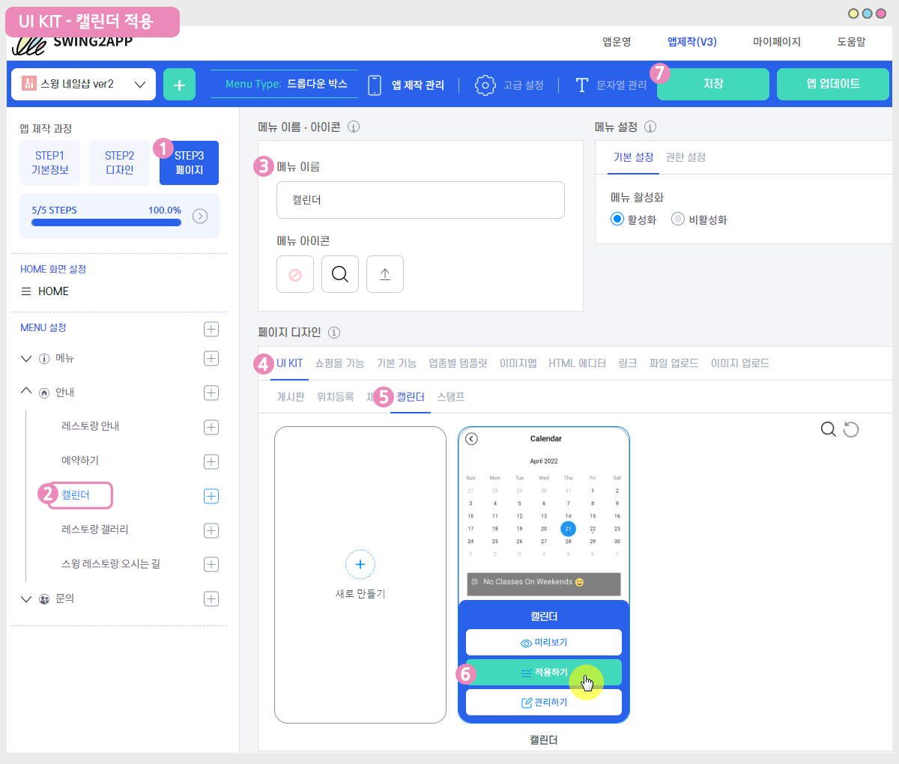

# 캘린더 이용방법

<figure><figcaption></figcaption></figure>

<mark style="color:blue;">**스윙투앱의 캘린더 ?**</mark>

캘린더에 주요 일정을 간편하게 등록할 수 있고, 예약 관리가 필요한 업체에서는 날짜, 시간별로 예약현황을 기록할 수 있어요.

또한 중요한 소식, 공지사항을 기재할 수 있습니다.\
\

<mark style="color:blue;">**스윙투앱의 캘린더에서 제공하는 기능**</mark>&#x20;

\+ 캘린더 날짜별 간편한 일정 작성

\+ 자유로운 일정 관리 – 편리한 일정 수정, 삭제

\+ 여러 일정 추가 가능

\+ 일정 마다 다른 색상의 텍스트, 배경으로 구분 가능

\+ 중요한 공지는 공지사항으로 작성 가능

\+ 일정 작성은 게시물 HTML에디터 작성과 동일(이미지첨부, 링크,동영상 첨부 모두 가능)&#x20;

\+ 일정 선택 시 ‘상세 일정보기’ 게시물로 이동\
\

<mark style="color:blue;">**스윙투앱의 캘린더 이용방법**</mark>

**1)캘린더 만들기**&#x20;

앱운영페이지 → 서비스관리 → 게시판 관리 → 게시판 생성 버튼 선택 → 새롭게 추가된 \[캘린더]를 확인할 수 있어요! ****&#x20;

**2) 캘린더에 일정 작성하기**&#x20;

캘린더는 게시판 기능이기 때문에, 게시물 입력과 동일하게 이용해주시면 됩니다.&#x20;

위에서 캘린더 게시판 저장 후 \*앱운영페이지 → 게시물관리 → 캘린더 게시물로 이동하여 입력해주시면 됩니다. ****&#x20;

**3) 캘린더 앱 적용 방법**&#x20;

앱제작 페이지 → 페이지메뉴 → 메뉴 추가 후 → 게시판 불러오기 선택 →  만들어놓은 캘린더 게시판 선택 후 적용 → 적용 및 저장

자세한 이용방법은 매뉴얼을 참고해주시기 바랍니다.

<figure><figcaption></figcaption></figure>

### <mark style="color:blue;"></mark> <mark style="color:blue;">****</mark> 1. 캘린더 만들기

****[**앱운영 → 서비스관리 → 게시판 관리**](http://www.swing2app.co.kr/view/board\_edit) **페이지**로 이동합니다.&#x20;

<figure><figcaption></figcaption></figure>

&#x20;게시판관리 페이지에서 **\[게시판 생성]** 버튼을 선택하면, 게시판 및 기능설정 창에서  **‘캘린더’**를 확인할 수 있습니다.

1\) 게시판 생성 버튼 선택

2\)게시판 및 기능 설정 창: 게시판 이름 입력

3\)서비스용도: ‘사용자 정의’ 선택&#x20;

4\)UI 및 기능 선택 : 캘린더 선택&#x20;

<figure><figcaption></figcaption></figure>

**5)권한 설정: 캘린더 게시판 이용 권한을 설정할 수 있는 메뉴입니다.**&#x20;

**6)권한 지정 유형 선택**

선택 등급 이상 권한 부여, 단일 권한 그룹 지정, 다중 지정 권한 설정 체크

**7)게시판 권한 설정**

글쓰기 권한, 글 상세 보기 권한, 목록 보기 권한 선택

**8)권한이 없는 경우 노출 메시지 설정** \*해당 항목은 선택사항이라 입력하지 않아도 됩니다. 기본 셋팅된 문구로 제공됩니다.&#x20;

**9)저장 버튼을 누르면 완료!**

&#x20;**** V3버전 이용시 위의 가이드대로 진행해주세요.&#x20;

V3 이용중임에도 위의 메뉴처럼 뜨지 않는다면, 앱제작으로 이동하여  \[앱 업데이트]를 해주세요.&#x20;

&#x20;



&#x20;V2 버전을 이용할 경우, 아래 내용으로 확인해주세요.&#x20;

### <mark style="color:blue;">1.캘린더 게시판 만들기</mark>

<figure><figcaption></figcaption></figure>

&#x20;게시판관리 페이지에서 **\[게시판 생성]**버튼을 선택하면, 게시판 및 기능설정 창에서  **‘캘린더’**를 확인할 수 있습니다.

**1) 게시판 생성 버튼 선택**

**2)게시판 및 기능 설정 창: 게시판 이름 입력**

**3)서비스용도: 사용자 정의 선택** \*권한을 수정하지 않을 경우 캘린더를 바로 선택해도 됩니다.&#x20;

**4)UI 및 기능 선택 : 캘린더 선택**&#x20;

**5)게시판 권한 설정: 캘린더 게시판 이용 권한을 설정할 수 있습니다.**

글쓰기 권한, 글 상세 보기 권한, 목록 보기 권한 선택

**6)저장 버튼을 누르면 완료! 캘린더 제작이 완료됩니다.**&#x20;

****

**캘린더는 게시판 기능이기 때문에 상세설정을 수정하여 사용할 수 있어요**.

서비스 용도에서 ‘사용자 정의’를 선택하면, 고정된 회색 음영 영역이 풀립니다.

UI 및 기능 선택에서 ‘캘린더’를 다시 선택하여, 권한설정 – 글쓰기 권한, 목록보기, 상세보기 권한을 수정할 수 있습니다.

&#x20;

### <mark style="color:blue;">**2.앱에 캘린더 적용하기**</mark>

<figure><figcaption></figcaption></figure>

&#x20;**앱제작 페이지 → 페이지메뉴 단계로 이동해주세요.**

1\. \[카테고리 추가] 버튼을 선택해서 게시판을 적용할 메뉴를 추가합니다.

2\. 메뉴 이름을 입력해주세요.

3\. 메뉴 유형: \[게시판]을 선택해주세요.

4\. \[링크마법사] 버튼을 선택해주세요.

5\. 메뉴에 적용할 ‘캘린더 게시판’을 선택한 뒤 \[반영] 버튼 선택

6\. \[적용] 버튼

7\. \[저장] 버튼을 누르면 완료됩니다.

\*아이콘은 선택사항이며, 메뉴 앞에 아이콘을 적용할 경우만 선택해주세요.



<figure><figcaption></figcaption></figure>

### <mark style="color:blue;"></mark> <mark style="color:blue;">****</mark> 2. 캘린더 일정 입력하기

**캘린더를 만들었으면 일정을 등록해야겠죠? 캘린더 입력은 웹에서만 가능합니다!!**

**앱운영 페이지 → 게시물 관리 → 캘린더**(만들어놓은 게시판)로 이동합니다.&#x20;

이렇게 새로 추가된 캘린더 페이지를 확인할 수 있어요.

캘린더는 해당 월을 기준으로 표시가 되구요.

원하는 년도, 월, 일을 선택할 수 있어요.

일정 작성 버튼으로 각 날짜별 일정을 추가하고, 공지작성 버튼을 통해서 주요 공지를 작성할 수 있어요.

<mark style="color:blue;">**1) 일정 작성하기**</mark>

일정은 상단의 \[일정작성] 버튼을 선택하여 작성할 수도 있고, 캘린더에서 날짜 영역을 선택하여 일정을 작성할 수 있어요.\
1\)날짜 및 시간 선택 (종일 일정은 ‘종일’ 버튼을 선택해주세요)\
2\)제목 입력\
3\)일정 상세 내용 입력\
4\)일정 제목의 텍스트, 배경 색상 설정 (아래 이미지를 통해서 색상 설정이 어떻게 보여지는지 확인해주세요)\
5\)저장 버튼 완료

\
**\[캘린더 일정 제목 텍스트, 배경 색상 설정]**

같은 날에 여러 일정이 있을 경우, 관리자가 구분하기 용이하게끔 색상을 다르게 설정할 수 있어요.

텍스트 색상과 배경색상을 설정하면, 캘린더 화면에서 일정마다 다른 색상으로 보여지게 됩니다.

\
\
<mark style="color:orange;"></mark><mark style="color:blue;">2</mark><mark style="color:blue;">**) 일정 수정, 삭제**</mark>

저장한 일정을 선택하면 수정, 삭제 버튼이 생성이 되요.

일정은 다시 수정할 수 있고, 필요 없는 일정은 삭제하는 등 간편한 일정관리가 가능해요!\
\
\
<mark style="color:orange;"></mark><mark style="color:blue;">**3) 일정 추가하기**</mark>

한 날에 여러 일정이 있다면!! 일정 추가 버튼으로 일정을 더 추가할 수 있습니다.

\
\
<mark style="color:blue;">4</mark><mark style="color:blue;">**) 공지사항 작성**</mark>

중요한 공지는 공지사항 버튼을 선택하여 작성할 수 있어요.\
\

캘린더 입력이 완료되었습니다.

그럼 만들어놓은 캘린더를 앱에 적용해볼게요!!

<figure><figcaption></figcaption></figure>

### <mark style="color:blue;"></mark> <mark style="color:blue;">****</mark> 3. 앱에 캘린더 적용하기

앱에 캘린더를 적용해주세요.&#x20;

<figure><figcaption></figcaption></figure>

1\)앱제작 화면 – STEP3 페이지 선택

2\)메뉴 선택 \*메뉴를 아직 안만들었다면, + 모양 버튼 선택하여 메뉴 추가 할 수 있습니다.&#x20;

3\)메뉴 이름을 입력해주세요.

4\)페이지 디자인에서 \[UI KIT] 선택

5\)\[캘린더]를 선택해주세요.&#x20;

6\) 만들어놓은 캘린더를 확인한 뒤 \[적용하기] 버튼을 선택해주세요. (페이지에 마우스 커서를 가져다 대면 적용하기 버튼이 열립니다)

\*캘린더게시판을 먼저 만들어주세요.&#x20;

만들어놓은 캘린더가 없을 경우 화면에 뜨지 않으며, 앱에 적용할 수 없습니다.&#x20;

\*UI KIT 화면에 있는 \[새로 만들기] 버튼을 선택하거나, 앱운영-서비스관리-게시판관리에서도 게시판을 만들 수 있습니다.

7\) 화면 상단 \[저장]버튼을 누르면 앱에 적용됩니다.

\*아이콘은 선택사항이며, 메뉴 앞에 아이콘을 적용할 경우만 선택해주세요.

<figure><figcaption></figcaption></figure>

### <mark style="color:blue;"></mark> <mark style="color:blue;">****</mark> 4. 앱 실행화면

<figure><figcaption></figcaption></figure>

**앱 실행 후 캘린더 메뉴로 이동하면, 적용된 캘린더를 확인할 수 있습니다.**

일정이 있는 날은 날짜 밑에 **.** 표시가 되어 있어요.

해당 날짜를 선택하면 캘린더 아래로 저장된 일정들이 표시가 되구요.

일정을 선택하면 일정 상세보기 페이지로 이동합니다.

공지사항을 작성했으면 캘린더 화면에 공지글이 고정글로 표시 됩니다.

<figure><figcaption></figcaption></figure>

### <mark style="color:blue;"></mark> <mark style="color:blue;">****</mark> 5. 앱에서 캘린더 일정 작성하는 방법

<mark style="color:orange;">**캘린더 일정은 앱에서도 작성이 가능해요!**</mark>

먼저 앱 내에서 사용자 혹은 손님, 특정그룹에서 캘린더 글 작성이 가능하도록 게시판 권한 설정을 해주셔야 합니다!

<figure><figcaption></figcaption></figure>

위에서 보셨던 \*[서비스관리- 게시판관리](https://www.swing2app.co.kr/view/board\_edit)-게시판 및 기능설정 창에서 다시 확인해주세요.

**\*게시판 권한 설정: 글쓰기 권한, 글 상세보기 권한, 목록보기 권한을 설정합니다.**

캘린더를 어떻게 운영할지에 따라서 관리자가 설정을 다양하게 할 수 있는데요.

**아래 예시를 확인해주세요!**

> 1\)관리자만 일정을 작성하고, 앱 사용자들은 일정만 확인하도록 할 경우
>
> **☞ 글쓰기 권한: 관리자 선택, 글상세보기 권한, 목록보기 권한: 사용자 선택**
>
> ****
>
> 2\)커뮤니티 용도로, 앱을 사용하는 모든 사용자가 일정을 작성할 수 있고 모든 사용자가 일정을 공유하도록 할 경우
>
> **☞ 글쓰기 권한, 글상세보기 권한, 목록보기 권한: 모두 ‘사용자’ 선택**
>
> ****
>
> 3\)내가 작성한 일정은 다른 사람은 못보고 나만 보게 할경우 (캘린더를 개인사용으로 이용할 경우)
>
> **☞ 글쓰기 권한: 사용자 선택, 글상세보기 권한: 사용자 선택, 목록보기 권한: 관리자 선택**
>
> ****
>
> \*비밀게시판(1:1 고객센터)처럼 권한을 설정하면 글을 쓴 사용자는 자신이 쓴 글만 확인이 가능하며, 다른 사용자들은 자신이 쓴 글 외에 다른 사람의 글을 확인할 수 없습니다.
>
> 단, 관리자는 모든 사용자의 글을 확인할 수 있습니다.

<mark style="background-color:blue;">****</mark>

<mark style="color:blue;">**앱에서 캘린더 일정을 작성하는 방법**</mark>

앱에서 사용자들에게 글 작성이 가능하도록 설정해놓으면, 위의 이미지에서 보듯이 글작성 버튼이 상단에 표시됩니다.

오른쪽 상단의 **\[글작성]** 아이콘 버튼을 눌러주세요.

**1)제목: 일정 제목을 입력합니다.**

**2)시작일정: 일정이 시작되는 날을 입력 (시작일정 선택하시면 날짜를 선택할 수 있는 달력 창, 시간을 설정할 수 있는 시간 창이 뜹니다)**

**3)종료일자: 일정이 종료되는 날 입력 (동일하게 종료날짜, 종료 시간을 설정할 수 있어요)**

**4)내용: 일정에 관련된 상세 내용을 작성해주세요.**

**5)오른쪽 상단의 \[작성 완료] 아이콘 버튼을 눌러주시면 저장됩니다.**

****

<mark style="color:blue;">**1. 날짜 설정 방법**</mark>

시작일정을 선택하면 날짜를 선택할 수 있는 캘린더 창이 열립니다.

원하는 날짜를 선택해주시구요.

<mark style="color:blue;">**2. 시간 설정 방법**</mark>

\[종일] 을 선택하면 시간을 선택할 수 있는 시간 창이 열려요.

원하는 시간을 선택하거나, 특별히 정해놓은 시간이 없다면 ‘종일’로 선택해주시면 됩니다.

이렇게 앱에서도 일정을 작성하고, 앱에서 캘린더 일정을 공유할 수 있습니다!

캘린더도 게시판 기능이기때문에, 일정을 작성한 사용자는 자신의 일정을 수정하고, 삭제할 수 있습니다.

***


<mark style="color:red;">**안내사항**</mark>

1\) 캘린더 사용을 위해서는 **2018.09.02 이전에 제작한 앱은 앱을 새로 제작하여 업데이트된 버전에서 이용이 가능합니다.**

업데이트 이후에 앱을 제작하신 분들은 바로 이용이 가능해요!

2\) 캘린더를 만들고, 일정 작성 등의 모든 관리는 웹에서(스윙 홈페이지-앱운영페이지) 가능하며 **게시판 권한을 설정하면 앱에서도 작성이 가능합니다.**

3\) 웹에서 캘린더 일정을 추가, 수정, 삭제 한 뒤 저장하면 앱에는 자동으로 반영됩니다.

4\) 앱제작 버전 -V3, V2 이용에 따라 캘린더 설정 방법이 다르기 때문에 위의 가이드를 확인해주세요.&#x20;


***

***

