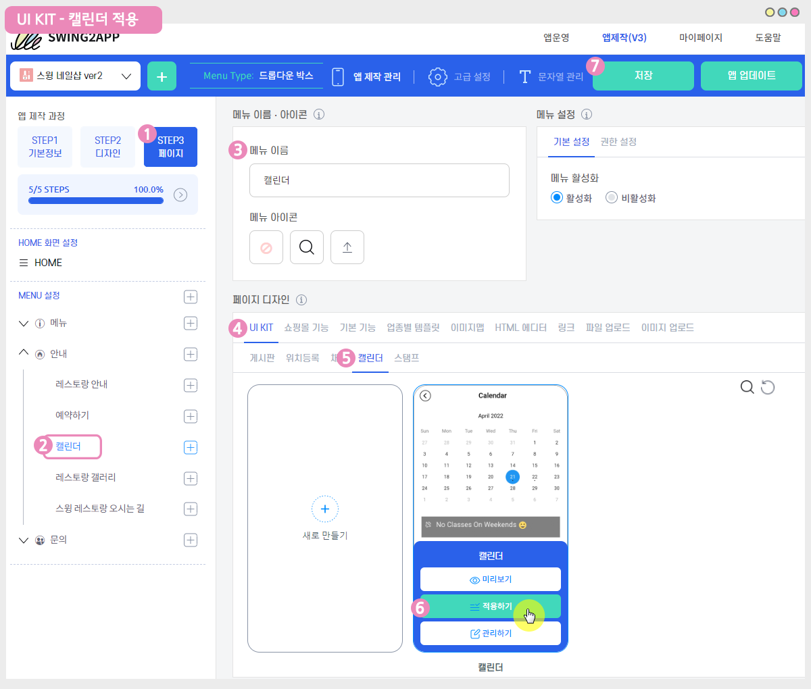

# 캘린더 응용-활용방법

<figure><figcaption></figcaption></figure>

캘린더는 주요 일정을 간편하게 등록할 수 있고, 예약 관리가 필요한 업체에서는 날짜, 시간별로 예약현황을 기록할 수 있어요.

또한 중요한 소식, 공지사항을 기재할 수 있는 기능입니다.

캘린더의 경우 앱 운영 목적에 맞게 다양하게 활용할 수 있는데요.

\-관리자만 일정을 기재하고, 사용자들에게 일정 공지용으로 활용할 수 있구요.

\-모든 앱 사용자가 일정을 직접 작성하고 공유할 수 있는 기능, 개인용으로 캘린더를 운영할 수도 있습니다.

**캘린더 제작 및 운영방법 상세 내용은 해당 매뉴얼을 확인해주세요!**



<figure><figcaption></figcaption></figure>

##  STEP1. 캘린더 만들기

[앱운영페이지 → 서비스관리 → 게시판 관리](http://www.swing2app.co.kr/view/board\_edit) 페이지로 이동해주세요.&#x20;

게시판관리 페이지에서 \[게시판 생성] 버튼을 선택하면, 게시판 및 기능설정 창이 뜹니다.

게시판관리 페이지에서 **\[게시판 생성]**버튼을 선택하면, 게시판 및 기능설정 창에서  **‘캘린더’**를 확인할 수 있습니다.

1\) 게시판 생성 버튼 선택

2\)게시판 및 기능 설정 창: 게시판 이름 입력

3\)서비스용도: 사용자 정의 선택 \*밑의 항목을 수정하지 않을 경우 캘린더를 바로 선택해도 됩니다.&#x20;

4\)UI 및 기능 선택 : 캘린더 선택&#x20;

5\)게시판 권한 설정: 캘린더 게시판 이용 권한을 설정할 수 있습니다.

글쓰기 권한, 글 상세 보기 권한, 목록 보기 권한 선택

6\)저장 버튼을 누르면 완료! 캘린더 제작이 완료됩니다

<figure><figcaption></figcaption></figure>

##  STEP2.앱에 캘린더 게시판 적용하기

만들어놓은 캘린더는 앱에 적용해야 하겠죠?

### <mark style="color:blue;">1.앱제작 V3버전 이용시</mark>

<figure><figcaption></figcaption></figure>

1\)앱제작 화면 – STEP3 페이지 선택

2\)메뉴 선택 \*메뉴를 아직 안만들었다면, + 모양 버튼 선택하여 메뉴 추가 할 수 있습니다.&#x20;

3\)메뉴 이름을 입력해주세요.

4\)페이지 디자인에서 \[UI KIT] 선택

5\)\[캘린더]를 선택해주세요.&#x20;

6\)만들어놓은 캘린더를 확인한 뒤 \[적용하기] 버튼을 선택해주세요. (페이지에 마우스 커서를 가져다 대면 적용하기 버튼이 열립니다)

\*캘린더게시판을 먼저 만들어주세요. 만들어놓은 캘린더가 없을 경우 화면에 뜨지 않으며, 앱에 적용할 수 없습니다.&#x20;

\*UI KIT 화면에 있는 \[새로 만들기] 버튼을 선택하거나, 앱운영-서비스관리- 게시판관리에서도 게시판을 만들 수 있습니다.

7\) 화면 상단 \[저장]버튼을 누르면 앱에 적용됩니다.

\*아이콘은 선택사항이며, 메뉴 앞에 아이콘을 적용할 경우만 선택해주세요.

### <mark style="color:blue;">2.앱제작 V2버전 이용시</mark>

앱제작 화면 –  페이지메뉴 선택

1\)\[카테고리 추가] 버튼을 선택해서 게시판을 적용할 메뉴를 추가합니다.

2\)메뉴 이름을 입력해주세요.

3\)메뉴 유형: \[게시판]을 선택해주세요.

4\)\[링크마법사] 버튼을 선택해주세요.

5\)메뉴에 적용할 ‘캘린더 게시판’을 선택한 뒤 \[반영] 버튼 선택

6\)\[적용] 버튼

7\)\[저장] 버튼을 누르면 완료됩니다.

\*아이콘은 선택사항이며, 메뉴 앞에 아이콘을 적용할 경우만 선택해주세요.

<figure><figcaption></figcaption></figure>

##  STEP3. 캘린더 응용하기&#x20;

본격적으로 캘린더를 다양하게 응용해서 사용하는 방법을 알려드릴게요!

### <mark style="color:blue;">**1. 캘린더 응용1 : 모든 사용자가 일정 작성**</mark>&#x20;

**★ 활용예: 커뮤니티용으로(대학교 과제, 동아리 등) 앱 회원들이 자신의 일정을 작성하여 서로의 일정을 공유합니다.**

모든 사용자가 앱에서 일정을 작성할 수 있고, 일정 목록 및 상세 일정 글을 보고 공유할 수 있습니다.

위의 앱 실행화면에서 보시듯이 사용자로 앱 접속시 캘린더 화면에서 다른 사용자들이 작성해놓은 일정을 확인할 수 있습니다.

앱에서 일정 작성이 가능하기 때문에! **캘린더 화면 오른쪽 상단을 보시면 \[글 작성] 아이콘 버튼이 있습니다.**

해당 버튼을 선택해서 일정을 작성할 수 있어요.

<mark style="color:orange;">**캘린더 목록 화면에서 보이는 일정 (제목)을 선택하면 → 일정 상세 페이지로 이동합니다.**</mark>

일정 목록에서 상세 페이지로 이동하면 글을 작성한 회원이 누구인지 확인이 가능하며, 일정에 대한 상세 내용을 확인할 수 있습니다.

<mark style="color:orange;">**응용사례1과 같은 캘린더를 제작하는 방법**</mark>

위에서 보셨던 \*[서비스관리- 게시판관리](https://www.swing2app.co.kr/view/board\_edit)-게시판 및 기능설정 창에서 다시 확인해주세요.

<mark style="color:purple;">**\[게시판 권한 설정]**</mark>

**-글쓰기 권한: 사용자**

**-글 상세보기 권한: 사용자**

**-목록보기 권한: 사용자**

해당 권한을 설정해주셔야 합니다. (사용자 외에 다른 그룹을 만들었다면 그룹별로도 적용이 가능합니다)

### <mark style="color:blue;">**2. 캘린더 응용2 : 관리자만 일정 작성**</mark>

**★ 활용예: 학원, 학교, 교육시설 어플에서 관리자가 학생들에게 시간표와 학업일정 등을 공지하는 캘린더로 사용할 수 있습니다.**

관리자만 일정을 작성할 수 있고, 앱 사용자들은 캘린더 – 일정 목록 및 상세 일정 글을 보고 공유할 수 있습니다.

앱 회원으로 로그인시 관리자가 작성해놓은 일정을 캘린더 목록화면에서 확인할 수 있습니다.

캘린더 목록 화면에서 보이는 일정 (제목)을 선택하면 → 일정 상세 페이지로 이동합니다.

일정 목록에서 상세 페이지로 이동하면, 일정에 대한 상세 내용을 확인할 수 있습니다.

**\*사용자들에게는 일정 작성 권한이 없기 때문에 위에 \[응용사례1]과 달리 캘린더 화면에서 글작성 버튼이 보이지 않아요!**

**\*관리자는 앱에서도 일정 작성이 가능하고, 스윙홈페이지) 앱운영페이지- 게시물관리에서도 웹으로 작성이 가능합니다.**

<mark style="color:orange;">**응용사례2와 같은 캘린더를 제작하는 방법**</mark>

위에서 보셨던 \*[서비스관리- 게시판관리](https://www.swing2app.co.kr/view/board\_edit)-게시판 및 기능설정 창에서 다시 확인해주세요.

<mark style="color:purple;">**\[게시판 권한 설정]**</mark>

**-글쓰기 권한: 관리자**

**-글 상세보기 권한: 사용자**

**-목록보기 권한: 사용자**

해당 권한으로 설정해주세요.&#x20;

***

### <mark style="color:blue;">**3. 캘린더 응용3 : 관리자만 일정 작성**</mark>

**★ 활용예: 네일샵,헤어샵 등 가게 예약 현황등을 앱 사용자들에게 공지하는 방법으로 활용합니다.**

관리자만 일정을 작성할 수 있고, 앱 사용자들은 캘린더 – 일정 목록 및 상세 일정 글을 보고 공유할 수 있습니다.

앱 회원으로 로그인시 관리자가 작성해놓은 일정을 캘린더 목록화면에서 확인할 수 있습니다.

그날의 예약 현황을 확인할 수 있구요.

가게 공지사항 및 예약이 가능한날, 불가능한 날을 확인할 수 있습니다.

**\*사용자들에게는 일정 작성 권한이 없기 때문에 위에 \[응용사례1]과 달리 캘린더 화면에서 글작성 버튼이 보이지 않아요!**

**\*관리자는 앱에서도 일정 작성이 가능하고, 스윙홈페이지) 앱운영페이지- 게시물관리에서도 웹으로 작성이 가능합니다.**

&#x20;<mark style="color:orange;">**응용사례3과 같은 캘린더를 제작하는 방법**</mark>

위에서 보셨던 \*[서비스관리- 게시판관리](https://www.swing2app.co.kr/view/board\_edit)-게시판 및 기능설정 창에서 다시 확인해주세요.

**\[게시판 권한 설정]**

**-글쓰기 권한: 관리자**

**-글 상세보기 권한: 사용자**

**-목록보기 권한: 사용자**

해당 권한으로 설정해주셔야 합니다.

***

이상으로 캘린더를 이용하여 다양한 사례별로 응용하는 방법을 알려드렸어요.

캘린더는 앱 운영에 맞게 자유롭게 활용해주시기 바랍니다. ^^
