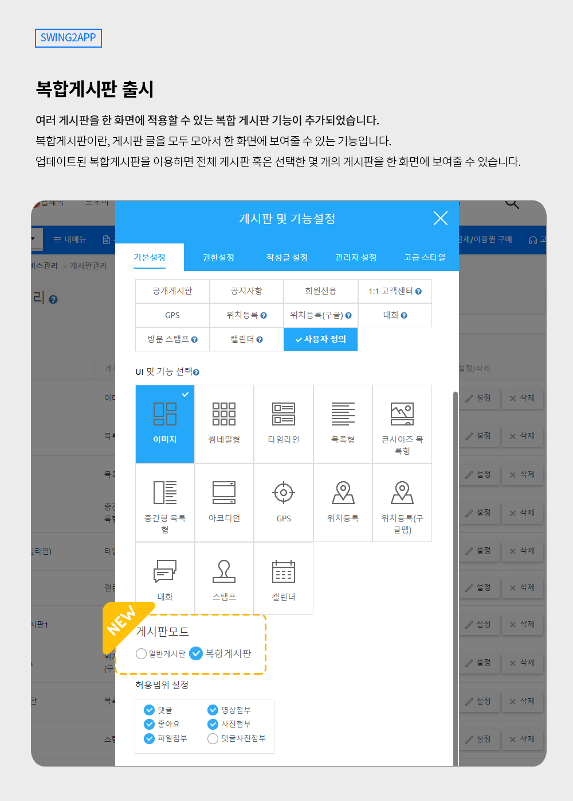
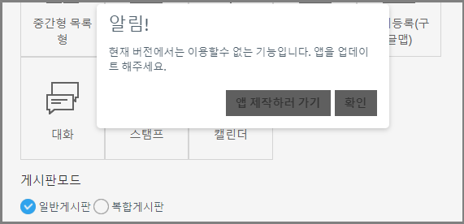
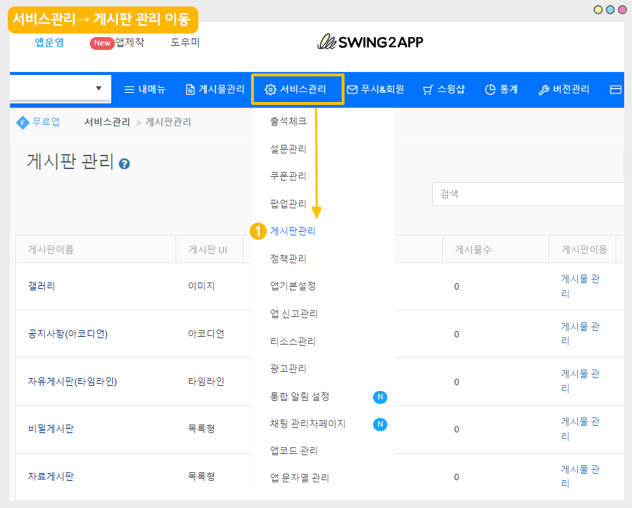
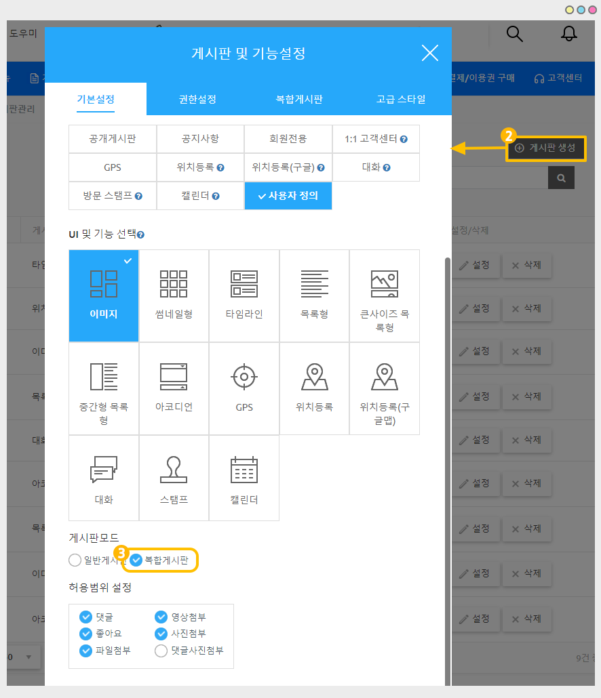
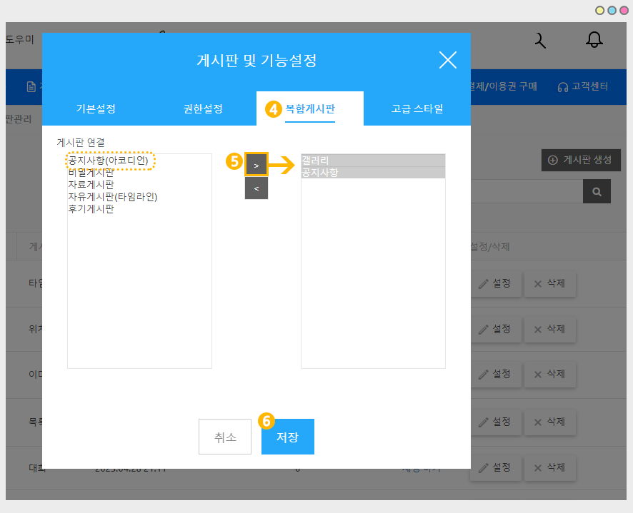
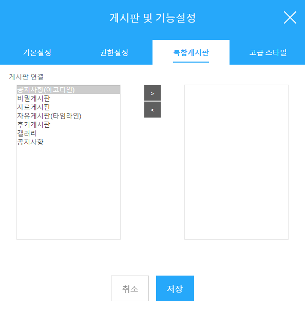
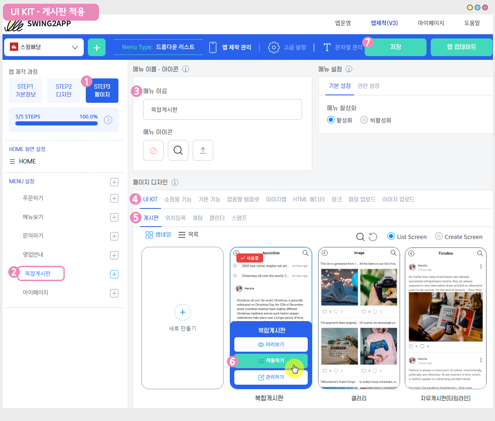
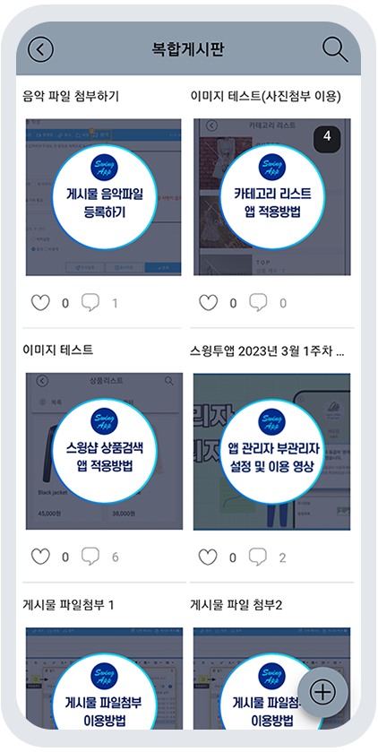

# 복합게시판

<figure><figcaption></figcaption></figure>

## 1. 복합게시판이란?

<figure><figcaption></figcaption></figure>

복합게시판이란, 게시판 글을 모두 모아서 한 화면에 보여줄 수 있는 기능입니다.

기존에는 한 메뉴에 하나의 게시판만 연결하여 보여줄 수 있었는데요.

업데이트된 복합게시판을 이용하면 전체 게시판 혹은 선택한 몇 개의 게시판을 한 화면에 모두 보여줍니다.

<figure><figcaption></figcaption></figure>

## 2.이용방법

<figure><figcaption></figcaption></figure>

앱제작 V3버전에서 이용 가능, 앱 업데이트가 필요합니다. 해당 기능을 이용하기 전 앱 업데이트를 먼저 해주세요.

23년 4월 11일 새로 제작되는 앱은 업데이트 필요 없이, 바로 이용 가능합니다.

<figure><figcaption></figcaption></figure>

1\)[앱운영 – 서비스관리 – 게시판 관리](http://www.swing2app.co.kr/view/board\_edit) 이동

<figure><figcaption></figcaption></figure>

2\)\[게시판 생성] 버튼 선택

\*기존에 만들어놓은 게시판으로 복합게시판을 설정한다면, 게시판 옆에 \[설정] 버튼을 선택해서 적용할 수 있습니다.

\*기본설정에서 - 게시판 이름, UI 선택은 일반 게시판 만드는 것과 동일하게 진행합니다.

3\)게시판 모드에 \[복합게시판]에 체크해주세요.

<figure><figcaption></figcaption></figure>

4\)상단 메뉴 \[복합게시판] 선택

<figure><figcaption></figcaption></figure>

5\)어떤 게시판을 연결할 것인지 왼쪽에 있는 게시판을 마우스로 선택한 뒤, > 버튼을 누르면 오른쪽으로 게시판이 추가됩니다.

6\)추가 완료 후 \[저장] 버튼을 선택해주세요.

<figure><figcaption></figcaption></figure>

7\)앱제작 화면 이동 후, 만들어놓은 복합 게시판을 앱 메뉴로 연결해주시면 앱에서 확인 가능합니다.

복합게시판은 홈화면에 적용하셔도 되고, 메뉴로 넣어주셔도 됩니다.

앱 운영 목적에 맞게 게시판을 적용해서 이용해주세요.

> 앱에 게시판 적용하는 방법
>
> (1)앱제작 화면 - STEP3 페이지 선택
>
> (2)메뉴 선택
>
> \*메뉴를 만들기 전이라면, 새 메뉴를 만들어주세요. (+ 모양 버튼 선택하여 메뉴 추가)
>
> (3) 메뉴 이름을 입력해주세요.
>
> (4) 페이지 디자인에서 \[UI KIT] 선택
>
> (5)\[게시판]을 선택해주세요.
>
> (6) 등록할 게시판을 확인한 뒤 \[적용하기] 버튼을 선택해주세요. (페이지에 마우스 커서를 가져다 대면 적용하기 버튼이 열립니다)
>
> (7) 화면 상단 \[저장]버튼을 누르면 앱에 적용됩니다.

<figure><figcaption></figcaption></figure>

## 3.앱 실행화면) 복합게시판 적용 화면

<figure><figcaption></figcaption></figure>

복합게시판은 선택한 게시판 UI스타일에 맞게 보여집니다.

이미지 게시판 스타일로 적용한 화면입니다.

이렇게 복합게시판으로 연결된 게시판 내 모든 게시물을 한 게시판에서 모두 보여주게 됩니다.

​

<mark style="color:red;">**\*안내**</mark>

이미지 게시판은 섬네일 이미지가 목록 화면에 노출되는 게시판 스타일이에요.

게시물에 등록된 섬네일 이미지가 없을 경우 앱 아이콘 이미지로 대체되어 보여집니다.

<figure><figcaption></figcaption></figure>

## 4.안내사항

​

1\)해당 기능은 V3앱제작 버전에서만 이용 가능하며, 기능을 이용하기 위해서는 앱 업데이트가 필요합니다.

업데이트 후 기능 이용이 가능하며 앱이 스토어에 출시되어 있다면 해당 스토어별로 앱 업데이트 진행해주세요.

23년 4월 11일 새로 제작되는 앱은 업데이트 필요 없이, 바로 이용 가능합니다.

​

2\)복합 게시판은 글 작성이 불가합니다.

게시판 글을 모아서 보여주는 목록보기 형식의 게시판입니다.

따라서 글 보기 외에 글 작성은 불가합니다.

연동된 게시판에서 글을 등록하면 복합게시판에도 자동으로 글이 보여집니다.

​

3\)복합게시판은 선택된 게시판 UI에 따라 디자인이 다릅니다.

섬네일, 이미지, 자료 게시판 등 선택한 UI에 따라 목록 화면이 다르게 보여집니다.

