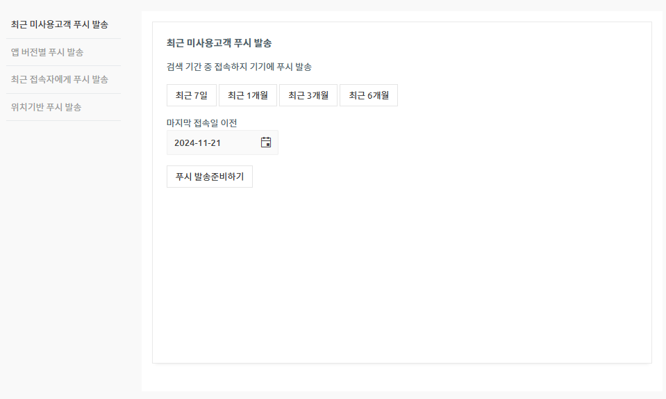

# 게시물 댓글, 대댓글 입력방법

<figure><figcaption></figcaption></figure>

<mark style="color:orange;">**가장 먼저 게시판에 댓글 허용을 설정해주셔야 합니다.**</mark>

댓글은 게시판 옵션 기능이기 때문에 관리자가 필요할 경우 ‘댓글허용’에 체크를 하거나 사용하지 않음으로 설정할 수 있어요!

따라서 게시판 게시물에서 댓글, 대댓글을 이용하길 원한다면!!

먼저, 만들어놓은 게시판 혹은 새로 제작하는 게시판에서 댓글 허용을 체크해주셔야 합니다.

### <mark style="color:blue;"></mark>STEP1. 게시판에 댓글 허용 설정하기

[1)앱운영 페이지→ 2)서비스관리 → 3)게시판 관리](https://www.swing2app.co.kr/view/board\_edit)로 이동합니다.

4\)게시판을 새로 만들어야 한다면 \[게시판 생성] 버튼을 선택하고,

기존에 만들어놓은 게시판에서 수정한다면 해당 게시판의 \[설정] 버튼을 선택해주세요.

5\)게시판 및 기능설정 창 상세설정에서 ** **<mark style="color:blue;">**\[댓글허용]**</mark>에 체크해주세요.

6\)저장하기 버튼을 누르면 완료!!

<figure><figcaption></figcaption></figure>

### <mark style="color:blue;"></mark>STEP2. 앱에 게시판 적용하기

만들어놓은 게시판을 앱에 적용해야 앱에서 이용이 가능하겠죠?

앱제작으로 이동한 뒤, 메뉴에 게시판을 적용해주세요

#### -앱제작 V3버전 이용시

<figure><figcaption></figcaption></figure>

1\)앱제작 화면 - STEP3 페이지 선택

2\)메뉴 선택

\*메뉴를 만들기 전이라면, 새 메뉴를 만들어주세요. (+ 모양 버튼 선택하여 메뉴 추가)

3\) 메뉴 이름을 입력해주세요.

4\) 페이지 디자인에서 \[UI KIT] 선택

5\)\[게시판]을 선택해주세요.&#x20;

6\) 등록할 게시판을 확인한 뒤 \[적용하기] 버튼을 선택해주세요. (페이지에 마우스 커서를 가져다 대면 적용하기 버튼이 열립니다) <mark style="color:red;"></mark>&#x20;

7\) 화면 상단 \[저장]버튼을 누르면 앱에 적용됩니다.

#### -앱제작 V2버전 이용시

앱제작 V2→  페이지 메뉴 로 이동합니다.&#x20;

1\. \[카테고리 추가] 버튼을 선택해서 게시판을 적용할 메뉴를 추가합니다.&#x20;

2\. 메뉴 이름을 입력해주세요.

3\. 메뉴 유형: \[게시판]을 선택해주세요.

4\. \[링크마법사] 버튼을 선택해주세요.

5\. 메뉴에 적용할 게시판을 선택한 뒤 \[반영] 버튼 선택

6\. \[적용] 버튼

7\. \[저장] 버튼을 누르면 완료됩니다.

\*아이콘은 선택사항이며, 메뉴 앞에 아이콘을 적용할 경우만 선택해주세요.&#x20;

***

<figure><figcaption></figcaption></figure>

앱에 게시판 적용이 완료되었다면, 앱을 실행해서 게시판 에서 댓글, 대댓글을 입력하는 방법을 확인해볼게요

### <mark style="color:blue;"></mark>STEP3. 앱실행화면) 댓글 입력방법

앱을 실행해서 게시판- 게시물 상세보기로 들어가면 화면 하단에 \[댓글 작성]bar가 생성됩니다.

글을 입력한 뒤 오른쪽 ‘작성완료’ 버튼을 누르면 댓글 작성이 완료되요!

​

\*\*댓글 작성란 왼쪽에 이미지 파일첨부는 위의 게시판 설정에서 <mark style="color:blue;">​</mark><mark style="color:blue;">**‘댓글사진첨부 허용’**</mark>에 체크해야 이용가능합니다.

<figure><figcaption></figcaption></figure>

### <mark style="color:blue;"></mark>STEP4. 앱 실행화면) 대댓글 입력방법

\*대댓글은 게시물의 댓글에서 작성할 수 있으며, 앱 업데이트 후 이용 가능합니다

&#x20;**** (2019년 5월 17일 이후 제작한 앱은 자동으로 반영)

1\)대댓글을 남기고자 하는 사용자의 댓글을 확인하구요.

2\)해당 사용자 댓글 옆의 \[점 세개 아이콘]을 선택합니다.

3\)’답글달기’를 선택해서 사용자의 댓글에 대댓글을 입력합니다.

4\)답글 입력이 완료되면 해당 사용자 아래로 대댓글이 기재된 것을 확인할 수 있습니다.

<mark style="color:blue;">****</mark> <mark style="color:blue;">**푸시 알림**</mark><mark style="color:orange;">**​​**</mark>

<mark style="color:red;">게시물에 댓글이 입력되면 해당 글을 작성한 사용자 및 권한이 있는 관리자에게 푸시 알림이 들어옵니다.</mark>&#x20;

대댓글 작성도, 댓글을 처음 작성한 사용자에게 <mark style="color:red;">실시간으로 대댓글 푸시 알림이 들어옵니다.</mark>

따라서 **게시글에 댓글이 달리거나, 자신의 댓글에 누군가의 대댓글이 달린 경우, 푸시 알림을 보고 들어갈 수 있습니다.**

**​**

<mark style="color:blue;">****</mark> <mark style="color:blue;">**자유로운 댓글, 대댓글 작성**</mark>

댓글이나 대댓글은 횟수가 정해진 것이 없이 무제한으로 쓸 수 있어요

따라서 댓글- 대댓글을 자유롭게 주고 받을 수 있구요.

누구에게 대댓글을 작성했는지 글 앞에 @사용자 이름이 표시됩니다.

​

스윙투앱으로 앱제작시 게시판에서 자유롭게 댓글, 대댓글을 입력하는 커뮤니티 앱 제작이 가능하구요.

관리자에게 댓글을 달고, 관리자가 다시 답변을 다는 등의 용도로도 앱제작이 가능합니다.

여러분의 앱제작 용도에 맞게 스윙투앱에서 제공하는 앱제작 기능을 다양하게 활용해주세요 .

