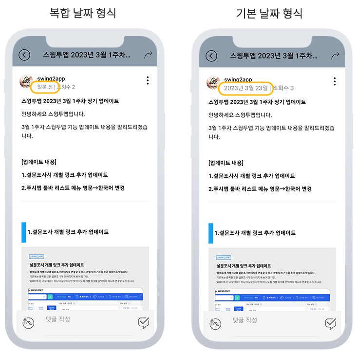

# 게시판 날짜 형식 설정 방법

<figure><figcaption></figcaption></figure>

**게시판 날짜 형식을 지정할 수 있는 옵션 기능이 새롭게 추가되었습니다.**&#x20;

기존 게시판 날짜 형식은 ‘복합날짜 형식’으로 고정 제공되며 관리자가 직접 지정이 불가했습니다.&#x20;

업데이트 된 기능에서는 원하는 날짜 형식으로 설정이 가능하며, 기본날짜 형식 or 기본날짜형식+시간표시로 설정할 수 있습니다.

\*해당 기능은 앱제작 V3버전에서 이용이 가능합니다. V2이용중이라면 V3버전 전환 후 이용해주세요.

<figure><figcaption></figcaption></figure>

## **1.게시판 날짜 형식 설정이란?**

게시판에 글이 등록되는 날짜로, 날짜를 어떻게 보여지게 할지 선택할 수 있습니다.

사용자분들은 게시판 날짜 형식 옵션기능을 이용하여 앱 게시판에 표시되는 날짜 형식을 직접 선택할 수 있습니다.

<figure><figcaption></figcaption></figure>

**\*기본 셋팅: 복합 날짜 형식**

복합 날짜는 스윙투앱 게시판에서 제공되는 기본 셋팅 날짜 형식이구요.&#x20;

게시물작성시 날짜로 표시되지 않고 ‘일분 전’, ‘하루 전’...으로 표시됩니다. \*일주일 이후 년/월/일로 변경됩니다.&#x20;

**\*변경할 수 있는 날짜 형식: 기본 날짜 형식**

기본 날짜 형식은 게시물 작성 순간부터 YYYY년/MM월/DD일로 날짜가 표시됩니다.&#x20;

<figure><figcaption></figcaption></figure>

## 2.이용방법

<figure><figcaption></figcaption></figure>

앱제작 이동

1\)고급설정 선택&#x20;

2\)설정: 앱 제작 설정 선택&#x20;

3\)앱 게시판 날짜형식 \[EDIT] 버튼 선택

4\)설정값 선택 - "기본날짜형식" 선택

\*기본 설정은 "복합날짜 형식"으로 되어 있습니다. 기존 앱에서 표시되는 시간 옵션입니다. (일분 전,1일 전...)

\*날짜 형식으로 보이게 하고 싶다면 "기본날짜 형식"을 선택해주세요.

\*날짜 및 시간까지 다 보이게 하고 싶다면 마지막 설정 값으로 선택해주세요.&#x20;

5\)UPDATE 버튼 선택&#x20;

6\)설정 창 닫은 뒤 앱제작 화면 상단\[저장] 버튼 선택

7\)\[앱 업데이트] 버튼 선택

앱 업데이트 후 확인하시면 게시판 날짜 형식이 변경된 것을 확인할 수 있습니다.

<figure><figcaption></figcaption></figure>

## **3.안내사항**



1\)해당 기능은 앱제작 V3버전에서 이용이 가능합니다.&#x20;

V2이용중이라면 V3버전 전환 후 이용해주세요.

2\)게시판 날짜 변경은 앱 업데이트가 필요합니다.

앱 업데이트를 해야 변경된 날짜 형식으로 앱 게시판에 반영됩니다.&#x20;

기본 날짜 변경 후 다시 복합 날짜로 변경시에도 앱 업데이트 다시 해야 반영됩니다.

플레이스토어, 앱스토어 등에 출시된 경우 해당 스토어에도 업데이트를 다시 해주세요.&#x20;

3\)기본 셋팅은 '복합 날짜 형식'으로 제공되고 있습니다.&#x20;

그대로 이용하셔도 되며, 앱 스타일에 맞게 옵션 항목별로 수정하여 사용해주시기 바랍니다.


