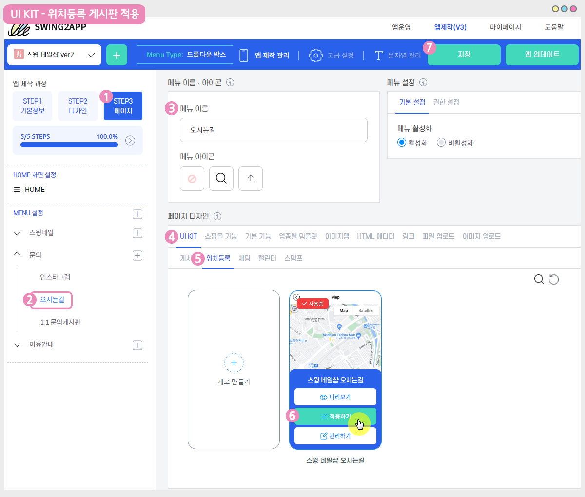

# 구글맵(구글지도)게시판

<figure><figcaption></figcaption></figure>


<mark style="color:green;">**구글맵은 별도 구글맵 플랫폼에서 신청을 한 뒤 이용해주셔야 합니다.**</mark>

1\. 구글맵은 무료로 이용할 수 있는 서비스가 아니며, 구글 자체 플랫폼에서 유료로 제공을 하고 있는 서비스에요.

2\. 사용자분들이 만든앱에 구글지도를 연동하기 위해서는 구글맵 플랫폼 사이트에서 가입을 하신 뒤에 API 라는 키 값을 발급받아야 합니다.

(해당 API키 값을, 스윙 구글맵 게시판에 입력하여 연동을 시키는 것이죠.)

그래야만 사용자분들이 구글맵을 정상적으로 이용할 수 있어요.&#x20;

3.구글맵은 유료서비스이기 때문에 구글맵 플랫폼에 요금을 납부하셔야 합니다.&#x20;

&#x20;\*종량요금제이며, 이용한만큼의 비용만 청구가 되는 시스템입니다.


**구글맵 API키를 발급 받는 방법은 아래 매뉴얼을 확인해주세요!**



<figure><figcaption></figcaption></figure>

***

## STEP1. 구글맵 게시판 만들기

**구글맵(구글지도)는 게시판에서 제공하는 기능이에요.**

따라서 게시판관리에서 먼저 구글맵 게시판을 만들어야 합니다\~!

[**앱운영 페이지 → 서비스관리 → 게시판 관리**](http://www.swing2app.co.kr/view/board\_edit) 메뉴로 이동합니다.

**\[게시판 생성] 버튼을 선택하면 게시판 및 기능 설정 창이 뜹니다.**

### <mark style="color:blue;">**1. 게시판 기능 설정 – 기본설정**</mark>

1\)게시판 및 기능 이름 : 게시판 이름을 작성합니다.

2\)서비스 용도: 사용자 정의 선택&#x20;

3\) UI 및 기능 선택: 위치등록(구글맵)을 선택합니다.

4\) 그외 지도보기 권한, 지정권한 사용기능 옵션 사항을 확인하여 체크해주세요.

5\)모든 내용 입력이 완료되면 \[저장하기]버튼을 눌러주세요.

> **+지도게시판은 기능설명 문구는 입력하지 않습니다.**
>
> **+’사용자 정의’를 선택해야 고정된 회색 영역이 풀리면서 지도보기 권한 등 옵션을 선택할 수 있습니다. \*따라서 서비스용도는 반드시 ‘사용자 정의’를 선택해주세요**
>
> **+기존의 한국 지도 게시판을 쓰고 싶다면, \[위치등록]을 선택해주시면 됩니다. (카카오 지도)**&#x20;

### <mark style="color:blue;">**2. 구글맵정보**</mark>

기존의 지도게시판과 달리, **구글맵 게시판은 \[구글맵정보] 로 이동하여서 구글맵 API키 값을 넣어주셔야 합니다.**&#x20;



복사해놓은 API키를 붙여넣기 하시고, 저장하기를 선택해주시면 됩니다.

그럼, 만들어놓은 구글맵 게시판에 위치를 등록해볼게요!

<figure><figcaption></figcaption></figure>

## STEP2. 구글맵 게시판에 위치 등록하기

**앱운영 페이지 → 게시물관리 → 만들어놓은 ‘구글맵’으로 이동합니다.**

&#x20;

새롭게 추가된 구글맵 게시판이에요\~!

**위치 등록은상단의 검색 툴바를 이용해서 주소를 입력하거나 상호명(키워드)로 검색해주세요.** \
\

### <mark style="color:blue;">**1. 위치등록**</mark>

1\) 구글맵 상단 검색창에서 주소를 입력하거나 상호명(키워드)로 검색해주세요. \
2\) 주소에서 위치가 생성이 되면 \[추가] 버튼을 선택해서 위치에 대한 정보 및 상세정보 등을 입력해주세요.\
**\*저는 홍콩에 있는 호텔들을 구글맵으로 보여줄 수 있도록, 홍콩 호텔들을 검색하여 위치에 추가해볼게요!**

### &#x20;<mark style="color:blue;">**2. 위치등록 – 상세 정보 입력**</mark>

**위치등록 창에서, 상세 설명을 입력할 수 있습니다.**

1\)상호: 상호명을 입력합니다. \*실제 회사명을 입력해도 좋고, 사용자들에게 소개할 문구를 작성해주세요.\
2\)주소: 앞서 검색한 주소 외에 상세 주소를 모두 입력합니다.\
3\)설명: 업체를 설명하는 소개글을 써주세요.\
4\)전화번호: 전화번호를 입력합니다.\
5\)홈페이지: 홈페이지나 운영하는 블로그, 카페 URL링크를 입력합니다.\
6\)우선순위: 우선순위는 등록한 위치가 여러개일 경우 앱에서 보여지는 순서를 정할 수 있어요 \*숫자가 작을수록 위에 배치됩니다.\
7\)이미지등록: 이미지 등록이 가능합니다. 업체 내부 사진 및 업체 홍보용 사진이 있다면 등록해주세요.(10장까지 첨부 가능)\
8\)모든 내용 입력이 완료되면 저장하기 버튼을 선택합니다.\
\
<mark style="color:red;">★ 홈페이지, 전화번호, 사진이 없는 경우 입력하지 않아도 괜찮아요.</mark>&#x20;

<mark style="color:red;">입력된 항목들만 게시판에서 표시가 됩니다.</mark>&#x20;

<mark style="color:red;">★ 위치 하나만 등록하는 경우 우선순위 입력하지 않아도 됩니다.</mark>\

&#x20;

**위치 등록이 완료되었습니다.**\
\
구글맵 게시판은 이렇게 주소 및 키워드로 위치를 추가할 수 있구요.

위치 수정 및 삭제가 가능하며, 여러 업체들을 관리하는 앱이라면 여러 업체들의 주소를 추가하여 등록 할 수 있어요\~

<figure><figcaption></figcaption></figure>

## STEP3. 앱에 지도게시판 적용하기

<mark style="color:blue;">**앱제작 V3버전 이용시)**</mark>

<figure><figcaption></figcaption></figure>

1\)앱제작–STEP3 페이지 선택

2\)메뉴 선택

\*메뉴를 만들기 전이라면, 새 메뉴를 만들어주세요. (+ 모양 버튼 선택하여 메뉴 추가)

3\) 메뉴 이름을 입력해주세요.

4\) 페이지 디자인에서 \[UI KIT] 선택

5\)\[위치등록]을 선택해주세요.&#x20;

6\) 만들어놓은 위치등록 게시판을 확인한 뒤 \[적용하기] 버튼을 선택해주세요. (페이지에 마우스 커서를 가져다 대면 적용하기 버튼이 열립니다)

<mark style="color:red;">\*위치등록게시판을 먼저 만들어주세요. 만들어놓은 위치등록 게시판이 없을 경우 화면에 뜨지 않으며, 앱에 적용할 수 없습니다.</mark>&#x20;

<mark style="color:red;">\*UI KIT 화면에 있는 \[새로 만들기] 버튼을 선택하거나, 앱운영-서비스관리- 게시판관리에서도 게시판을 만들 수 있습니다.</mark>

7\) 화면 상단 \[저장]버튼을 누르면 앱에 적용됩니다.

\*제작 단계 중 메뉴 아이콘 , 메뉴 설정은 필수 입력 항목이 아닙니다.

해당 매뉴얼에서는 입력 없이 진행했으며, 앱 제작시 필요할 경우 추가로 적용해주세요.

<mark style="color:blue;">**앱제작 V2버전 이용시)**</mark>

**스윙 앱제작 페이지에서 →  페이지 메뉴 로 이동합니다.**&#x20;

1\. \[카테고리 추가] 버튼을 선택해서 게시판을 적용할 메뉴를 추가합니다.&#x20;

2\. 메뉴 이름을 입력해주세요.

3\. 메뉴 유형: \[게시판]을 선택해주세요.

4\. \[링크마법사] 버튼을 선택해주세요.

5\. 메뉴에 적용할 지도게시판을 선택한 뒤 \[반영] 버튼 선택

6\. \[적용] 버튼

7\. \[저장] 버튼을 누르면 완료됩니다.

\*아이콘은 선택사항이며, 메뉴 앞에 아이콘을 적용할 경우만 선택해주세요.&#x20;

<figure><figcaption></figcaption></figure>

## STEP4. 앱 실행화면

앱을 실행하여서 구글맵 게시판이 어떻게 보여지는지 확인할게요.

**\[리스트 열기]**를 선택하면 앞서 게시판에서 등록한 위치들이 리스트로 보여집니다. \

입력한 위치 중에서 ‘르네상스 홍콩 하버 뷰 호텔’을 선택하구요.

**\[길안내] 버튼을 선택하면 구글 지도페이지로 이동하여 길찾기를 안내해줍니다.**\

해외에서 앱을 제작하고 운영하시는 분들, 해외 길찾기 서비스를 제공해야 하는 분들, 해외업체를 관리하는 분들 등등등…

구글맵이 필요하신 모든 분들이 유용하게 사용해주시기 바랍니다. ^^

카카오지도에서 제공되는 지도게시판도(국내용) 함께 운영이 되고 있으니 국내 위치 등록은 일반 위치등록 게시판을 이용해주셔도 됩니다.


