# 그룹채팅 기능 소개

<figure><figcaption></figcaption></figure>

그룹 채팅방을 만들고 운영하는 방법은 아래 매뉴얼을 확인해주세요.



## 1.채팅 공지 메시지

<figure>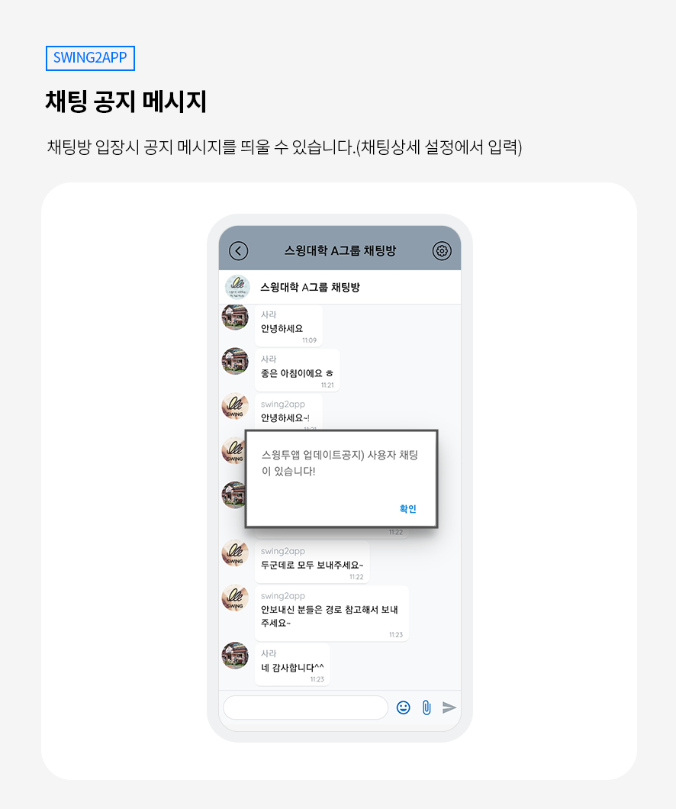<figcaption></figcaption></figure>

채팅방 공지 메시지를 띄울 수 있습니다. 채팅방 입장시 관리자가 설정한 공지 메시지 팝업이 뜹니다.

공지 메시지 설정은 그룹채팅 생성시 → 채팅 상세 설정에서 채팅 공지 메시지 입력을 통해 적용할 수 있습니다.

<figure>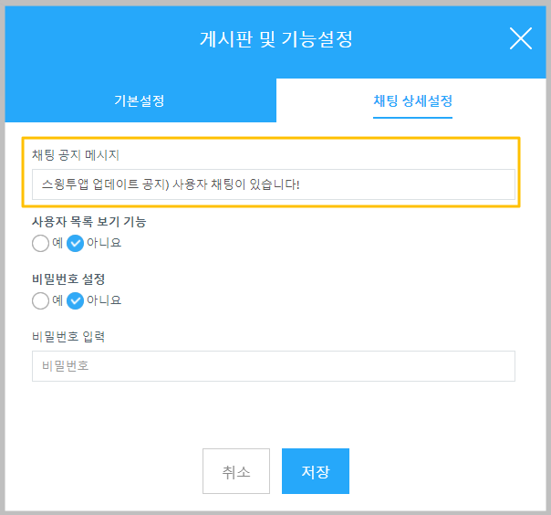<figcaption></figcaption></figure>

## 2.사용자 목록 보기

<figure>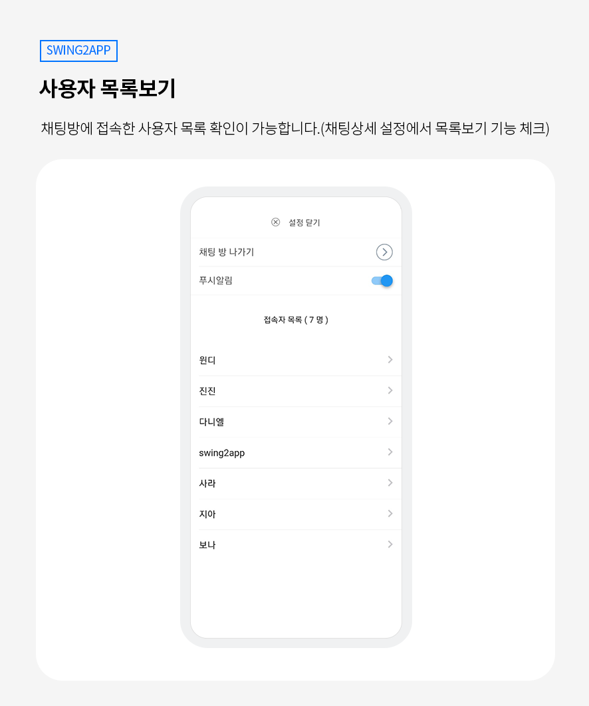<figcaption></figcaption></figure>

채팅방에 접속한 사용자 목록 확인이 가능합니다.

채팅방의 오른쪽 상단 톱니바퀴 버튼을 누르면 채팅방에 입장한 사용자 목록을 확인할 수 있어요.

사용자 목록보기 설정은 그룹채팅 생성시 → 채팅 상세 설정에서 사용자 목록보기 기능 '예' 체크를 통해 적용할 수 있습니다.

<figure>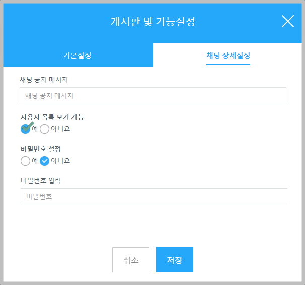<figcaption></figcaption></figure>

## 3.비밀번호 설정

<figure>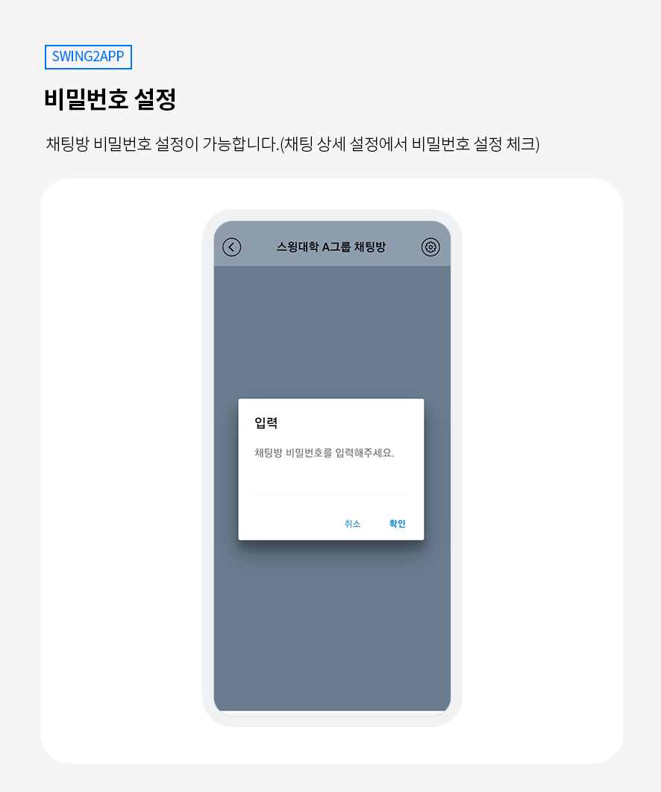<figcaption></figcaption></figure>

채팅방 비밀번호 설정: 채팅방 입장시 관리자가 설정한 비밀번호를 입력하여 접속하도록 운영할 수 있습니다.

비밀번호 설정은 그룹채팅 생성시 → 채팅 상세 설정에서 비밀번호 설정 체크를 통해 적용할 수 있습니다.

<figure>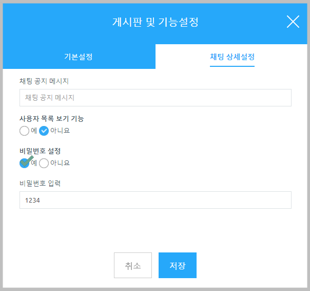<figcaption></figcaption></figure>

## 4.이전 대화목록 확인

<figure>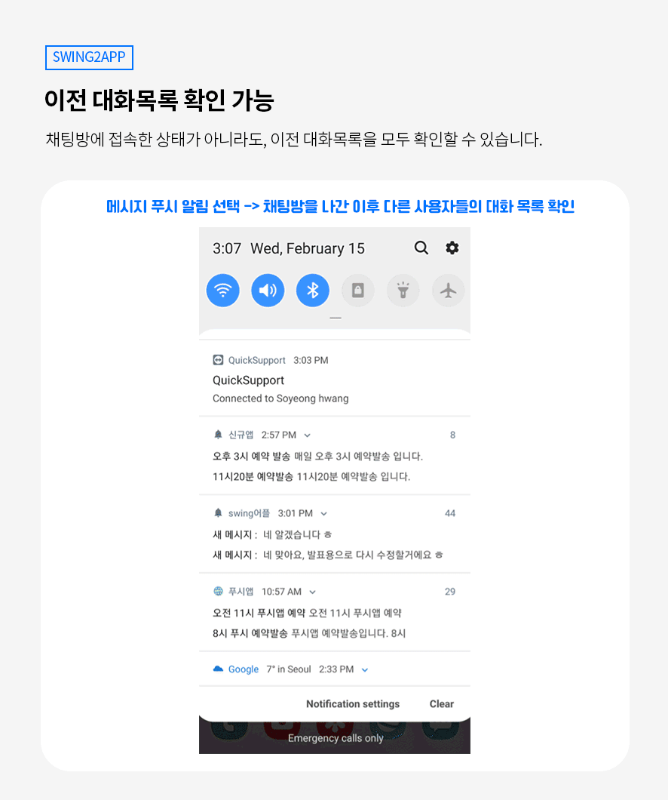<figcaption></figcaption></figure>

채팅방에 접속한 상태가 아니라도 사용자들이 채팅방에서 주고 받은 대화목록을 확인할 수 있습니다.

\*이전 대화 목록 확인은, 앱 설치 및 실행 후 최초 한번이라도 그룹채팅방에 접속한 이력이 있어야 이용 가능합니다.

## 5.채팅 알림 푸시

<figure>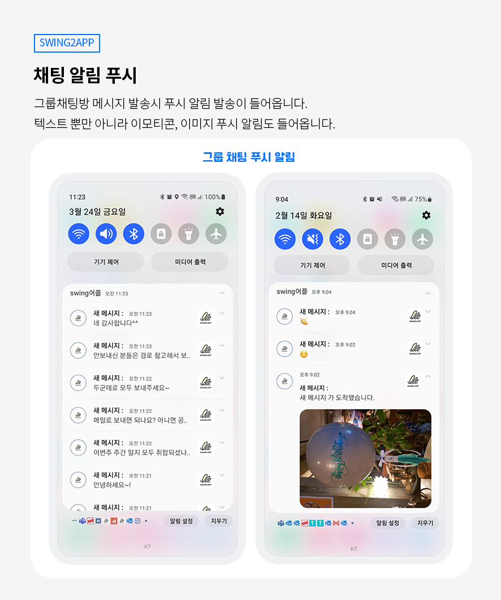<figcaption></figcaption></figure>

채팅 메시지 발송시, 사용자 앱으로 푸시 알림이 발송됩니다.

채팅 메시지 뿐만 아니라 이미지, 첨부파일, 이모티콘 발송시에도 모두 푸시 알림이 발송됩니다.

알림 확인하여 그룹채팅방에 접속할 수 있습니다.

## 6. 사용자 프로필 이미지 생성

<figure><figcaption></figcaption></figure>

대화 메시지 옆에 사용자 프로필 이미지가 표시됩니다.&#x20;

여러 명의 사용자가 들어와서 채팅을 하는 공간이기 때문에 보다 쉽게 사용자를 구분할 수 있습니다.

단, 사용자가 프로필 이미지를 등록하지 않을 경우 채팅방 프로필 기본 셋팅 이미지로 보여집니다.

### 7.메시지 답장

<figure>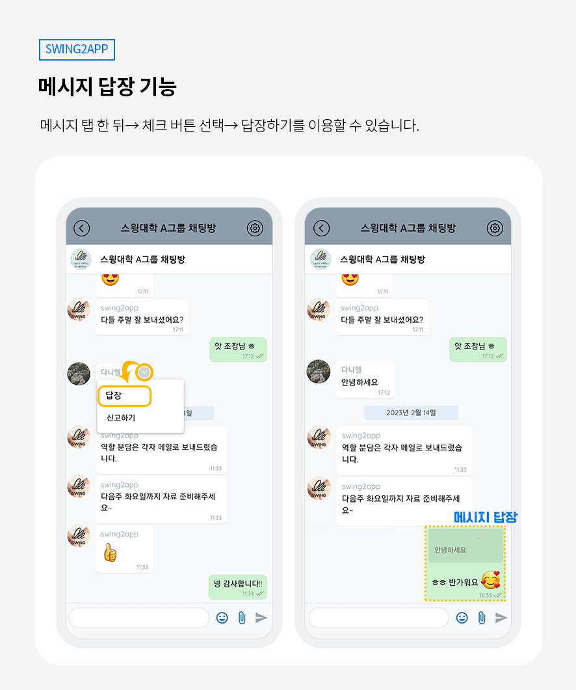<figcaption></figcaption></figure>

특정 사용자에게 답장을 하고 싶을 경우 사용자 메시지란에 답장을 선택해서 메시지를 보낼 수 있습니다.

메시지 탭 한 뒤→ 체크 버튼 선택→ 답장 선택→ 해당 메시지에 대한 답장을 작성해서 보낼 수 있습니다.

## 8.메시지 읽음 처리 기능

<figure>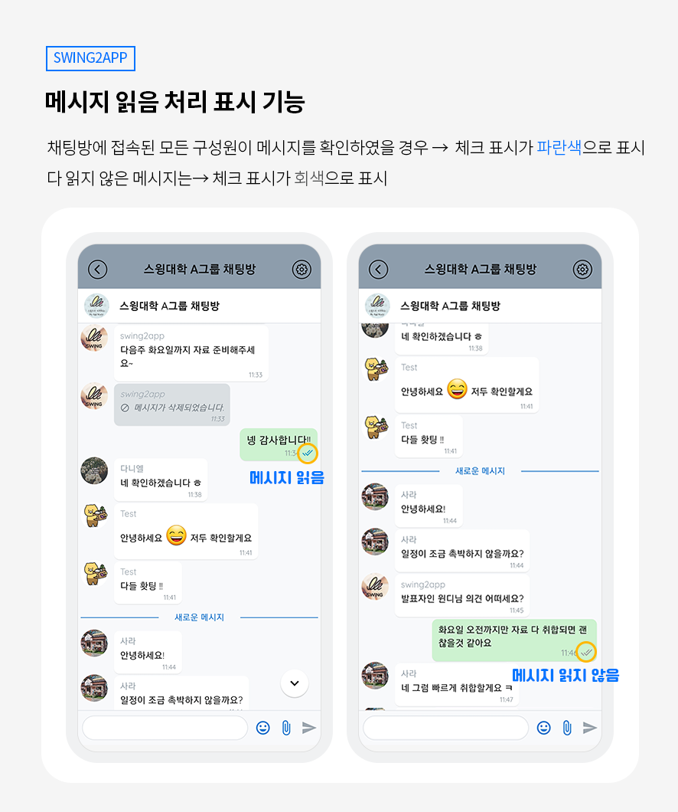<figcaption></figcaption></figure>

내가 보낸 채팅 메시지를 다른 사용자들이 읽었는지 확인할 수 있는 읽음 처리 표시 기능을 확인할 수 있습니다.

단, 읽음처리가 숫자로 카운팅 되는 방식은 아닙니다.

\*채팅방에 접속된 모든 구성원이 메시지 확인시→ 체크 표시가 파란색으로 표시

\*다 읽지 않은 메시지는→ 체크 표시가 회색으로 표시 됩니다.

## 9.메시지 수정, 삭제 기능 추가

<figure>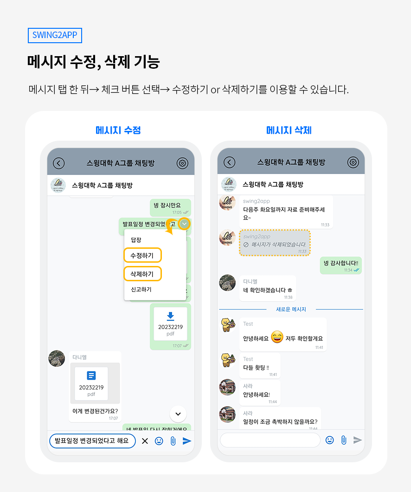<figcaption></figcaption></figure>

메시지 수정 및 삭제 기능을 이용할 수 있습니다.

메시지 발송 후 잘못된 내용은 수정하고, 삭제할 수 있습니다.

내가 작성한 메시지 탭 한 뒤→ 체크 버튼 선택→ 수정하기 or 삭제하기를 이용할 수 있습니다.

## 10.메시지 신고하기

<figure>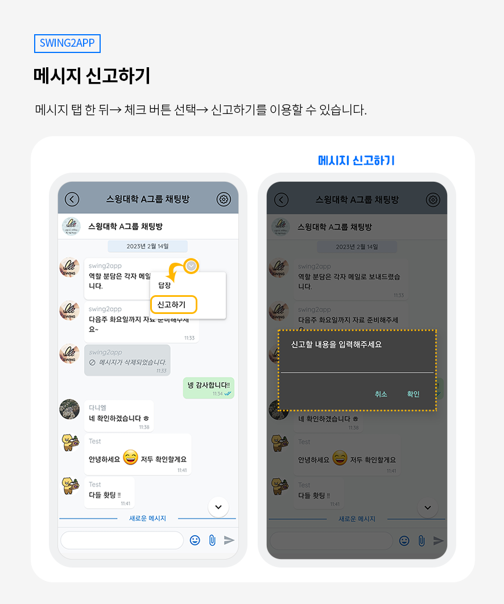<figcaption></figcaption></figure>

사용자들이 글을 입력하고, 대화를 할 수 있는 커뮤니티 공간에는, 사용자 제작 컨텐츠(UGC) 정책에 따라 신고하기 기능이 제공되어야 하죠.

채팅방에서도 메시지에 대한 신고 기능이 제공되고 있습니다.

메시지 탭 한 뒤→ 체크 버튼 선택→ 신고하기 기능을 이용할 수 있습니다.

\*신고가 들어간 글은 스윙투앱 대시보드에서 관리자가 확인 가능합니다.

[앱운영 → 서비스관리→ 앱 신고 관리 페이지](http://www.swing2app.co.kr/view/app\_report\_manage)에서 확인이 가능합니다.

## 11.이모티콘, 파일 첨부 버튼

<figure>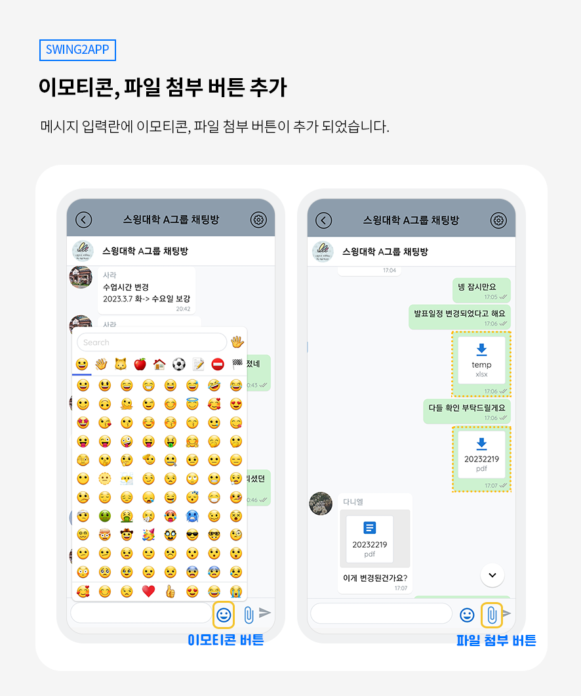<figcaption></figcaption></figure>

메시지 입력란에 이모티콘 버튼, 파일 첨부 버튼을 이용할 수 있습니다.

핸드폰 모바일에서 사용되는 다양한 이모티콘을 입력할 수 있구요.

파일 첨부-이미지 파일부터 pdf, word 등 다양한 문서의 파일유형도 첨부 가능합니다.

## 12.이미지 보기, 다운로드 기능

<figure>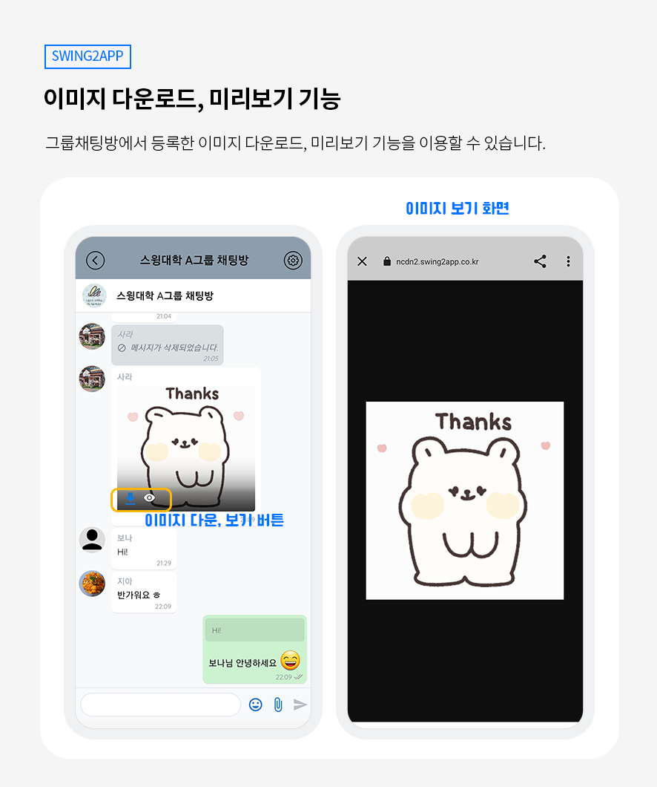<figcaption></figcaption></figure>

대화그룹채팅방에 등록된 이미지를 선택하면 다운로드, 미리보기 버튼이 생성됩니다.

다운로드 버튼 선택시 핸드폰 내에 이미지를 저장할 수 있구요.

미리보기 선택시 새로운 웹 페이지 창으로 이미지 확인이 가능합니다.

## 13.GIF 움짤 이미지 등록

<figure>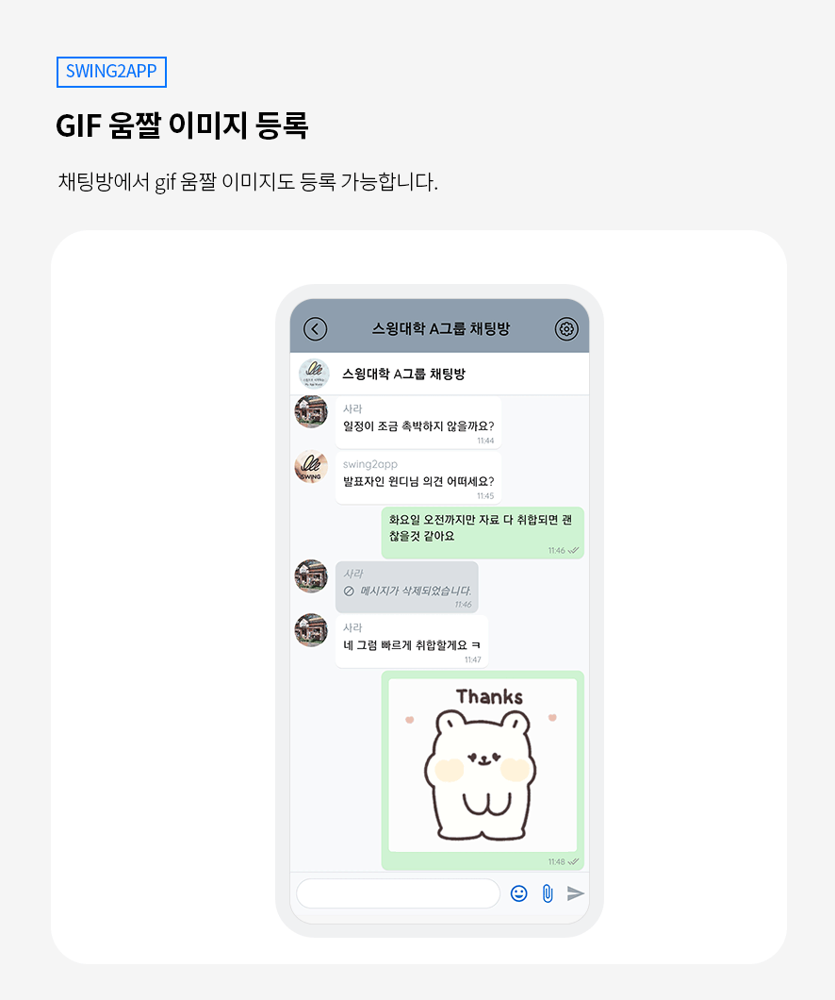<figcaption></figcaption></figure>

움짤 이미지-gif 이미지도 그룹채팅방에서 등록할 수 있습니다.


<mark style="color:red;">**안내사항**</mark>

1\)그룹채팅은 신규 기능을 이용하기 위해서는 앱제작 V3 버전으로 이용해주셔야 하며, 업데이트 기준일로 업데이트가 필요합니다.&#x20;

\-2023년 2월 이후 새로 제작된 앱은 자동으로 해당 기능으로 반영되어 앱 이용 가능

\-2023년 2월 이전에 제작된 앱은 업데이트를 해주세요.

\*앱제작 화면 이동 – 앱 업데이트 선택

기존 앱이 스토어(플레이스토어, 앱스토어)에 출시된 상태라면, 새로 제작된 버전으로 앱 업데이트를 해야 합니다.

2\)그룹채팅 기능은 스윙투앱 일반 프로토타입(슬라이드, 푸터, 탑 등)으로 제작된 앱에서만 제공되는 앱 기능입니다.

웹사이트를 연결한 웹뷰, 푸시앱은 그룹채팅 이용이 불가합니다.

3\)사용자들 역시 앱을 업데이트 해야 위에서 안내 드린 신규 기능들을 이용할 수 있습니다.

예를 들어, 업데이트 하지 않은 사용자는 이전 기능을 이용하고 있기 때문에 이전 대화 목록 등 메시지 확인이 불가하며 신규 적용된 모든 기능 이용이 불가합니다.

4\)그룹채팅은 계속해서 추가적으로 기능들이 개선되고 업데이트 되고 있습니다.

문제가 있거나 개선이 필요한 기능은 문의게시판을 통해 피드백 주시면 계속해서 보안 할 수 있도록 하겠습니다.


