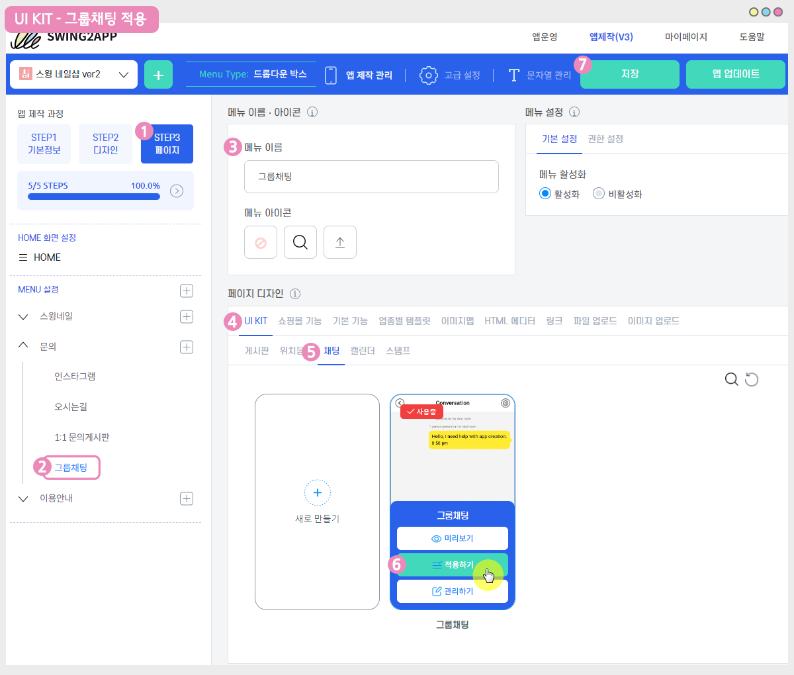
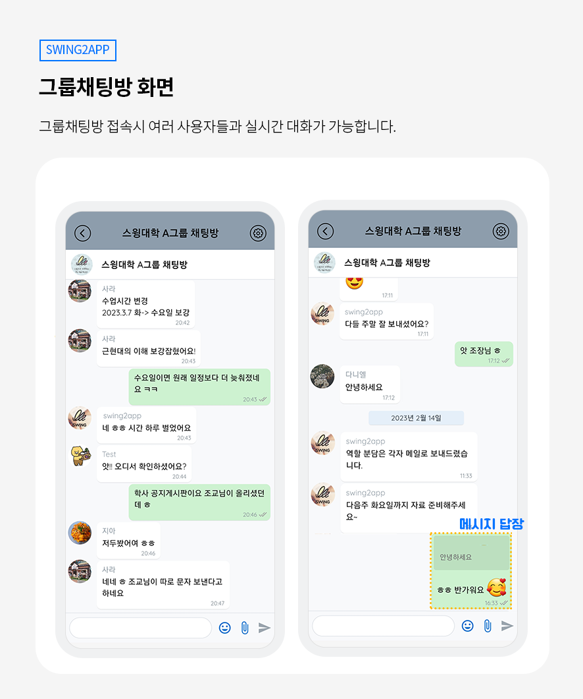

# 그룹채팅

**그룹채팅방 이용방법**

앱 내에서 여러명의 사용자가 동시에 채팅을 진행할 수 있고, 관리자와 다수의 사용자의 채팅도 가능합니다.

또한 회원 그룹별로 채팅방 권한을 설정할 수 있으며, 비밀번호를 입력해야 입장이 가능한 비밀채팅방을 설정할 수도 있습니다.

매뉴얼을 통해서 그룹채팅방 이용방법을 확인해주세요.


**스윙 상품 유형별 그룹채팅방 이용 정책**

**\*무료앱 이용**&#x20;

채팅방 1개 개설, 사용자 5명까지 채팅 가능

**\*유료앱 이용**

\-기본형 유료앱 이용권 : 채팅방 5개 개설, 사용자 20명까지 접속 가능

\-확장형 유료앱 이용권: 채팅방 10개 개설, 사용자 100명까지 접속 가능

\-프리미엄 유료앱 이용권 : 채팅방 무제한 개설 가능, 사용자 무제한 접속 가능

\-스윙 알뜰형 패키지 사용: 채팅방 4개 개설, 사용자 10명까지 접속 가능

패키지 상품)애드몹 파워패키지, 대용량 패키지는 기본형 유료앱이용권 상품과 동일하게 제공됩니다. (채팅방 5개 개설, 사용자 20명까지 접속 가능)


<figure><figcaption></figcaption></figure>

## &#x20;STEP1. 그룹채팅방 만들기

스윙 앱운영 페이지 → 서비스관리 → 게시판 관리 메뉴로 이동합니다.

### <mark style="color:blue;">**1. 그룹채팅방 생성 – 기본설정**</mark>

게시판 관리 페이지에서 \[게시판 생성] 버튼을 선택하면 게시판 및 기능설정 창이 열립니다.

1\) 게시판 및 기능이름:  게시판 이름을 입력합니다.

2\) 서비스용도 :  \[사용자 정의]를 선택해주세요.

<mark style="color:red;">\*채팅방 입장 권한은 기본 ‘손님’으로 셋팅되어 있어요.</mark>

<mark style="color:red;">권한을 수정하시려면, 서비스 용도에서 ‘사용자 정의’를 선택하면 고정된 회색 영역이 풀리며 권한을 수정할 수 있습니다.</mark>&#x20;

3\) UI 및 기능 선택: \[대화] 를 선택해주세요.&#x20;

4\) 채팅방 입장 권한&#x20;

박스 화살표 버튼을 눌러서 권한을 설정할 수 있어요. 원하는 등급을 만들어 설정할 수 있구요.

손님이나 사용자 중 기본 권한을 선택할 수 있습니다.

5\)\[저장] 버튼을 누르면 완료됩니다.

<mark style="color:red;">\*게시판 및 기능설정 내용은 입력하지 않아도 됩니다. (작성해도 앱에서 보여지지 않아요!)</mark>

### <mark style="color:blue;">**2.그룹채팅방 생성 – 채팅 상세설정**</mark>

<figure><figcaption></figcaption></figure>

<mark style="color:red;">채팅 상세설정은 필수가 아닌 ‘선택 옵션’이에요.</mark>&#x20;

<mark style="color:red;">따라서 상세 설정을 이용하지 않아도 되구요. 이용할 경우만 해당 옵션을 설정해주시면 됩니다.</mark>

1\) 채팅 공지 메시지 : 채팅방에 띄울 메시지를 입력합니다.

2\) 사용자 목록 보기 기능 : 채팅방에 입장한 사용자 목록을 볼 수 있습니다.

3\) 비밀번호 설정 : 채팅방에 비밀번호를 설정하여, 비밀번호를 입력한 사용자만 입장이 가능합니다.

4\)비밀번호 설정시 비밀번호를 입력해주세요.&#x20;

5\)상세 설정 내용 입력이 완료되면 \[저장] 버튼을 눌러주세요.

***

<figure><figcaption></figcaption></figure>

## STEP2. 앱에 그룹채팅방 적용하기

그룹 채팅 게시판을 만들었다면, 앱에 채팅방을 적용해야겠죠?&#x20;

앱제작페이지로 이동해서 앱에 채팅방을 적용해볼게요.

### <mark style="color:blue;">**1.앱제작 V3 버전 이용시**</mark>

<figure><figcaption></figcaption></figure>

1\)앱제작 화면 STEP3 페이지 선택

2\)메뉴 선택

\*메뉴를 만들기 전이라면, 새 메뉴를 만들어주세요. (+ 모양 버튼 선택하여 메뉴 추가)

3\) 메뉴 이름을 입력해주세요.

4\) 페이지 디자인에서 \[UI KIT] 선택

5\)\[채팅]을 선택해주세요.&#x20;

6\) 만들어놓은 채팅방을 확인한 뒤 \[적용하기] 버튼을 선택해주세요. (페이지에 마우스 커서를 가져다 대면 적용하기 버튼이 열립니다)

<mark style="color:red;">\*그룹채팅게시판을 먼저 만들어주세요. 만들어놓은 그룹채팅 게시판이 없을 경우 화면에 뜨지 않으며, 앱에 적용할 수 없습니다.</mark>&#x20;

<mark style="color:red;">\*UI KIT 화면에 있는 \[새로 만들기] 버튼을 선택하거나, 앱운영-서비스관리- 게시판관리에서도 게시판을 만들 수 있습니다.</mark>

7\) 화면 상단 \[저장]버튼을 누르면 앱에 적용됩니다.

### <mark style="color:blue;">**2.앱제작 V2 버전 이용시**</mark>

**앱제작 페이지 → 페이지메뉴 단계로 이동합니다.**

1\) \[카테고리 추가] 버튼 선택해서 새 메뉴를 만들어주세요.

2\) 메뉴명: 메뉴 이름을 입력합니다.

3\) 메뉴 유형에서 \[게시판] 선택

4\) \[링크마법사] 버튼을 선택합니다.

5\) 링크마법사 – 게시판 창에서 \[그룹채팅] 선택한 뒤, \[반영] 버튼을 선택합니다.

6\) \[적용] 버튼

7\) \[저장] 버튼 눌러주시면 완료됩니다.

<figure><figcaption></figcaption></figure>

## STEP3. 앱 실행화면

**앱을 실행하여서 채팅방이 앱에서 어떻게 보여지는지 확인해보겠습니다.**&#x20;

### <mark style="color:blue;">**1. 그룹채팅방 화면**</mark>

<figure><figcaption></figcaption></figure>

<figure><figcaption></figcaption></figure>

채팅방에는 본인 외에 다른 사용자의 입장을 확인할 수 있으며, 인원 및 글을 입력하는 상태도 확인할 수 있습니다.

실시간으로 여러명의 사용자들과 대화를 할 수 있습니다.

### <mark style="color:blue;">**2. 채팅방 메시지 푸시 알림**</mark>

<figure><figcaption></figcaption></figure>

그룹채팅방에서 메시지를 입력하면 상대방에 푸시 알림이 발송이 되요.

### <mark style="color:blue;">**3. 채팅 상세설정**</mark>

* **채팅 상세 설정을 해놓은 경우 앱에서 어떻게 보여지는지 확인해볼게요.**

<mark style="color:green;">**1) 채팅 공지 메시지**</mark>

<figure><figcaption></figcaption></figure>

&#x20;채팅방 입장시 입력된 공지사항메시지 창이 뜹니다.&#x20;

<mark style="color:green;">**2) 비밀번호 설정**</mark>

<figure><figcaption></figcaption></figure>

채팅방 입장시 채팅방 비밀번호 입력 창이 뜹니다.

비밀번호는 채팅방 상세설정에서 입력해놓은 번호로 지정이 되고, 공지사항이나 다른 경로를 통해서 사용자들과 공유할 수 있습니다.

<mark style="color:green;">**3) 사용자 목록 보기**</mark>

<figure><figcaption></figcaption></figure>

&#x20;채팅방의 오른쪽 상단 버튼을 누르면 채팅방에 입장한 사용자 목록을 확인할 수 있어요.

<figure><figcaption></figcaption></figure>

## STEP4. 그룹채팅 기능 소개

그룹채팅에서 제공하는 다양한 기능을 확인해주세요.



<figure><figcaption></figcaption></figure>

## STEP5. 그룹채팅 Q\&A

**Q.앱에서 사용자가 다른 사용자를 선택하여 채팅을 할 수 있나요?**

사용자를 선택하거나 방으로 초대하는 기능은 지원되지 않습니다.

**Q. 그룹채팅방에서 대화를 걸면 앱 사용자들은 어떻게 알 수 있나요?**

그룹 채팅방에 한번이라도 접속(들어온)이력이 있는 사용자에게는 앱에서 대화 푸시알림이 발송됩니다.

푸시 알림을 선택하면 채팅방으로 들어올 수 있습니다.

단, 접속한 이력이 없는 사용자는 푸시 알림이 들어오지 않기 때문에 대화 이력을 확인할 수 없어요.

**Q. 그렇다면 사용자들에게 어떻게 그룹채팅을 알릴 수 있나요? 혹은 그룹채팅방에 참여하라는 공지를 할 수 있나요?**

관리자가 푸시를 보낼 수 있습니다.

채팅 푸시가 아닌 스윙투앱 앱운영에서 제공하는 기능→ 푸시 발송을 이용해주세요.

푸시 발송시 링크마법사를 선택하면, 링크를 그룹채팅방으로 설정할 수 있습니다.

앱에서 사용자들이 받은 푸시를 선택하면 바로 그룹채팅방으로 이동하기 때문에 해당 방법으로 채팅방 참여를 유도할 수 있습니다.

단, 위에서 안내드렸듯이 <mark style="color:green;">상품에 따라 접속 인원이 정해져있기 때문에 적용된 상품에 기재된 인원만 접속할 수 있습니다.</mark>

**Q. 그룹채팅방은 관리자가 항상 들어와야 운영이 되나요?**

관리자 채팅이 아니기 때문에 사용자들만 들어와도 이용이 가능합니다.

관리자 외에 사용자들끼리 그룹채팅이 가능합니다.

**Q. 채팅방 대화는 어떻게 삭제하나요?**

채팅창 오른쪽 상단의 \[설정]버튼을 누르면 대화기록 삭제하기 메뉴가 있습니다.

해당 메뉴 선택하시면 대화를 나눈 기록을 삭제할 수 있습니다.

삭제 후 다시 나갔다 들어오면 대화 기록이 삭제되어 있습니다.

**Q. 대화 푸시 받기를 원치 않을 경우 어떻게 하나요?**

채팅창 오른쪽 상단의 \[설정]버튼을 누르면 푸시 알림 켜기/끄기 버튼이 있습니다.

해당 메뉴 선택해서 알림 설정을 꺼주시면 됩니다.
