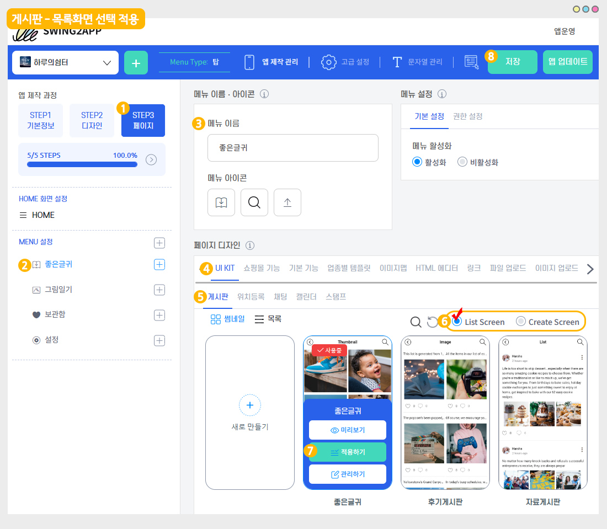
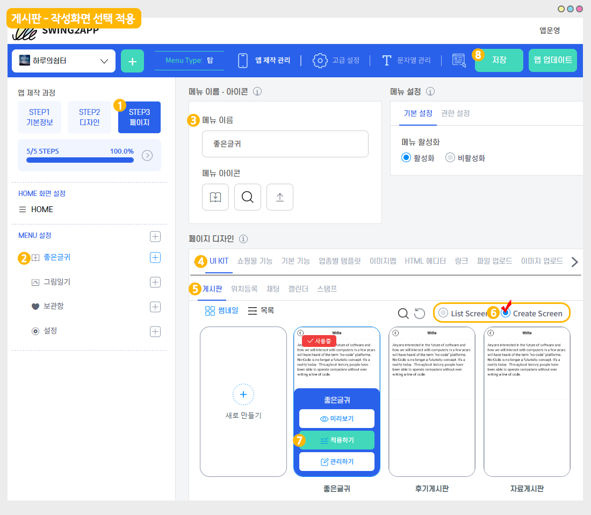

# 게시판: 목록화면, 작성화면 이용방법

<figure><figcaption></figcaption></figure>

게시판을 적용할 때, 게시판을 불러오는 스타일을 선택하게 되는데요.

이때 '목록화면' or '작성화면'을 선택합니다.

가장 기본적인 스타일은 ‘목록화면’이지만 사용자의 앱 이용 목적에 따라서 ‘작성화면’으로 선택을 하셔도 됩니다.

목록화면, 작성화면 차이점과 이용 방법에 대해서 매뉴얼을 확인해주세요.

***

<mark style="color:blue;">**게시판: 목록화면, 작성화면은 어디서 이용하나요?**</mark>

<figure><figcaption></figcaption></figure>

게시판은 앱제작 – STEP3페이지에서 이용가능합니다.

페이지 디자인 - UI KIT 선택 - \[게시판] 선택 - 게시판 화면에서&#x20;

‘목록화면(List Screen)'으로 선택할지 ‘작성화면(Create Screen)’으로 선택할지 체크할 수 있습니다.

###  1. 게시판: 목록화면&#x20;

<figure><figcaption></figcaption></figure>

1\)앱제작 화면 - STEP3 페이지 선택

2\)메뉴 선택

\*메뉴를 만들기 전이라면, 새 메뉴를 만들어주세요. (+ 모양 버튼 선택하여 메뉴 추가)

3\)메뉴 이름을 입력해주세요.

4\)페이지 디자인에서 \[UI KIT] 선택

5\)\[게시판]을 선택해주세요.&#x20;

6\)\[List Screen] 선택해주세요.&#x20;

7\)등록할 게시판을 확인한 뒤 \[적용하기] 버튼을 선택해주세요.&#x20;

(페이지에 마우스 커서를 가져다 대면 적용하기 버튼이 열립니다)

8\)화면 상단 \[저장]버튼을 누르면 앱에 적용됩니다.

 <mark style="color:blue;">**앱 실행화면**</mark>

**목록화면은 게시판 목록이 보이는 스타일 \*가장 기본적인 게시판 화면이에요.**

게시판 ‘목록화면’을 선택하면 적용된 게시판의 목록(리스트)이 보이게 됩니다.

목록에서 게시물을 선택하면, 게시물 상세보기 페이지로 이동하여 게시물 내용을 확인할 수 있어요.

★게시판 불러오기는 ‘목록화면’으로 기본 셋팅되어서 제공됩니다.

따라서 특별한 경우가 아니면 수정하지 않고, 목록화면으로 보기로 이용해주시면 됩니다.&#x20;

<figure><figcaption></figcaption></figure>

###  2. 게시판: 작성화면

<figure><figcaption></figcaption></figure>

1\)앱제작 화면 - STEP3 페이지 선택

2\)메뉴 선택

\*메뉴를 만들기 전이라면, 새 메뉴를 만들어주세요. (+ 모양 버튼 선택하여 메뉴 추가)

3\)메뉴 이름을 입력해주세요.

4\)페이지 디자인에서 \[UI KIT] 선택

5\)\[게시판]을 선택해주세요.&#x20;

6\)\[Create Screen] 선택해주세요.&#x20;

7\)등록할 게시판을 확인한 뒤 \[적용하기] 버튼을 선택해주세요.&#x20;

(페이지에 마우스 커서를 가져다 대면 적용하기 버튼이 열립니다)

8\)화면 상단 \[저장]버튼을 누르면 앱에 적용됩니다.

 <mark style="color:blue;">**앱 실행화면**</mark>

‘작성화면’을 선택하면 글을 작성할 수 있는 화면(페이지)가 먼저 열리게 됩니다.

게시판의 글 작성 페이지가 보이는 스타일이며 <mark style="color:orange;">**\*특수한 운영 목적에 사용할 수 있어요.**</mark>

\*사용자들이 바로 글을 작성해야 할 때 사용할 수 있지만 사용자들은 해당 게시판의 목록을 볼 수 없어요.

\*즉 글만 작성할 수 있고, 작성된 글 목록은 앱운영페이지에서 관리자만 확인이 가능합니다.

<figure><figcaption></figcaption></figure>

###  3. 게시판 작성화면 이용목적

작성화면 설정은 **\*설문지, 동의서, 신청서, 입사지원서 등 사용자에게 필요한 내용을 작성 받을 때 이용할 수 있어요.**

커뮤니티, 상호작용 게시판 형태가 아니라 앱 사용자들에게 일방적으로 필요한 정보만을 받을 때 이용합니다.

관리자는 **스윙 앱운영페이지 – 게시물 관리**에서 작성된 글을 확인할 수 있습니다.

 <mark style="color:blue;">**예시: 작성화면으로 사용하는 경우**</mark>

위에 보시는 것처럼 게시판 작성화면을 선택하는 사례를 보면요.

**+작성글을 적용한 회원 자기소개 게시판, 작성폼을 적용한 입사지원서 등에 사용할 수 있어요.**

**+해당 게시판 선택시 바로 글 작성 페이지가 열리기 때문에 사용자들을 글을 바로 작성할 수 있구요.**

**+관리자는 웹-앱운영페이지에서 회원들이 작성한 글을 따로 볼 수 있습니다.**

&#x20;

 <mark style="color:blue;">**앱 실행화면: 게시판 작성화면 적용시**</mark>

앱 운영의 목적에 맞게 게시판 불러오기 스타일을 선택해주시기 바랍니다.

게시판 불러오기 역시 자유롭게 수정이 가능하니 목록화면- 작성화면 등 원하는 스타일로 설정하고 수정해주시기 바랍니다.

<figure><figcaption></figcaption></figure>



앱제작 V2버전 이용시에는 해당 매뉴얼로 확인해주세요.

게시판은 앱제작 – 페이지 메뉴단계에서 이용가능합니다.

메뉴유형: 게시판을 선택 후-> 링크마법사 버튼을 누르면 -> 링크마법사 창에서 게시판을 선택할 수 있구요.

아래에 보시면 ‘목록화면’ 으로 선택할지 ‘작성화면’으로 선택할지 체크할 수 있습니다.&#x20;

***

#### <mark style="color:blue;">**1. 게시판: 목록화면**</mark>&#x20;

<mark style="color:purple;">**\[게시판 적용방법]**</mark>

**앱제작 페이지에서 →  페이지 메뉴 로 이동합니다.**&#x20;

1\. \[카테고리 추가] 버튼을 선택해서 게시판을 적용할 메뉴를 추가합니다.&#x20;

2\. 메뉴 이름을 입력해주세요.

3\. 메뉴 유형: \[게시판]을 선택해주세요.

4\. \[링크마법사] 버튼을 선택해주세요.

5\. 메뉴에 적용할 게시판을 선택합니다.

6\. 링크선택: <mark style="color:red;">목록화면</mark> 선택

7.\[반영] 버튼 선택

8\. \[적용] 버튼

9\. \[저장] 버튼을 누르면 완료됩니다.

\*아이콘은 선택사항이며, 메뉴 앞에 아이콘을 적용할 경우만 선택해주세요.&#x20;

<mark style="color:orange;">**앱 실행화면**</mark>

**목록화면은 게시판 목록이 보이는 스타일 \*가장 기본적인 게시판 화면이에요.**

게시판 ‘목록화면’을 선택하면 적용된 게시판의 목록(리스트)이 보이게 됩니다.

목록에서 게시물을 선택하면, 게시물 상세보기 페이지로 이동하여 게시물 내용을 확인할 수 있어요.

★게시판 불러오기는 ‘목록화면’으로 기본 셋팅되어서 제공됩니다.

따라서 특별한 경우가 아니면 수정하지 않고, 목록화면으로 보기로 이용해주시면 됩니다.&#x20;

***

#### <mark style="color:blue;">**2. 게시판: 작성화면**</mark>

<mark style="color:purple;">**\[게시판 적용방법]**</mark>

**앱제작 페이지에서 →  페이지 메뉴 로 이동합니다.**&#x20;

1\. \[카테고리 추가] 버튼을 선택해서 게시판을 적용할 메뉴를 추가합니다.&#x20;

2\. 메뉴 이름을 입력해주세요.

3\. 메뉴 유형: \[게시판]을 선택해주세요.

4\. \[링크마법사] 버튼을 선택해주세요.

5\. 메뉴에 적용할 게시판을 선택합니다.

6\. 링크선택: <mark style="color:red;">작성화면</mark> 선택

7.\[반영] 버튼 선택

8\. \[적용] 버튼

9\. \[저장] 버튼을 누르면 완료됩니다.

\*아이콘은 선택사항이며, 메뉴 앞에 아이콘을 적용할 경우만 선택해주세요.&#x20;

<mark style="color:orange;">**앱 실행화면**</mark>

‘작성화면’을 선택하면 글을 작성할 수 있는 화면(페이지)가 먼저 열리게 됩니다.

게시판의 글 작성 페이지가 보이는 스타일이며 <mark style="color:orange;">\*특수한 운영 목적에 사용할 수 있어요.</mark>

\*사용자들이 바로 글을 작성해야 할 때 사용할 수 있지만 사용자들은 해당 게시판의 목록을 볼 수 없어요.

\*즉 글만 작성할 수 있고, 작성된 글 목록은 앱운영페이지에서 관리자만 확인이 가능합니다.



