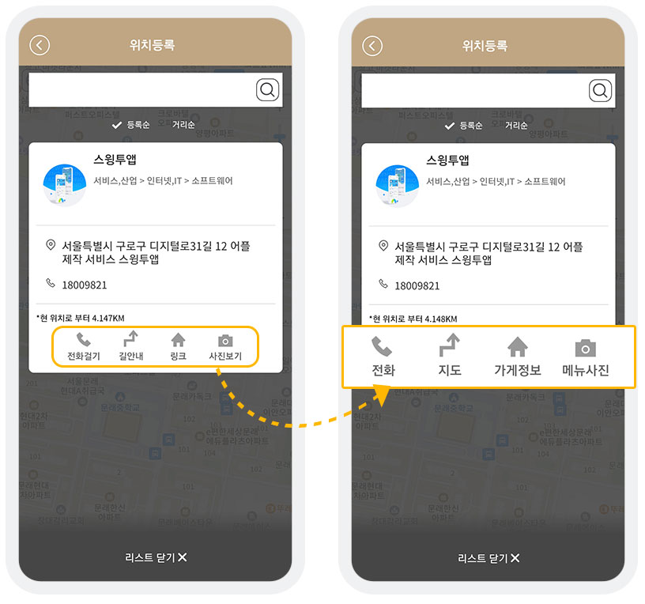
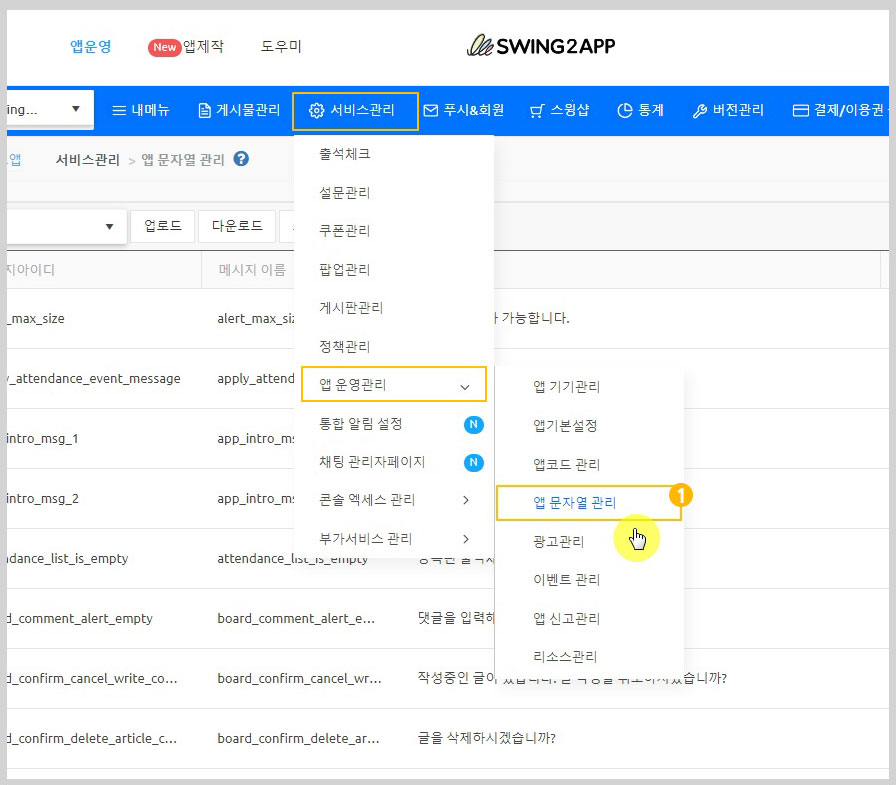
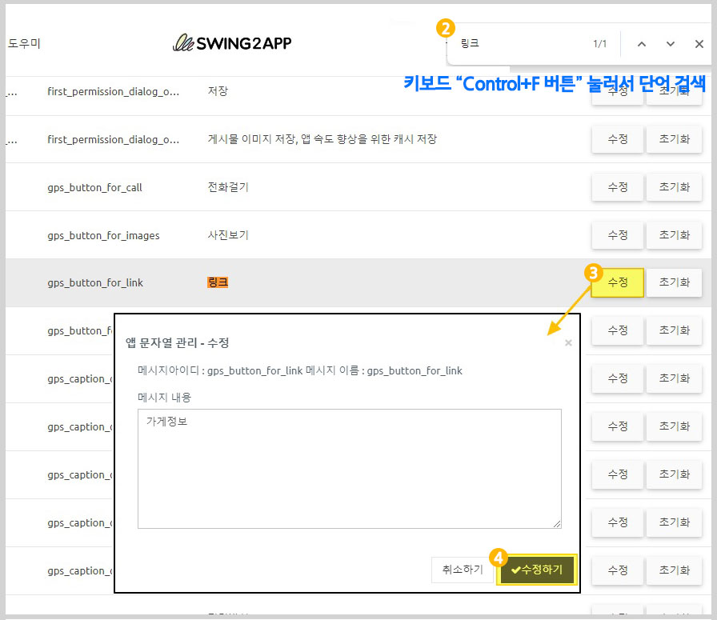
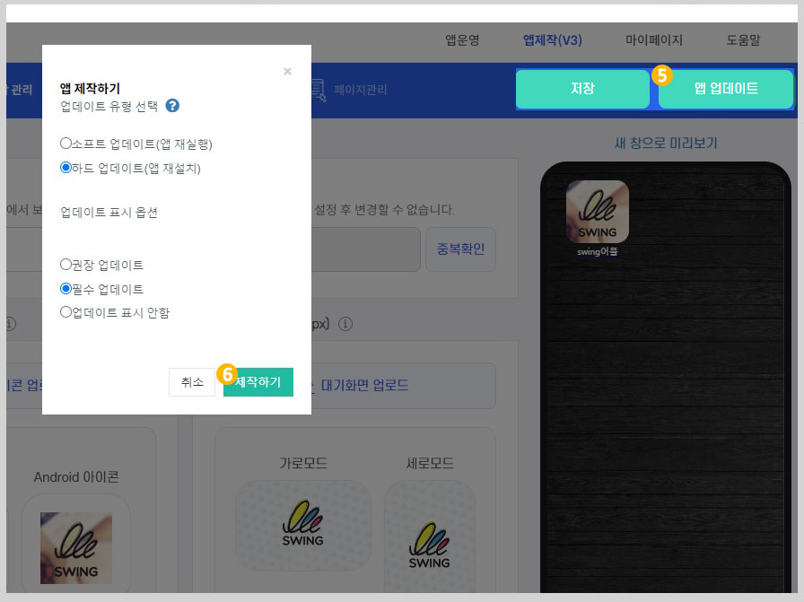

# 위치등록(지도)게시판 버튼명 수정

***

## 위치등록 게시판 버튼명 변경

<figure><figcaption></figcaption></figure>

위치등록 게시판에서 제공되는 버튼이름\[전화걸기, 길안내, 링크, 사진보기]을 원하는 메뉴명(텍스트)으로 수정하여 이용할 수 있습니다.

각 항목에 제공되는 정보에 적합하게 버튼 이름을 수정해서 사용해보세요.&#x20;

**‘문자열관리’에서 직접 메시지(단어)를 수정하여 적용할 수 있습니다.**

***

## 변경방법

<figure><figcaption></figcaption></figure>

1\)[앱운영-서비스관리-앱 운영관리-앱 문자열 관리](https://www.swing2app.co.kr/view/app\_resourecs\_manager) 이동

<figure><figcaption></figcaption></figure>

2\)키보드 Control+F 버튼 선택하여, 단어를 검색해주세요.&#x20;

**‘링크’ 단어 변경시**&#x20;

3\)링크 검색 후 \[수정]버튼 선택&#x20;

4\)원하는 단어로 편집 후 \[수정하기] 선택

<figure><figcaption></figcaption></figure>

5\)앱제작 화면 이동&#x20;

6\) \[앱 업데이트] 버튼 선택

7\)새 버전으로 제작된 앱으로 업데이트 후 확인시, 변경된 항목 확인이 가능합니다.


스토어 출시된 유료버전 앱은 반드시 “하드 업데이트” 진행 후 해당 스토어에 업데이트 버전앱으로 다시 제출하여 버전 업데이트 해주셔야 합니다.&#x20;

\*스토어를 통한 업데이트가 이루어지지 않으면 앱 변경이 되지 않습니다.&#x20;

\*무료앱은 소프트 업데이트로 진행 가능


