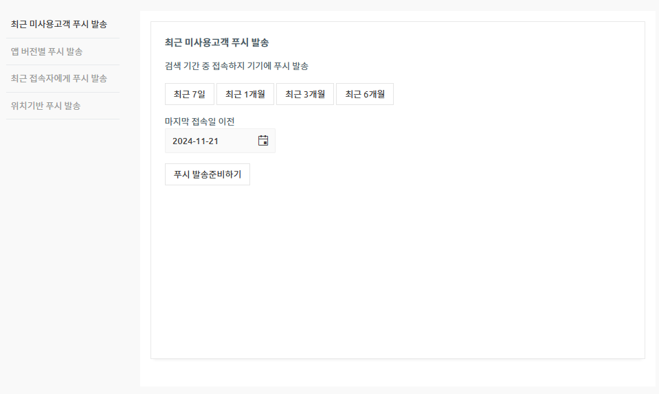

# 게시물 이동

**게시글 이동이란?**

게시글 이동은 게시글(게시물)을 선택하여 원하는 게시판으로 이동시킬 수 있는 기능입니다.

게시글 복사와는 다르게 기존 게시판에 등록된 글은 삭제되고, 작성일은 기존 등록일로 유지됩니다.

 ** **<mark style="color:blue;">**게시물 복사와 게시물 이동의 차이점**</mark>

<mark style="background-color:blue;">​</mark>**게시물 복사**

게시물을 다른 게시판으로 복사하는 기능

\+기존 게시판에도 해당 글은 유지됩니다.

\+복사된 글은 복사된 일자로 등록일자가 수정됩니다.

​

**게시물 이동**

게시물을 다른 게시판으로 이동시키는 기능(=잘라내기)

\+기존 게시판에는 해당 글은 삭제 처리됩니다.

\+이동한 글은 기존 작성일로 등록일자가 유지됩니다.

<figure><figcaption></figcaption></figure>

## **** (1).png>)**게시글 이동 이용방법**

1\)앱운영 – 게시물 관리에서 만들어놓은 게시판을 선택해서 이동합니다. (게시글을 이동하고자 하는 게시판 선택)

2\)\[리스트형] 선택

3\)작성된 게시물 리스트에서 이동하고자 하는 게시물을 선택합니다.

4\)\[게시글 이동] 버튼을 선택합니다.

5\)대상 게시판을 선택한 뒤 \[이동] 버튼을 선택합니다.

6\)\[확인] 버튼 선택시 완료됩니다.

게시글 이동 이용방법 이렇게 간단하게 이용할 수 있어요!!

\-해당 게시판의 전체 글을 이동할 수도 있구요.

\-게시글 몇 개만 선택하여 이동할 수 있습니다.

해당 게시판으로 이동시, 선택한 게시글이 이동된 것을 확인할 수 있습니다.

****
