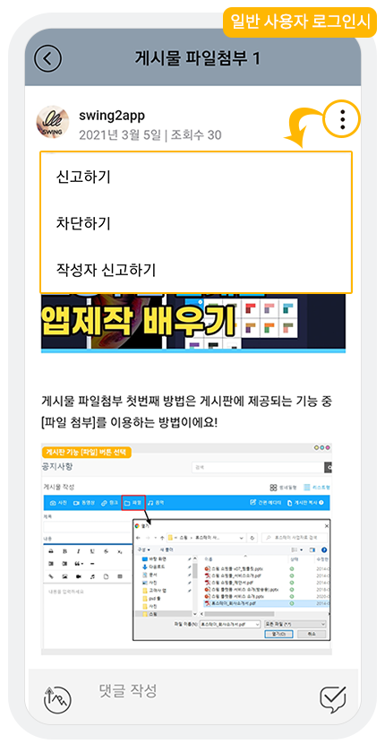

# 게시물 신고 및 관리

<figure><figcaption></figcaption></figure>

게시물 신고는 많은 사람들과 함께 운영하는 앱을 더욱 질서있고, 쾌적하게 만들기 위해서 꼭 필요한 기능인데요.

**+사용자는 앱에서 부적절한 게시물을 발견하면, 신고하기를 통해 게시물을 삭제할 수 있습니다.**&#x20;

**+관리자는 앱운영페이지 \[신고글관리]에서 신고를 받은 게시글을 확인하여 글을 삭제하거나, 신고 취소를 할 수 있습니다.**

게시물 신고 기능- 게시물을 신고하고, 처리하는 과정을 알려드리겠습니다.

***

## &#x20;****  (1).png>)1. 게시물 신고하기

<figure><figcaption></figcaption></figure>

게시판 – 게시물 상세보기에서 오른쪽 상단을 보시면, 점 3개로 표시된 아이콘이 있어요.

해당 아이콘을 선택하면 ‘신고하기’ , ‘차단하기' , '작성자 신고하기' 메뉴가 뜹니다.&#x20;

\[신고하기]를 선택하면 신고할 내용을 입력하게 됩니다.

내용 입력 완료 후 \[OK ]선택 하면, 신고처리가 완료됩니다.

<mark style="color:red;">-신고를 한 사용자에게는 해당 글이 바로 삭제되어 보이지 않도록 처리되구요.</mark>

<mark style="color:red;">-신고글이 접수되어 관리자가 신고된 글을 삭제하면 모든 사용자들에게도 해당 글이 보이지 않게 됩니다.</mark>

<figure><figcaption></figcaption></figure>

## **** (1).png>)2. 관리자 신고글 삭제 or 신고 취소하기

사용자가 신고 했다면, 관리자는 신고글을 확인하여 글을 삭제할 것인지 유지할 것인지 관리할 수 있어야 하겠죠?

<mark style="color:red;">**\*신고글은 앱운영 웹 대시보드에서 확인 가능합니다.**</mark>

[**앱운영 페이지 → 게시물관리 → 신고글 관리**](http://www.swing2app.co.kr/view/board\_article\_report) **메뉴로 이동합니다.**

&#x20;

신고글관리 페이지로 이동하면 방금 사용자가 신고한 게시물을 확인할 수 있습니다.

신고글에는 게시판명, 게시자명, 신고한 회원, 신고 일시, 신고 내용을 확인할 수 있구요.

**★관리자는 해당 글을 확인하여 관리자 권한으로 글을 삭제할 수도 있으며, 삭제할 필요가 없다고 생각들면 신고 취소를 할 수도 있습니다.**

&#x20;

<mark style="color:blue;">**1) 신고글 삭제하기**</mark>

게시판 설정이 올바르지 않다고 판단되면 해당 글을 삭제할 수 있습니다.

삭제를 하면 게시판에 기재된 글이 앱에서 완전히 삭제되어, 모든 사용자들에게 보이지 않게 됩니다.

&#x20;

<mark style="color:blue;">**2) 신고글 취소하기**</mark>

게시물 내용이 괜찮다고 판단되면, 신고를 취소하여 게시물을 유지할 수 있습니다.

게시물 신고하기와 함께, 차단하기 기능도 함께 제공되고 있습니다.

게시물 차단은, 차단한 글과 함께 해당 사용자가 작성한 모든 글이 노출되지 않도록 설정되는 게시판 옵션 기능입니다.&#x20;

차단을 한 사용자에게만 보이지 않으며, 다른 사용자들에게는 글이 노출됩니다.&#x20;

차단하기 이용방법은 아래 매뉴얼을 참고해주세요.



