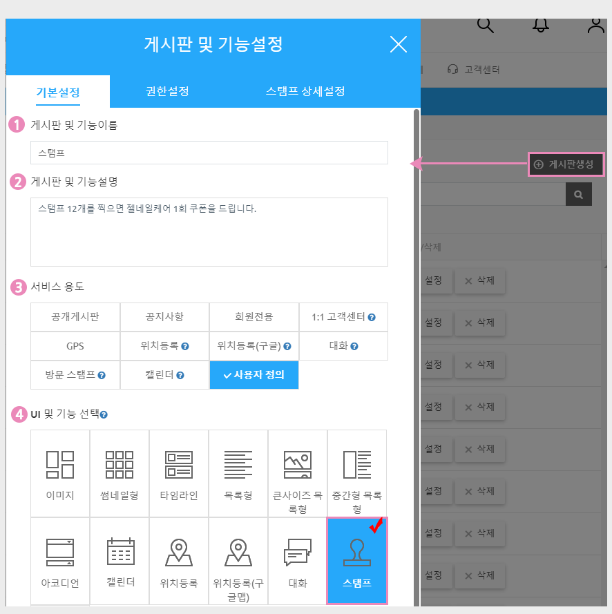
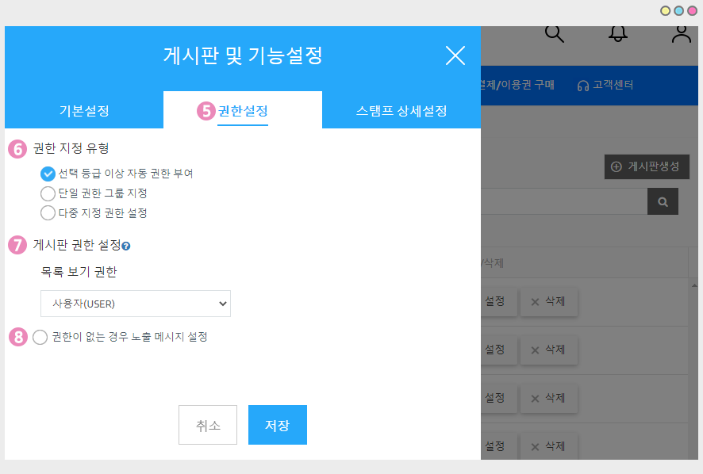
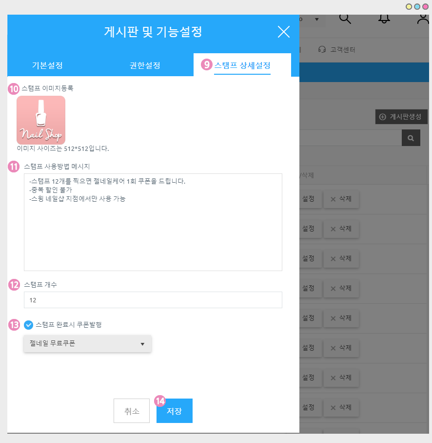
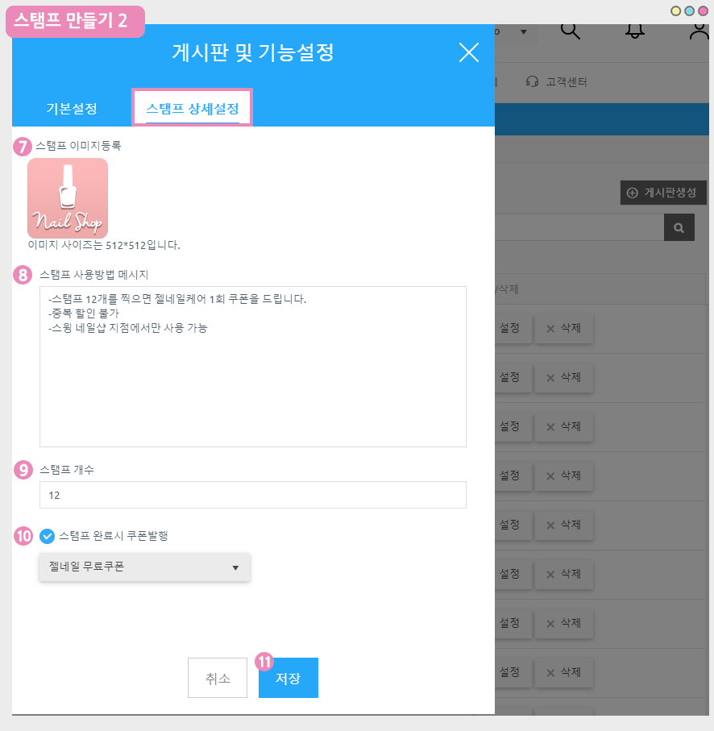
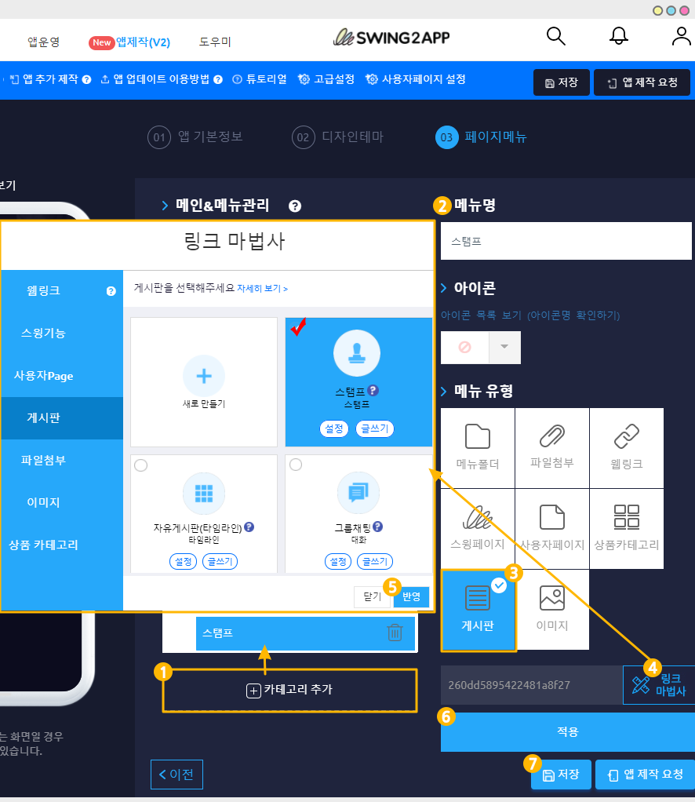
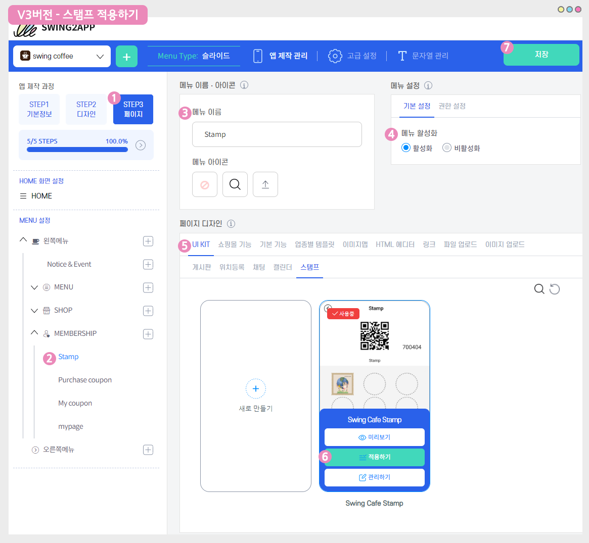
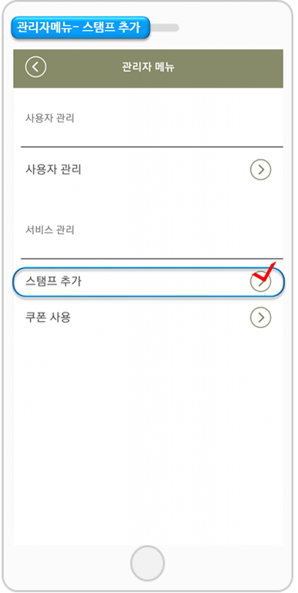

# 스탬프 이용 및 등록방법

<figure><figcaption></figcaption></figure>

<mark style="color:blue;">**스윙투앱에서 제공하는 스탬프 란?**</mark>

스윙투앱에서는 종이쿠폰이 아닌 앱에 내장된 모바일 쿠폰으로 도장을 찍을 수 있답니다.

앱에서 발행한 회원번호로 관리자가 스탬프 도장을 추가할 수 있고, QR코드로 찍어서 추가할 수도 있어요.

불편하게 쿠폰을 들고 다닐 번거로움 없이 해당 업체에서 제공하는 앱을 실행하면 바로 도장을 받을 수 있는 것이죠!!

스탬프 기능은 스윙 서비스관리- 게시판관리에서 이용할수 있구요.

게시판으로 제공되는 기능이기 때문에 게시판관리에서 스탬프 UI를 선택하고 앱에 반영해주시면 됩니다.

스탬프 이용방법 매뉴얼을 통해서 스탬프 게시판을 만드는 방법, 앱에 스탬프를 적용하는 방법, 회원들에게 스탬프를 넣어주는 방법, 앱 실행화면까지 모두 확인해주세요.

<figure><figcaption></figcaption></figure>

### <mark style="color:blue;"></mark> <mark style="color:blue;">****</mark> 1. 스탬프 만들기

[스윙 앱운영 페이지 → 서비스관리 → 게시판 관리](https://www.swing2app.co.kr/view/board\_edit) 페이지로 이동합니다.

<figure><figcaption></figcaption></figure>

**게시판 관리 페이지에서 \[게시판 생성] 버튼을 선택하면 \[게시판 및 기능설정]창이 열립니다.**

1\) 기본설정 메뉴에서 게시판 이름 입력

2\)게시판 설명: 스탬프 이용에 대한 간단 설명을 기재합니다.

3\)서비스용도: ‘사용자 정의’ 선택

4\)UI및 기능 선택: 스탬프 선택

<figure><figcaption></figcaption></figure>

5\)권한 설정 메뉴 선택

6\)권한 지정 유형 선택&#x20;

선택 등급 이상 권한 부여, 단일 권한 그룹 지정, 다중 지정 권한 설정 체크

7\)게시판 권한 설정&#x20;

스탬프를 이용할 권한을 설정해주세요.

**8)권한이 없는 경우 노출 메시지 설정**&#x20;

\*해당 항목은 선택사항이라 입력하지 않아도 됩니다. 기본 셋팅된 문구로 제공됩니다.&#x20;

<figure><figcaption></figcaption></figure>

9\)스탬프 상세 설정메뉴 선택

10\)스탬프 이미지 등록

스탬프 이미지는 원하는 이미지로 등록가능합니다.(이미지 사이즈 512px \* 512px)

아이콘을 누르면 이미지를 등록할 수 있도록 파일첨부 창이 뜨구요. 원하는 이미지를 첨부해주세요.

11\)스탬프 사용방법 메시지

해당 스탬프를 이용하는 방법, 주의사항 등을 기재해주세요.(업체에 맞게 기재)

12\)스탬프 개수

기본 셋팅이 10개로 제공되며, 개수는 사용자가 원하는 수로 설정할 수 있습니다.

13\) **“스탬프 완료시 쿠폰발행”** 체크 여부는 선택사항입니다.

\-스탬프 완료 후 자동으로 쿠폰이 발행되길 원한다면 체크해주시구요., 발행할 쿠폰을 선택합니다.

(쿠폰은 서비스관리→ 쿠폰관리에서 먼저 만들어 주셔야 적용이 가능하겠죠?)

\-자동 발행을 원치 않거나 쿠폰 발행을 이용하지 않는다면 체크를 풀어주세요.

\*쿠폰발행에 체크하실 경우, 쿠폰은 먼저 만들어주셔야 합니다.

만들어놓은 쿠폰이 없을 경우 선택할 쿠폰이 없기 때문에 이용에 제한이있어요.

쿠폰을 만드는 방법은 아래 쿠폰 등록방법 매뉴얼을 확인해주세요.

[\[쿠폰 등록 및 이용방법 보러가기\]](https://wp.swing2app.co.kr/documentation/appmanage/service/coupon/)

14\) \[저장]버튼을 누르면 스탬프 게시판이 등록완료됩니다.

&#x20;



앱제작 버전 V2 이용시, 해당 가이드로 확인해주세요.&#x20;

### &#x20;<mark style="color:blue;">**1. 스탬프 만들기**</mark>

<figure><figcaption></figcaption></figure>

&#x20;**첫번째 기능 설정 창에서 게시판을 선택합니다.**

1\) 게시판 이름 입력

2\)게시판 설명: 스탬프 이용에 대한 간단 설명을 기재합니다.

3\)서비스용도: ‘사용자 정의’ 선택

4\)UI및 기능 선택: 스탬프 선택

5\) 게시판 권한 설정

목록 보기 권한 : 스탬프를 이용할 권한을 설정해주세요.

6\) 지정권한 사용기능 허용 : ‘사용안함’이 기본셋팅값입니다.

선택된 특정 권한만 이용하게 하는 설정으로 ‘손님’으로 설정시 손님을 제외한 다른 등급 및 그룹의 이용자들은 확인이 불가

**\*만약 해당 게시판을 특정 회원들만 이용하게 하고 싶다면 \[지정권한 사용기능 허용] 에 체크하고 지정할 회원그룹을 선택해주세요.**

&#x20;

<figure><figcaption></figcaption></figure>

&#x20;**두 번째 기본설정 메뉴에서 입력이 모두 끝났다면 **<mark style="color:blue;">**\[스탬프 상세설정]**</mark>**으로 이동합니다.**

7\)스탬프 이미지 등록: 스탬프 이미지는 원하는 이미지로 등록가능합니다.(이미지 사이즈 512px \* 512px)

아이콘을 누르면 이미지를 등록할 수 있도록 파일첨부 창이 뜨구요. 원하는 이미지를 첨부해주세요.

8\)스탬프 사용방법 메시지: 해당 스탬프를 이용하는 방법, 주의사항 등을 기재해주세요.(업체에 맞게 기재)

9\)스탬프 도장 개수: 기본 셋팅이 10개로 제공되며, 개수는 사용자가 원하는 수로 설정할 수 있습니다.

10\) **“스탬프 완료시 쿠폰발행”** 체크 여부는 선택사항입니다.

<mark style="color:red;">-스탬프 완료 후 자동으로 쿠폰이 발행되길 원한다면 체크해주시구요. 발행할 쿠폰을 선택합니다.</mark>

<mark style="color:red;">(쿠폰은 서비스관리→ 쿠폰관리에서 먼저 만들어 주셔야 적용이 가능하겠죠?)</mark>

<mark style="color:red;">-자동 발행을 원치 않거나 쿠폰 발행을 이용하지 않는다면 체크를 풀어주세요.</mark>

<mark style="color:red;">\*쿠폰발행에 체크하실 경우, 쿠폰은 먼저 만들어주셔야 합니다.</mark>

<mark style="color:red;">만들어놓은 쿠폰이 없을 경우 선택할 쿠폰이 없기 때문에 이용에 제한이있어요.</mark>

<mark style="color:red;">쿠폰을 만드는 방법은 아래 쿠폰 등록방법 매뉴얼을 확인해주세요.</mark>

11\) \[저장]버튼을 누르면 스탬프 게시판이 등록완료됩니다.

\*스탬프 완료시 쿠폰발행 기능은 신규기능으로 앱 업데이트를 해야 이용 가능해요.

2019.3.22 이전에 제작한 사용자분은 업데이트를 먼저 하고 이용해주세요.

&#x20;

### <mark style="color:blue;">**2. 앱에 스탬프 적용하기**</mark>&#x20;

<figure><figcaption></figcaption></figure>

&#x20; **\*앱제작 페이지 → 페이지 메뉴 단계로 이동합니다.**

1\. \[카테고리 추가] 버튼을 선택해서 게시판을 적용할 메뉴를 추가합니다.

2\. 메뉴 이름을 입력해주세요.

3\. 메뉴 유형: \[게시판]을 선택해주세요.

4\. \[링크마법사] 버튼을 선택해주세요.

5\. 메뉴에 적용할 ‘스탬프 게시판’을 선택한 뒤 \[반영] 버튼 선택

6\. \[적용] 버튼

7\. \[저장] 버튼을 누르면 완료됩니다.

\*아이콘은 선택사항이며, 메뉴 앞에 아이콘을 적용할 경우만 선택해주세요.



***

<figure><figcaption></figcaption></figure>

### <mark style="color:blue;"></mark> <mark style="color:blue;">****</mark> 2. 앱에 스탬프 적용하기

**게시판에서 스탬프를 만들었다면!! 만든 스탬프를 앱에 적용하는 방법을 알려드릴게요.**

<figure><figcaption></figcaption></figure>

**\*스윙투앱 앱제작 v3**&#x20;

1.STEP3 페이지 단계

2.메뉴를 추가해주세요. + 아이콘 선택

3.메뉴 이름을 입력해주세요.

4.메뉴 설정 – 기본설정에서 메뉴 활성화에 체크해주세요.

\*아직 앱에 보여지는 메뉴가 아니라면 ‘비활성화’에 체크 후 작업이 완료되면 ‘활성화’로 바꿔주셔도 됩니다.

5.페이지 디자인: **\[UI KIT – 스탬프]** 선택

6.\[적용하기] 버튼

7.\[저장] 버튼을 누르면 완료됩니다.

\*아이콘은 선택사항이며, 메뉴 앞에 아이콘을 적용할 경우만 선택해주세요.

****

<mark style="color:blue;">**스탬프 적용 앱 실행화면**</mark>

스탬프 게시판에는 ** **<mark style="color:blue;">**QR코드, 회원번호**</mark>**가 각 사용자 계정으로 발행이 됩니다.**

**-앱 관리자가 QR코드로 사용자에게 스탬프를 추가할 수 있구요.**

**-웹 관리자 페이지에서 회원번호를 등록하여 스탬프를 추가할 수 있습니다.**

<mark style="color:red;">스탬프 게시판은 앱에서 회원가입을 한 사용자부터 이용이 가능하기 때문에 반드시 로그인을 해주셔야 합니다.</mark>

<mark style="color:red;">로그인이 되어야 해당 사용자에게 회원번호 및 QR이 생성됩니다.</mark>

<figure><figcaption></figcaption></figure>

### <mark style="color:blue;"></mark> <mark style="color:blue;">****</mark> 3. 스탬프 등록하기(스탬프 추가)

스탬프 게시판을 만들고, 앱에 적용까지 다 했다면!

실제로 앱 회원들에게 스탬프를 등록해주는 방법을 알려드릴게요.

****

<mark style="color:blue;">**1)스탬프 추가방법 1 – 회원번호로 추가하기**</mark>

앱운영 페이지 →  게시물관리 →  스탬프로 이동합니다.

**1)회원번호 입력**

**2)스탬프를 등록할 수량입력**

**3)등록하기를 누르면 완료됩니다.**

<mark style="color:orange;">**↓↓ 회원번호는 아래 앱 실행화면을 보면, 사용자마다 회원번호를 확인할 수 있습니다.**</mark>

<mark style="color:blue;">**2) 스탬프 추가방법2 – 회원찾기로 스탬프 추가하기**</mark>

만약 사용자의 회원번호를 당장 확인할 수 없는 상황이라면,**두번째 방법- 회원찾기를 이용하여 등록할 수 있습니다.**

**\[회원찾기]버튼을 선택하면, 앱에 가입된 회원목록이 뜨구요.**

**사용자 이름을 검색한뒤, 해당 회원을 선택하고 스탬프를 등록해주시면 됩니다.**&#x20;

<mark style="color:blue;">**3) 스탬프 추가방법3 – 앱관리자 로그인에서 회원 스탬프 추가하기**</mark>

**스탬프 추가 세번째 방법은 관리자가 앱에서 스탬프를  QR코드로 등록할 수 있어요.**

앱 실행 후 설정 → 관리자 로그인→ 스윙투앱 계정 로그인(스윙투앱 홈페이지 가입 계정)하면 관리자메뉴가 열립니다.&#x20;


<mark style="color:green;">스윙투앱 간편 로그인 사용자 분들은 아래 방법으로 이용해주셔야 합니다.</mark>

앱에서 회원가입을 한 뒤 해당 회원의 그룹을 → 관리자로 설정해주세요.&#x20;

1\)앱 회원 가입 후&#x20;

2\)회원조회 페이지 이동 [앱 운영 → 푸시 & 회원 → 회원조회](http://www.swing2app.co.kr/view/member\_list)

3\)회원 선택 후 그룹을 **‘관리자’**로 변경

4\)앱 실행 → 로그인 후 → 앱 설정 → 관리자 메뉴 선택시 관리자 로그인에서 제공되는 메뉴 동일하게 이용 가능합니다.


<figure><figcaption></figcaption></figure>

관리자메뉴에서 – \[스탬프 추가]를 선택합니다.

\[QR코드로 읽기]를 선택하면  엡에 내장된 QR코드 리더기가 실행되면서 사용자의 QR코드 이미지를 스캔할 수 있습니다.

<mark style="color:red;">\*이때 사용자 앱에서 스탬프를 열어두셔야 QR코드이미지를 확인할 수 있어요.</mark>

앱 관리자에서 스탬프를 추가하는 방법! 움짤 이미지로 확인해주세요!!

실제로 앱 관리자메뉴- 스탬프 등록 화면에서  QR코드를 실행하여서 사용자의 스탬프를 등록했습니다.

앱관리자메뉴 -스탬프 등록방법은 아래 링크를 통해 상세내용을 확인할 수 있습니다.

[**\[앱관리자메뉴:스탬프 등록방법 매뉴얼 보러가기\]**](../../appoperation/appmanager-stamp.md)

<figure><figcaption></figcaption></figure>

### <mark style="color:blue;"></mark> <mark style="color:blue;">****</mark>** 4. 스탬프 삭제하는 방법**

**스탬프 수량을 잘 못 입력했거나, 등록완료된 스탬프를 초기화 할 경우는!**

**\[삭제] 버튼을 눌러서 원하는 수량만큼 삭제하거나 모든 스탬프를 다 삭제할 수 있습니다.**

\-스탬프 게시판의 회원 목록 옆의 \[삭제]버튼을 누르면 삭제할 수량입력 창이 뜹니다.

\-삭제할 수량을 입력한 뒤 \[확인]을 누르면 해당 숫자만큼 스탬프가 삭제되요.

\-만약 스탬프를 초기할 경우는 스탬프 전체 수량을 입력하고 삭제하시면 됩니다.

<figure><figcaption></figcaption></figure>

### <mark style="color:blue;"></mark> <mark style="color:blue;">****</mark> 5. 앱 실행화면

**앱에서는 스탬프 게시판이 어떻게 실행되고, 스탬프가 어떻게 추가되는지 확인해볼게요!!**

스탬프 게시판에는 <mark style="color:red;">QR코드와 회원번호가 사용자마다 랜덤으로 발행이 됩니다.</mark>

앱 관리자가 QR코드로 사용자에게 스탬프를 추가할 수 있구요.

웹 관리자 페이지에서 회원번호를 등록하여 스탬프를 추가할 수 있습니다.

게시판기능 – 상세설정에서 입력한 사용방법 메시지 내용은 스탬프 화면 하단에 배치됩니다.

스탬프를 추가하게 되면, 쿠폰에 도장을 찍어주듯이 스탬프가 수량만큼 추가 됩니다.

스탬프 이미지도 게시판기능 – 상세설정에서 등록한 이미지로 표시됩니다.

<mark style="color:blue;">**★움짤이미지로 스탬프가 추가되는 모습을 확인해주세요.**</mark>

<mark style="color:blue;">▶</mark><mark style="color:blue;">**스탬프 완료시 쿠폰발행에 체크한 경우**</mark>

앞서 스탬프 상세설정에서 \[스탬프 완료시 쿠폰발행]에 체크했을 때는 앱에서 어떻게 실행이 되는지 확인할게요!

관리자가 설정한 갯수만큼 스탬프등록이 완료되면, 스탬프가 모두 리셋(사라지며)되면서 쿠폰이 발행되었다는 팝업창이 뜹니다.

확인을 선택하면 사용자가 발급받은 쿠폰 목록을 확인할 수 있습니다.


<mark style="color:orange;">**안내사항**</mark>

1.스탬프 도장 갯수는 10개로 셋팅되어 있구요.

\[스탬프 상세설정]에서 스탬프 개수를 수정하여 사용할 수 있습니다.

**2. \[스탬프 완료시 쿠폰발행]에 체크한 경우**

정해진 스탬프 만큼 숫자가 다 채워지면 자동으로 화면이 초기화되구요,

자동으로 관리자가 설정해놓은 쿠폰이 사용자에게 발행이 됩니다.

**3. \[스탬프 완료시 쿠폰발행] 에 체크하지 않을 경우**

앱에서 제공하는 스탬프를 모두 다 찍을 경우, 사용자의 스탬프는 자동으로 초기화가 되지 않습니다.

관리자가 직접 초기화를 해야만 다시 처음으로 셋팅이 됩니다.

초기화 방법은 위에서 설명해드린 방법처럼 웹관리자페이지에서 \[삭제] 버튼을 눌러서 등록된 스탬프 갯수만큼을 삭제해주시면 됩니다.


<mark style="color:orange;">****</mark>

