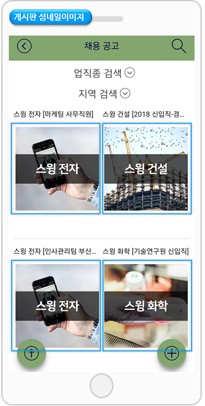

# 게시판 섬네일 이미지 등록

<figure><figcaption></figcaption></figure>

**게시판 섬네일이미지란?**

<figure><figcaption></figcaption></figure>

게시판 게시물 목록화면에서 보여지는 대표 이미지를 말해요.

섬네일은 게시판 글 작성시,  첫 번째로 등록한 이미지가 섬네일로 지정되요.

이렇게 **게시판 목록화면에서 대표로 보이는 이미지를 섬네일이미지** 라고 하구요.

해당 이미지는 **게시물 등록시 첫번째로 등록된 이미지가 섬네일로 적용됩니다.**

<mark style="color:red;">게시물 작성시 사진 첨부로 이미지를 별도로 첨부하지 않으면, 앱 아이콘 이미지가 보여집니다.</mark>

매뉴얼을 통해서 게시판에 섬네일 이미지를 등록하는 방법을 확인해주세요.

<figure><figcaption></figcaption></figure>

## &#x20;1. 섬네일 이미지 등록하기

**앱운영 페이지 → 서비스관리 → 게시물 관리 → 만들어 놓은 게시판으로 이동**

글 작성시 \[사진] 첨부 버튼을 눌러서 이미지를 등록을 해주세요.

게시물 입력시 사진 첨부로 등록한 이미지 중 **첫번째로 올라간 이미지가 게시물 대표 섬네일로 자동 지정이 되요.**

따라서 별도 작업을 하지 않아도 섬네일은 첫번째 이미지로 자동으로 지정됩니다.


<mark style="color:red;">**주의사항**</mark>

간혹, 게시물에 이미지를 등록했는데 섬네일 이미지가 안 보인다고 하시는 경우가 있는데요.

대표 섬네일이미지로 보이게 하기 위해서는 이미지를 게시물 본문에 등록하면 안보이구요.

반드시 **\[사진] 첨부 버튼을 선택해서 이미지를 등록해주셔야 대표 섬네일 이미지가 앱에서 표시됩니다.**&#x20;


그런데 저는 게시물관리 글 작성 페이지에서 사진 버튼이 안보여요!! 하시는 분들도 있는데요.&#x20;

**이렇게 사진 첨부 버튼이 안 보이시는 분들은 게시판을 만들 때 해당 옵션을 설정하지 않았을 수 있어요.**

[앱운영 →  서비스관리 → 게시판관리](http://www.swing2app.co.kr/view/board\_edit)로 이동해주시구요.

해당 게시판의 \[설정] 버튼을 선택하면 게시판 및 기능 설정 창이 열립니다.

<mark style="color:orange;">여기서 허용범위 설정 :</mark>  <mark style="color:orange;"></mark><mark style="color:orange;">**‘사진첨부 허용’ 항목에 체크해주시기 바랍니다.**</mark>

\-게시판을 새로 만들 경우 게시판 생성 버튼을 눌러서 새로 만들어주시구요.

\-기존 게시판을 수정할 경우 설정 버튼을 선택하면 됩니다.

\-게시판은 서비스용도를 ‘사용자 정의’로 선택하면 아래 고정된 회색 영역이 풀리면서 항목들을 수정할 수 있습니다.&#x20;

<figure><figcaption></figcaption></figure>

## &#x20;2. 섬네일 이미지를 본문에 나오지 않게 설정하기

섬네일 이미지가 게시물 목록에서 대표이미지로만 보이게 하고, 본문에는 나오지 않게 하고 싶다면 아래 방법을 확인해주세요!

**앱운영 페이지 → 서비스관리 → 게시물 관리 → 만들어 놓은 게시판으로 이동 → 게시물 작성 페이지에 ‘첫 이미지 썸네일 사용’ 체크**

게시판마다 글 작성시 **\[첫 이미지 썸네일 사용]** 이라는 기능을 확인할 수 있어요.

**-첫 이미지 섬네일 사용 체크 하면, 본문과 중복되지 않고 섬네일을 지정할 수 있어요.**

**-첫 이미지 섬네일 사용 체크를 해제하면, 본문에도 섬네일 이미지가 중복으로 함께 표시가 됩니다.**&#x20;

<mark style="color:red;">‘첫 이미지 섬네일 사용’ 기능은 웹 대시보드(스윙투앱 웹사이트)에서만 제공되는 기능이기 때문에 앱에서는 이용할 수 없습니다.</mark>

### <mark style="color:blue;">**앱 실행화면) 섬네일 이미지 사용 기능 비교**</mark>

**1) \[첫 이미지 섬네일 사용]을 선택했을 경우**

게시판 목록에 섬네일 이미지가 표시되며, 게시물 상세보기에는 섬네일로 이용한 이미지가 보이지 않습니다.  (본문에 대표이미지가 보이지 않음)

**2) \[첫 이미지 섬네일 사용]을 선택하지 않을 경우**&#x20;

게시판 목록에 섬네일이미지가 표시되며, 게시물 상세보기에도 섬네일이미지가 본문에 중복으로 보여지는 것을 확인할 수 있습니다.


<mark style="color:orange;">**안내사항**</mark>

1\)앱에서 게시물을 작성하면 첨부한 첫번째 이미지가 섬네일로 지정됩니다.

2\)섬네일 이미지는 반드시 게시물 작성시 사진 첨부 버튼을 눌러서 이미지를 등록해야 합니다. (본문에만 이미지 등록시 섬네일로 표시되지 않습니다.

3\)섬네일로 지정할 대표 이미지가 없을 시 앱 아이콘 이미지가 섬네일 이미지로 표시됩니다.

4\)’첫 이미지 섬네일 사용’ 기능은 웹 대시보드(스윙투앱 웹사이트)에서만 제공되는 기능이기 때문에 앱에서는 이용할 수 없습니다.

