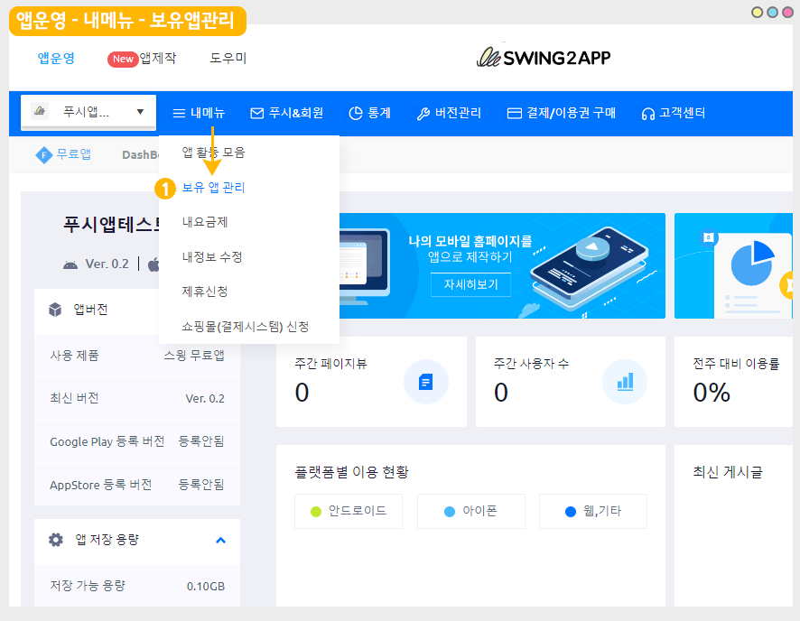

# 앱 제거(삭제)방법

<figure><figcaption></figcaption></figure>

## .png>) 1.앱 제거 방법

<figure><figcaption></figcaption></figure>

1\)[앱운영-내메뉴-보유 앱 관리 ](http://www.swing2app.co.kr/view/app\_stat)페이지로 이동합니다.

<figure><figcaption></figcaption></figure>

2\)앱 리스트에서 삭제하고자 하는 앱 확인 후 \[앱제거] 버튼을 선택합니다.

3\)삭제 확인 메시지가 뜨며, \[확인] 버튼을 선택합니다.

​

<figure><figcaption></figcaption></figure>

4\)삭제 완료\[확인]을 선택하면, 앱이 삭제 됩니다.

\*삭제된 앱은 다시 복원이 되지 않으니 신중히 결정해주세요.

<figure><figcaption></figcaption></figure>

## .png>) 2.앱 제거 주의사항

1\)앱 제거는 계정에 제작해놓은 앱이 2개 이상일 때 삭제가 가능합니다.

<figure><figcaption></figcaption></figure>

만들어놓은 앱이 하나 밖에 없다면 위의 이미지처럼, 앱 제거가 불가하오니 앱 추가 제작을 먼저 한 뒤 앱을 제거해주세요.

앱 추가 제작은 앱제작 화면으로 이동- 상단 앱 추가 제작 버튼+ 을 이용하여 제작 가능합니다.


**2개 이상부터 삭제가 가능한 이유?**

스윙투앱 앱운영 대시보드에는 앱 정보가 기록됩니다. 따라서 앱을 삭제헤서 계정에 아무 앱이 없을 경우 대시보드를 불러오지 못합니다.

앱 정보가 기록되어 있어야 하기 때문에 앱을 제거하더라도, 최소 1개의 앱 정보는 계정에 보여질 수 있도록 하기 위함입니다.


2\)유료앱은 이용기간이 끝나기 전까지는 제거가 불가합니다.

<figure><figcaption></figcaption></figure>

유료앱 이용권이 적용된 유료버전 앱은 이용기간이 끝나기 전까지는 앱을 제거할 수 없습니다.

이용기간 종료 후 제거가 가능합니다.

​

3\)삭제된 앱은 다시 복원할 수 없으니, 앱 저거 전 신중히 생각 후 결정해주세요.

**Related Articles**

* [내메뉴](https://wp.swing2app.co.kr/documentation/appmanage/menu/)
* [유료상품 취소 및 환불 정책](https://wp.swing2app.co.kr/documentation/appmanage/pay/refund/)
* [프로그레스바(상태 표시줄)색상 설정](https://wp.swing2app.co.kr/documentation/v3manual/webview-pushapp/progressbar/)
* [게시물 정렬 순서 설정 방법](https://wp.swing2app.co.kr/documentation/appmanage/board/sort-posts/)
* [푸시 아이콘 이미지 가이드라인](https://wp.swing2app.co.kr/documentation/appmanage/pushmember/pushicon-guideline/)
* [페이지 기능 – UI KIT](https://wp.swing2app.co.kr/documentation/v3manual/step3-page/ui-kit/)
