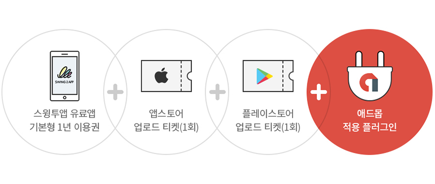
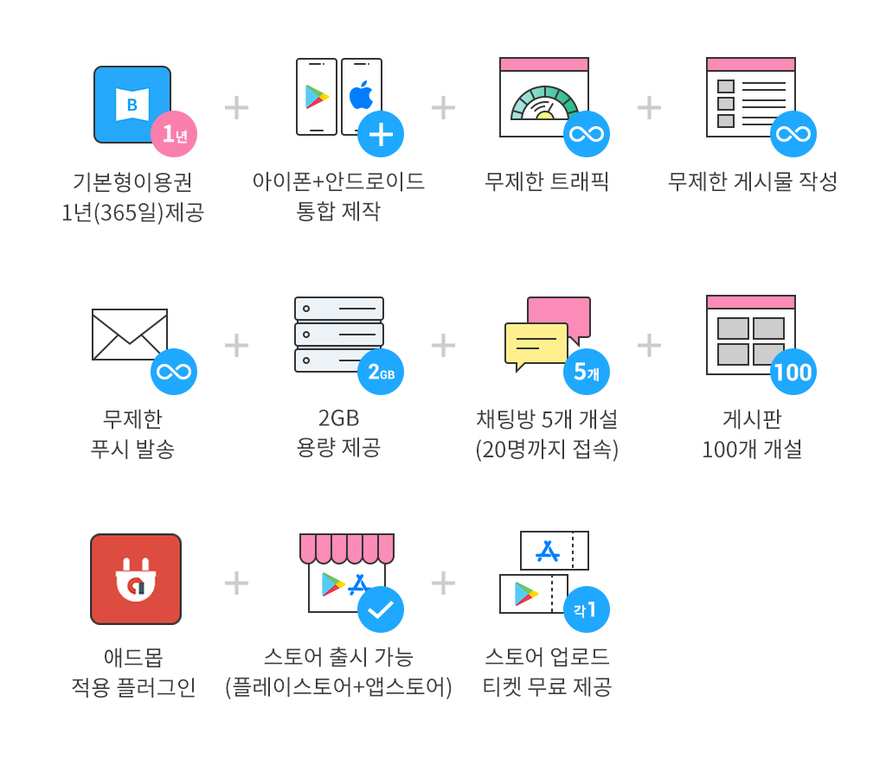
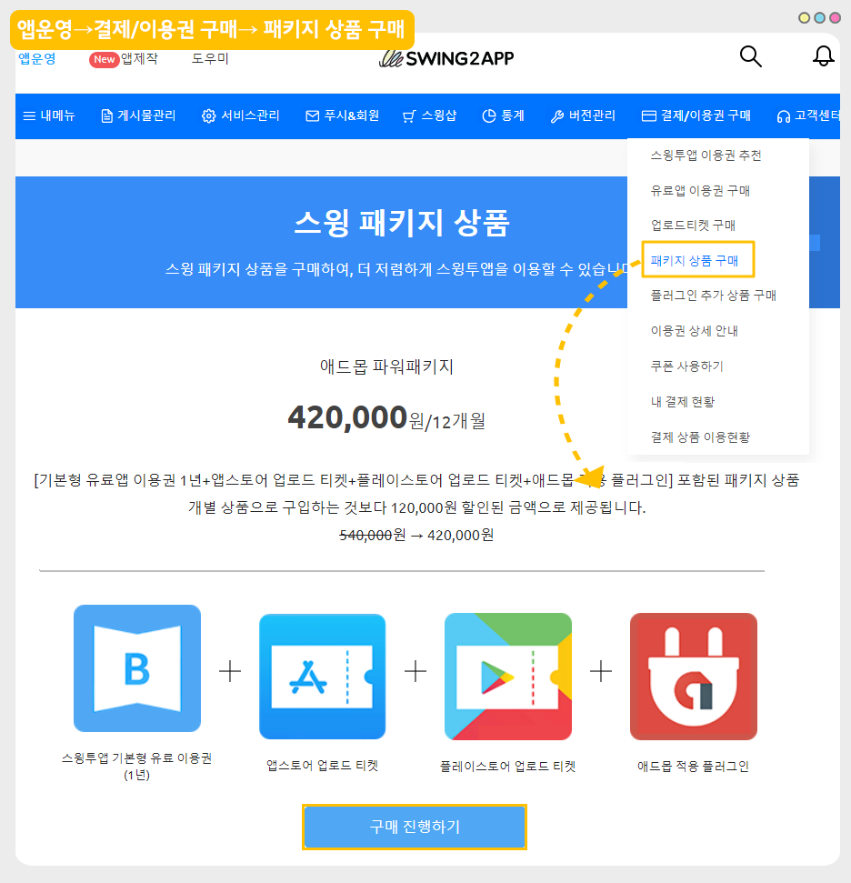

# 애드몹 파워 패키지(12개월)

***

##  **01. 애드몹 파워 패키지란?**&#x20;

스윙투앱에서 제작한 앱에 애드몹 광고를 셋팅할 수 있는 이용권 포함 패키지 상품입니다.

**애드몹 셋팅하여 수익형 앱을 창출할 경우 & 장기간 앱을 운영하실 경우 추천드립니다.**

<figure><figcaption></figcaption></figure>

\[기본형 유료앱 이용권 1년+앱스토어 업로드 티켓+플레이스토어 업로드 티켓+애드몹 적용 플러그인] 포함된 패키지 상품

개별 상품으로 구입하는 것보다 120,000원 할인된 금액으로 제공됩니다. ~~540,000~~원 → 420,000원​

1\)무료로 제작된 앱을유료버전으로 전환하는 이용권이며 패키지 상품입니다.

2\)스윙투앱에서 제작한 앱을 플레이스토어, 앱스토어 등의스토어에 올려서 배포할 경우 이용권을 필수 구매해야 합니다.(유료버전 전환)

3\)유료앱 이용권 구매는 구매 즉시 이용일이 적용되기 때문에 최종 앱 제작 후 결제해서 사용해주시기 바랍니다.

4\)알뜰형 패키지 상품은 일반 프로토타입- 탑, 푸터, 슬라이드, 드롭다운 리스트&박스로 제작한 앱에서만 구매할 수 있습니다.

\*푸시버전, 웹뷰버전으로 제작한 앱은 구매할 수 없습니다.

***

##  **02. 제공 서비스**

<figure><figcaption></figcaption></figure>

1\)개별 상품으로 구매 하는 것 보다 120,000원 할인된 금액으로 이용 가능 ~~540,000~~원 → 420,000원(부가세포함)

2\)플레이스토어 업로드 티켓(1개)+앱스토어 업로드 티켓(1개) 무료제공!

3\)애드몹 적용 플러그인 제공

4\)앱 저장용량 2GB, 게시판 100개 개설, 채팅방 5개 개설(20명 접속)

5\)무제한 트래픽 제공

6\)무제한 푸시 발송

7\)스윙투앱에서 제공하는앱제작 및 앱운영기능 모두 이용 가능

8\)기술적 장애 즉시 대응

***

##  **03. 애드몹 패키지 구매 및 이용 방법**

1\) 앱은 최종적으로 다 제작 후 테스트까지 완료해주세요.

이용권 구매시 구매한 날부터 이용일이 카운팅되기 때문에 앱을 다 제작해놓고 최종적으로 이용권을 구매해주셔야 합니다.

<mark style="color:red;">\*패키지 상품 구매는 일반프로토타입으로 제작한 앱만 신청 가능 – 푸시, 웹뷰버전앱은 구매가 불가합니다.</mark>

2\)앱제작이 완료되면 [앱운영→ 결제/이용권 구매 페이지→ 패키지 상품 구매](https://www.swing2app.co.kr/view/new\_product\_list\_by\_package) 페이지로 이동해서 \[애드몹    파워 패키지상품]을 구매해주세요.​

<figure><figcaption></figcaption></figure>

2\)패키지 상품 구매 수량을 체크하여 원하는 이용기간을 설정하여 구매할 수 있습니다.

예)구매수량1개 = 1년 이용, 구매수량 2개=2년 이용

\*단, 여러 수량을 구매해도 용량은 누적되는 것이 아닙니다. 2개 상품을 구매할시 1년에 30GB씩 용량이 제공이 됩니다.

3\)이용권 구매시 구매 즉시 이용일수가 카운팅되며, 1년 이용권으로 12개월(365일)동안 앱을 유료버전으로 이용할 수 있습니다.

\*1년 뒤 재구매가 필요하며 동일 상품으로 구매하거나, 기본형 이용권 등 단품 상품을 구매하여 연장 가능합니다.

4\)구매시 앱이 유료버전으로 전환되며, 해당 앱을 플레이스토어/앱스토어에 등록하여 출시할 수 있습니다.

5\)패키지 상품 구매시 함께 받은 티켓(플레이스토어, 앱스토어)으로 업로드 신청을 해주시면 당사에서 대행해서 스토어에 앱을 출시해드립니다.

**\[스토어 업로드 신청방법]**

\*[앱운영→버전관리→앱제작이력](https://www.swing2app.co.kr/view/app\_work\_history) 메뉴로 이동한 뒤, 마켓등록란에 있는 \[플레이스토어 업로드 신청], \[앱스토어 업로드 신청] 버튼을 선택합니다.​

신청양식에 따라 내용을 기재한 뒤 업로드 신청을 해주셔야 스윙으로 업로드 신청건이 전달됩니다. (결제한 뒤 꼭 업로드 신청을 해주세요)

\*플레이스토어는 사용자분이 직접 등록이 가능하며, 앱스토어는 업로드 대행만 가능합니다.

스토어 업로드 신청까지 완료해주시면 사용자분께서 하셔야 할 것은 끝입니다\~!

스토어 진행 등의 이후 과정은 담당자가 따로 안내 메일을 드리니 확인해주시구요.

그외 스토어 등록 정책 및 이용정책은 꼭 미리 확인해주시기 바랍니다.

***

##  **04. 이용 안내 및 주의사항**

1\)애드몹 파워패키지 구매시 앱이 유료버전으로 전환되며, 유료버전 앱을 플레이스토어/앱스토어에 등록하여 출시할 수 있습니다.

애드몹 플러그인 셋팅은 사용자분께서 직접 해주셔야 하며, 업로드 신청주시면 스토어 출시 대행해드립니다.

\*플레이스토어는 사용자가 직접 출시도 가능하며, 앱스토어는 업로드 대행만 가능합니다.

2\) 애드몹 파워패키지 상품은 기본형 이용권에서 제공되는 앱 저장용량이 적용됩니다. - 2GB 용량 제공

용량이 초과가 되면 남은 앱 이용 일수와는 상관없이 앱 이용이 정지되오니 이용용량을 항상 확인해주시기 바랍니다.

용량이 초과되기 전에 용량추가 상품을 구매하거나, 앱운영→ 서비스관리→ 리소스관리에서 용량을 확보해주시기 바랍니다.

3\)1년(365일) 이용기간이 끝나고 난 뒤에는, 패키지 상품을 다시 구매하지 않으셔도 됩니다.(이미 애드몹이 셋팅되었기 때문에)

이후 기간을 다시 연장하고자 할 때는 스윙투앱 일반 이용권(기본형, 확장형, 프리미엄)으로 구매해주시기 바랍니다.

일반 이용권 역시 기간을 선택해서 결제 가능합니다. (1개월 마다 구매 혹은 6개월, 12개월 등 장기 구매 가능)

4\) 유료 이용이 끝나기 전 이용권을 재구매하지 않으면 유료버전이 종료되며 앱 이용에 제한이 있습니다. (앱 실행이 되지 않습니다)

스윙투앱에서 제작한 앱이 삭제되거나 스토어에 출시된 앱이 삭제되지는 않기 때문에, 이용권을 재구매하면 자동으로 복원되어, 앱을 정상적으로 이용할 수 있습니다.

5\)유료앱 이용기간 만료일 7일전부터 사용자의 메일과 문자메시지로 만료일에 대한 공지 안내를 드립니다.

이메일은 스윙에 가입된 메일로 보내 드리며, 전화번호는 별도 수집을 하지 않기 때문에 연락처가 없는 사용자는 문자메시지 발송이 안됩니다.

\*이용권 내역은 스윙 앱운영→ 결제 → 내결제현황 페이지에서 구매한 내역 및 이용기간을 확인할 수 있습니다.

6\)앱 운영자는 이용기간이 만료되기 전 다시 이용권을 구매하여야 이용기간이 연장됩니다.

자동결제가 아니기 때문에 이용기간 날짜를 정확히 확인하여 결제해주세요.

7\)앱 하나에 상품이 적용이 됩니다.

3개의 앱에 패키지 상품을 적용하고자 할 때는 앱 별로 패키지 상품 구매를 별도로 해주셔야 합니다.

8\)애드몹 파워 패키지 상품은 일반 프로토타입- 탑, 푸터, 슬라이드, 드롭다운 리스트&박스로 제작한 앱에서만 구매할 수 있습니다.

\*푸시버전, 웹뷰버전으로 제작한 앱은 구매할 수 없습니다.

9\) 애드몹 파워 패키지 상품은 애드몹 셋팅 작업이 완료되면 환불이 불가합니다.

환불은 반드시 애드몹 셋팅 작업 전에만 가능합니다.

***
