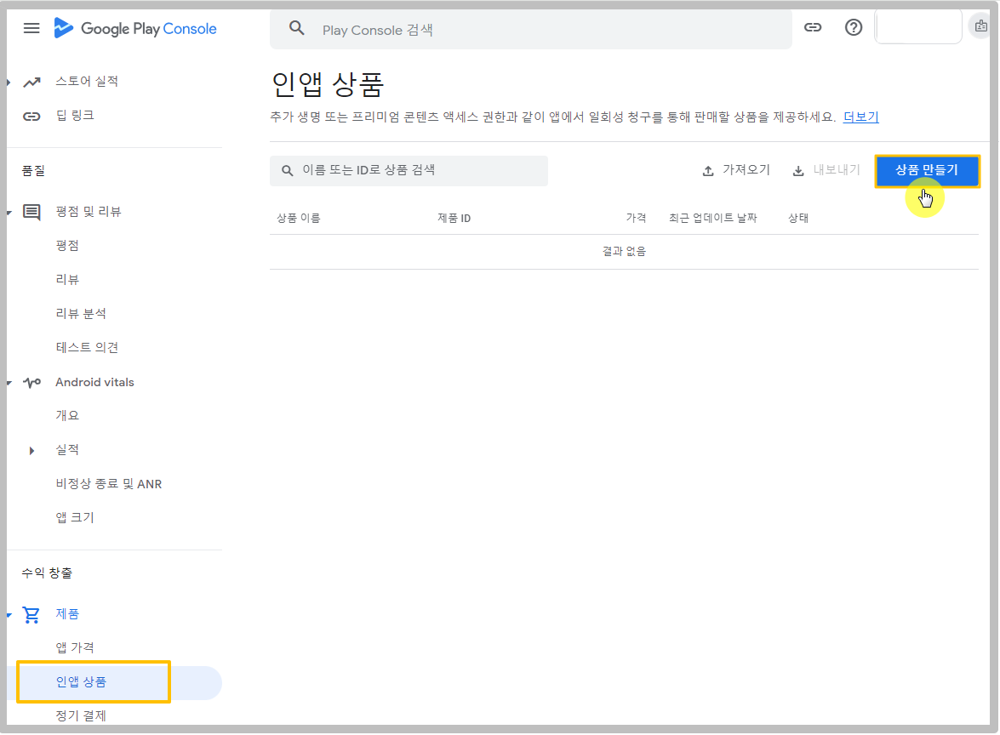
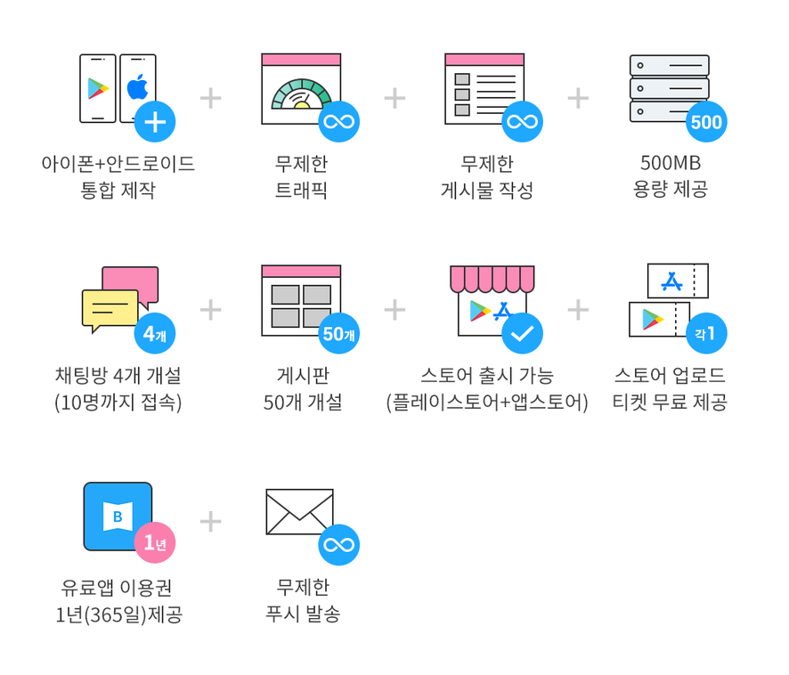
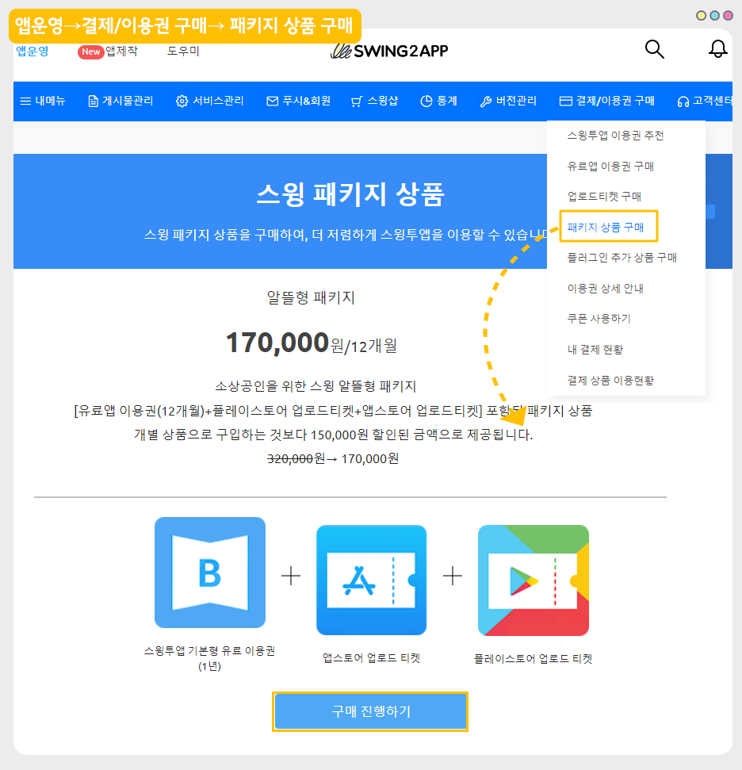
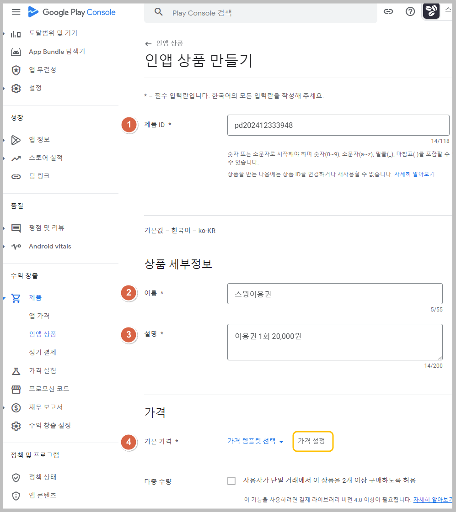

# 알뜰형 패키지(12개월)

&#x20;

***

##  **01. 스윙투앱 알뜰형 패키지 상품이란?**

<figure><figcaption></figcaption></figure>

스윙 알뜰형 패키지 상품은, 스윙 이용권 패키지 상품이구요.

**\[유료앱 1년(12개월) 이용권+플레이스토어 업로드 티켓+앱스토어 업로드티켓]**을 제공합니다.

기본 유료앱 이용권을 월단위로 이용해서 결제하는 것보다 약 50% 할인된 금액으로 이용이 가능합니다.

※월 단위로 이용권 1년 사용하실 경우 320,000원 → 알뜰형 패키지 상품 이용시 170,000원입니다.

따라서 보다 저렴하고! 실속있게! 사용할 수 있는 패키지상품입니다.

#### <mark style="color:blue;">**제공 서비스**</mark>

<figure><figcaption></figcaption></figure>

1\)무료로 제작된 앱을유료버전으로 전환하는 이용권이며 패키지 상품입니다.

2\)스윙투앱에서 제작한 앱을 플레이스토어, 앱스토어 등의스토어에 올려서 배포할 경우 이용권을 필수 구매해야 합니다.(유료버전 전환)

3\)유료앱 이용권 구매는 구매 즉시 이용일이 적용되기 때문에 최종 앱 제작 후 결제해서 사용해주시기 바랍니다.

4\)알뜰형 패키지 상품은 일반 프로토타입- 탑, 푸터, 슬라이드, 드롭다운 리스트&박스로 제작한 앱에서만 구매할 수 있습니다.

\*푸시버전, 웹뷰버전으로 제작한 앱은 구매할 수 없습니다.

5\)알뜰형 패키지 상품 구매시, 플레이스토어 업로드 티켓(1개)+앱스토어 업로드티켓(1개)이 무료로 제공됩니다.

***

##  **02.알뜰형 패키지 이용방법**&#x20;

<figure><figcaption></figcaption></figure>

1\)앱제작이 완료되면 [앱운영→ 결제/이용권 구매 페이지 → 패키지 상품 구매](https://www.swing2app.co.kr/view/new\_product\_list\_by\_package) 페이지로 이동해서 \[스윙 알뜰형 패키지 상품]을 구매해주세요.​

<mark style="color:red;">\*패키지 상품 구매는 일반 프로토타입(탑,푸터,슬라이드,드롭다운)으로 제작한 앱만 신청 가능 \*푸시, 웹뷰버전앱은 구매가 불가합니다.</mark>

<mark style="color:red;">\*이용권은 구매 즉시 이용일수가 카운팅 되기 때문에 앱을 다 제작해놓고, 테스트도 다 해보신 다음 최종 결제해주셔야 합니다.</mark>

\*상품 구매를 선택하면 이용에 관련된 상세 내용을 확인할 수 있어요.

결제 전 반드시 내용을 확인한 뒤에 구매하기를 진행해주세요.

2\)패키지 상품 구매 수량을 체크하여 원하는 이용기간을 설정하여 구매할 수 있습니다.

예)구매수량1개 = 1년 이용, 구매수량 2개=2년 이용

3\)이용권 구매시 구매 즉시 이용일수가 카운팅되며, 1년 이용권으로 12개월(365일)동안 앱을 유료버전으로 이용할 수 있습니다.

\*1년 뒤 재구매가 필요하며 동일 상품으로 구매하거나, 기본형 이용권 등 단품 상품을 구매하여 연장 가능합니다.

4\)구매시 앱이 유료버전으로 전환되며, 해당 앱을 플레이스토어/앱스토어에 등록하여 출시할 수 있습니다.

5\)알뜰형 패키지 상품 구매시 함께 받은 티켓(플레이스토어, 앱스토어)으로 업로드 신청을 해주시면 당사에서 대행해서 스토어에 앱을 출시해드립니다.

#### **\[업로드 신청 방법]**

\*[앱운영→버전관리→앱제작이력](https://www.swing2app.co.kr/view/app\_work\_history) 메뉴로 이동한 뒤, 마켓등록란에 있는 \[플레이스토어 업로드 신청], \[앱스토어 업로드 신청] 버튼을 선택합니다.​

신청양식에 따라 내용을 기재한 뒤 업로드 신청을 해주셔야 스윙으로 업로드 신청건이 전달됩니다. (결제한 뒤 꼭 업로드 신청을 해주세요)

\*플레이스토어는 사용자분이 직접 등록이 가능하며, 앱스토어는 업로드 대행만 가능합니다.

스토어 업로드 신청까지 완료해주시면 사용자분께서 하셔야 할 것은 끝입니다\~!

스토어 진행 등의 이후 과정은 담당자가 따로 안내 메일을 드리니 확인해주시구요.

그외 스토어 등록 정책 및 이용정책은 꼭 미리 확인해주시기 바랍니다.

***

##  **03.**스윙 알뜰형 패키지 특징

<figure><figcaption></figcaption></figure>

1\)기본형 상품 월 이용료 결제의 50% 할인가격으로 제공 ~~320,000~~원 → 170,000원(부가세포함)

2\)플레이스토어 업로드 티켓(1개)+앱스토어 업로드 티켓(1개) 무료제공!

3\)앱 저장용량 500MB, 게시판 50개 개설, 채팅방 4개 개설(10명 접속)

<mark style="color:red;">\*알뜰형 패키지는 기본형 이용권에서 제공하는 기능(서비스)보다 적게 제공이 됩니다.</mark>

예시)

기본형 이용권 용량 2GB 제공 ↔ 알뜰형 패키지 용량 500MG 제공

기본형 이용권 게시판 제작 수 100개 제공 ↔ 알뜰형 패키지 게시판 제작 수 50개 제공

4\)무제한 트래픽

5\)무제한 푸시 발송

6\)스윙투앱에서 제공하는앱제작및앱운영기능 모두 이용 가능

7\)기술적 장애 즉시 대응

***

##  **04. 알뜰형 패키지 이용 안내 및 주의사항**  &#x20;

**\*앱을 유료버전으로 전환하는 이용권이며 패키지 상품으로, 단품으로 구매하는 것보다 저렴하게 이용할 수 있습니다.**

1\) 무료로 제작된 앱을 유료버전으로 전환하는 이용권(패키지 상품)이며 플레이스토어, 앱스토어 등 마켓에 상용화 할 경우 구매합니다.

2\) 알뜰형 패키지는 \[스윙 1년(365일)유료이용권+앱스토어 업로드티켓+플레이스토어 업로드티켓]이 포함된 패키지 상품입니다.&#x20;

기본형 월 이용상품으로 구입하는 것보다 약50% 할인된 금액으로 제공됩니다. ~~320,000원~~ → 170,000원

3\) 상품 구매 즉시 이용일수가 카운팅되기 때문에, 최종 앱 제작 후 결제해서 사용해주시기 바랍니다.

**1년 이후 계속 앱을 사용하실 경우  유료앱 이용권 재구매가 필요한 상품입니다.**

4\) 이용권 구매시 앱이 유료버전으로 전환되며, 유료버전 앱을 플레이스토어/앱스토어에 등록하여 출시할 수 있습니다.

5\) 패키지 상품 구매시 함께 받은 티켓(플레이스토어, 앱스토어)으로 스토어 업로드 신청을 해주시면 당사에서 대행해서 스토어에 앱을 출시해드립니다.

\*플레이스토어는 사용자가 직접 출시도 가능하며, 앱스토어는 업로드 대행만 가능합니다.

6\) 알뜰형 패키지 상품에는 **앱 저장용량 => 500MB용량이 제공**됩니다.

용량이 초과가 되면 남은 앱 이용 일수와는 상관없이 앱 이용이 정지되오니 이용용량을 항상 확인해주시기 바랍니다.

용량이 초과되기 전에 용량추가 상품을 구매하거나, [앱운영 → 서비스관리 →리소스관리](https://www.swing2app.co.kr/view/storage\_manager) 에서 용량을 확보해주시기 바랍니다.

7\) 이용권은 하루라도 이용일수가 지난 경우 환불이 불가하며, 남은 일수를 환불해드리지 않으며, 이용을 보류해드리지 않습니다.

따라서 신중히 고려하여 구매해주시기 바랍니다.&#x20;

8\) 구매한 이용권은 스윙 [앱운영페이지→ 결제 → 내결제현황](https://www.swing2app.co.kr/view/payment\_list) 페이지에서 구매한 내역 및 이용기간을 확인할 수 있습니다.

9\)유료이용이 끝나기 전 다시 이용권을 재구매 하지 않으시면 유료버전은 종료되며 앱이용이 정지됩니다.

이용기간이 만료되기 전 다시 이용권을 구매하여야 이용기간이 연장됩니다.&#x20;

(자동결제가 아니기 때문에 이용기간 날짜를 정확히 확인하여 결제해주세요.)

10\)유료 이용(유료버전)을 종료할 경우 다시 무료버전으로 사용할 수 있습니다.

앱제작 페이지에서 \[앱제작하기] 버튼을 선택해서 새 버전으로 제작해주세요.

그럼 앱이 무료버전으로 재제작되며, 무료버전으로 이용이 가능합니다.

<mark style="color:purple;">\*무료버전 전환시 개인적인 용도로만 사용가능하므로, 스토어에 출시된 앱은 사용이 불가능합니다.</mark>

<mark style="color:purple;">\*무료버전 앱 용량은 100mb 제공됩니다.</mark>&#x20;

11\)유료앱 이용기간 만료일 7일전부터 사용자의 메일과 문자메시지로 만료일에 대한 공지 안내를 드립니다.

이메일은 스윙에 가입된 메일로 보내드리며, 전화번호는 별도 수집을 하지 않기 때문에 연락처가 없는 사용자는 문자메시지 발송이 안됩니다.

12\) 알뜰형 패키지 상품 및 모든 유료 상품은 앱 하나에 이용권 하나가 적용됩니다.

예를들어, 3개의 앱에 이용권을 적용하고자 할 때는 각 앱별로 이용권 구매를 별도로 해주셔야 합니다.

13\)알뜰형패키지 상품은 일반 프로토타입- 탑, 푸터, 슬라이드, 드롭다운 리스트&박스로 제작한 앱에서만 구매할 수 있습니다.&#x20;

<mark style="color:purple;">\*푸시버전,웹뷰버전으로 제작한 앱은 구매할 수 없습니다.</mark>&#x20;

14\)플레이스토어 업로드를 위해서는 반드시 사용자 분의 구글 개발자 계정(등록비 25$)을 미리 만들어주셔야 합니다. [\[상품 상세 내용 보기\]](http://www.swing2app.co.kr/view/swing\_notice\_detail?notice\_id=380\&notice\_type=paymentNotice)&#x20;

앱스토어는 사용자의 개발자 계정으로 등록하거나 or 당사 스윙투앱 회사 계정으로 대리등록 중 선택하여 등록 가능합니다. [\[상품 상세 내용 보기\]](http://www.swing2app.co.kr/view/swing\_notice\_detail?notice\_id=381\&notice\_type=paymentNotice)&#x20;

각 업로드 티켓별 상세 내용은 구매페이지에서 확인해주시기 바랍니다. &#x20;
