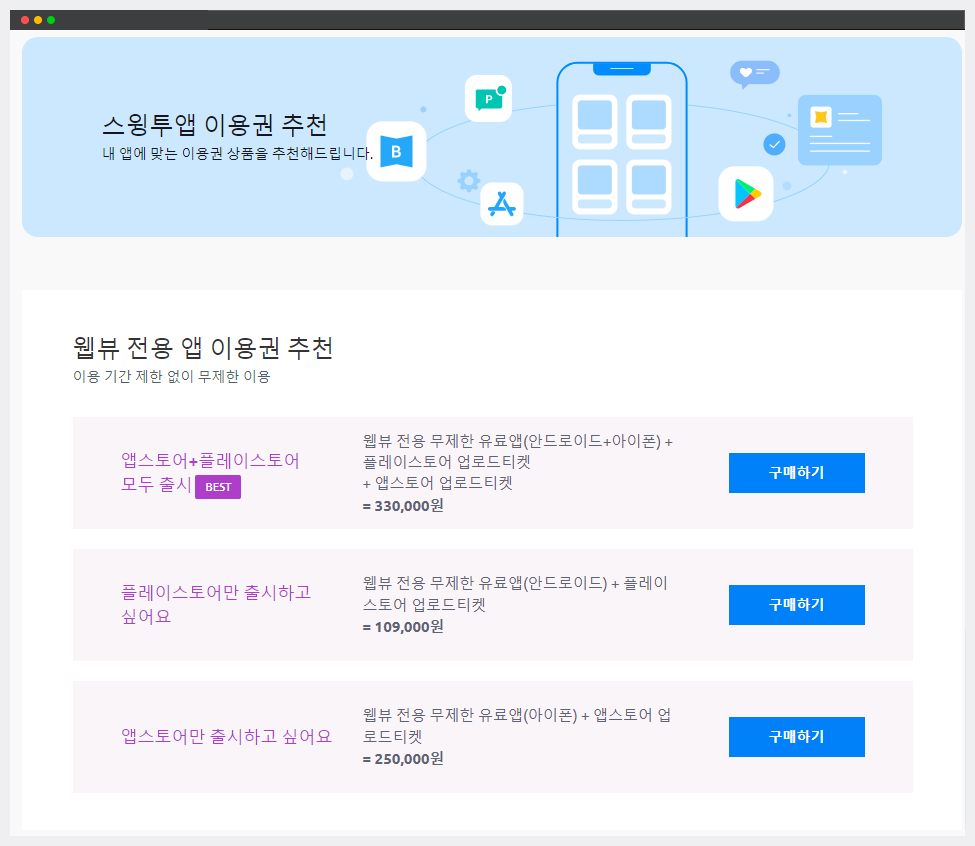

# 웹뷰 무제한 유료앱

<figure><figcaption></figcaption></figure>

**웹뷰 무제한 유료앱이란?**

1\) 웹뷰무제한 유료앱은 **스윙 프로토타입- 웹뷰 스타일로 제작된 앱에 한해서 이용이 가능**합니다.

2\) 앱에 웹사이트를 그대로 옮겨서 제작하는 웹앱 스타일로, 모바일웹과 구현 화면이 동일합니다.&#x20;

3\) **매월 비용을 내지 않아도 무제한(기간 제한X)으로 앱을 이용할 수 있습니다.**

4\) 아이폰+안드로이드 통합적용이 가능하며,  원하는 플랫폼만 따로 이용하실 경우 **웹뷰 무제한 유료앱 ‘안드로이드’ 혹은 ‘아이폰’** 상품으로 구매할 수 있습니다.&#x20;

5\) 플레이스토어, 앱스토어에 앱을 출시할 수 있습니다.&#x20;

**매월 내야 하는 유료앱 이용료 비용이 부담이 되는 경우, 오랜 기간 앱을 이용해야 할 때 부담없이 앱을 무제한으로 사용할 수 있습니다.**&#x20;

**프로토타입 : 웹뷰 란?**

스윙에서는 여러 스타일의 UI디자인 – 프로토타입을 제공하고 있는데요.

이 중에서 ‘웹뷰’ 전용은 다른 제작 기능 없이 사용자의 홈페이지 URL만 입력해주시면 앱에 그대로 연동되어서 제작이 됩니다.

쇼핑몰을 운영중인데 어플을 그대로 만들고 싶을 경우 정말 간단하게 제작할 수 있어요\~!!

**따라서 스윙에서 제공하는 웹뷰 무제한 이용 플러그인 상품은 웹뷰로 앱을 제작한 사용자가 이용할 수 있구요.**&#x20;

**매 월 내야 하는 유료앱 이용료 비용이 부담이 되는 경우, 오랜 기간 앱을 이용해야 할 때 부담없이 앱을 무제한으로 사용할 수 있습니다.** \

<figure><figcaption></figcaption></figure>

## ​ (1) (1).png>)**STEP1. 웹뷰앱 제작방법**

<figure><figcaption></figcaption></figure>

제작요청을 하면 10분 내로 웹뷰앱이 제작됩니다.

제작 완료된 앱은 스윙투앱 앱 미리보기를 이용하거나 메일로 발송된 APK파일을 안드로이드 폰에서 다운받아 확인할 수 있어요.

<mark style="color:orange;">\*웹뷰, 푸시로 제작된 앱은 안드로이드폰에서만 확인 가능합니다.</mark>&#x20;

<mark style="color:orange;">(아이폰은 웹뷰버전 앱 확인할 수 없습니다.)</mark>

[**제작한 앱을 설치하여 안드로이드폰으로 다운받는 방법**](https://documentation.swing2app.co.kr/manual/appoperation/appinstall)

&#x20;<mark style="color:blue;">**웹뷰앱 특징**</mark>

-웹뷰로 앱 제작시 웹링크 URL주소만 넣으면 앱을 제작할 수 있어요.

-웹링크만 이용하는 스타일이기 때문에 스윙에서 제공하는 다른 메뉴들은 사용할 수 없어요.(푸시 알림, 게시판 등 모든 메뉴 사용 안되요)

-푸시 알림을 보내고 싶다면 프로토타입: 푸시 전용을 선택하여야 합니다.&#x20;

<figure><figcaption></figcaption></figure>

## ​ (1) (1).png>)**STEP**2. 웹뷰 무제한 유료앱 구매 및 이용방법

위에서 알려드린 방법으로 웹뷰 프로토타입 앱제작을 완료 한다음! 구매 페이지로 이동할게요.&#x20;

<figure><figcaption></figcaption></figure>

**1) 구매 상품 안내**

[앱운영 →결제/이용권 구매 → 스윙투앱 이용권 추천 페이지](http://www.swing2app.co.kr/view/payment_list_by_recommend_voucher)로 이동해주세요&#x20;

**웹뷰 무제한 유료앱 +플레이스토어 업로드티켓 (20,000원) +앱스토어 업로드 티켓 (20,000원)**

웹뷰앱으로 이용기간 제한 없이 계속 이용하길 원하시면, ‘웹뷰무제한 유료앱’ 상품을 구매할 수 있습니다.


<mark style="color:green;">**웹뷰 무제한 플러그인 상품은 총 3가지로 운영할 플랫폼에 따라 구매가 가능합니다.**</mark>

-앱스토어, 플레이스토어 모두 출시할 예정이라면 → 웹뷰 무제한 통합(아이폰+안드로이드) 상품을 구매해주시구요.

-앱스토어만 출시한다면 → 웹뷰 무제한 플러그인(아이폰) 구매

-플레이스토어만 출시한다면 → 웹뷰 무제한 플러그인(안드로이드) 구매&#x20;


2\)상품을 결정하셨다면! \[구매하기] 버튼을 누르면 구매 상세 페이지로 이동합니다.

<mark style="color:red;">상품 구매를 선택하면 이용에 관련된 상세 내용을 확인할 수 있어요,  결제 전 반드시 내용을 확인한 뒤에 구매하기를 진행해주세요.</mark>

3\) 구매가 완료되면 개발팀에서 웹뷰 무제한 유료앱을 적용한 내용으로 사용자의 앱을 새 버전으로 다시 제작해드립니다.&#x20;

**1시간\~2시간 이내로 개발팀에서 별도로 처리 후 메일드립니다. (바로 적용되지 않아요!)**

4\) 완료 메일을 받은 뒤 웹뷰 무제한이 적용된 새 버전의 앱을 플레이스토어, 앱스토어에 등록할 수 있습니다.&#x20;

\*앱은 사용자분께서 직접 다운받아 테스트 해주세요. 문제가 있을 경우 피드백 주시기 바랍니다.

\*기존 앱이 출시된 사용자는 스토어에 다시 업데이트하여 재출시 해야 합니다.

<figure><figcaption></figcaption></figure>

## ​ (1) (1).png>)**STEP3**. 스토어 업로드 신청

플레이스토어, 앱스토어 등 출시를 원하는 스토어에 업로드 신청을 해주세요.

&#x20;[**\*앱운영- 버전관리- 앱제작 이력 페이지**](http://www.swing2app.co.kr/view/app_work_history)에서

\[플레이스토어 업로드 신청] or \[앱스토어 업로드 신청]  버튼을 눌러서 신청서 작성하시면 접수 됩니다.&#x20;

업로드티켓이 없을 경우, [결제/이용권  구매 - 업로드티켓구매](http://www.swing2app.co.kr/view/new_product_list_by_publish_service) 페이지에서 업로드 티켓 구매 후 신청해주세요.&#x20;

**\*플레이스토어는 직접 등록이 가능할 경우 업로드 티켓 구매하실 필요 없으며, 해당 버전앱을 직접 출시해주시면 됩니다.**

**\*앱스토어는 직접 업로드 불가하며, 스윙 대행으로만 업로드 출시 가능합니다.**


<mark style="color:orange;">**스토어 업로드 관련 주의사항**</mark>

1\)웹뷰전용 무제한 유료앱 패키지 상품(33만원)구매시 업로드티켓이 모두 제공됩니다.&#x20;

2\)무제한 이용권 단품(30만원)만 구매시에는 스토어 업로드 티켓이 포함되어 있지 않습니다.&#x20;

\[플레이스토어 업로드 티켓(20,000원), 앱스토어 업로드 티켓(20,000원)]을 별도 구매해서,&#x20;

업로드 신청을 할 수 있습니다.&#x20;

[\[플레이스토어 업로 티켓 구매하기\]](http://www.swing2app.co.kr/view/order_info_action?product_id=4) ,  [\[앱스토어 업로드티켓 구매하기\]](http://www.swing2app.co.kr/view/order_info_action?product_id=3)

3\)플레이스토어 업로드를 위해서는 반드시 사용자 분의 구글 개발자 계정(등록비 25$)을 미리 만들어주셔야 합니다. [\[상품 상세 내용 보기\]](http://www.swing2app.co.kr/view/order_info_action?product_id=4)&#x20;

4\)앱스토어는 개발자 계정을 만들거나 당사 스윙투앱 회사 계정인 휴스테이로 대리등록이 가능합니다. [\[상품 상세 내용 보기\]](http://www.swing2app.co.kr/view/order_info_action?product_id=3)&#x20;

\*각 업로드 티켓별 상세 내용은 구매페이지에서 확인해주시기 바랍니다. &#x20;


<figure><figcaption></figcaption></figure>

## &#x20;​ (1) (1).png>)**STEP4**. 웹뷰 무제한 유료앱 이용시 주의사항

1\) 웹뷰 무제한 이용 중, 앱에 적용된 웹링크 주소를 변경해야 할 경우는 앱 업데이트가 필요합니다.&#x20;

앱제작→ 페이지 메뉴 단계→ 웹링크 주소 수정 후 \[저장], \[앱제작하기] 버튼 선택 후 새로 제작된 버전 앱으로 플레이스토어, 앱스토어 등에도 업데이트 해주셔야 합니다. &#x20;

2\) 웹뷰 무제한 상품은 앱 셋팅을 위해 당사에서 새 버전으로 앱을 업데이트 해드립니다.

따라서 기존에 앱이 출시된 사용자는 스토어에 웹뷰 무제한이 적용된 앱 버전으로 업데이트 해주셔야 합니다.

다시 업데이트해야 기존 사용자들이 업데이트를 받아 이용할 수 있으며, 신규 사용자 역시 웹뷰무제한이 적용된 앱으로 이용할 수 있습니다.

(업데이트는 선택사항이 아닌 필수입니다.)

3\) 웹뷰 무제한 유료앱은 스토어 업로드 티켓이 포함되어 있지 않습니다.

스토어 신규 출시 or 업데이트 할 경우 플레이스토어/앱스토어 업로드 티켓 구매 후 업로드 신청주시기 바랍니다.&#x20;

4\) 웹뷰 무제한 유료앱이 적용된 앱을 이용하다가 앱 이름, 아이콘 이미지, 대기화면 이미지 등을 변경하고 싶다면??

1단계 앱 기본정보를 변경하실 경우 \[앱제작하기] 버튼을 선택해서 새 버전으로 업데이트 해주세요.

플레이스토어, 앱스토어 등에 출시된 앱도 새 버전으로 다시 업데이트 해주셔야 합니다.&#x20;

(플레이스토어는 직접 업데이트 가능, 앱스토어는 업로드티켓 구매후 재신청)

5\) 웹뷰 무제한 이용중에는 프로토타입 변경이 불가합니다.

웹뷰 버전으로만 이용가능하며, 푸시 앱으로는 변경이 불가하오니 신중히 고려해서 구매해주시기 바랍니다. &#x20;

6\) 기존에 스윙 유료앱 이용권을 구매하여 이용하다가, 웹뷰 무제한 유료앱을 결제하더라도 남은 기간에 대한 분할 환불은 이루어지지 않습니다.

예) 총 이용 일수 30일 중에서 10일만 사용하여 20일이 남아 있어도, 해당 일수에 대한 차액 환불은 진행되지 않습니다.

따라서 웹뷰 앱 제작 후 바로 웹뷰 무제한 티켓을 구매하여 이용하시길 권장드리며, 유료앱 이용권을 먼저 구매했다면, 이용일을 다 사용하신 뒤 웹뷰 무제한 티켓을 구매하시길 바랍니다.

7\) 다른 업체에서 만든 앱을 스윙투앱 웹뷰 버전으로 전환(=앱 이전)하길 원하시면, 구매 전 반드시 문의 주시기 바랍니다.&#x20;

앱 이전에 필요한 정보에 대해 안내드립니다.&#x20;

<figure><figcaption></figcaption></figure>

## ​ (1) (1).png>)**STEP5**. 환불안내

* 사용하지 않은 이용권은 환불신청이 가능하며, 전액 환불 가능합니다.  [\[내 결제 현황\]](http://www.swing2app.co.kr/view/payment_list) 환불 신청 가능
* **무제한 셋팅 작업이 완료되면 환불이 불가합니다.** 취소 및 환불은 상품 적용 전  [문의게시판](http://www.swing2app.co.kr/view/service_qa) 혹은 [채팅 상담](https://direct.lc.chat/12036120/)으로 문의주시기 바랍니다.
* 구매한 이용권은 다른 앱으로 옮길 수 없습니다.
* 구매일 기준 30일 이후에는 어떤 경우라도 환불이 불가합니다.



\[제2장 서비스의 이용] 제10조 (이용권 및 상품 환불에 대한 규정)
