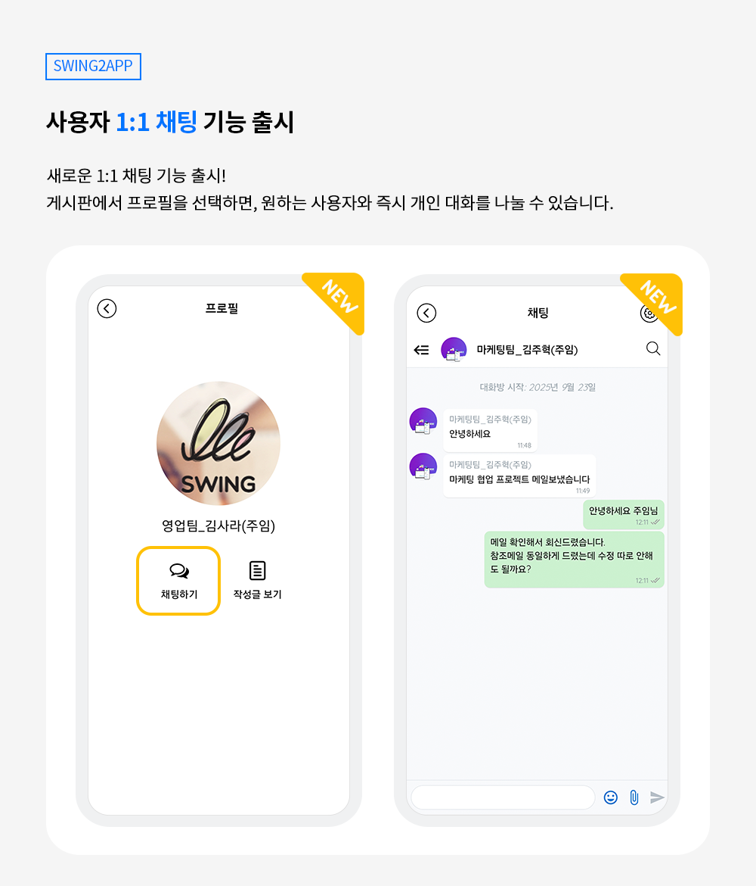
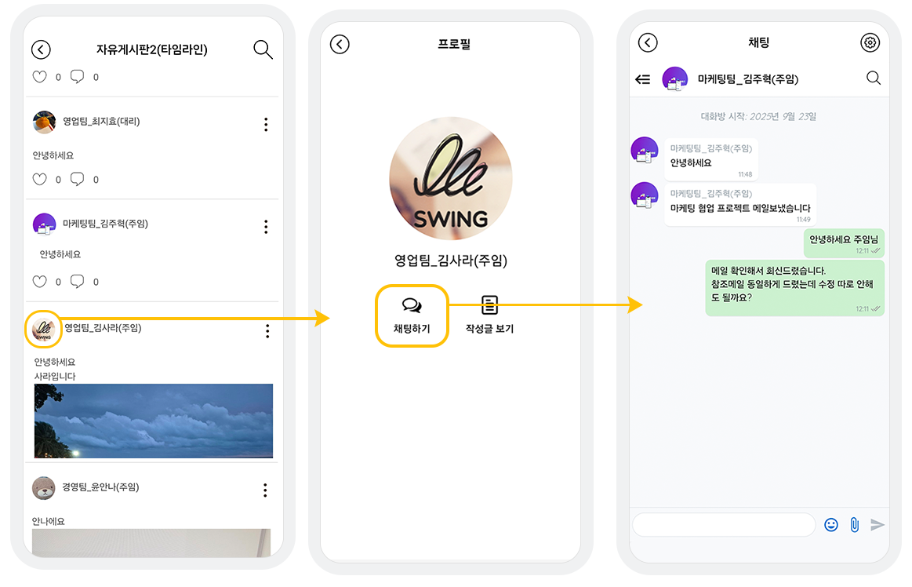
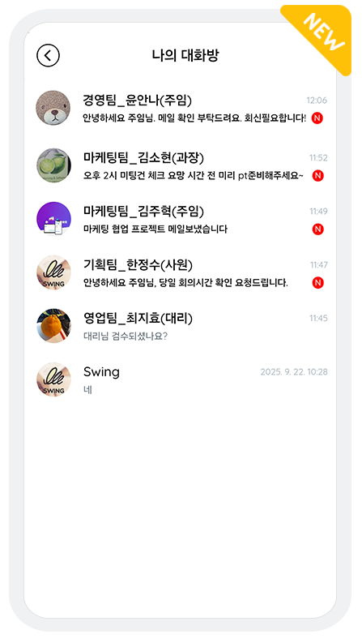

# 1:1 사용자 채팅

***

#### ✅사용자 1:1 채팅

<figure><figcaption></figcaption></figure>

사용자 1:1 채팅 기능은 _**스윙투앱 프리미엄 이용권 사용자**_ 에게 제공되는 기능입니다.

(무료버전 앱 / 기본형 / 확장형 / 알뜰형 패키지에서는 이용할 수 없습니다.)

채팅은 게시판에서 제공하고 있구요.

게시판에서 원하는 사용자의 프로필을 선택하면 즉시 1:1 채팅을 시작할 수 있어,

커뮤니티 운영이나 고객 상담 기능이 필요한 앱에 유용하게 활용할 수 있습니다.

***

## 1. 1:1 채팅 이용방법

| 
<strong>📢안내사항</strong>

1:1 채팅 기능은 25년 9월 19일 신규 출시된 기능입니다.

앱이 해당 일자 전에 만들어졌다면 앱 업데이트를 먼저 진행해주세요. (새 버전에서 확인 요청)

이후 제작된 앱은 업데이트 없이 바로 이용 가능합니다.
 |
| ------------------------------------------------------------------------------------------------------------------------------------------------------------------------ |

<figure><figcaption></figcaption></figure>

**1)게시판에서 사용자 프로필 선택**

게시판 – 게시물에서 사용자 프로필 이미지를 탭 합니다.

✔게시판을 만들고 앱에 적용하는 방법은 아래 가이드를 통해 확인해주세요



**2)프로필 화면에서 ‘채팅하기’ 버튼 선택**

프로필 화면에서 – '채팅하기' 버튼을 탭 합니다.

\[작성글 보기] 선택시 \*채팅하기 외에도 사용자가 작성한 글도 확인 가능합니다.

**3)채팅창 진입**

채팅창이 열리며, 해당 사용자와 1:1 대화를 시작할 수 있습니다.

**4)나의 대화방에서 채팅 기록 확인**

그리고 채팅을 한 내역은 나의 대화방에서 확인 할 수 있습니다.

<figure><figcaption></figcaption></figure>



***

#### **🔎나의 대화방이란?**

사용자들과 주고받은 1:1 채팅 및 그룹 채팅 기록을 확인할 수 있는 페이지입니다.

향후 다시 채팅을 이어갈 때 편리하게 사용할 수 있습니다.

## **2. 나의 대화방 적용 방법**

<figure><figcaption></figcaption></figure>

앱제작 페이지 - STEP3 화면

1\)메뉴 생성\[+] 선택

2\)메뉴이름 입력

3\)페이지 디자인: 기본 기능 선택

4\)페이지 선택

5\)나의 대화방 페이지 “적용하기“ 선택

6\)저장 버튼 선택

저장 후 앱을 실행하시면 나의 대화방 메뉴 확인 가능합니다.

***

## **3. 최종 안내사항 정리**

**1) 업데이트 적용 기준**

* 2025년 9월 19일 이후 제작된 앱 → 즉시 사용 가능
* 2025년 9월 19일 이전 앱 → 업데이트 필요

스토어에 출시된 앱은 각각의 스토어에도 업데이트 제출이 필요합니다.

**2) 지원되는 앱 종류**

일반 UI 프로토타입 앱에서만 이용 가능

**3) 이용권 안내**

* 프리미엄 이용권에서만 제공되는 기능
* 기본형·확장형·알뜰형·무료버전에서는 이용이 불가능합니다.

**4)프리미엄 이용권 전환 가능**

Q.현재 기본형 혹은 확장형 이용권 사용중인데 프리미엄 이용권으로 전환하고 싶습니다. 변경 가능한가요?

이용권은 업그레이드해서 구매 가능합니다. (프리미엄 전환 가능)

그러나 현재 사용중인 이용권 이용기간이 모두 소진되어야 프리미엄 이용권으로 전환이 가능합니다.

만약, 바로 이용권 업그레이드를 원하면

남은 기간 동안 만큼의 차액 금액을 저희가 계산하여 변경해드릴 수 있으니 필요하실 경우 스윙투앱 고객센터로 문의주세요.

[실시간 채팅](https://direct.lc.chat/12036120)   |  고객센터 메일: help@swing2app.co.kr   |   [문의게시판](https://www.swing2app.co.kr/view/service_qa)

