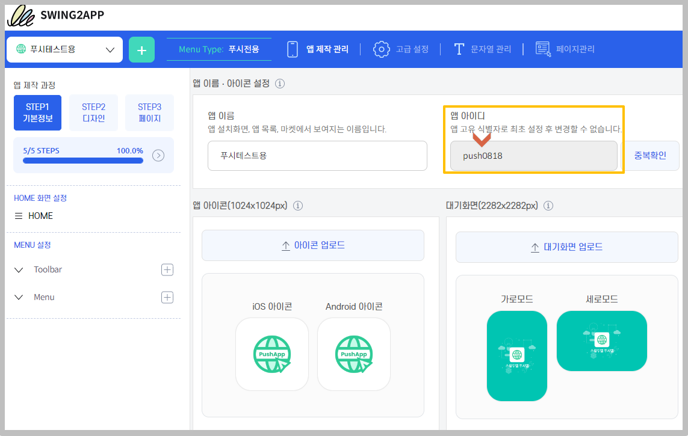

# 회원조회 - 부관리자 설정 및 로그인 방법

<figure><figcaption></figcaption></figure>

관리자 외에 다른 회원을 **부관리자로 설정하여 권한을 변경하는 방법**을 알려드릴게요.\
\
 **부관리자란?**

부관리자는 **관리자와 같은 권한을 갖는 사용자로 관리자가 특정회원을 선택하여 관리자 권한을 부여할 수 있어요.**

앱을 최초로 만든 관리자 외에  **앱을 관리할 수 있는 있는 관리자를 여러명 설정할 수 있구요. (제한 없어용!!)**

관리자로 설정된 회원을 부관리자로 통칭합니다.

<mark style="color:red;">\*부관리자라는 명칭이 있는 것이 아니라서 부관리자로 설정된 회원들은 모두 관리자로 보여집니다.</mark>

<mark style="color:red;">\[앱을 개발한 사용자: 관리자]로 통칭하며, 관리자가 권한을 부여한 사용자를 부관리자로 통칭하기 때문에 편의상 부관리자로 부릅니다.</mark>

매뉴얼을 통해서 앱 부관리자를 설정하는 방법과 스윙 웹, 앱에서 부관리자로 로그인하는 방법을 알려드릴게요.

<figure><figcaption></figcaption></figure>

<mark style="color:blue;">**부관리자 설정 방법은 영상을 통해서도 확인할 수 있습니다!!**</mark>



<figure><figcaption></figcaption></figure>

## <mark style="color:blue;"></mark> <mark style="color:blue;">****</mark> STEP1. 앱 회원가입 진행

 **부관리자로 지정을 하기 위해서는 앱에서 회원가입이 되어 있어야 해요!**

부관리자로 지정할 회원이 있어야 하겠죠?

앱 실행 후 회원가입을 진행해주시구요.

가입된 사용자 계정을 확인하여 아래에서, 해당 사용자를 관리자 그룹으로 변경해주시면 됩니다.

<figure><figcaption></figcaption></figure>

## <mark style="color:blue;"></mark> <mark style="color:blue;">****</mark> STEP2. 관리자 그룹변경

**스윙 홈페이지 접속 후,** [**앱운영 → 푸시&회원 → 회원조회**](http://www.swing2app.co.kr/view/member\_list) **메뉴로 이동합니다.**

****

회원조회 페이지에서 **사용자인  ‘윈디’ 회원을 선택해서 그룹을→관리자로 변경**해볼게요.

1\)윈디 회원을 마우스로 선택하면 회원정보 창이 뜹니다.

2\) 그룹 정보를 **‘사용자’에서 → ‘관리자’**로 설정합니다.

3\) \[그룹변경하기] 버튼을 선택하면 완료됩니다.

저장이 완료되면 앞서 보셨던 사용자 **윈디 회원이 ‘관리자’ 그룹으로 변경** 된 것을 확인할 수 있어요! ****&#x20;

<figure><figcaption></figcaption></figure>

## <mark style="color:blue;"></mark> <mark style="color:blue;">****</mark> STEP3. 부관리자 로그인 방법

### <mark style="color:blue;">**1.홈페이지 부관리자 로그인**</mark>

먼저 [\[스윙투앱 홈페이지\]](http://www.swing2app.co.kr) 접속하여 부관리자로 로그인해볼게요.

홈페이지 접속 후 – 로그인 화면에서&#x20;

**1) \[부관리자]를 선택해주세요.**

**2) 앱아이디: 관리자가 앱을 제작할 때 설정한 아이디를 입력합니다.**

<mark style="color:red;">→ 앱 아이디란? 관리자가  스윙투앱 웹사이트에서 앱을 제작할 때 앱기본정보에서 입력한 아이디를 말합니다.</mark>&#x20;

&#x20;어떤 아이디를 기재하는 것인지 아래에서 설명해드릴게요.

**3)부관리자 아이디: 부관리자가 앱에서 회원가입한 아이디를 입력합니다.**

**4)비밀번호: 부관리자가 앱 회원가입시 설정한 비밀번호를 입력합니다.**

**5)입력이 완료된 후 로그인 버튼을 눌러주세요.**

<mark style="color:red;">\*주의사항: 앱 제작이 완료되어야 부관리자 로그인이 가능합니다.</mark>

<mark style="color:red;">앱을 제작한 상태가 아닐 경우 앱 아이디가 인식이 되지 않아요, 따라서 앱을 제작해놓은 뒤 부관리자 로그인을 이용해주시기 바랍니다.</mark>&#x20;

<mark style="color:red;"></mark>

 **앱 아이디는 어디서 확인할 수 있나요?**

앱 아이디는 **앱제작 - 1단계 앱기본정보**에서 입력한 앱 아이디 입니다.&#x20;

**-앱제작 V3 버전 이용시 확인**

<figure><figcaption></figcaption></figure>

**-앱제작 V2 버전 이용시 확인**

부관리자에게는 관리자가 앱제작에서 설정한 **앱 아이디**를 알려주셔야 로그인이 가능합니다.

로그인 하시면,  부관리자로 지정된 윈디 회원으로 로그인이 된 것을 확인할 수 있습니다.

윈디 부관리자는 이제 관리자가 제작한 앱을 함께 운영할 수 있어요.

### <mark style="color:blue;">**2.앱에서 부관리자로 로그인하기**</mark>&#x20;

앱에서 부관리자로 로그인하는 방법을 알려드릴게요!!

**앱 로그인은 가입하신 아이디, 비밀번호로 동일하게 로그인을 하시면 됩니다.**

(관리자로 변경된 회원은 기존과 동일하게 로그인하시면 됩니다\~)

&#x20;**등급이 관리자로 변경된 것을 확인할 수 있습니다.**

등급 변경 전에는 ‘윈디’ 회원이 사용자 등급이었구요.

변경 후에는 **등급 → 관리자로** 변경된 것을 확인할 수 있어요.

<mark style="color:blue;">**★ 관리자 등급 변경 푸시 발송**</mark>

**★ 등급 변경시에는 사용자에게 푸시 알림이 함께 발송이 됩니다.**

따라서 앱을 이용하는 회원들은 자신의 등급이 어떻게 변경되었는지 푸시알림을 통해서 미리 확인할 수 있습니다.

부관리자는 여러명을 지정해서 운영할 수 있으니, 앱의 특성에 맞게 잘 활용해서 운영해주세요 ^^

그리고 부관리자 역시 앱에서 운영하는 \[앱관리자 메뉴]를 사용할 수 있습니다.

<figure><figcaption></figcaption></figure>


**부관리자 설정 및 로그인 방법 정리**

<mark style="color:green;">****</mark>

<mark style="color:green;">**1. 부관리자 설정하기**</mark>

**1)앱에서 회원가입을 먼저 해주세요.**

가입된 사용자 계정을 확인하여 아래에서, 해당 사용자를 관리자 그룹으로 변경해주시면 됩니다.

**2) 스윙 홈페이지에서 →** [**앱운영페이지 →푸시&회원 → 회원조회**](https://www.swing2app.co.kr/view/member\_list) **페이지 이동**

**회원조회 페이지에서 관리자로 변경할 해당 회원을 선택 후 → 현재 그룹 정보의 ‘사용자’에서 → ‘관리자’로 선택한 뒤**

**\[그룹변경하기] 버튼을 선택합니다.**

변경하기를 완료하면 관리자 등급 변경 완료됩니다. \~!!

​

<mark style="color:green;">**2. 스윙투앱 홈페이지 로그인**</mark>

홈페이지 – 부관리자 로그인 페이지에서

**앱 아이디, 부관리자 아이디, 비밀번호 입력 후 로그인 하면 관리자 대시보드로 접속됩니다.**

​

<mark style="color:green;">**3. 앱 로그인**</mark>

관리자로 등급이 변경되어도 로그인은 동일합니다.

앱 가입 아이디, 비밀번호 입력하면 관리자로 로그인됩니다.


<mark style="color:green;">****</mark>
