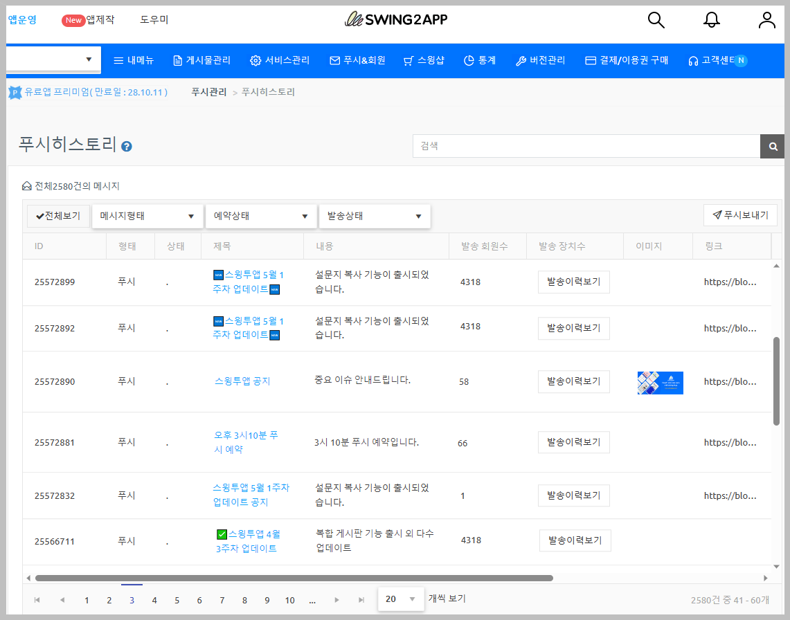

# 푸시 히스토리

**푸시 히스토리 이용하기**

푸시 히스토리는 발송된 푸시 내역을 확인할 수 있는 관리 메뉴에요.

푸시 내용, 푸시 등록일자, 발송상태, 예약상태, 발송 회원 수, 발송 장치 수 등의 정보를 확인하고 관리할 수 있습니다.

특히 ‘발송장치수’를 통해서 푸시가 실제 앱 이용자 몇 명에게 발송되었는지를 확인할 수 있어서 관리하기가 더욱 용이해요!

**푸시 발송 기록 및 상세 내역 확인 등 ‘푸시 히스토리’ 를 이용하는 방법을 확인해주세요.**

<figure><figcaption></figcaption></figure>

#### &#x20;푸시 히스토리 이동

[앱운영 페이지 → 푸시&회원 → 푸시 히스토리](http://www.swing2app.co.kr/view/push_list) 메뉴로 이동합니다.&#x20;

##  1. 푸시 히스토리

<figure><figcaption></figcaption></figure>

푸시 히스토리 페이지에는 그동안 보냈던 푸시 목록을 확인할 수 있어요.

푸시 등록일자, 발송상태, 예약상태, 발송 회원 수, 발송 장치 수(핸드폰으로 실제 발송된 수) 등의 정보를 확인하고 관리할 수 있습니다.

### <mark style="color:blue;">1)푸시 발송 수 체크</mark>

<figure><figcaption></figcaption></figure>

푸시 히스토리에서는 푸시 발송 수 통계를 확인할 수 있습니다.&#x20;

-발송 회원 수 : 푸시를 받은 해당 앱 회원 수(앱에서 회원가입한 사용자 수)를 말합니다.

-발송 장치 수 : 실제 기기로 발송된 푸시 수를 말합니다.&#x20;

### <mark style="color:blue;">**2)푸시 발송 장치수**</mark>

<figure><figcaption></figcaption></figure>

\[발송 이력보기] 버튼 선택시, 발송된 내역을 보다 정확히 확인할 수 있습니다.

-실제 발송된 장치 수: 총 발송 수, 성공 발송 수, 실패 발송 수 기재

-플랫폼별 현황: 안드로이드, IOS 플랫폼 별 발송 수 확인 가능합니다.

\*Remaining: 아직 푸시 전송이 완료되지 않은 \*발송 중 상태를 말합니다.

\*Converted: 알림을 클릭/탭한 장치 수를 말합니다.

### <mark style="color:blue;">3)안내사항</mark>

**푸시 히스토리 내역을 보시면 발송 회원 수와 발송 장치수의 숫자가 많이 다름을 볼 수 있어요.**

**그래서 간혹 통계에 무슨 문제가 있나 라고 생각할 수 있지만\~!! 굉장히 정확히 집계가 되고 있다는 증거에요.**

**물론 발송 숫자가 비슷할 수도 있지만, 발송 회원수와 발송 장치수가 많이 다르다면 아래 내용을 참고해주세요!**

**1)발송 회원수는 1,000명인데, 발송 장치수는 500개 밖에 집계가 안되요. 왜 그런가요?**

(회원수보다 발송 장치가 더 적을 경우)

\= 이 경우는 앱 사용자들이 푸시 알림을 받지 않도록 설정했기 때문이에요.

푸시 알림을 받지 않도록 설정할 경우에는 실제로 핸드폰으로 발송된 푸시가 회원수 보다 더 적게 집계가 되요.

푸시 알림을 off로 꺼놓은 경우 실제로 발송된 집계수는 적을 수 밖에 없습니다.&#x20;

따라서 앱을 사용자들 중 푸시를 받지 않음으로 설정했을 경우 그 수만큼 발송 장치수가 마이너스(누락)이 되는 것입니다.

**2)발송 회원수는 500명인데, 발송 장치수는 1,000개가 넘어요. 왜 그런가요?**

(회원수보다 발송 장치수가 더 많은 경우)

\=이 경우는 앱에 가입한 회원보다 회원가입을 하지 않은 손님이 더 많기 때문이에요.

즉, 스윙투앱에서는 회원가입을 하지 않은 손님은 회원수로 집계가 되지 않고, 손님은 무조건 1명으로 통합 집계가 되요.

즉, 실제 앱을 이용하는 사람이 1,000명이라도, 회원가입한 사람은 500명이라면 501명로 발송 회원수가 집계가 되는 것이죠. (손님은 무조건 회원수 1로 집계)

따라서 회원수보다 핸드폰으로 발송된 푸시가 더 많은 경우 회원가입된 사용자보다 앱을 이용하는 손님이 더 많아서 그렇구요.

특히, 푸시버전으로 앱을 제작한 분들은 발송회원수는 2명으로 표시가 되구요.

발송장치수는 실제 핸드폰에 발송된 푸시집계로 확인할 수 있습니다.


<mark style="color:red;">**푸시앱에서 웹사이트 회원을 연동하지 않았을 경우, 발송 회원수가 의미가 없습니다.**</mark>

**푸시로 제작한 앱에서는 회원수가 집계가 되지 않기 때문에 발송 회원수와 장치수는 차이가 납니다.**

푸시앱은 회원이 없고 모두 손님으로 집계, 손님은 1명으로 환산됩니다.

따라서 푸시앱은 발송 회원수를 보는 것은 의미가 없구요.

장치수로 얼만큼 푸시가 발송되었는지를 확인해주세요!

**다만, 웹사이트 회원연동을 통해 앱에 회원을 연동했을 경우는 발송 회원 수를 체크할 수 있습니다.**&#x20;

[**웹사이트 회원 연동 가이드**](https://documentation.swing2app.co.kr/developer/webview/user-integration)


<figure><figcaption></figcaption></figure>

##  2.푸시 복사하기

발송한 푸시 중에서 동일한 내용으로 다시 푸시를 보내야 한다면, 복제 기능을 이용할 수 있습니다.

<figure><figcaption></figcaption></figure>

푸시 히스토리 리스트 가장 오른쪽에 관리 영역에 보시면 \[복제]버튼 확인할 수 있습니다.

복제 버튼을 누르면 ‘푸시 발송하기’ 화면으로 이동하며,

기존에 작성되었던 내용(메시지 제목, 내용, 이미지, 링크 등)이 동일하게 복사되어 연동됩니다.

***

##  3.푸시 히스토리 – 내용별 필터링하여 보기

**메시지 형태, 예약 상태, 발송 상태** 등을 선택하여 푸시 목록을 필터링하여 확인할 수 있습니다.

원하는 내용을 분류해서 푸시 알림을 확인해보세요.

<figure><figcaption></figcaption></figure>

##  4.푸시 기록 삭제

발송된 푸시 기록을 삭제하고 싶다면, **\[기록삭제]** 버튼을 눌러서 삭제할 수 있어요.

<figure><figcaption></figcaption></figure>

##  5.푸시 예약 수정

<figure><figcaption></figcaption></figure>

예약 설정된 푸시에서 내용을 수정하고 싶다면 **\[예약수정]** 버튼을 선택해서 수정할 수 있어요.

**\[예약수정]** 버튼을 선택하면 푸시발송 창이 뜨구요.

기본설정이나 푸시 내용 등을 수정하여 재저장할 수 있습니다.

<figure><figcaption></figcaption></figure>

##  6.푸시 반복 취소

반복설정 된 푸시를 취소하고 싶다면, **\[반복취소]** 버튼을 선택해서 반복예약을 취소할 수 있습니다.

반복 취소 선택시, 예약설정된 푸시는 삭제됩니다.&#x20;

***

<figure><figcaption></figcaption></figure>

##  7.푸시 알림을 끄는 방법

앱을 이용하면서 푸시 알림을 받지 않고 싶을 때가 있죠!! 그럴때는 앱 푸시 알림을 꺼주시면 됩니다.

### <mark style="color:blue;">1)일반 프로토타입 앱 푸시 알림 끄기</mark>

스윙투앱에서 앱제작시 일반 프로토타입(슬라이드, 푸터, 탑, 드롭다운) 으로 제작한 앱에서는!

\*앱 실행 후 \[설정] 메뉴에서 – **푸시 알림 설정을 \[ON-OFF]**&#xB85C; 설정할 수 있습니다. &#x20;

<mark style="color:orange;">**앱 선택 - 어플리케이션 정보에서도 푸시 알림을 끌 수 있습니다.**</mark>

<figure><figcaption></figcaption></figure>

### <mark style="color:blue;">**2)푸시앱에서 알림 끄기**</mark>

&#x20;푸시전용으로 제작된 푸시앱에서는 푸시 알림을 끄는 방법이 달라요!

<mark style="color:orange;">**(1) V3버전 제작 푸시앱 (안드로이드폰 앱 실행화면)**</mark>&#x20;

<figure><figcaption></figcaption></figure>

&#x20;V3 버전에서 제작된 푸시앱은 툴바'- 설정' 페이지 상단 알림 설정에서 알림을 끌 수 있습니다.&#x20;

손으로 터치하여 알림을 꺼주시면 됩니다.&#x20;

<mark style="color:orange;">**(2) V2버전 제작 푸시앱 (안드로이드폰 앱 실행화면)**</mark>&#x20;

앱 화면 하단의 푸시 툴바에서 → 톱니바퀴 모양의 아이콘을 선택 한 뒤 → 푸시 메시지 수신 설정 체크 박스를 풀어주시면 됩니다.


&#x20;**아이폰 푸시 알림 끄기 방법**

아이폰은 설정 앱 선택→ 알림 선택→ 앱 선택→ 알림 허용 체크를 풀어주세요.&#x20;


