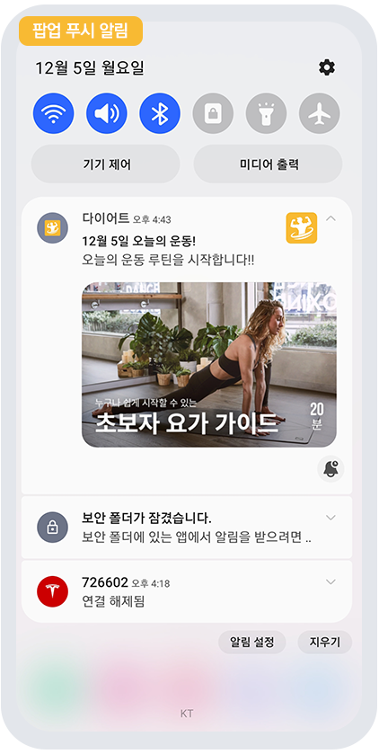
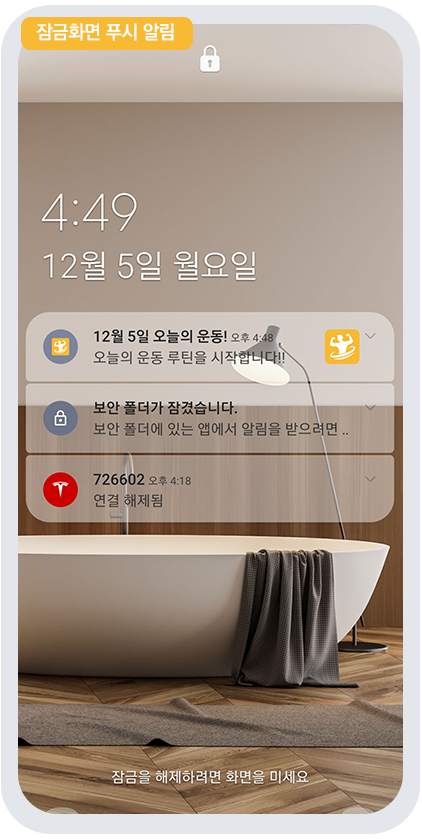
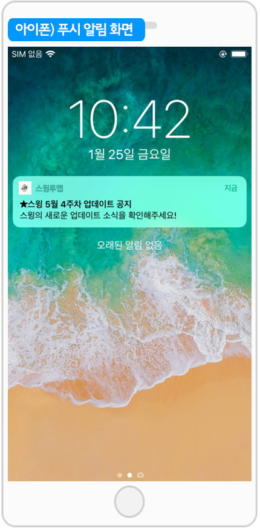

# 푸시 발송하기

<figure><figcaption></figcaption></figure>

### <mark style="color:blue;">**푸시란?**</mark>

**푸시는 앱에서 발송하는 광고성 메시지라고 보시면 쉽게 이해가 되실거에요.**

**앱을 이용하는 회원들에게 공지, 이벤트, 광고 등의 내용을 가장 쉽게 전달할 수 있는 홍보채널이구요.**

**전달하고자 하는 내용이 담긴 페이지를 연동하여 제공하기 때문에 홍보 효과가 훨씬 높습니다.**

\-푸시 역시 스윙투앱에서는 앱제작시 무료로 모두 이용할 수 있구요.

\-발송 횟수, 사용자수 제한 없이 무제한으로 이용할 수 있어요.

### <mark style="color:blue;">**발송된 푸시 확인하기**</mark>

<figure><figcaption></figcaption></figure>

 

<figure><figcaption></figcaption></figure>

안드로이드폰에 발송된 푸시 입니다.

푸시 발송시 등록한 제목, 내용, 이미지가 함께 표시 됩니다.&#x20;

<figure><figcaption></figcaption></figure>

<mark style="color:red;">\*아이폰은 푸시 이미지가 표시되지 않습니다!</mark>

푸시 스타일은 폰 기종마다 다르며,  스타일은 핸드폰마다 차이가 있는 점 참고 부탁드려요!

<figure><figcaption></figcaption></figure>

###  STEP1.푸시 발송하기

스윙 홈페이지 접속 후 [앱운영 페이지→푸시&회원→푸시발송하기](http://www.swing2app.co.kr/view/push) 페이지로 이동합니다.&#x20;

<figure><figcaption></figcaption></figure>

###  STEP2.  기본설정

푸시발송 첫 번째 메뉴는 '기본설정'입니다.&#x20;

기본설정에서 수신자 선택, 예약설정, 반복 여부를 설정할 수 있어요.&#x20;

**1. 발송 플랫폼**

전체 OS플랫폼으로 보낼 것인지, 안드로이드 /아이폰 따로 보낼 것인지 선택할 수 있습니다.

일반적으로 전체를 선택해서 보내지만 필요할 경우 각 플랫폼별로 따로 푸시 발송을 할 수도 있습니다.

​

**2. 발송 대상 선택**

1\)전체발송하기 : 앱을 이용하는 모든 사용자에게 푸시를 보낼 수 있어요.

2\)특정 회원 발송 : 특정 회원들만 선택하여 푸시를 발송할 수 있어요.

<mark style="color:blue;">**움짤 이미지를 통해서 푸시를 보낼 회원을 추가하는 방법을 확인해주세요**</mark>

**3. 예약설정**

예약설정은 푸시 발송을 원하는 날짜와 시간으로 지정해서 보낼 수 있는 기능이에요.

바로 보낼 분들은 예약설정에 체크하지 않고, 푸시보내기로 바로 넘어가구요.

예약을 설정할 분들은 체크한 뒤 아래 방법대로 설정을 완료해주세요.

1\)예약설정 후 푸시발송을 희망하는 날짜를 선택한 뒤, 시간을 선택해주세요.

2\)반복여부: 해당 푸시를 반복해서 보낸다면 반복주기-요일, 시간을 설정하구요. 반복을 원하지 않으면 체크를 풀어주세요.

3\)무제한 : 푸시 종료일자 없이 무제한으로 보낸다면 ‘무제한’으로 체크해주세요. 제한을 두고 싶다면 종료일정을 설정해주세요.

**푸시 기본설정이 완료 되었다면, 다음 단계인 \[푸시보내기]로 이동합니다.**

<figure><figcaption></figcaption></figure>

###  STEP3. 푸시 보내기

**1.푸시 메시지 제목**

제목을 입력해주세요. <mark style="color:red;">**\*필수입력**</mark>

**2. 메시지 내용**

내용은 너무 길게 입력하지 않도록 해주세요. 글자수가 많으면 짤려서 보입니다. <mark style="color:red;">**\*필수 입력**</mark>

**3. 이미지 등록**

푸시발송시 보여질 이미지를 등록해주세요 <mark style="color:red;">**\*필수가 아니라서 이미지를 넣지 않아도 됩니다.**</mark>

**-이미지는 가로 1000px, 세로 500px 권장**

**-아이폰에서는 기기 특성상 푸시 이미지가 보이지 않고, 안드로이드폰에서만 보입니다.**

**4. 링크 마법사**

링크마법사는 발송된 푸시를 터치했을때 앱에서 어디로 이동하게 할 것인지 링크를 적용할 수 있는 기능이구요.

\[링크마법사] 버튼을 선택해서 푸시 발송시 어떤 페이지로 연동을 할 것인지 적용해주세요. <mark style="color:red;">**\*아래에서 상세내용 확인해주세요.**</mark>

**5. 푸시 발송하기**

발송하기 버튼을 선택하면 발송 완료됩니다!

\

 <mark style="color:blue;">**링크 마법사란?**</mark>

**링크마법사는 웹링크(URL)뿐만 아니라 스윙에서 제공하는 다양한 기능들을 연동하여 사용할 수 있는 메뉴에요.**

웹링크에는 일반 인터넷 사이트 주소 외에 전화번호, 문자메시지, 이메일에도 연동이 됩니다.

해당 링크를 입력하면, 푸시선택시 연동된 페이지로 이동이 되요!!

​

웹링크 외에도 스윙에서 제공하는 기능 , 페이지, 게시판, 게시물 등으로도 연동이 가능해요.

게시판 선택하면 앱에 만들어놓은 게시판 중 원하는 게시판을 반영하여 이동할 수 있구요.

게시물을 검색해서, 특정 게시물에도 푸시를 반영하여 보낼 수 있습니다.

 <mark style="color:blue;">**알림 확인 후 푸시 메시지 표시란?**</mark>

옵션 기능으로 필요한 경우만 체크해서 사용할 수 있구요.

일반적으로 푸시를 터치하면 바로 연동된 링크로 이동하는 반면, 해당 기능을 설정해놓으면 메시지를 먼저 확인한 뒤 링크로 이동합니다.

**푸시 메시지를 사용자들에게 보여주길 원할 경우 이용할 수 있어요!**

​

푸시 알림을 선택하면, 메시지창이 뜨구요. \*푸시발송시 기재한 제목, 메시지 내용

\[이동하기] 버튼을 누르면 적용해놓은 해당 링크 페이지로 이동합니다.

<mark style="color:red;">\*아이폰 푸시발송시 적용한 이미지도 확인할 수 있습니다.</mark>

<mark style="color:red;">아이폰은 푸시이미지가 보이지 않기 때문에 메시지 표시를 해놓으면 이미지도 확인할 수 있어요.</mark>

​

**푸시에서 중요 메시지를 사용자에게 먼저 보여 준 뒤 링크로 이동을 할 때는 \[알림 확인 후 푸시 메시지 표시]에 체크를 해주세요.**

**푸시를 발송하면 메시지를 먼저 확인한 뒤, 이동하기 버튼을 눌러서 해당 링크 페이지로 이동합니다.**

<figure><figcaption></figcaption></figure>

###  **STEP4. 앱 실행화면: 푸시 발송된 화면**

**푸시를 발송하면 어플리케이션이 설치된 사용자의 핸드폰으로 푸시 알림이 발송이 되요.**

<mark style="color:red;">\*푸시는 반드시 핸드폰에 앱을 설치한 뒤, 핸드폰에서 직접 확인하셔야 합니다. (가상머신, 앱 미리보기에서는 작동하지 않습니다!)</mark>

푸시알림은 앱을 이용하는 사용자의 수에 따라 속도는 다를 수 있지만 보통 3초\~10초 이내로 즉시 발송이 되요.&#x20;

**해당 푸시 알림을 선택하면,  연동된 웹링크 페이지로 이동합니다.**


푸시가 발송된 화면은 아이폰, 안드로이드폰이 스타일이 달라요. 아래 이미지를 통해서 확인해주세요!


<mark style="color:blue;">**1) 안드로이드폰 앱 푸시 발송 화면**</mark>

**안드로이드폰에서는 푸시발송에서 등록한 제목, 내용, 이미지가 모두 표시됩니다.**

**알림창에서 아래 버튼을 내리면 등록된 이미지를 확인할 수 있어요.**

\*\*푸시는 앱이 종료된 상태에서 보내셔야 알림으로 확인이 가능하구요.

만약 앱이 실행된 상태에서 푸시를 보내면 팝업창 형태로 표시가 됩니다.

따라서 **정상적인 루트로 푸시알림을 받기 위해서는 앱을 종료한 상태에서 보내주시기 바랍니다.**

<mark style="color:blue;">**2) 아이폰 앱 푸시 발송 화면**</mark>

**아이폰에서는 푸시 제목, 메시지 내용만 표시가 되구요.**

**푸시발송에서 이미지를 등록해도, 아이폰 알림창에서는 이미지가 보이지 않아요.**

&#x20;

 <mark style="color:blue;">**푸시 알림창**</mark>

푸시를 바로 확인하지 못했다면, 앱 푸시 알림창 목록을 이용하여 확인이 가능해요.

메인 홈의 상단 알림풍선을 선택하면 푸시를 받은 목록을 확인할 수 있어요. (프로토타입마다 위치는 조금씩 달라요!)

목록에서 원하는 푸시를 확인할 수도 있구요.

받은 푸시를 삭제하거나, 읽음으로 처리, 전체 알림 삭제 등을 관리할 수 있어요.

<mark style="color:red;">\* 앱에서 회원가입이 된 사용자만 푸시알림 삭제, 읽음으로 처리 등을 이용할 수 있어요.</mark>

<mark style="color:red;">손님은 로그 기록이 없기 때문에 위의 기능들을 이용할 수 없습니다.</mark>

<figure><figcaption></figcaption></figure>

 **푸시전용앱 푸시발송**

★푸시전앱에서 푸시발송하는 상세 내용은 아래 매뉴얼을 참고해주세요 \~!

**☞** [ **\[푸시전용앱 푸시발송하기 매뉴얼\]**](../../../undefined/webapp/pushapp-push.md)

\* 프로토타입: 푸시전용으로 제작한 푸시버전앱은 푸시 발송이 특이사항이 있어요!

**1)푸시 발송시, 회원을 선택할 수 없고 전체발송만 가능합니다.**

푸시전용앱은 웹사이트(홈페이지)링크를 그대로 앱에 적용해서 만든앱이기 때문에 앱에서 가입하는 회원이 없어요.

따라서 앱에서는 회원을 인식할 수 없기 때문에 회원을 선택할 수 없고, 전체발송만 가능합니다.

모두 ‘손님’으로 표시되요.

**2)링크마법사를 이용할 수 없습니다.**

앱에 연동되는 메뉴가 없기 때문에 링크마법사는 이용할 수 없구요.

일반 웹링크 (URL)만 넣어서 발송이 가능합니다.

**따라서 푸시전용 앱으로 제작해서 사용중이라면, 푸시발송시 해당 내용들을 꼭\~! 체크해주세요 ^^**

