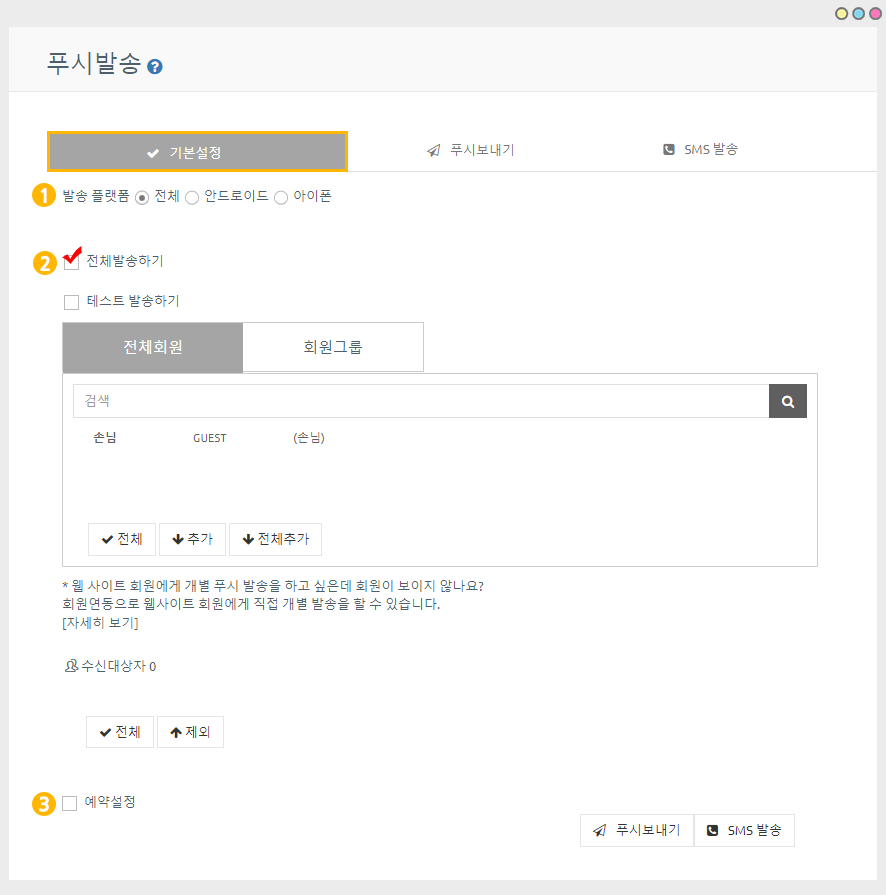
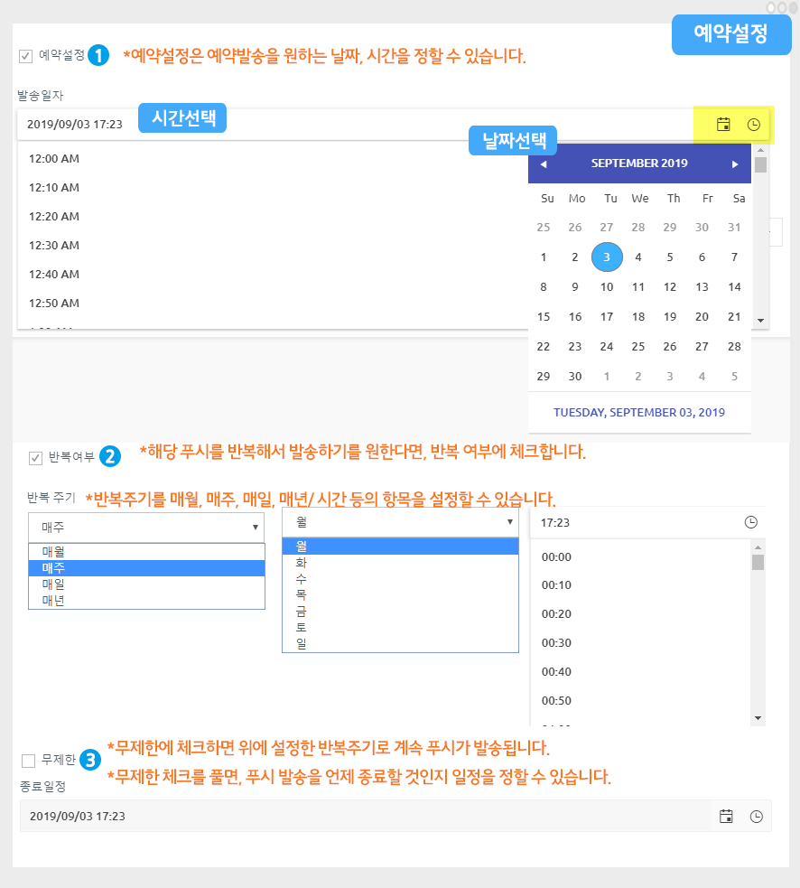
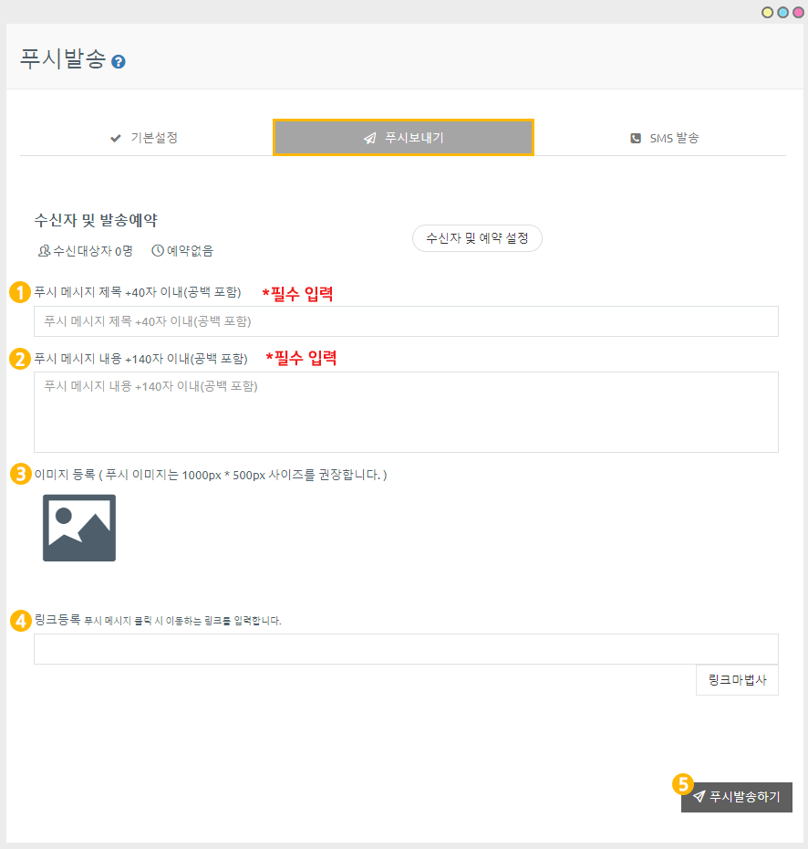

# 푸시앱에서 푸시발송하기

<figure><figcaption></figcaption></figure>

### <mark style="color:blue;">**안드로이드폰) 발송된 푸시 확인**</mark>

안드로이드폰에 발송된 푸시 입니다.

### <mark style="color:blue;">**아이폰) 발송된 푸시 확인**</mark>

<mark style="color:red;">특히 아이폰은 푸시 이미지가 표시되지 않습니다!</mark>

푸시 스타일은 폰 기종마다 다르며,  스타일은 핸드폰마다 차이가 있는 점 참고 부탁드려요!

푸시앱제작 방법은 아래 매뉴얼을 확인해주세요.



일반 프로토타입 앱 푸시 발송 방법은 아래 매뉴얼을 확인해주세요.&#x20;



<figure><figcaption></figcaption></figure>

##  STEP1. **푸시 발송하기**

스윙 홈페이지 접속 후 [앱운영 페이지 → 푸시&회원 → 푸시발송하기](http://www.swing2app.co.kr/view/push) 페이지로 이동합니다.

### <mark style="color:blue;">1.기본설정</mark>

<figure><figcaption></figcaption></figure>

푸시발송하기 첫번째 단계는 기본설정입니다. &#x20;

기본설정에서 수신자 선택, 예약설정, 반복 여부를 설정할 수 있어요.&#x20;

**1)발송 플랫폼**

전체 OS플랫폼으로 보낼 것인지, 안드로이드 /아이폰 따로 보낼 것인지 선택할 수 있습니다.

일반적으로 전체를 선택해서 보내지만 필요할 경우 각 플랫폼별로 따로 푸시 발송을 할 수도 있습니다.

**2)발송 대상 선택**

<mark style="color:red;">발송 대상 선택은 '전체발송하기'로 체크해주세요.</mark>&#x20;

'테스트 발송하기'는 STEP3.푸시 테스트 발송 내용으로 확인해주세요.&#x20;

푸시앱은 회원연동을 하지 않을 경우 회원 선택이 되지 않으며 전체발송만 가능합니다.&#x20;

푸시앱은 웹사이트(홈페이지)링크를 그대로 앱에 적용해서 만든앱이기 때문에 앱에서 가입하는 회원이 없어요.​

따라서 앱에서는 회원을 인식할 수 없기 때문에 회원을 선택할 수 없고, 전체발송만 가능합니다.

모두‘손님’으로 표시됩니다.

푸시앱에서 회원을 선택해서 개별 푸시를 발송하길 원하시면, 아래 방법을 확인해주세요.

> ### <mark style="color:blue;">웹사이트 회원 연동 가능</mark>

웹사이트의 회원을 앱으로 연동할 수 있습니다.&#x20;

회원을 연동하면 웹사이트의 회원 정보를 가져올 수 있고, 푸시 역시 개별 회원을 선택해서 보낼 수 있습니다.

<figure><figcaption></figcaption></figure>

\[자세히보기] 버튼을 클릭하면, 웹사이트 연동에 관련된 가이드를 확인할 수 있습니다.

사용자분의 웹사이트 내에서 회원을 연동하는 방법을 가이드를 통해 확인해주시구요.

해당 방법대로 진행시 스윙투앱으로 웹사이트의 회원 정보가 표시됩니다.&#x20;

<mark style="color:red;">\*연동후 앱에서 사이트를 실행한 사용자부터 스윙투앱 콘솔 회원조회화면에서 표시가 됩니다.</mark>

<mark style="color:red;">연동 전 가입한 이전 회원 목록은 불러오지 못합니다.</mark>


일반 웹사이트 회원 연동시 해당 가이드로 확인해주세요.



워드프레스 웹사이트 회원 연동시 해당 가이드로 확인해주세요.


**3)예약설정**

예약설정은 푸시 발송을 원하는 날짜와 시간으로 지정해서 보낼 수 있는 기능이에요.

바로 보낼 분들은 예약설정에 체크하지 않고, 푸시보내기로 바로 넘어가구요.

예약을 설정할 분들은 체크한 뒤 아래 방법대로 설정을 완료해주세요.

<figure><figcaption></figcaption></figure>

(1)예약설정 후 푸시발송을 희망하는 날짜를 선택한 뒤, 시간을 선택해주세요.

(2)반복여부: 해당 푸시를 반복해서 보낸다면 반복주기-요일, 시간을 설정하구요.&#x20;

반복을 원하지 않으면 체크를 풀어주세요.

(3)무제한 : 푸시 종료일자 없이 무제한으로 보낸다면 ‘무제한’으로 체크해주세요.&#x20;

제한을 두고 싶다면 종료일정을 설정해주세요.

**푸시 기본설정이 완료 되었다면, 다음 단계인 \[푸시보내기]로 이동합니다.**

### <mark style="color:blue;">2.푸시보내기</mark>

<figure><figcaption></figcaption></figure>

**1)푸시 메시지 제목 **<mark style="color:red;">**\*필수입력**</mark>

제목을 입력해주세요.&#x20;

**2) 메시지 내용 **<mark style="color:red;">**\*필수 입력**</mark>

내용은 너무 길게 입력하지 않도록 해주세요. 글자수가 많으면 짤려서 보입니다.&#x20;

**3) 이미지 등록** <mark style="color:red;">\*선택사항 (이미지를 넣지 않아도 됩니다)</mark>

푸시발송시 보여질 이미지를 등록해주세요&#x20;

<mark style="color:red;">-이미지는 가로 1000px, 세로 500px 권장</mark>

<mark style="color:red;">-아이폰에서는 기기 특성상 푸시 이미지가 보이지 않고, 안드로이드폰에서만 보입니다.</mark>

**4) 링크 등록** <mark style="color:red;">\*선택사항</mark>

푸시 메시지 클릭시 이동하는 링크를 입력할 수 있습니다.

일반 웹링크(URL)입력은 링크등록란에 바로 입력하실 수 있구요.

\[링크마법사] 버튼 선택시 앱 내에서 사용되는 페이지 링크를 적용할 수 있습니다.&#x20;

**5) 푸시 발송하기**

발송하기 버튼을 선택하면 발송 완료됩니다!

<figure><figcaption></figcaption></figure>

##  STEP2. 푸시 발송 화면(안드로이드폰)

### <mark style="color:blue;">**1.푸시에 웹링크 연결 X**</mark>

푸시발송시 웹링크를 연결하지 않을 경우는 알림 선택시 푸시 제목, 메시지만 표시가 됩니다.&#x20;

### <mark style="color:blue;">**2.웹링크 연결시**</mark>&#x20;

푸시발송시 웹링크를 연결할 경우, 푸시 알림 선택시 연결해놓은 해당 페이지로 이동합니다.


<mark style="color:red;">**\*중요\***</mark>

푸시는 핸드폰에 앱이 설치되어야 발송이 됩니다.&#x20;

<mark style="color:red;">\*가상머신, 앱 미리보기 상태에서는 발송 되지 않습니다.</mark>

따라서 만든 앱을 핸드폰에 설치하거나 다운 받은 뒤, 푸시 발송을 진행해주시구요.

앱은 종료한 상태에서 푸시를 보내주세요. &#x20;

(안드로이드폰에서 확인 가능, 아이폰은 앱스토어에 출시한 경우만 확인 가능)


<figure><figcaption></figcaption></figure>

##  STEP3. 푸시  테스트 발송

푸시앱 출시 전, 혹은 출시 후 푸시가 잘 발송되는지 먼저 테스트 해보고 싶다면?

\=>푸시 장치 관리 기능으로 푸시를 받을 핸드폰을 설정하여 테스트 발송을 할 수 있습니다.&#x20;

<mark style="color:red;">**★ 푸시 장치 관리 기능이란?**</mark>

**특정 핸드폰 기기를 테스트 기기로 등록하여, 해당 기기에만 테스트용 푸시를 발송 할 수 있는 기능입니다.**

푸시버전으로 제작한 앱은 앱 운영자가 푸시가 잘 들어오는지 테스트를 하고 싶어도 전체발송 밖에는 할 수 없어요.

\*푸시앱은 앱에서 회원가입이 없기 때문에 모든 앱 설치자가 손님으로 표시되며, 회원을 선택할 수가 없습니다.

따라서 푸시 장치 관리 기능을 이용하여 운영자 핸드폰을 테스트 기기로 등록 한다음, 푸시발송 메뉴에서 테스트 발송하기를 하면 테스트로 등록한 핸드폰으로만 푸시가 들어오게 됩니다.

푸시 장치 관리는 새롭게 추가된 기능으로 **\[푸시 장치 관리] 기능을 이용하여 테스트 기기 등록을 한 뒤, 푸시발송하기에서 테스트 발송하기로 푸시 테스트를 이용할 수 있습니다.**

\*[**\[푸시 장치 관리- 테스트 푸시 발송 매뉴얼\]**](https://documentation.swing2app.co.kr/manual/appmanage/pushmember/pushtest)

<figure><figcaption></figcaption></figure>

