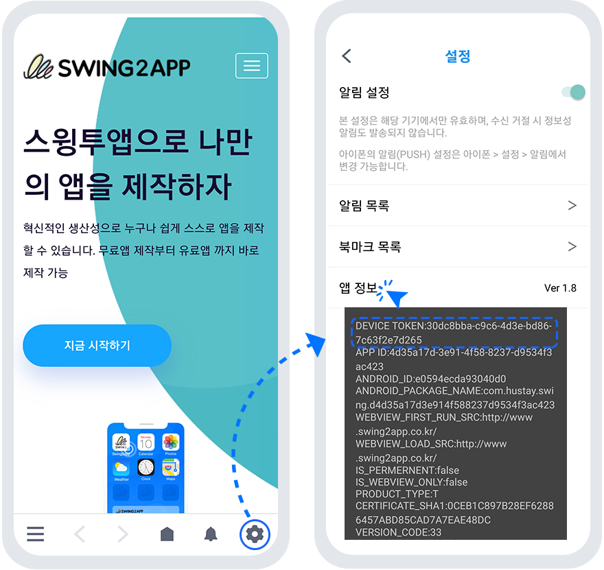
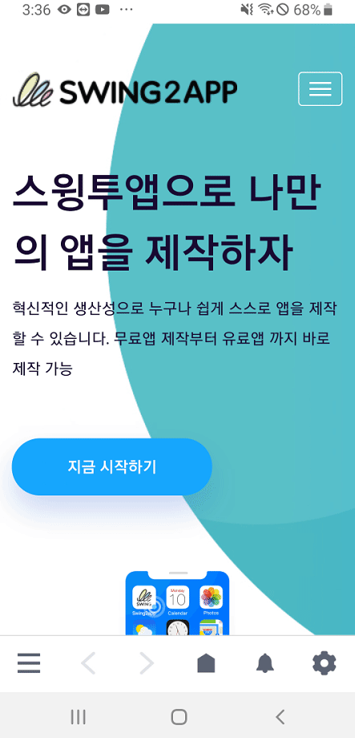

# 푸시 장치 관리 이용방법

<figure><figcaption></figcaption></figure>

### 푸시 장치 관리 기능이란?

**특정 핸드폰 기기를 테스트 기기로 등록하여, 해당 기기에만 테스트용 푸시를 발송 할 수 있는 기능입니다.**

푸시버전으로 제작한 앱은 앱 운영자가 푸시가 잘 들어오는지 테스트를 하고 싶어도 전체발송 밖에는 할 수 없었어요.

\*푸시앱은 앱에서 회원가입이 없기 때문에 모든 앱 설치자가 손님으로 표시되며, 회원을 선택할 수가 없습니다.

따라서 푸시 장치 관리 기능을 이용하여 운영자 핸드폰을 테스트 기기로 등록 한다음, 푸시발송 메뉴에서 테스트 발송하기를 하면 테스트로 등록한 핸드폰으로만 푸시가 들어오게 됩니다.

푸시 장치 관리는 새롭게 추가된 기능으로 **\[푸시 장치 관리] 기능을 이용하여 테스트 기기 등록을 한 뒤, 푸시발송하기에서 테스트 발송하기로 푸시 테스트를 이용할 수 있습니다.**


\*푸시장치 관리는 안드로드이폰에서만 푸시 테스트가 가능합니다. (아이폰 불가)

\*푸시앱제작시 “툴바 표시 여부 – 툴바 제거”로 선택하고 제작하신 앱은 푸시 장치 관리 기능 테스트가 불가합니다.

\*해당 기능은 2020년 3월 업데이트 된 기능입니다. 2020년 3월 이전에 제작한 앱은 새로 업데이트 하신 뒤 이용해주시기 바랍니다.


&#x20;****&#x20;

<figure><figcaption></figcaption></figure>

### STEP1. 푸시 장치 관리 이동

[앱운영 → 푸시&회원 → \[푸시 장치 관리\]](http://www.swing2app.co.kr/view/push\_device\_management)로 이동합니다.

푸시 장치 관리 페이지에는 앱을 설치한 핸드폰 기기 목록을 확인할 수 있어요.

내 핸드폰의 ‘**device\_token**‘ 을 확인하여 해당되는 기기의 **\[테스트 등록]** 버튼을 누르면 해당 기기가 테스트로 등록됩니다.

만약 앱에 등록된 기기가 많아 device\_token을 찾기 어렵다면, 상단의 검색창에서 device 정보를 입력하여 조회할 수 있어요!

<figure><figcaption></figcaption></figure>

<mark style="color:blue;">**안드로이드폰에서 device\_token은 어떻게 확인할 수 있나요?**</mark>

<figure><figcaption></figcaption></figure>

핸드폰에서 앱을 실행한 뒤 푸시 툴바에서 설정 버튼을 터치해주세요.

설정 페이지에서 - **‘앱 정보’** 단어를 3번 터치해주세요.

해당 핸드폰의  **device\_token** 팝업이창 뜹니다. **token 정보를 확인할 수 있습니다.**&#x20;

푸시 장치 관리에서 해당 디바이스 정보와 동일한 기기를 확인하여 테스트로 등록할 수 있습니다.

\*안드로이드폰에서만 확인 가능합니다.&#x20;

<mark style="color:blue;">****</mark>

<mark style="color:blue;">**\[움짤 이미지로 확인하기]**</mark>

<figure><figcaption></figcaption></figure>

&#x20;

앱제작 V2로 제작한 푸시앱에서 확인하기

스윙투앱 앱제작 버전 V2로 제작한 푸시앱은 확인하는 경로가 다르니, 아래 방법으로 확인해주세요.

### 푸시 장치 관리 이용방법

&#x20;[Edit](https://wp.swing2app.co.kr/wp-admin/post.php?post=7153\&action=edit) [Edit with WPBakery Page Builder](https://wp.swing2app.co.kr/wp-admin/post.php?vc\_action=vc\_inline\&post\_id=7153\&post\_type=manual\_documentation)

푸시 테스트 발송 : 푸시 장치 관리 이용방법

&#x20;

★ 푸시 장치 관리 기능이란?

특정 핸드폰 기기를 테스트 기기로 등록하여, 해당 기기에만 테스트용 푸시를 발송 할 수 있는 기능입니다.

푸시버전으로 제작한 앱은 앱 운영자가 푸시가 잘 들어오는지 테스트를 하고 싶어도 전체발송 밖에는 할 수 없었어요.

\*푸시앱은 앱에서 회원가입이 없기 때문에 모든 앱 설치자가 손님으로 표시되며, 회원을 선택할 수가 없습니다.

따라서 푸시 장치 관리 기능을 이용하여 운영자 핸드폰을 테스트 기기로 등록 한다음, 푸시발송 메뉴에서 테스트 발송하기를 하면 테스트로 등록한 핸드폰으로만 푸시가 들어오게 됩니다.

푸시 장치 관리는 새롭게 추가된 기능으로 \[푸시 장치 관리] 기능을 이용하여 테스트 기기 등록을 한 뒤, 푸시발송하기에서 테스트 발송하기로 푸시 테스트를 이용할 수 있습니다.

**\*푸시장치 관리는 안드로드이폰에서만 푸시 테스트가 가능합니다. (아이폰 불가)**

\*푸시앱제작시 툴바 사용 여부에 ” 아니오”로 선택하고 제작한 앱은 푸시 장치 관리 기능 테스트가 불가합니다.

\*해당 기능은 2020년 3월 업데이트 된 기능입니다. 2020년 3월 이전에 제작한 앱은 새로 업데이트 하신 뒤 이용해주시기 바랍니다.

(앱제작하기 버튼 눌러서 새 버전으로 앱 확인)  2020년 3월 이후 제작한 앱은 자동 반영됩니다.

***

&#x20;

STEP.1 푸시 장치 관리 이동

[앱운영 → 푸시&회원 → \[푸시 장치 관리\]](http://www.swing2app.co.kr/view/push\_device\_management)로 이동합니다.

&#x20;

푸시 장치 관리 페이지에는 앱을 설치한 핸드폰 기기 목록을 확인할 수 있어요.

내 핸드폰의 ‘device\_token‘ 을 확인하여 해당되는 기기의 **\[테스트 등록]** 버튼을 누르면 해당 기기가 테스트로 등록됩니다.

&#x20;

만약 앱에 등록된 기기가 많아 device\_token을 찾기 어렵다면, 상단의 검색창에서 device 정보를 입력하여 조회할 수 있어요!

&#x20;

안드로이드폰에서 device\_token은 어떻게 확인할 수 있나요?

핸드폰에서 앱을 실행한 뒤 푸시 툴바에서 설정 버튼을 터치해주세요.

설정 페이지에서 -‘앱 정보’ 단어를 3번 터치해주세요.

해당 핸드폰의 device info 배너 창이 뜹니다. 해당 정보가 device\_token 정보가 됩니다.

푸시 장치 관리에서 해당 디바이스 정보와 동일한 기기를 확인하여 테스트로 등록할 수 있습니다.

\*안드로이드폰에서만 확인 가능합니다.&#x20;

​

<mark style="color:orange;">**\[움짤 이미지로 확인하기]**</mark>

<figure><figcaption></figcaption></figure>

&#x20;

&#x20;

앱제작 V2로 제작한 푸시앱에서 확인하기

스윙투앱 앱제작 버전 V2로 제작한 푸시앱은 확인하는 경로가 다르니, 아래 방법으로 확인해주세요.

핸드폰에서 앱을 실행한 뒤 푸시 툴바에서 설정버튼을 터치해주세요.

그럼 이미지처럼 \[푸시 메시지 수신 설정] 팝업 창이 뜨구요.

해당 팝업의 “푸시 메시지 수신 설정” 단어른 3-4회 터치합니다.

터치하면 해당 화면 위로 핸드폰의 device info 배너 창이 뜹니다. 해당 정보가 device\_token 정보가 됩니다.

푸시 장치 관리에서 해당 디바이스 정보와 동일한 기기를 확인하여 테스트로 등록할 수 있습니다.

<figure><figcaption></figcaption></figure>

### STEP2. 테스트 푸시 발송하기

앱운영 → 푸시&회원 → 푸시발송하기 이동합니다.

**기본설정에서 \[테스트 발송하기]에 체크해주세요.** \*테스트로 등록된 기기에만 푸시가 발송이 됩니다.

​

다음 \[푸시보내기]는 기존 푸시발송 내용과 동일합니다.&#x20;

내용 입력해서 푸시발송하기 선택해주세요.

<figure><figcaption></figcaption></figure>

​푸시 장치 관리는 푸시버전앱에서 유용하게 사용할 수 있는 기능입니다.

푸시앱에서, 푸시 알림이 잘 들어오는지 테스트가 필요할 때 앱 운영자 기기를 테스트로 등록한 뒤 푸시 발송 테스트를 해볼 수 있습니다.&#x20;

**푸시장치 관리는 안드로드이폰에서만 푸시 테스트가 가능합니다. (아이폰 이용 불가)**

****

****
