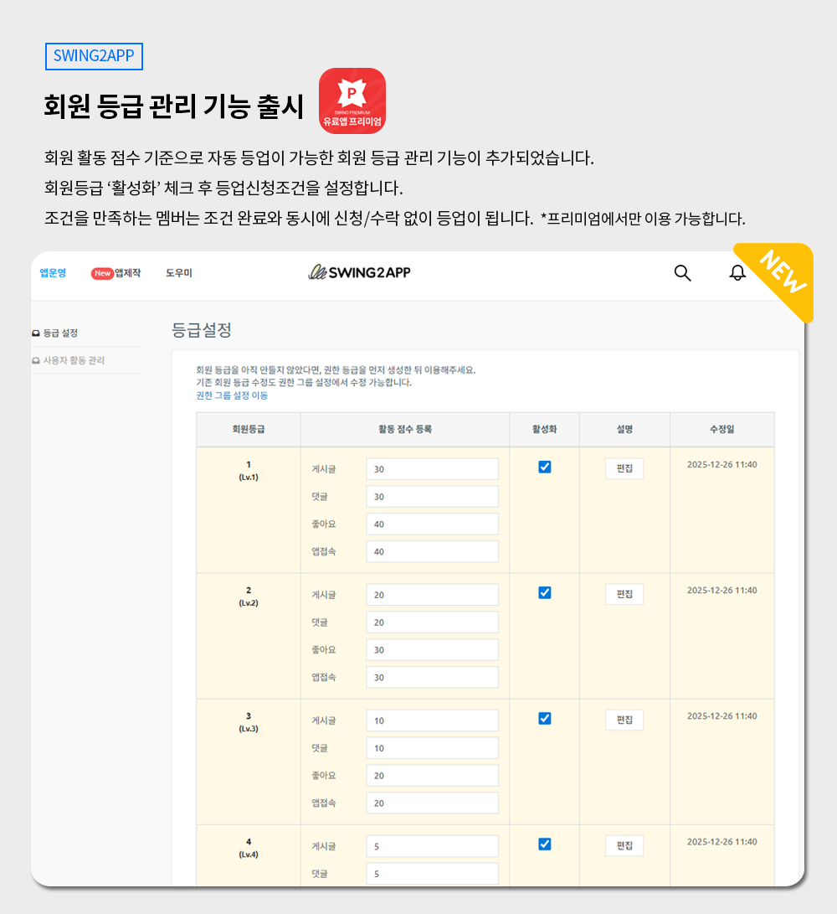
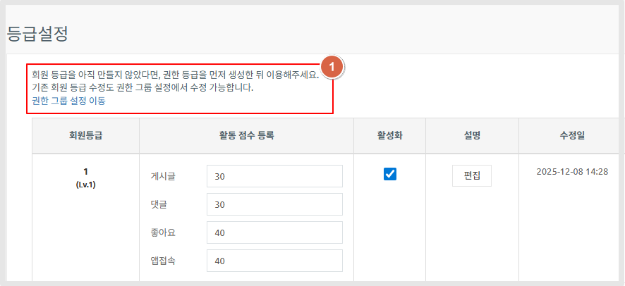
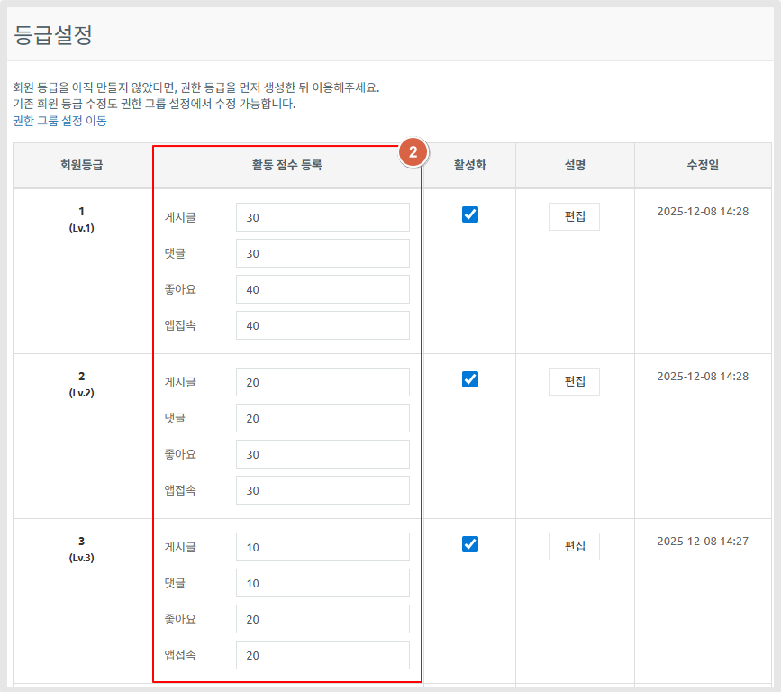
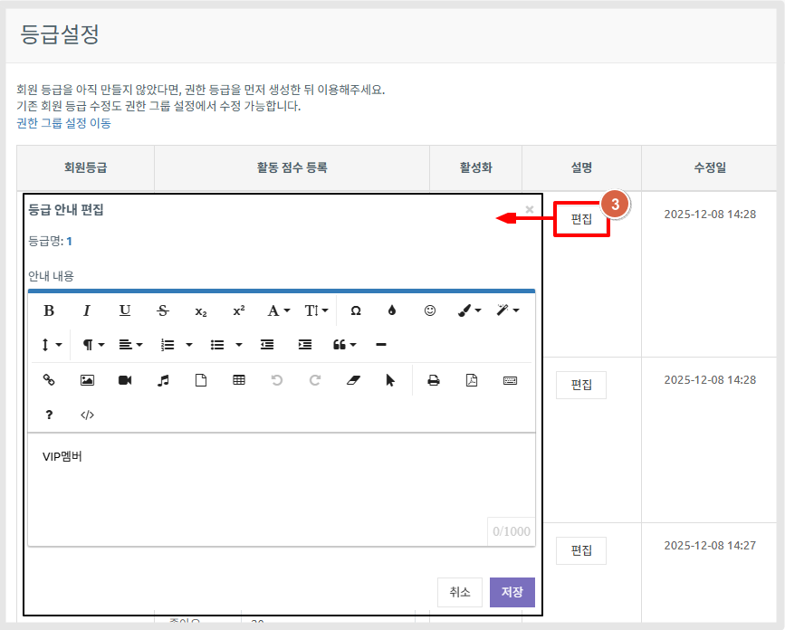
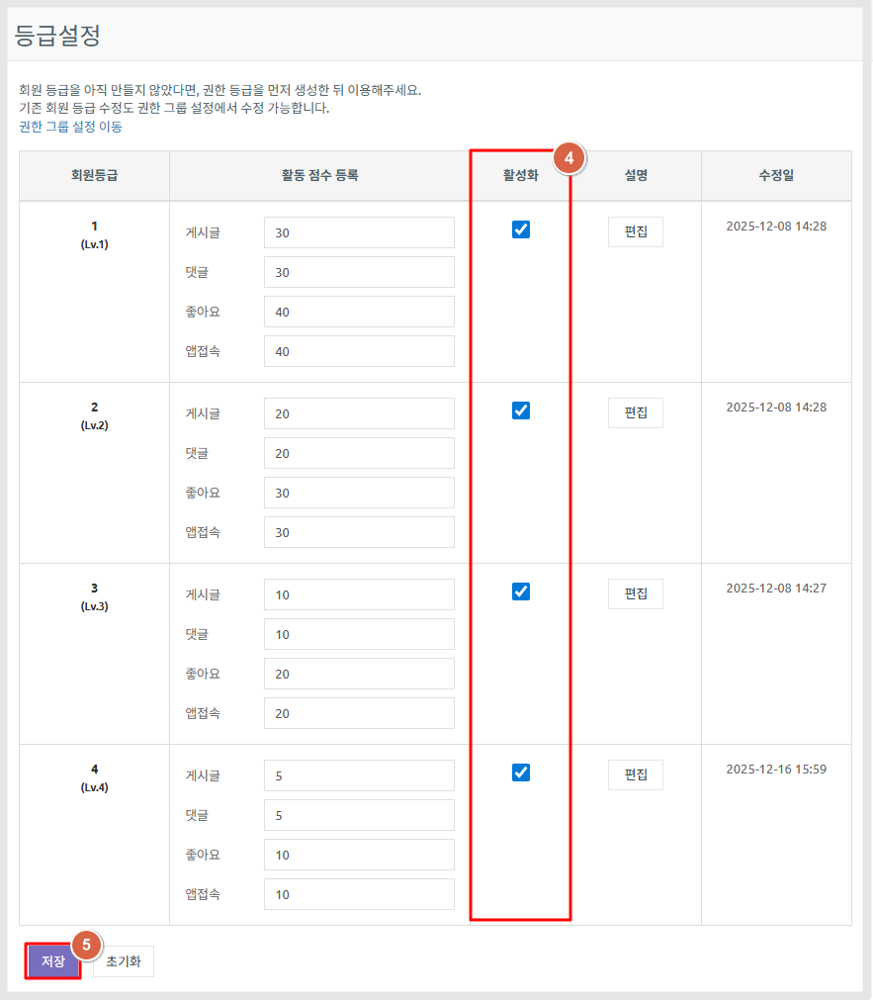
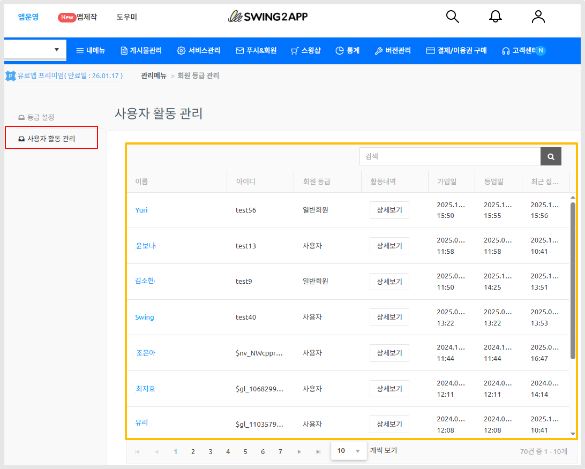
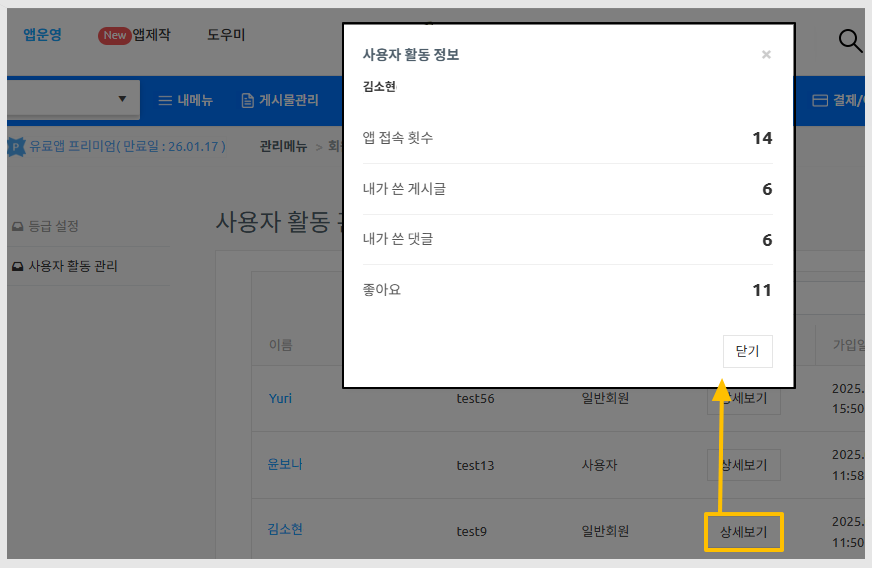
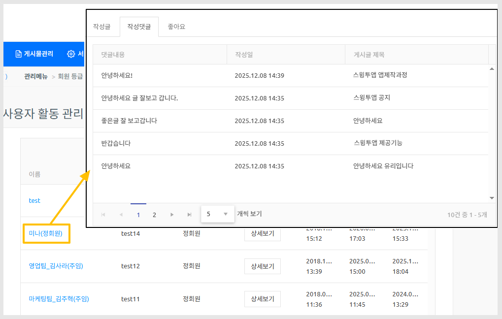
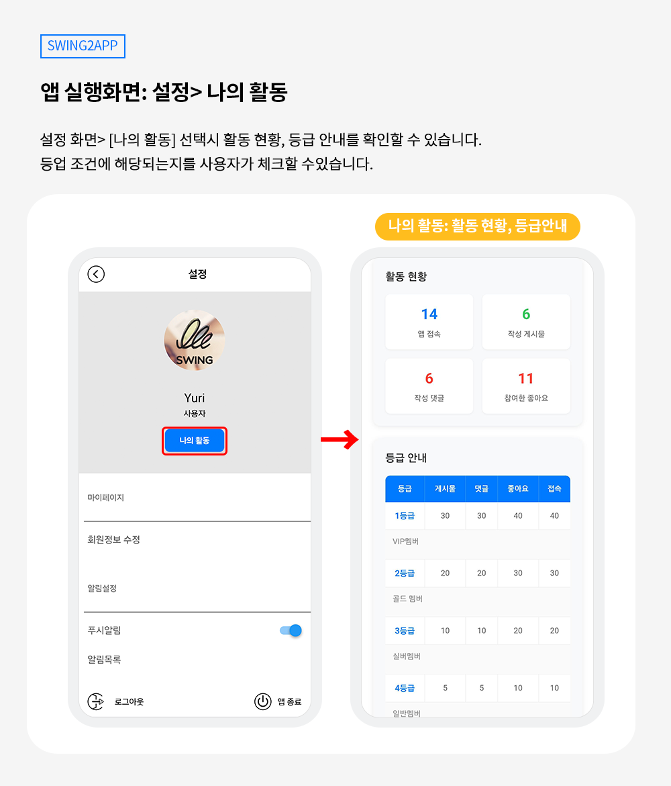
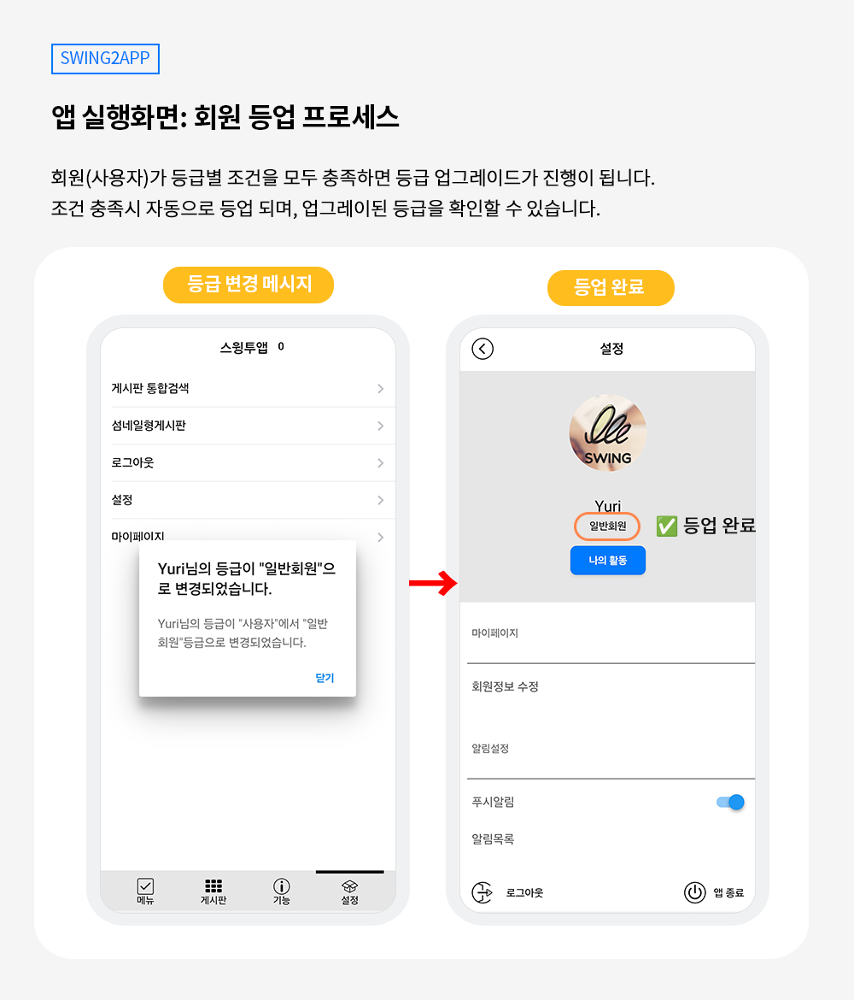

# 회원 등급 관리 - 등업 설정

***

## 1.회원 등업 관리 기능이란?

<figure><figcaption></figcaption></figure>

회원의 활동 점수를 기준으로 사전에 설정한 조건을 충족하면 자동으로 등급이 변경되는 기능입니다.

관리자가 등급 조건만 설정해두면 별도의 승인이나 수동 관리 없이도 회원 등급이 자동으로 업데이트됩니다.

<mark style="color:red;">\*유료앱 - 프리미엄 이용권에서만 이용가능합니다.</mark>&#x20;

***

## 2.주요 기능 안내

1\. 회원 등급 설정

* Lv1, Lv2, Lv3 등 앱에서 만들어놓은 권한에 등급별 회원 단계 설정 가능 (총 9단계 권한 설정 가능)
* 앱에서 생성한 권한 그룹 기준으로 등급 관리
* 등급별 활성화 / 비활성화 관리 지원
* 등급별 설명 및 수정 이력 관리 가능

2\. 활동 점수 기준 등록

회원의 실제 활동을 기준으로 점수를 부여할 수 있습니다.

설정 가능한 활동 항목 예시:

* 게시글 작성
* 댓글 작성
* 좋아요
* 앱 접속

👉 각 항목별로 필요 점수를 자유롭게 설정할 수 있습니다.

3\. 자동 등업 시스템

* 설정한 활동 점수를 모두 충족하면 자동 등업
* 별도의 신청, 승인 절차 없이 즉시 적용
* 실시간 회원 등급 반영

***

## **3.이용방법 (웹 대시보드- 관리자)**

✔해당 기능은 스윙투앱 이용권 중 "프리미엄" 이용권 에서만 이용 가능합니다. (기본형, 확장형에서는 이용 불가)

✔기능 적용 후 앱 업데이트를 해주세요. (업데이트 반영일: 2025년 11월 24일 이후 제작된 앱은 즉시 이용 가능)

메뉴 경로

[앱운영 - 푸시&회원 - 회원 등급 관리](https://www.swing2app.co.kr/view/app_user_active_point) 메뉴 이동, 등급설정 화면에서 셋팅을 해주세요.

**1. 권한 등급 생성**

먼저 권한 등급을 생성해주세요!

회원 등급을 아직 만들지 않았다면, 권한 등급을 먼저 생성한 뒤 이용해주세요.

기존 회원 등급 수정도 권한 그룹 설정에서 수정 가능합니다.

&#x20;권한 그룹 설정 이용방법 보러가기



<figure><figcaption></figcaption></figure>

**2.등급별 활동 점수 등록**

회원등급을 모두 생성했다면 등급설정 화면에서 각 등급별 활동 점수 등록을 입력합니다.

점수는 관리자가 원하는대로 숫자로 기재하면 됩니다.

<figure><figcaption></figcaption></figure>

**3.등급 설명 입력**

설명란 \[편집] 버튼을 선택해서 - 등급 안내(설명)을 기재해주세요.

예시) 1등급:VIP회원 / 2등급: 골드회원 / 3등급: 실버회원/ 4등급: 우수회원 등을로 앱에서 사용되는 용어로 알맞게 기재해주세요.

<figure><figcaption></figcaption></figure>

**4.활성화 설정**

이용할 회원등급은 "활성화"에 체크해주세요.

**5. 저장** 버튼을 눌러주세요.

<figure><figcaption></figcaption></figure>

※ 2025년 11월 24일 이전 제작된 앱은 앱 업데이트 필수

※ 초기화 버튼을 누르면 기본 셋팅값으로 되돌아 갑니다.

***

## **4.**&#xC0AC;용자 활동 관리 (웹 대시보드- 관리자)

<figure><figcaption></figcaption></figure>

사용자 활동 관리 메뉴에서는 앱에 가입된 사용자(회원)목록을 확인할 수 있구요.

가입일, 등업일, 최근 접속일 등의 정보 확인이 가능합니다.

<figure><figcaption></figcaption></figure>

\[상세보기] 선택시

사용자 활동 정보 - 앱 접속 횟수, 게시글 작성 수, 댓글 수, 좋아요 수 확인할 수 있습니다.

<figure><figcaption></figcaption></figure>

사용자 이름 선택시,

해당 사용자가 작성한 게시물(작성글), 댓글, 좋아요에 체크한 게시글을 확인할 수 있습니다.

작성한 글은 작성일, 조회수, 좋아요 수, 댓글 수 까지 모두 확인 가능합니다.

***

## **5.앱 이용 화면 안내(사용자)**

등급 설정을 한 후 앱에서 어떻게 이용이 되는지 보여드릴게요&#x20;

### **1)나의 활동 확인**

<figure><figcaption></figcaption></figure>

사용자는 앱 실행 후 - 설정 화면에서 \[나의 활동]을 선택해서 지금 해당 아이디에 적용된 활동 현황, 관리자가 설정한 등급 안내를 확인할 수 있습니다.&#x20;

\*앱제작시 설정 메뉴를 제거했다면 이용 불가합니다. 따라서 꼭 '설정' 메뉴를 앱에 적용해주세요.

등급 안내 표를 보고 조건에 맞는 작업을 수행할 수 있습니다.&#x20;

활동을 하는 만큼 현황은 실시간으로 변경됩니다.&#x20;

### **2)자동 등업 프로세스**

<figure><figcaption></figcaption></figure>

조건을 충족하면 앱에서 등급 변경 팝업 메시지 창이 뜹니다.&#x20;

그리고 설정 화면으로 이동하면 등급이 업그레이드 된 것을 확인할 수 있습니다.&#x20;

즉, 조건 충족이 완료되면 자동으로 앱에서 등업이 진행됩니다. 


**📌 안내사항**

1\)업데이트 반영일: 2025년 11월 24일 이후 제작된 앱부터 적용

11월 24일 이전에 제작한 앱은 업데이트 해주세요.

11월 24일 이후 제작한 앱은 즉시 등업 설정 기능 이용 가능합니다.&#x20;

\*앱스토어, 플레이스토어 등에 출시된 앱은 업데이트 버전으로 해당 스토어에도 업데이트 제출을 해주셔야 변경됩니다.

2\)일반 UI 프로토타입 앱만 해당 됩니다.&#x20;

3\)해당 기능은 스윙투앱 이용권 중 "프리미엄" 이용권 에서만 이용 가능합니다. (기본형, 확장형에서는 이용 불가)


