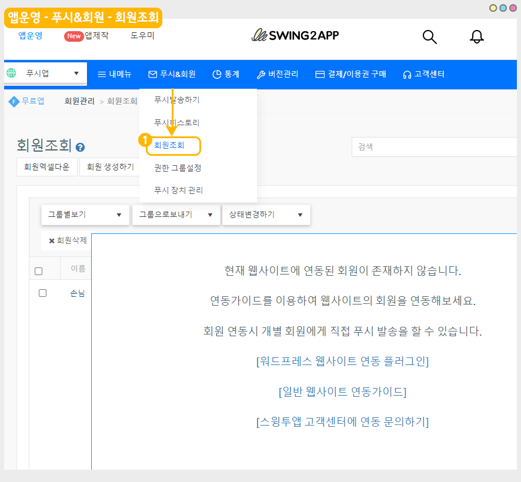
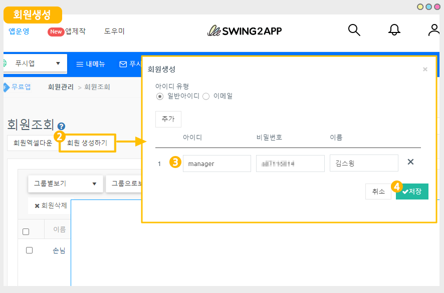
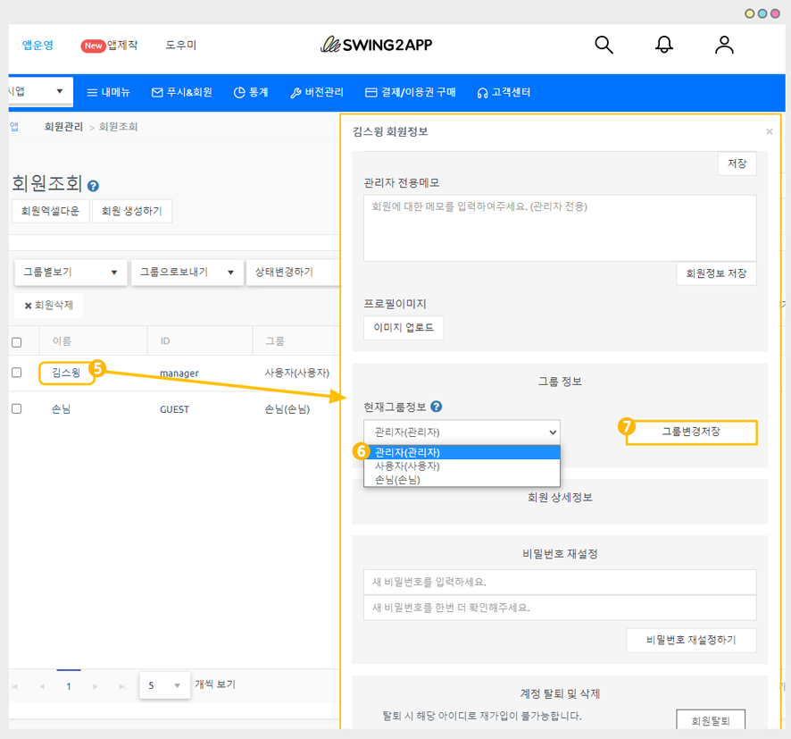
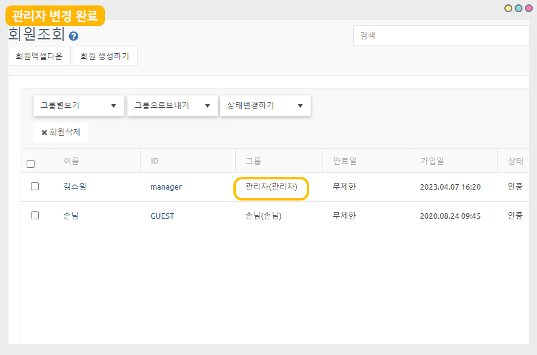
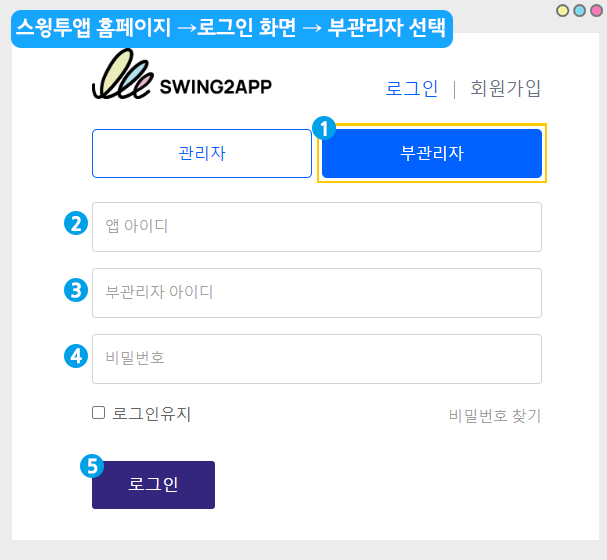
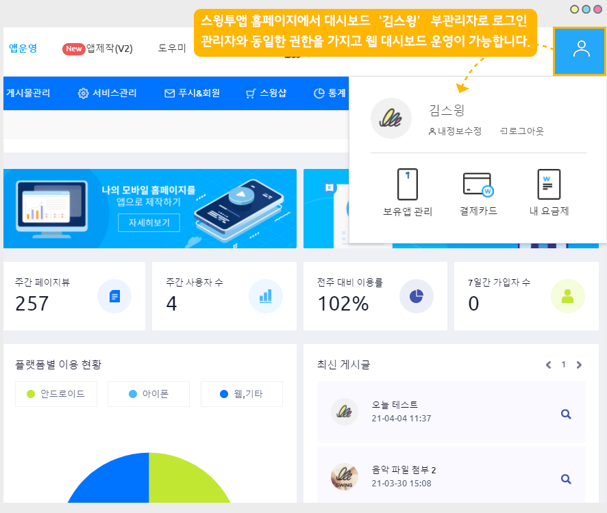

# 푸시앱, 웹뷰앱 이용 부관리자 설정

<figure><figcaption></figcaption></figure>

 **부관리자란?**

부관리자는 관리자와 같은 권한을 갖는 사용자로 관리자가 특정회원을 선택하여 관리자 권한을 부여할 수 있어요.

앱을 최초로 만든 관리자 외에 앱을 관리할 수 있는 있는 관리자를 여러명 설정할 수 있구요. (부관리자 수 제한 없이 가능!!)

관리자로 설정된 회원을 부관리자로 통칭합니다.

\*부관리자라는 명칭이 있는 것이 아니라서 부관리자로 설정된 회원들은 모두 관리자로 보여집니다.

\[앱을 개발한 사용자: 관리자]로 통칭하며, 관리자가 권한을 부여한 사용자를 부관리자로 통칭하기 때문에 편의상 부관리자로 부릅니다.

스윙투앱 웹 대시보드 이용시 부관리자를 둘 수 있으며 인원 제한 없이 추가가 가능합니다.

앱에서회원가입한 사용자를 관리자로 설정한 뒤 사이트에 로그인할 수 있도록 권한을 부여할 수 있어요.

**단, 위의 방법은 일반 프로토타입으로 제작한 앱에서만 이용이 가능하구요.**

**웹사이트를 연결한 웹앱 - 웹뷰, 푸시앱은 다른 방법으로 회원을 생성하고 관리자로 권한을 부여할 수 있습니다.**

아래 이용방법을 확인하여 웹뷰앱, 푸시앱 이용시 부관리자를 설정하고, 홈페이지에서 로그인하는 방법을 확인해주세요.

<mark style="color:blue;">해당 방법은 웹뷰앱, 푸시앱에 해당 되는 매뉴얼로</mark>

<mark style="color:blue;">일반 프로토타입 앱 이용시 아래 매뉴얼을 통해 부관리자 설정 방법을 확인해주세요.</mark>&#x20;



<figure><figcaption></figcaption></figure>

##  (1).png>)1.회원 생성하기

<figure><figcaption></figcaption></figure>

1\)앱운영- 푸시&회원 - 회원조회 메뉴 이동

<figure><figcaption></figcaption></figure>

2\)\[회원생성하기] 버튼 선택

3\)회원생성 팝업창에서 아이디, 비밀번호, 이름 항목을 입력해주세요.

회원을 더 추가할 경우, 상단의 \[추가] 버튼을 누르면 회원 정보를 더 입력할 수 있습니다.

4\)\[저장] 버튼 선택

<figure><figcaption></figcaption></figure>

회원조회 화면에서 추가된 회원을 확인할 수 있습니다.

5\)그룹을 변경할 회원을 선택해주세요. (이름을 마우스 포인터로 클릭)

6\)회원정보 창에서 현재 그룹정보를 '관리자'로 변경

7\)\[그룹변경저장] 버튼 선택하면 완료됩니다.

<figure><figcaption></figcaption></figure>

회원이 '관리자'로 변경된 것을 확인할 수 있습니다.

<figure><figcaption></figcaption></figure>

홈페이지에서 부관리자로 로그인하는 방법을 알려드릴게요.

##  (1).png>)2. 홈페이지- 부관리자 로그인하기

<figure><figcaption></figcaption></figure>

스윙투앱 홈페이지 접속 후 – 로그인 화면 이동해주세요.

1\)\[부관리자]를 선택해주세요.

2\)앱 아이디 : 관리자가 앱을 제작할 때 설정한 아이디를 입력합니다.

→ 앱 아이디란? 관리자가 스윙투앱 웹사이트에서 앱을 제작할 때 앱기본정보에서 입력한 아이디를 말합니다.

어떤 아이디를 기재하는 것인지 아래에서 설명해드릴게요.

3\)부관리자 아이디 : 회원생성에서 등록한 아이디 입력

4\)비밀번호: 회원생성에서 등록한 비밀번호 입력

5\)입력 완료 후 로그인 버튼을 눌러주세요.


<mark style="color:red;">주의사항</mark>

앱 제작이 완료되어야 부관리자 로그인이 가능합니다.

앱을 제작한 상태가 아닐 경우 앱 아이디가 인식이 되지 않아요.

따라서 앱을 제작해놓은 뒤 부관리자 로그인을 이용해주시기 바랍니다.


### 앱 아이디는 어디서 확인할 수 있나요?

<mark style="color:blue;">**앱제작 V3 버전 화면**</mark>

<figure><figcaption></figcaption></figure>

앱 아이디는 **앱제작 - STEP1 기본정보에서 입력한 앱 아이디**를 말합니다.

부관리자에게는 관리자가 앱제작에서 설정한 앱 아이디를 알려주셔야 로그인이 가능합니다.

<figure><figcaption></figcaption></figure>

로그인 하면, 관리자가 이용했던 동일한 웹 대시보드 화면이 표시되구요.

부관리자로 지정된 '김스윙' 회원으로 로그인이 된 것을 확인할 수 있습니다.

김스윙 부관리자는 이제 관리자가 제작한 앱을 함께 운영할 수 있어요.

<figure><figcaption></figcaption></figure>

##  (1).png>)3.부관리자 설정 정리

**1) 부관리자 설정하기**

(1)스윙투앱 앱운영페이지 →푸시&회원 → 회원조회 페이지 이동

(2)회원 생성(아이디, 비밀번호, 이름 기재)

(3)해당 회원을 선택 후 → 현재 그룹 정보의 ‘사용자’에서 → ‘관리자’로 선택한 뒤\[그룹변경하기] 버튼을 선택

(4)변경하기를 완료하면 관리자 등급 변경 완료됩니다. \~!!

​

**2) 스윙투앱 홈페이지 로그인**

홈페이지 – 부관리자 로그인 페이지에서

앱 아이디, 부관리자 아이디, 비밀번호 입력 후 로그인 하면 관리자 대시보드로 접속됩니다.

