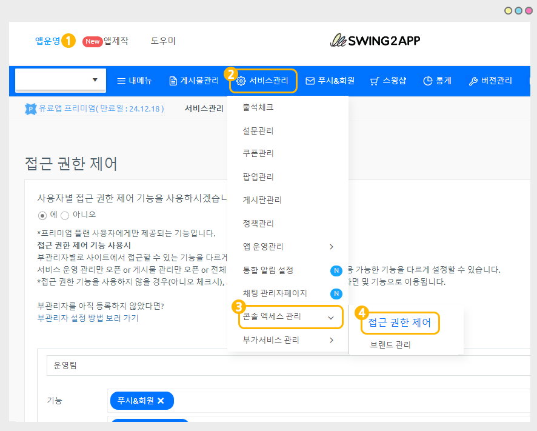
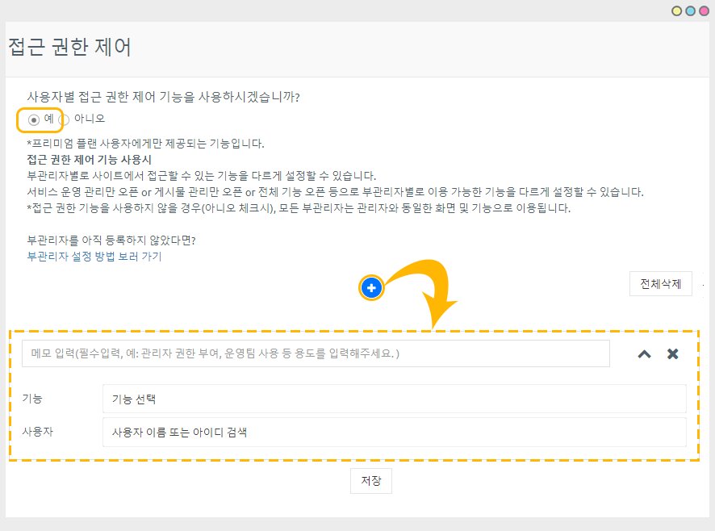
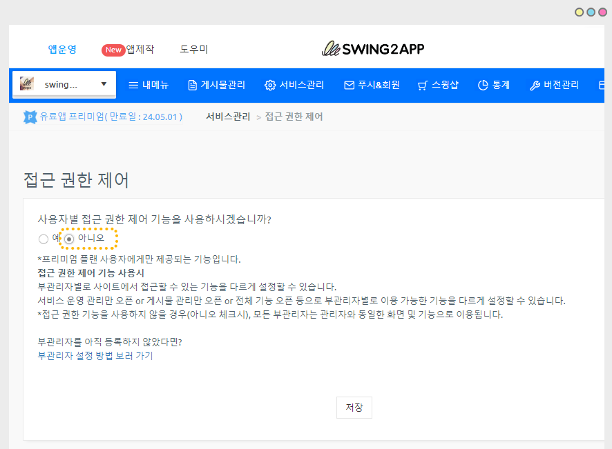
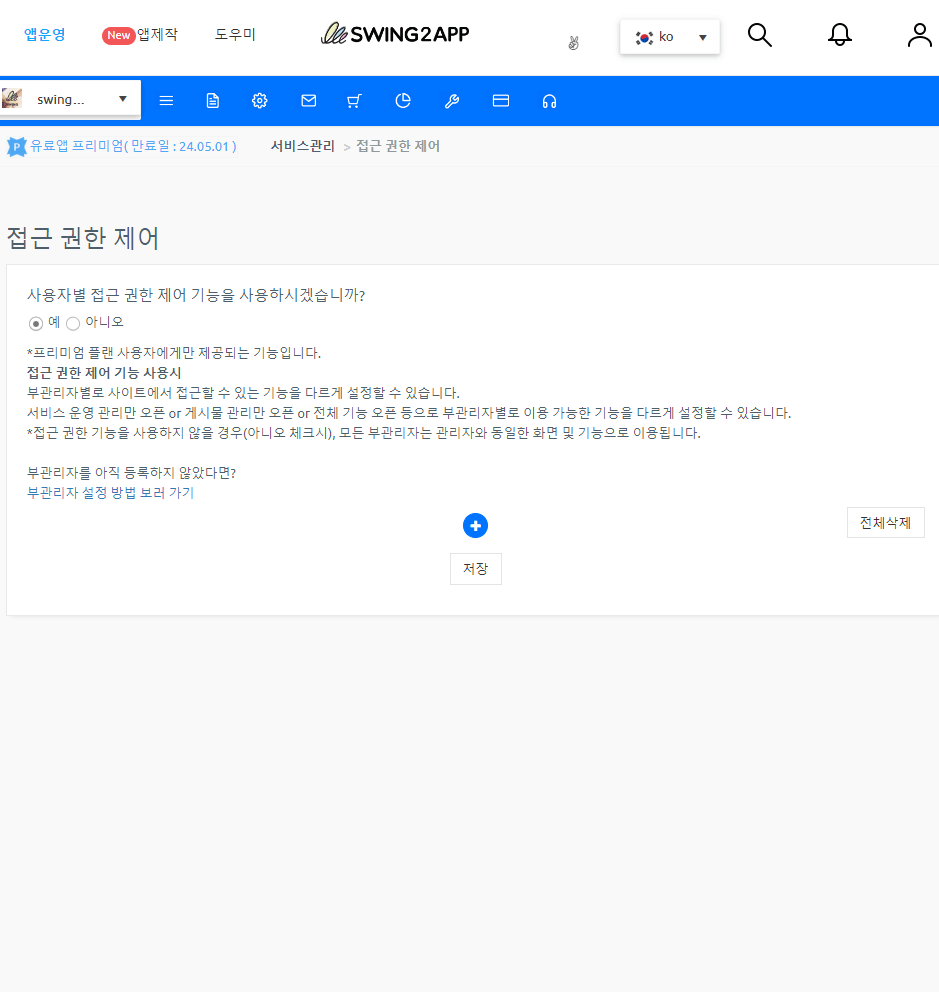
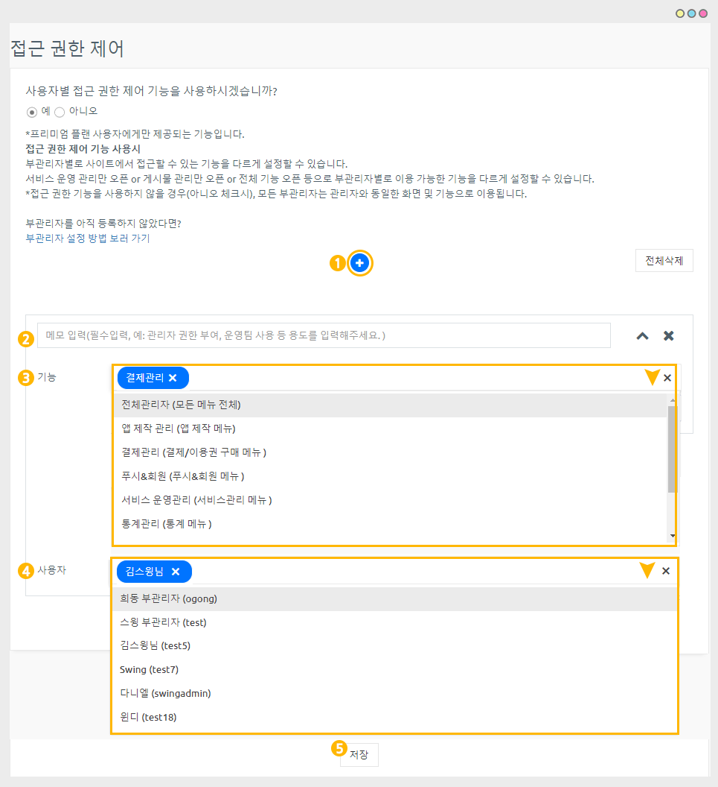
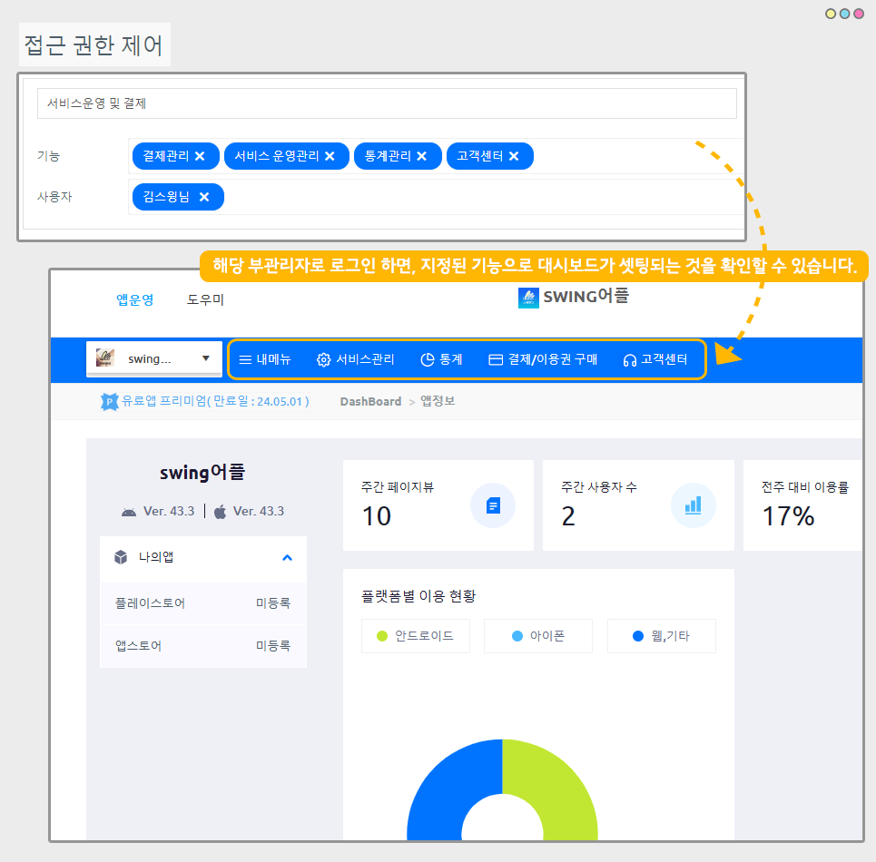
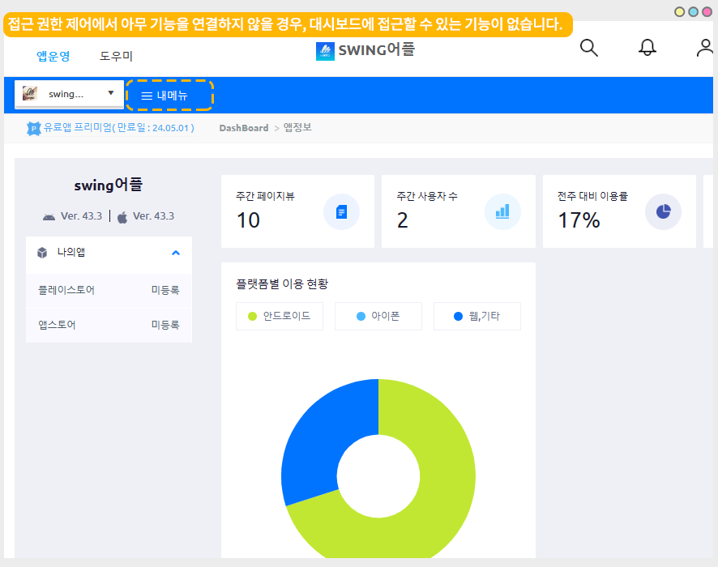

# 접근 권한 제어

***

<mark style="color:red;">해당 기능은 "일반 프로토타입 앱" - "프리미엄 유료앱 이용권" 사용자만 이용 가능합니다.</mark>&#x20;


**접근 권한 제어 이용 목적**

스윙투앱 서비스 이용시, 앱 제작 및 계정을 소유한 관리자가 있구요.

앱을 함께 관리하는 부관리자를 여러명 설정하여 운영할 수 있습니다.

부관리자 역시 관리자와 동일한 역할을 수행할 수 있고, 스윙투앱 사이트 대시보드에도 로그인하여 접속할 수 있습니다.&#x20;

이때, **부관리자별로 앱을 운영하는 기능을 다르게 설정하고자 할 때 접근 권한 제어 기능을 통해 각 부관리자별로 다른 접근 권한 기능을 셋팅할 수 있습니다.**&#x20;



**접근 권한 제어란?**

접근 권한 제어란, 부관리자별로 대시보드에 접근할 수 있는 기능을 각각 다르게 설정하는 기능입니다.

예를 들어)

-A 부관리자: 결제 관리&#x20;

-B 부관리자:운영팀(앱 서비스관리, 게시물 관리, 쇼핑몰 관리)

-C부관리자: 앱제작 관리

이렇게 각 관리자별로 접근이 가능한 기능을 셋팅하여 해당 기능만 노출되도록 사용할 수 있습니다.&#x20;

설정한 기능 외에 다른 기능은 노출되지 않아요.

\*접근 권한을 사용하지 않을 경우 모든 부관리자는 관리자와 동일한 대시보드로 사용됩니다.

접근 권한 없이 모든 기능이 관리자 화면과 동일하게 노출됩니다.



**사용 조건**

1\)일반 프로토타입 앱 사용자 대상

2\)스윙투앱 유료앱 이용권 중 "프리미엄 이용권" 사용에 한해 이용 가능합니다.

3\)앱에 설정된 부관리자가 있어야 합니다.&#x20;

부관리자를 아직 설정하지 않았다면 매뉴얼을 보시고, 부관리자를 지정해주세요.&#x20;

[부관리자 설정방법](https://documentation.swing2app.co.kr/manual/appmanage/pushmember/associate-administrator)

\*부관리자라는 명칭이 있는 것이 아니라서 부관리자로 설정된 회원들은 모두 관리자로 보여집니다.

\[앱을 개발한 사용자: 관리자]로 통칭하며, 관리자가 권한을 부여한 사용자를 부관리자로 통칭하기 때문에 편의상 부관리자로 부릅니다.


***

## 1.접근 권한 사용하기

<figure><figcaption></figcaption></figure>

[앱운영 - 서비스관리 - 콘솔 액세스 관리 - 접근 권한 제어](https://www.swing2app.co.kr/view/app_access_management_view) 메뉴로이동합니다.

<mark style="color:red;">"일반 프로토타입 앱" - "프리미엄 이용권" 사용자만 이용이 가능한 기능입니다.</mark>&#x20;

<mark style="color:red;">프리미엄 외 다른 이용권을 구매하여 사용중인 분들은 해당 메뉴 이용이 불가합니다.</mark>

### 1)접근 권한 제어 사용하기

<figure><figcaption></figcaption></figure>

부관리자별 접근 권한 제어를 사용하실 경우 "예"에 체크하고  <mark style="color:blue;">**+**</mark> 버튼을 선택해주세요.

기능과 사용자 선택 탭이 열리고, 원하시는 기능과 사용자(부관리자)를 설정해서 저장할 수 있습니다.&#x20;

<mark style="color:green;">**부관리자별 접근 권한을 설정하지 않을 경우는?**</mark>

<figure><figcaption></figcaption></figure>

접근 권한을 사용하지 않을 경우는 "아니오"에 체크해주세요.

접근 권한을 사용하지 않을 경우, 앱의 모든 부관리자들은 관리자와 동일한 대시보드로 이용됩니다.

\*모든 기능 및  운영 도구들이 동일하게 노출됩니다.

### 2)입력 방법

<figure><figcaption></figcaption></figure>

<figure><figcaption></figcaption></figure>

(1)**+**&#xBC84;튼을 선택해서 항목을 추가합니다.

(2)메모란은 사용 용도를 입력해주세요.

예시) 운영, 결제, 앱제작, 전체 관리자 권한 부여

(3)기능: 마우스 커서를 탭에 선택하면 기능 선택란이 열립니다.&#x20;

원하는 기능을 선택해주세요.&#x20;

(4)사용자: 마우스 커서를 탭해 선택하면 부관리자(이름/아이디) 리스트가 열립니다.

해당 기능을 사용할 부관리자를 선택해주세요.&#x20;

(5)저장 버튼을 선택해주세요.

\*접근 권한 항목을 추가 등록할 경우는 **+** 버튼을 선택해서 추가할 수 있습니다.&#x20;

***

## 2.접근 권한 대시보드 확인하기

부관리자별 접근 권한 기능을 설정 한 후, 해당 부관리자로 로그인해보겠습니다.&#x20;

<figure><figcaption></figcaption></figure>

'김스윙' 이라는 부관리자로 로그인한 화면입니다.

지정된 접근 권한 기능으로 대시보드 화면이 셋팅된 것을 확인할 수 있습니다.&#x20;

결제관리, 서비스운영, 통계, 고객센터 메뉴가 대시보드에 노출되고 있는 것을 확인할 수 있습니다.

<mark style="color:red;">\*내메뉴는 앱 정보에 관련된 메뉴라 별도 셋팅 없이 모두에게 보여지는 고정 메뉴입니다.</mark>&#x20;

<mark style="color:green;">**Q.부관리자에게 아무런 접근 권한 기능을 부여하지 않을 경우는 어떻게 보여지나요?**</mark>

<figure><figcaption></figcaption></figure>

만약 접근 권한 제어에서 아무 기능을 연결하지 않는다면, 위의 이미지에서 보듯이 대시보드에서 아무 메뉴가 노출되지 않습니다.


<mark style="color:blue;">**활용 TIP**</mark>

접근 권한 제어 기능은 앱의 부관리자별로 다른 접근 권한 기능을 부여해야 할 때 유용하게 사용할 수 있습니다.


