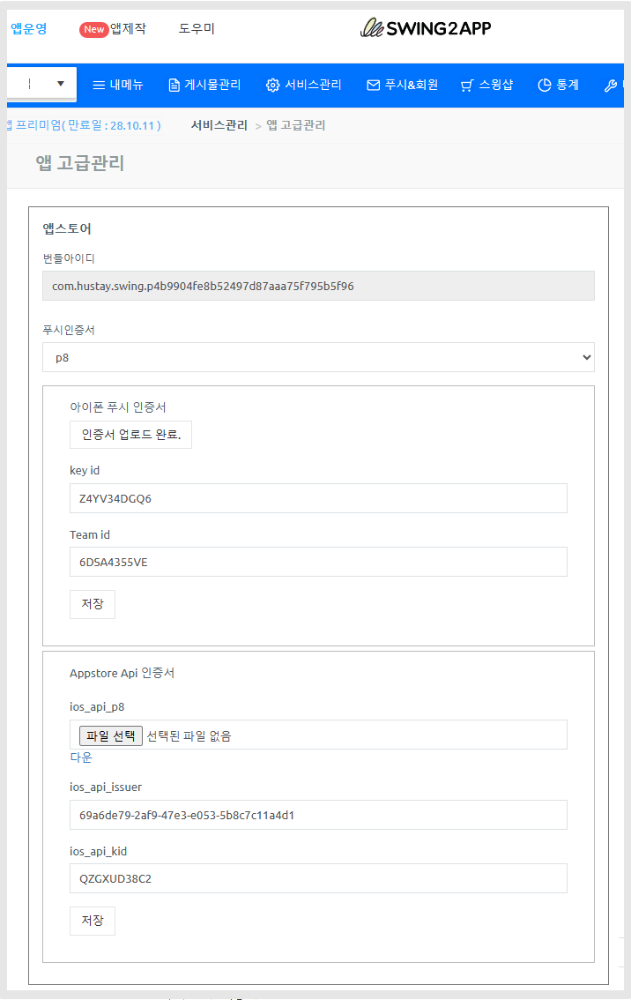

# 앱 고급 관리

***

## <mark style="color:blue;">앱 고급관리란?</mark>

앱 고급 관리는 앱에 관련된 개발 정보를 확인하는 페이지이구요.

[앱운영-서비스관리-앱 운영관리-앱 고급관리](https://www.swing2app.co.kr/view/app\_advanced\_management) 메뉴에서 확인 가능합니다.&#x20;

## <mark style="color:blue;">**앱 고급 관리 제공 메뉴**</mark>

**1)안드로이드 키 파일 및 키스토어 정보 확인**

앱 패키지 아이디, 키스토어 정보,  키스토어 비밀번호, 키스토어 파일을 다운 받을 수 있습니다.&#x20;

**2)앱스토어 정보 확인**&#x20;

앱스토어 출시된 앱은 앱스토어 등록시 셋팅한 API 정보, 인증서 정보를 확인할 수 있습니다.&#x20;

**3)App Id, App Key 확인**

푸시 API 연동에 필요한 App Id, App Key 정보를 확인하고 발급받을 수 있습니다.&#x20;


**이용안내**

앱 고급 관리는 <mark style="color:red;">\*일반 프로토타입 앱, 푸시앱 유료앱 이용권 사용 중에만 고급관리 메뉴 접속이 가능합니다.</mark>&#x20;

**무료앱 이용, 웹뷰앱 무료&유료 버전에서는 확인이 불가합니다.**&#x20;

웹뷰앱 유료 사용자분들은 안드로이드 키 정보가 필요하실 경우 고객센터로 요청주시면 해당 정보를 개별적으로 보내드립니다.&#x20;


***

## 1.안드로이드 키스토어 정보

[앱운영-서비스관리-앱 운영관리-앱 고급관리](https://www.swing2app.co.kr/view/app\_advanced\_management) 메뉴

<figure><figcaption></figcaption></figure>

안드로이드 패키지 아이디, 키스토어 정보 - 키스토어 파일, 키스토어 Alias , 키스토어  패스워드 정보를 확인할 수 있습니다.&#x20;

***

## 2.앱스토어 정보

<figure><figcaption></figcaption></figure>

\*앱스토어 등록된 앱만 정보가 확인됩니다. 앱스토어에 출시되지 않은 앱은 저장된 정보 없습니다.&#x20;

아이폰 푸시 인증서,  API 인증서 정보를 확인할 수 있습니다.&#x20;

해당 정보는 앱스토어 앱 등록시 스윙투앱에서 작업 해드리고 셋팅을 해드립니다.&#x20;

등록 후 해당 정보가 필요하실 경우 고급 관리 페이지에서 정보를 확인할 수 있습니다.&#x20;

<mark style="color:orange;">\*인증서 연장이 필요하거나, 새 인증서로 다시 셋팅이 필요하실 경우 이용 가능</mark>

***

## 3.API-KEY 관리

<figure><figcaption></figcaption></figure>

APP ID,   API 키 확인이 가능합니다.

\[복사하기] 버튼을 선택해서 이용해주세요.&#x20;

<mark style="color:red;">그런데, App ID는  확인 가능한데 API 키 값이 입력되어 있지 않다면?</mark>

<mark style="color:red;">\[발급 요청] 버튼을 선택해서 키 값을 발급 받아주세요!</mark>

<figure><figcaption></figcaption></figure>

<figure><figcaption></figcaption></figure>

API키 등록이 안되어 있을 경우 \[발급요청] 버튼을 선택해주세요.&#x20;

API 키  발급이  바로 되며, 복사하여 사용 가능합니다.

