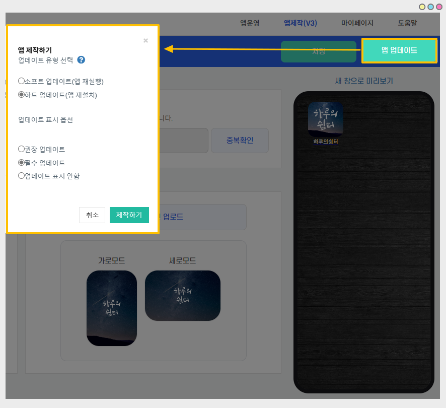

# 앱 문자열 관리

<figure><figcaption></figcaption></figure>

\[앱 문자열 관리]는 앱에서 표시 및 사용되는 모든 문구와 메시지를 확인할 수 있는 관리 페이지이구요. \_2019년 6월 오픈 기능

**앱에서 사용되는 컨텐츠 문구를 관리자가 직접 수정하여 이용할 수 있으며, 외국어로 변경하여 이용이 가능합니다.**

**따라서 앱 문자열 관리 화면에서 앱에서 사용되는 모든 문구를 확인할 수 있구요.**

**모든 내용을 변경하거나 원하는 문구만 찾아서 변경 하는 등 관리자가 직접 수정할 수 있는 접근 권한을 확장시켰습니다.**

아래 이용방법을 확인해주세요\~!

<figure><figcaption></figcaption></figure>

##  1. 앱 문자열 관리란?

[앱운영→서비스관리→앱 문자열 관리](http://www.swing2app.co.kr/view/app\_resourecs\_manager)로 이동하면 앱에서 표시 및 사용되는 모든 문구와 메시지를 확인할 수 있습니다.&#x20;

**-새롭게 오픈된 \[앱 문자열 관리] 화면에서는 앱에서 사용되는 모든 문구를 사용자가 직접 원하는 문구로 수정하여 사용할 수 있구요.**

**-한국어로 기본 셋팅된 앱 문구를 외국어(영어, 일본어, 중국어 등)로 변경하여 제작할 수도 있습니다.**

\*\*기존에 커스터마이징(앱개발)으로 진행되었던 앱 문구 변경 및 외국어 전환은 이제 개발을 하지 않아도 사용자가 직접 내용을 수정하여 사용할 수 있습니다.

<figure><figcaption></figcaption></figure>

##  2. 메시지 내용 수정 방법

1\) 메시지 내용에서 \[수정] 버튼을 눌러주세요.

2\) 문자열 수정 창에서 메시지 내용을 수정 한 뒤

3\) \[수정하기] 버튼을 눌러주시면 됩니다.

4\) 메시지 내용이 변경된 것을 확인할 수 있습니다.

<figure><figcaption></figcaption></figure>

5\) 앱제작 이동 → \[앱 업데이트] 버튼을 눌러서 앱 새버전으로 업데이트 해주세요.

<mark style="color:red;">\*문구만 수정해서는 앱에 반영되지 않으며, 반드시 앱제작 페이지에서 새 버전으로 앱 업데이트 해주셔야 합니다.</mark>


<mark style="color:blue;">**업데이트 유형 안내**</mark>

\-플레이스토어, 앱스토어 등에 앱이 출시되어 있을 경우: 하드 업데이트(앱 재설치) 선택 해주시구요. 새 버전앱 다시 스토어에 업데이트 해주셔야 합니다.&#x20;

\-무료이용 혹은 스토어 출시를 안하셨다면 : 소프트 업데이트(앱 재실행) 선택&#x20;

\-업데이트 표시 옵션은 권장, 필수 중 원하는 표시로 선택해주시면 됩니다.&#x20;


<figure><figcaption></figcaption></figure>

##  3. 운영 TIP

<mark style="color:red;">**TIP 1)**</mark> 몇 개 단어만 수정할 경우 **\*컨트롤(control) + F 버튼**을 누르면 내용을 검색하여 찾을 수 있습니다!!

<mark style="color:red;">**TIP 2)**</mark> 앱 문구 전체를 수정할 경우 \[다운로드] 버튼을 눌러서 엑셀파일로 받아주세요.

내용을 수정한 뒤 저장하고 \[업로드]로 엑셀파일을 한번에 올려주시면 수월하게 작업을 하실 수 있습니다.

<figure><figcaption></figcaption></figure>

##  4.문구 변경 후) 앱 실행화면

\[앱 문자열 관리]에서 회원가입 페이지에서 표시되는 모든 문구를 영어로 변경했구요.

앱 재제작(업데이트) 하신 뒤 새 버전으로 확인하시면, 회원가입 페이지의 한국어 문구가 모두 영어로 변경된 것을 확인할 수 있습니다.

<mark style="color:red;">**\[안내사항]**</mark>

앱에서 수정된 문구를 적용하기 위해서는 앱 업데이트가 필요합니다. (소프트 업데이트도 가능합니다. )

문구 내용을 수정한 뒤 앱제작 페이지 – \[앱제작요청]을 해서 앱을 새버전으로 업데이트 하셔야 앱에도 수정 내용이 반영이 됩니다.

따라서 문자열 관리 화면에서 내용 수정을 모두 완료 하신 뒤 최종적으로 \[앱제작요청] 버튼을 눌러서 앱 업데이트를 해주시기 바랍니다.
