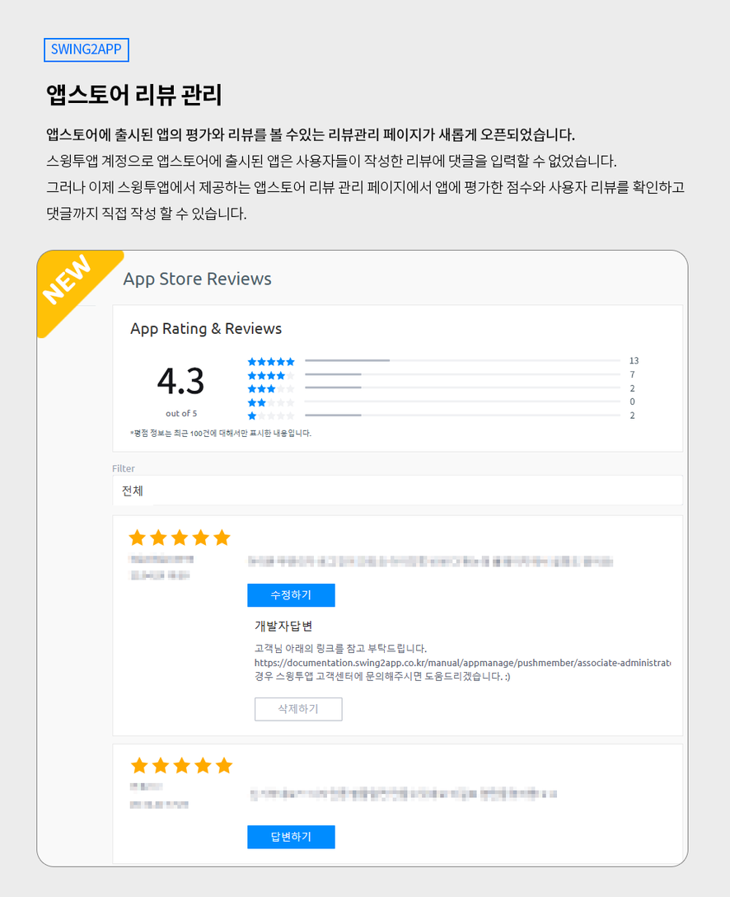
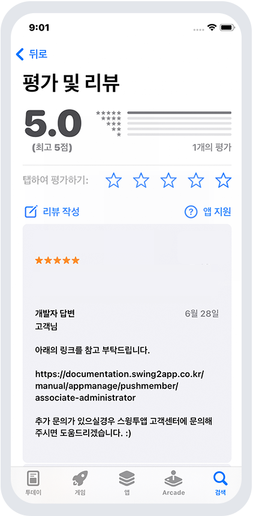

# 앱스토어 리뷰 관리

***

## 1.앱스토어 리뷰 관리란?

<figure><figcaption></figcaption></figure>

앱스토어의 경우, 애플 개발자 계정으로 로그인 된 앱스토어 커넥트(appstoreconnect)에서 앱 리뷰에 대한 댓글 작성이 가능합니다.

따라서 사용자 계정이 아닌 스윙투앱 계정으로 앱스토어에 등록된 앱은 리뷰 확인 및 댓글 작성이 불가했습니다.

스윙투앱에서 제공하는 '앱스토어 리뷰 관리 페이지'에서 앱 평가 점수와 사용자 리뷰를 확인하고 댓글까지 직접 작성할 수 있습니다.

리뷰에 대한 댓글을 작성하여 제출하면 앱스토어에 연동되며, 앱스토어 어플에서 입력된 댓글을 확인할 수 있습니다.

<mark style="color:red;">\*리뷰에 작성된 댓글이 앱스토어에서 보여지기 까지는 최대 24시간이 걸릴 수 있습니다.</mark>

***

## 2.이용 조건

**\*앱스토어 리뷰 관리 페이지는 먼저 앱스토어에 앱이 출시 되어있어야 이용 가능하며, 아래 조건에 해당하는 분들만 이용 가능합니다.**

1\)일반 프로토타입 앱 이용시

확장형 이용권, 프리미엄 이용권을 구매하신 분들에게만 제공됩니다.(기본형, 알뜰형 등의 상품은 이용 불가)

2\)푸시앱 이용시

푸시 무제한 유료앱 이용시에만 이용 가능합니다. (기본형 이용권은 이용 불가)

\*웹뷰앱은 이용 불가합니다.

구매하신 이용권 상관없이 웹뷰앱에서는 제공이 되지 않습니다.

***

## 3.이용방법

<figure><figcaption></figcaption></figure>

앱운영 – 서비스관리 – 앱스토어 리뷰 관리 메뉴 이동하면 확인 가능합니다.

1\)앱스토어 리뷰 페이지에서는 해당 앱에 매겨진 평균 평점과 별점 표시

2\)해당 앱에 작성된 리뷰 글을 모두 모두 볼 수 있습니다.

3\)리뷰글에 댓글을 달면(답변하기 버튼), 바로 앱스토어 및 아이폰으로 연동이 되어 보여집니다.

4\)필터 기능을 이용하여 별점 별 5점, 4점, 3점 .... 등을 선택해서 볼 수 있습니다.

<mark style="color:red;">\*평점 정보는 모든 히스토리를 다 불러오지는 못하고 최근 100건에 대해서만 표시됩니다.</mark>

<mark style="color:red;">\*5점 만점이며 해당 앱에 매겨진 평점이 표시됩니다.</mark>

### <mark style="color:blue;">1)답변 작성하기</mark>

<figure><figcaption></figcaption></figure>

(1)답변하기 버튼 선택

(2)댓글(내용) 입력

(3)Submit(제출) 버튼을 누르면 작성 완료!

<mark style="color:red;">**\*중요 \***</mark>

리뷰에 작성된 댓글이 앱스토어에서 보여지기 까지는 최대 24시간이 걸릴 수 있어요.

### <mark style="color:blue;">2)답변 수정하기</mark>

<figure><figcaption></figcaption></figure>

작성된 댓글을 수정할 때는 \[수정하기] 버튼을 선택해서 내용을 수정 입력할 수 있습니다.

<mark style="color:red;">**\*중요\***</mark>

리뷰에 작성된 댓글이 앱스토어에서 보여지기 까지는 최대 24시간이 걸릴 수 있어요.

***

## 4.아이폰 -앱스토어에서 댓글 확인하기

<figure><figcaption></figcaption></figure>

앱스토어 어플에서 앱 검색 후 - 평가 및 리뷰 버튼을 탭해주세요.

리뷰 관리에서 작성된 댓글을 확인할 수 있습니다.

***

## 5. 안내사항

1\)앱스토어에 앱이 출시된 경우에만 이용 가능합니다.

무료버전앱 혹은 유료앱이지만 플레이스토어만 출시해서 이용하시는 분들은 해당 기능 접근이 불가합니다.

2\)스윙투앱 계정이 아닌, 사용자의 애플 개발자 계정으로 등록하신 분들도 이용 가능합니다.

앱스토어 리뷰 관리 페이지에서 보다 편하게 리뷰 확인 및 댓글 입력이 가능합니다.

3\)앱에 달린 리뷰가 없을 경우 아무 내용도 표시 되지 않습니다.

4\)평점 정보는 모든 히스토리를 다 불러오지는 못하고 최근 100건에 대해서만 표시됩니다.

5\)이용조건에 해당 되는 분들에 한해 이용이 가능하오며, 이용조건 내용을 확인해주시기 바랍니다.

6\)리뷰에 작성된 댓글이 앱스토어에서 보여지기 까지는 최대 24시간이 걸릴 수 있습니다. (실시간 반영이 아닙니다)


