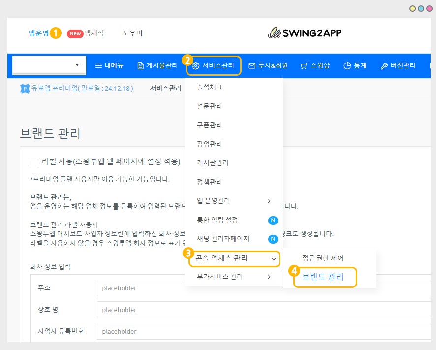
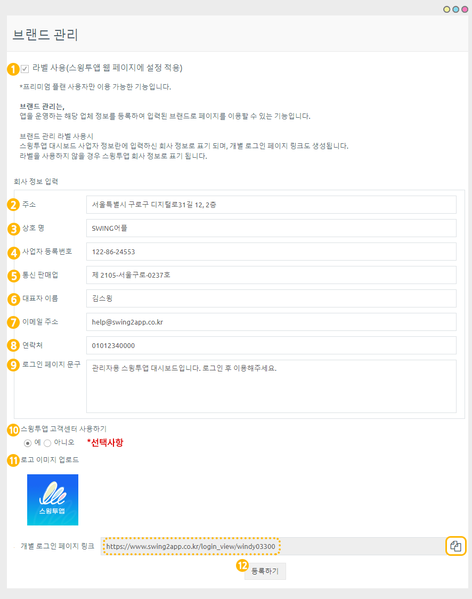
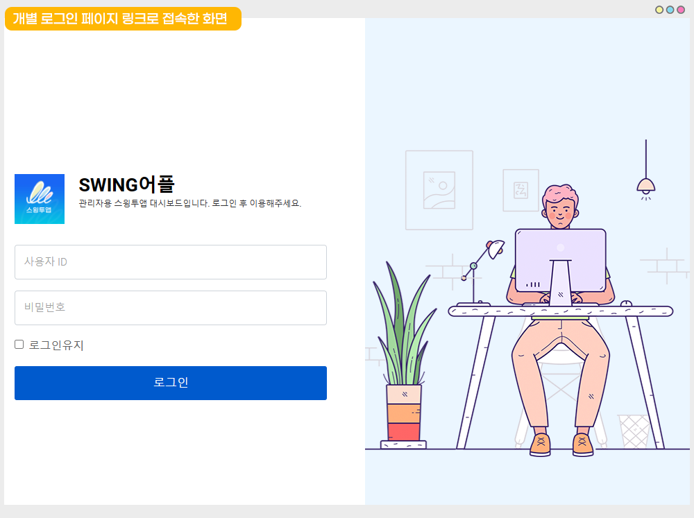
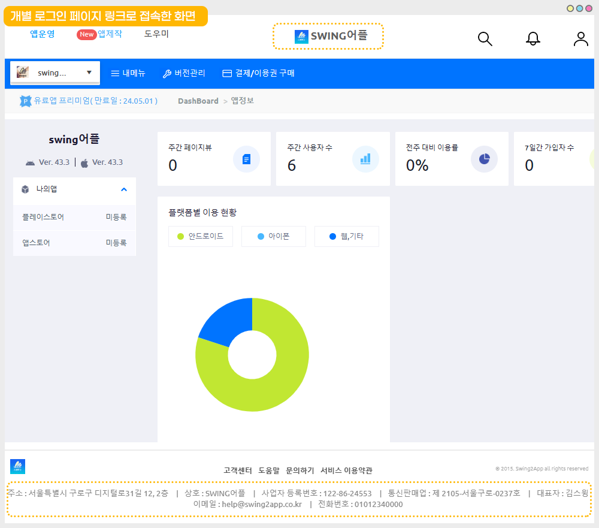
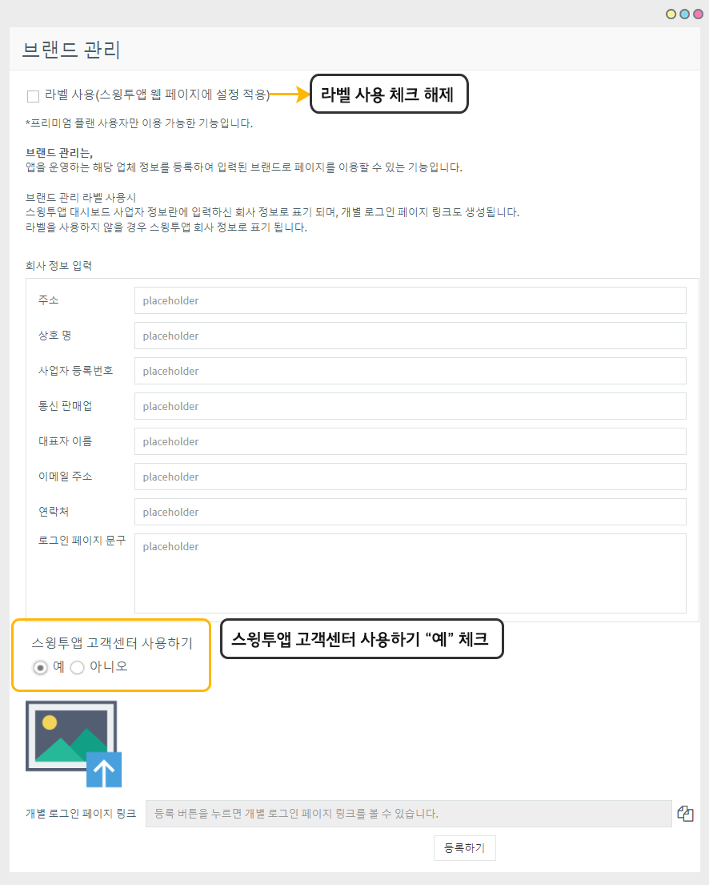
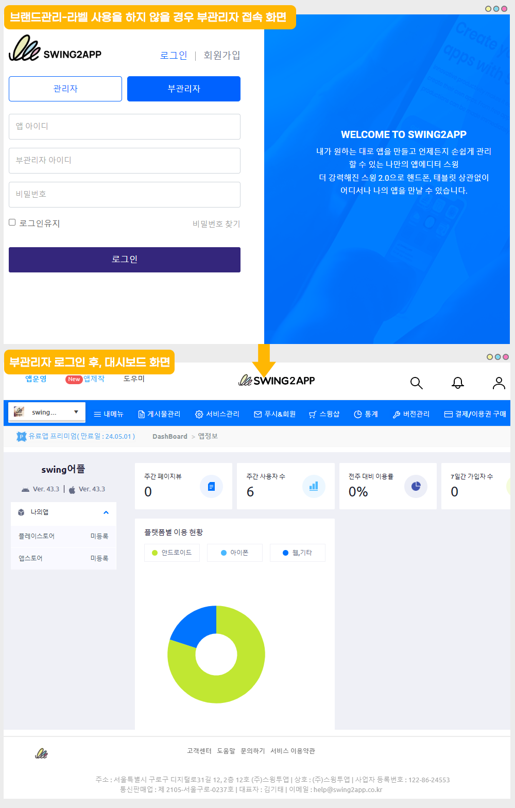

# 브랜드관리 - 라벨 사용

***

<mark style="color:red;">해당 기능은 "일반 프로토타입 앱" - "프리미엄 유료앱 이용권" 사용자만 이용 가능합니다.</mark>&#x20;


**브랜드관리 이용 목적**

스윙투앱 서비스 이용시, 앱 제작 및 계정을 소유한 관리자가 있구요.

앱을 함께 관리하는 부관리자를 여러명 설정하여 운영할 수 있습니다.

부관리자 역시 관리자와 동일한 역할을 수행할 수 있고, 스윙투앱 사이트 대시보드에도 로그인하여 접속할 수 있습니다.&#x20;

이때, 특정 업체에서 이용하는 앱을 대행하여 제작을 했거나 매니지먼트가 따로(앱제작사) 있을 경우 업체정보를 직접 수정하여 해당 브랜드에 맞게 대시보드 정보를 구성할 수 있습니다.&#x20;



**브랜드관리 - 라벨 사용이란?**

브랜드 관리는, 앱을 운영하는 해당 업체 정보를 등록하여 입력된 브랜드로 페이지를 이용할 수 있는 기능입니다.

라벨 사용시,&#x20;

스윙투앱 대시보드 사업자 정보란에 입력하신 회사 정보로 표기 되며, 개별 로그인 페이지 링크도 생성됩니다.&#x20;

라벨을 사용하지 않을 경우 개별 페이지는 생성되지 않고, 회사 정보 역시 스윙투앱 정보로 표기 됩니다.



**사용 조건**

1\)일반 프로토타입 앱 사용자 대상

2\)스윙투앱 유료앱 이용권 중 "프리미엄 이용권" 사용에 한해 이용 가능합니다.

3\)앱에 설정된 부관리자가 있어야 합니다.&#x20;

부관리자를 아직 설정하지 않았다면 매뉴얼을 보시고, 부관리자를 지정해주세요.&#x20;

[부관리자 설정방법](https://documentation.swing2app.co.kr/manual/appmanage/pushmember/associate-administrator)

\*부관리자라는 명칭이 있는 것이 아니라서 부관리자로 설정된 회원들은 모두 관리자로 보여집니다.

\[앱을 개발한 사용자: 관리자]로 통칭하며, 관리자가 권한을 부여한 사용자를 부관리자로 통칭하기 때문에 편의상 부관리자로 부릅니다.


***

## 1.브랜드 관리-라벨 사용하기

<figure><figcaption></figcaption></figure>

[앱운영 - 서비스관리 - 콘솔 액세스 관리 - 브랜드관리](https://www.swing2app.co.kr/view/brand\_setting\_view) 메뉴로 이동합니다.

<mark style="color:red;">"일반 프로토타입 앱" - "프리미엄 이용권" 사용자만 이용이 가능한 기능입니다.</mark>&#x20;

<mark style="color:red;">프리미엄 외 다른 이용권을 구매하여 사용중인 분들은 해당 메뉴 이용이 불가합니다.</mark>

### 1)라벨 사용 정보 입력

<figure><figcaption></figcaption></figure>

1\)라벨 사용 체크&#x20;

\--회사 정보 입력--

2\)주소 입력

3\)상호명 입력

4\)사업자 번호 입력

5\)통신 판매업 정보 입력

6\)대표자 이름 입력

7\)이메일주소 입력

8\)연락처 입력

9\)로그인 페이지 문구 입력

10\) 스윙투앱 고객센터 사용하기 - '아니오'에 체크해주세요.&#x20;

11\)로고 이미지 업로드 선택해서, 브랜드 로고 혹은 심볼 이미지를 등록해주세요.

12\)등록하기 버튼을 누르면 해당 정보로 저장됩니다.


모든 정보 필수 입력 아닙니다.&#x20;

**\*정보를 모두 입력하지 않아도 되며, 기재가 가능한 내용만 입력하셔도 됩니다.**&#x20;



**등록을 하면, 개별 로그인 페이지 링크가 생성됩니다.**&#x20;

복사 버튼을 선택하여, 해당 링크 주소를 부관리자에게 공유하여 접속해주세요.&#x20;


### 2)개별 로그인 페이지 접속&#x20;

<figure><figcaption></figcaption></figure>

복사한 개별 로그인 페이지로 접속시, 위의 화면과 같은 랜딩페이지가 열립니다.

위에서 입력한 로고 이미지 및 상호명이 표시됩니다.&#x20;

그리고 부관리자 탭으로 이동해서 로그인했던 일반 로직과 달리 **해당 관리자의 아이디, 비밀번호만 입력하면 로그인이 가능합니다.**&#x20;

### 3)개별 대시보드 화면

<figure><figcaption></figcaption></figure>

로그인하여 접속한 대시보드 화면입니다.

마찬가지로 입력한로고 이미지, 상호명으로 사이트 내 브랜드 정보가 바뀐 것을 확인할 수 있구요.

대시보드 화면 하단에도 입력한 회사 정보(주소, 상호명, 사업자번호, 연락처 등)로 업체 정보가 보여집니다.


<mark style="color:blue;">**활용 TIP**</mark>

스윙투앱의 회사 정보가 아닌, 앱을 운영하는 운영사의 회사 정보로 브랜드를 관리해야 할 경우 유용하게 사용할 수 있구요.

개별 로그인 페이지가 생성되기 때문에 여러명의 부관리자와 함께 앱을 운영할 경우 보다 간편하게 이용할 수 있습니다.&#x20;


***

## 2.라벨 사용하지 않는 경우

<mark style="color:orange;">**\*라벨관리를 사용하지 않을 경우는 어떻게 화면이 보여지나요?**</mark>

<mark style="color:orange;">**브랜드관리-라벨 사용을 하지 않을 경우 보여지는 화면에 대해서 안내드립니다.**</mark>&#x20;

### **1)라벨 사용 체크 해제**

<figure><figcaption></figcaption></figure>

라벨 사용 체크 해제 한 뒤, 스윙투앱 고객센터 사용하기-"예"에 체크하고 \[등록하기] 선택해주세요.

### 2)부관리자 접속 화면

<figure><figcaption></figcaption></figure>

라벨을 사용하지 않을 경우는&#x20;

스윙투앱 홈페이지로 접속 후, 부관리자 탭을 선택해서 앱 아이디, 부관리자 아이디, 비밀번호를 입력하여 로그인할 수 있구요.

로그인하여 들어온 대시보드에서도 스윙투앱 회사 정보로 보여집니다.&#x20;

아무 셋팅도 하지 않을 경우는 위의 이미지처럼 보이는 것이 일반적입니다.&#x20;

부관리자는 스윙투앱 홈페이지 접속 후, 부관리자 탭에서 로그인하여 접속하실 수 있구요.

대시보드 화면 역시 스윙투앱 홈페이지 대시보드와 동일하게 보여집니다. (관리자 화면과 동일)

