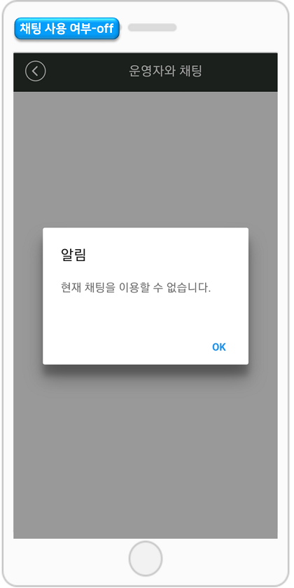
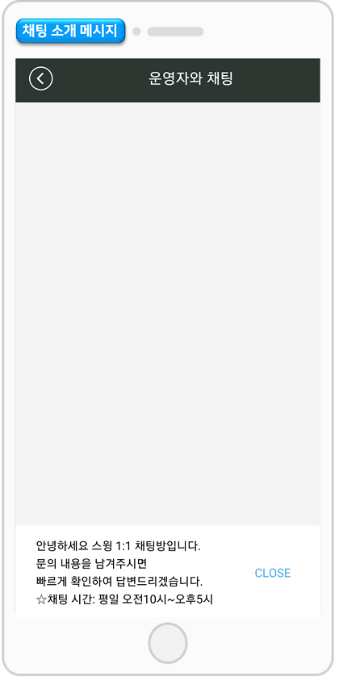
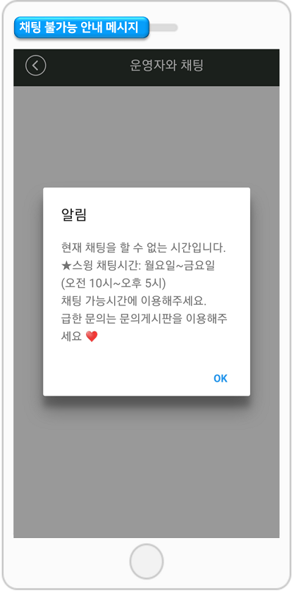
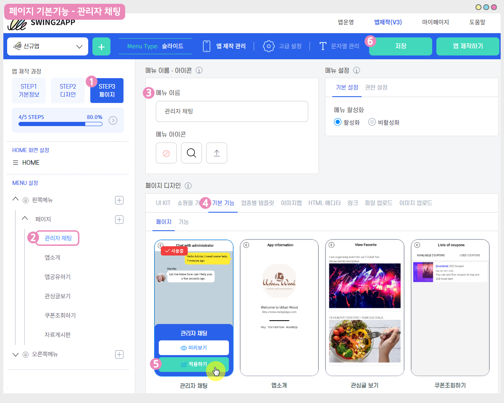

# 채팅 관리자 페이지 - 채팅설정

**채팅 관리자 페이지 – 채팅 설정 이용방법**

채팅 설정은 관리자가 앱 채팅방을 직접 관리할 수 있는 메뉴이구요.

\*채팅방 소개 메시지 입력, 채팅 가능 요일/시간 설정, 채팅 불가능 메시지를 작성 하여 이용할 수 있습니다.

매뉴얼을 통해서 채팅 설정 이용방법을 확인해주세요.

<figure><figcaption></figcaption></figure>

## 1. 채팅 관리자 페이지 이동&#x20;

스윙 홈페이지 접속 후 [**앱운영 페이지에서 → 서비스관리 →  채팅 관리자페이지 →  채팅 설정** ](http://www.swing2app.co.kr/view/admin\_chatting\_setting)으로 이동합니다.&#x20;

<figure><figcaption></figcaption></figure>

## 2. 채팅 설정

**채팅 설정 페이지에서는 앱 채팅방을 관리자가 직접 관리할 수 있어요.**

\*채팅 사용 여부 , PC 알림 사용 여부를 체크 할 수 있구요.

\*채팅 소개 메시지, 채팅 가능 요일/ 시간, 채팅 불가능 메시지를 설정하고, 아래 \[설정하기] 버튼을 눌러서 저장해주세요.&#x20;

<figure><figcaption></figcaption></figure>

## 3. 채팅 설정 – 앱 실행화면

### <mark style="color:blue;">**1)채팅 사용 여부-off**</mark>

<figure><figcaption></figcaption></figure>

채팅 사용 여부를 off로 설정해놓으면 채팅방 접속시 “현재 채팅을 이용할 수 없습니다.”라는 메시지가 뜹니다.\

### <mark style="color:blue;">**2)채팅 소개 메시지**</mark>

채팅 소개 메시지를 입력하면 채팅창 실행시 소개 메시지가 뜹니다.

<figure><figcaption></figcaption></figure>

앱 실행 후 채팅방으로 들어가면, 입력해놓은 소개 멘트를 확인할 수 있어요.

### &#x20;<mark style="color:blue;">**3)채팅 불가능 안내 메시지**</mark>

채팅이 불가능한 요일, 시간을 설정해놓구요.

<figure><figcaption></figcaption></figure>

메시지를 입력해놓으면, 앱 실행시 채팅 불가능 안내 메시지 창이 뜹니다.

<figure><figcaption></figcaption></figure>

## 4. 앱에 1:1채팅을 적용하는 방법

마지막으로 1:1 채팅을 앱에 적용하는 방법을 알려드릴게요.

### <mark style="color:blue;">**1)앱제작 V3버전 이용시**</mark>

<figure><figcaption></figcaption></figure>

앱제작 화면 이동

1\)STEP3 페이지 단계로 이동합니다.

2\)새 메뉴를 만들어주세요. (+ 모양 버튼 선택하여 메뉴 추가)

3\) 메뉴 이름 입력

4\) 페이지 디자인에서 \[기본 기능] -\[페이지]를 선택해주세요.&#x20;

5\) ‘관리자 채팅’ 페이지를 찾아서 \[적용하기] 버튼을 선택해주세요.&#x20;

(페이지에 마우스 커서를 가져다 대면 적용하기 버튼이 열립니다)

6\) 화면 상단 \[저장]버튼을 누르면 앱에 적용됩니다.&#x20;

### <mark style="color:blue;">**2)앱제작 V2버전 이용시**</mark>

앱제작 페이지 – 페이지메뉴 단계로 이동합니다.

1\) \[카테고리 추가] 버튼 선택해서 새 메뉴를 만들어주세요.

2\) 메뉴명: 메뉴 이름을 입력합니다.

3\) 메뉴 유형에서 \[스윙 페이지] 선택

4\) \[링크마법사] 버튼을 선택합니다.

5\) 링크마법사 스윙 기능 창에서 \[관리자 채팅] 선택한 뒤,  \[반영] 버튼을 선택합니다.&#x20;

6\) \[적용] 버튼

7\) \[저장] 버튼 눌러주시면 완료됩니다.

