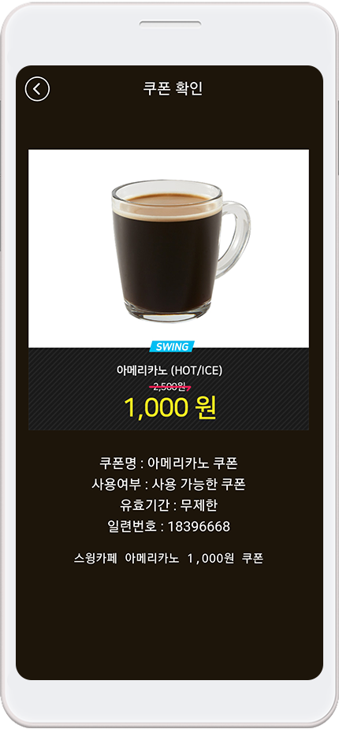
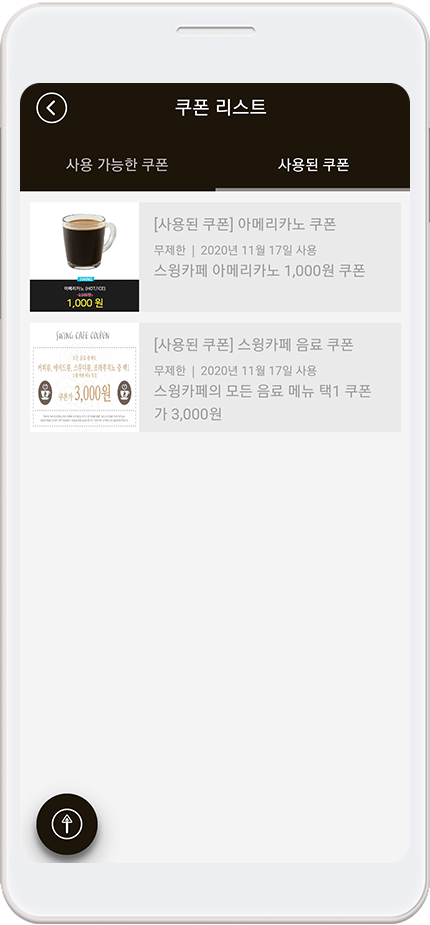
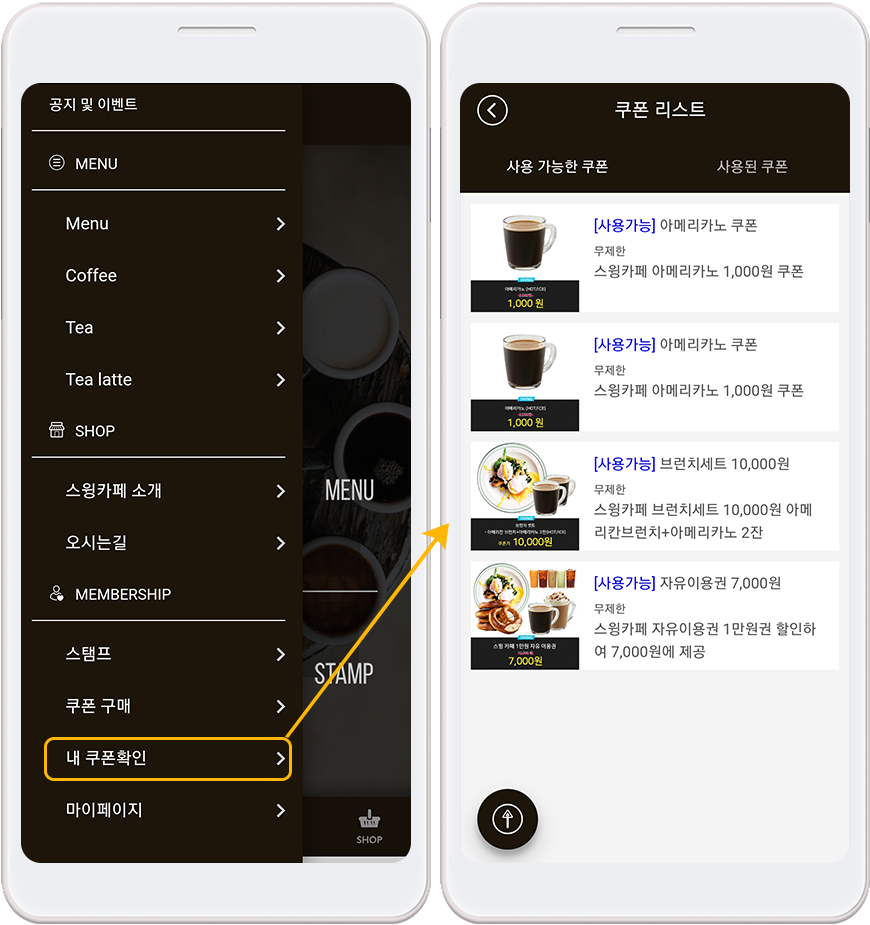
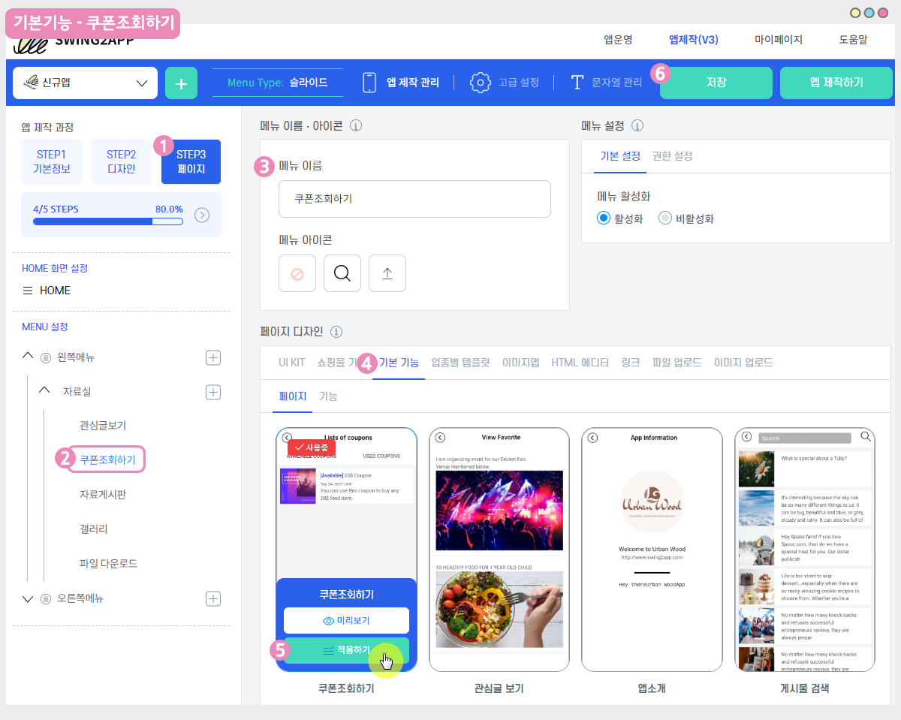

# 쿠폰관리: 쿠폰만들기, 발행하기

<figure><figcaption></figcaption></figure>

\[쿠폰관리]는 관리자가 앱을 이용하는 회원들에게 쿠폰을 발송하고 관리하는 메뉴입니다.

​적립쿠폰, 할일쿠폰, 제품 이용권 등을 관리자가 직접 만들 수 있으며 회원에게 쿠폰을 발송하여 사용할 수 있도록 관리할 수 있습니다.

쿠폰을 만드는 방법, 사용자에게 쿠폰을 발행하는 방법, 앱 실행화면, 쿠폰 사용처리 등 쿠폰관리에 대한 상세 매뉴얼을 알려드리겠습니다.

<figure><figcaption></figcaption></figure>

##  STEP1. 쿠폰 만들기

가장 먼저 사용자에게 발행할 쿠폰을 만들어볼게요!

[앱운영 페이지 → 서비스관리 → 쿠폰 관리](http://www.swing2app.co.kr/view/coupon\_admin) 메뉴로 이동합니다.

쿠폰 관리 페이지의 오른쪽 상단의 \[쿠폰 추가] 버튼을 선택합니다.

쿠폰 정보 창에서 발행할 쿠폰 내용을 입력해주세요.

1\)쿠폰 이름 입력

2\)쿠폰 내용 입력

3\)유효기간 (쿠폰을 사용할 유효기간 입력 무제한 or 날짜 선택)

4\)쿠폰 이미지 등록 (정해진 사이즈는 없습니다)

5\)저장하기 버튼 선택

\*쿠폰 유효기간은 무제한 설정도 가능하구요.

캘린더 아이콘과 시계 아이콘을 선택해서 유효 날짜, 시간을 설정할 수 있습니다.

이렇게 쿠폰관리 메뉴에서는 만들어놓은 쿠폰을 확인할 수 있구요.

<mark style="color:red;">+수정 , 삭제 버튼을 통해서 쿠폰을 수정하거나 삭제할 수도 있습니다.</mark>

<mark style="color:red;">+그리고 발행된 쿠폰 내역을 확인할 수도 있으니, 쿠폰을 만들고 관리를 할 때는 해당 페이지에서 이용해주세요</mark>

쿠폰을 다 만들었다면! 아래에서 쿠폰을 사용자에게(앱 회원) 보내는 방법을 알려드릴게요.

<figure><figcaption></figcaption></figure>

##  STEP2. 쿠폰 발송하기

### <mark style="color:blue;">1.쿠폰 발송</mark>

발송하고자 하는 쿠폰을 선택해주시구요.

왼쪽 상단의 **\[쿠폰 발송]** 버튼을 선택해주세요.

쿠폰 보내기 창에서&#x20;

1\)수신자 설정 선택&#x20;

2\)푸시를 보내고자 하는 회원을 선택합니다.

**\*회원은 전체 사용자에게 모두 보낼 수 있구요. 원하는 사용자만 선택해서 보낼 수 있습니다.**

3\)\[쿠폰보내기] 항목을 선택해주세요.

4\)푸시 메시지 제목

5\)푸시 메시지 내용

\*푸시 메시지 제목, 내용은 고정으로 셋팅되어서 제공되요. 그대로 보내셔도 되고 수정해서 입력하셔도 됩니다 ^^

6\)이미지 등록 (이미지 사이즈 1000px\*500px)

\* 푸시 발송 이미지는 필수가 아닌 선택사항이에요.

아이폰에서는 푸시 이미지가 보이지 않기때문에 이미지를 넣어도 아이폰 사용자는 보이지 않습니다.

7\)\[쿠폰발송하기] 버튼을 선택합니다.

***

### <mark style="color:blue;">**2.앱 실행화면 - 쿠폰 발송된 화면**</mark>

**1)쿠폰푸시 알림**

쿠폰 발행시, 앱 푸시 알림이 들어오기 때문에 사용자는 푸시 알림을 통해서 쿠폰이 발행되었음을 알 수 있어요.

푸시 알림을 선택해주세요.

**2)쿠폰 확인**

<figure><figcaption></figcaption></figure>

이렇게 관리자에게 발급 받은 쿠폰을 확인할 수 있습니다.

**3)사용된 쿠폰 확인**

<figure><figcaption></figcaption></figure>

앱에 쿠폰조회 메뉴를 적용하시면, 사용자는 쿠폰조회 페이지에서 자신이 받은 쿠폰을 확인할 수 있어요.

**4)쿠폰조회 메뉴에서 확인하기**

<figure><figcaption></figcaption></figure>

앱 실행 후 \[내 쿠폰확인] 메뉴를 선택하면, 쿠폰조회 페이지가 열립니다.

앱에서 쿠폰을 발급받으면, 사용 가능한 쿠폰 목록에 받은 쿠폰이 표시됩니다.

\*발급받은 쿠폰이 없을 경우 “쿠폰이 존재하지 않습니다”라는 메시지가 표시되요.

### <mark style="color:blue;">**3.쿠폰조회 메뉴는 어디서 만들면 되나요?**</mark>

**위의 사용자 앱을 보면, 쿠폰조회 메뉴에서 사용 가능한 쿠폰, 사용된 쿠폰을 확인할 수 있어요.**

이 메뉴는 스윙 앱제작 - 페이지 단계에서 적용 가능합니다.&#x20;

**1)앱제작 V3버전 이용시**

<figure><figcaption></figcaption></figure>

1\)앱제작 화면-STEP3 페이지 단계로 이동합니다.

2\)새 메뉴를 만들어주세요. (+ 모양 버튼 선택하여 메뉴 추가)

3\) 메뉴 이름 입력

4\) 페이지 디자인에서 \[기본 기능] -\[페이지]를 선택해주세요.&#x20;

5\) ‘쿠폰조회하기’ 페이지를 찾아서 \[적용하기] 버튼을 선택해주세요. (페이지에 마우스 커서를 가져다 대면 적용하기 버튼이 열립니다)

6\) 화면 상단 \[저장]버튼을 누르면 앱에 적용됩니다.

**2)앱제작 V2버전 이용시**

1\) \[카테고리 추가] 버튼 눌러서 새 메뉴를 추가해주세요.

2\) 메뉴명: 메뉴 이름을 입력합니다.&#x20;

3\) 메뉴유형: 스윙페이지 선택 후

4\) \[링크마법사] 버튼을 선택합니다.

5\) 링크마법사 스윙 기능 창에서 \[쿠폰조회하기] 선택한 뒤,  \[반영] 버튼을 선택합니다.&#x20;

6\)  \[적용] 버튼

7\) \[저장] 버튼 눌러주시면 완료됩니다.

<figure><figcaption></figcaption></figure>

##  **STEP3.** **쿠폰 사용처리 방법**

**그럼 관리자가 쿠폰을 사용처리 하는 방법에 대해서 알려드릴게요.**

### <mark style="color:blue;">**1.쿠폰 사용처리하기**</mark>

쿠폰관리 페이지에서

1\)\[쿠폰사용하기] 버튼 선택

2\)쿠폰 일련번호를 입력해주세요.

3\)\[쿠폰 조회 및 사용]을 선택하면 완료됩니다.

쿠폰 사용처리가 완료됩니다.

### <mark style="color:blue;">**2.발행한 쿠폰 이력 확인**</mark>

쿠폰을 발행한 뒤 쿠폰 목록 앞에 있는 삼각형 아이콘을 선택하면 쿠폰 발행 이력을 확인할 수 있습니다.

### <mark style="color:blue;">**3.쿠폰 사용처리 후 사용자 앱 실행화면**</mark>

<figure><figcaption></figcaption></figure>

사용자계정으로 다시 앱을 실행한 뒤 – 쿠폰 조회 페이지 \[사용된 쿠폰] 메뉴에서 사용처리 된 것을 확인할 수 있습니다.

### <mark style="color:blue;">**4.앱에서 쿠폰처리하기(관리자 메뉴)**</mark>

**\[앱 관리자 메뉴 이용]**

<mark style="color:red;">**이용방법**</mark>

앱 실행 후 \[설정] 메뉴 → \[관리자 로그인]선택 → 스윙계정으로 로그인 → \[관리자 메뉴] 창에서 → \[쿠폰사용하기] 선택

→ 사용자 쿠폰번호를 확인하여 쿠폰번호 입력

**\*앱 관리자메뉴에서 쿠폰 사용처리를 하는 방법은 아래 매뉴얼을 확인해주세요.**



<figure><figcaption></figcaption></figure>

## STEP4. 쿠폰 관리 이용방법 정리

쿠폰을 만들고 이용하는 방법을 다시 정리해드릴게요!

<mark style="color:blue;">**1. 쿠폰 만들기**</mark>

앱운영 페이지 → 서비스관리 → 쿠폰관리 → \[쿠폰 추가] 버튼을 선택해서 발행할 쿠폰 내용을 입력합니다.

<mark style="color:blue;">**2. 쿠폰 발행하기**</mark>

쿠폰 관리 페이지에서 → \[쿠폰 발송] 버튼을 선택 → 쿠폰 보내기 창에서 1)수신자 설정 선택 → 2) 푸시를 보내고자 하는 회원을 선택

→ 3)\[쿠폰보내기] 항목을 선택해주세요.→ 4)푸시 메시지 제목 → 5)푸시 메시지 내용 → 6)이미지 등록 → 7)\[쿠폰발송하기] 버튼 선택

<mark style="color:blue;">**3. 쿠폰 사용처리 하기**</mark>

쿠폰관리 페이지에서 1)\[쿠폰사용하기] 버튼 선택→ 2)쿠폰 일련번호를 입력 → 3)\[쿠폰 조회 및 사용]을 선택하면 완료됩니다.

혹은 앱에서 앱 관리자 메뉴를 선택해서, 쿠폰 사용처리를 할 수 있습니다.

***
