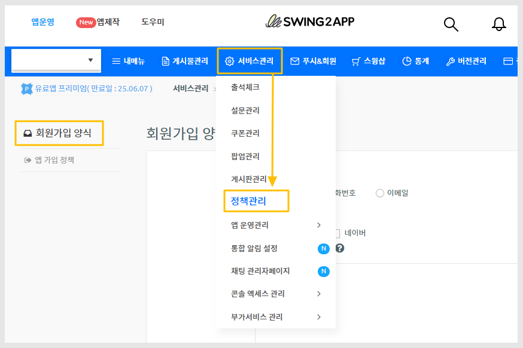

# 회원가입 양식 - 외부 로그인 연동


외부 로그인 연동은 스윙투앱 유료앱 이용 사용자분들 중, 확장형 이용권과 프리미엄 이용권 사용시에만 적용이 가능합니다.

무료앱은 사용이 불가하며, 유료앱 이용중이라도 해당 이용권이 아닌 경우는 이용이 불가한 점 유념해주세요.


***

## 1.외부 연동 로그인 적용하기

<figure><figcaption></figcaption></figure>

1\)[앱운영-서비스관리-정책관리](https://www.swing2app.co.kr/view/app\_policy)\[회원가입 양식] 화면으로 이동합니다.

2\)외부 연동 로그인 기능&#x20;

<figure><figcaption></figcaption></figure>

카카오톡, 구글, 네이버 3개 기능 제공하고 있습니다.

여기서 모든 로그인 기능을 다 연동해서 사용하셔도 되고, 필요한 기능만 선택해서 연동할 수 있습니다.&#x20;

3\)각 서비스별 로그인 연동 방법은 아래 가이드를 확인해주세요.







4\)키값 및 ID 값을 해당 서비스별로 입력 후, 정책 설정하기 버튼을 선택해주세요.

5\)<mark style="color:red;">\*앱 업데이트가 필요합니다\*</mark> 앱제작 화면 이동- 앱 업데이트 버튼 선택해주세요.

\-업데이트 받아서 확인시 적용된 로그인 확인 가능합니다.&#x20;

\-앱이 플레이스토어, 앱스토어 등에 출시되어 있다면 업데이트 된 버전을 다시 제출해서 승인받아야 합니다.

***

## 2.앱 실행화면

<figure><figcaption></figcaption></figure>

***


**안내사항**

1\)해당 기능은 일반 프로토타입 앱 사용하시는 분들이 이용 가능합니다. (탑, 푸터, 슬라이드, 드롭다운 등)

웹사이트를 적용한 웹뷰, 푸시앱은 해당 없습니다.

2\)무료앱은 적용 불가합니다.

3\)유료앱 이용중이라도, 확장형 이용권 or 프리미엄 이용권이 아닐 경우 사용이 불가합니다.

4\)로그인 셋팅 후 반드시 업데이트 후 이용해주시기 바랍니다.


