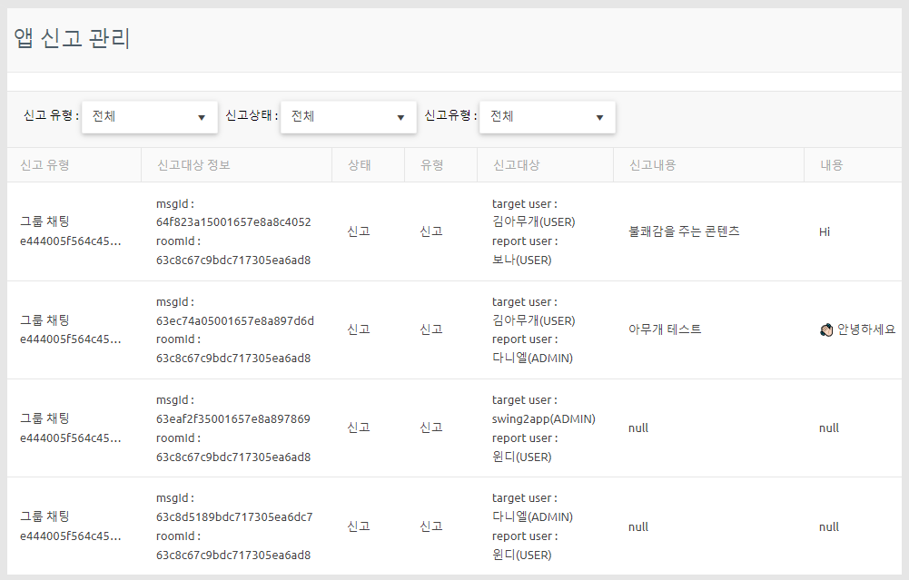
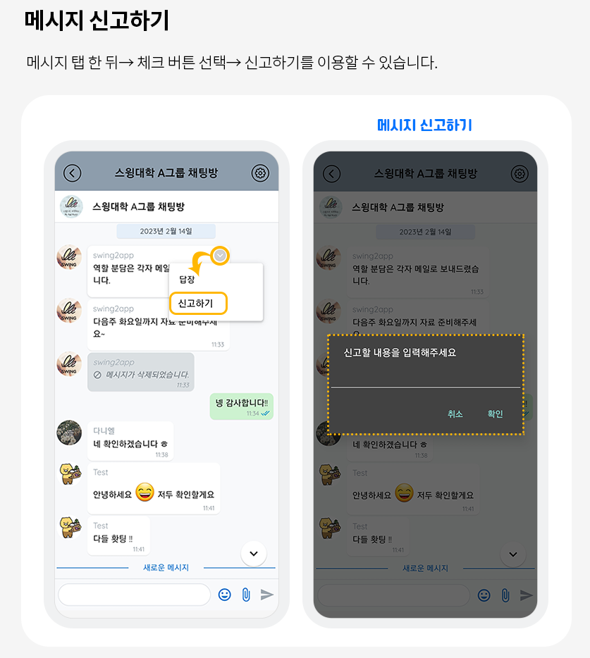
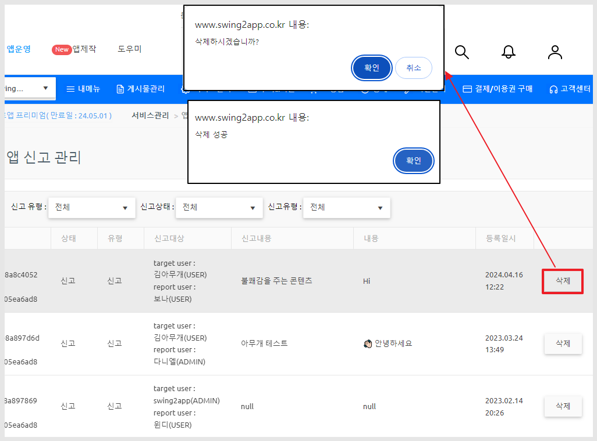
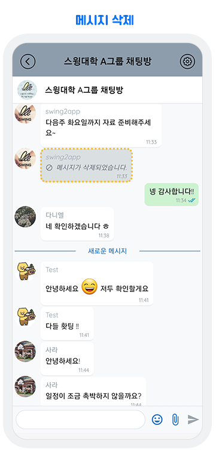

# 앱 신고 관리

***

## 1.앱 신고 관리

그룹채팅방에서  메시지 신고를 할 수 있구요.&#x20;

신고가 접수되면, 앱 신고관리에서 접수된 신고글을 확인할 수 있습니다.&#x20;

<figure><figcaption></figcaption></figure>

[앱운영 → 서비스관리→ 앱운영관리 ](http://www.swing2app.co.kr/view/app\_report\_manage)[→](http://www.swing2app.co.kr/view/app\_report\_manage)[앱  신고 관리 페이지](http://www.swing2app.co.kr/view/app\_report\_manage)에서 확인이 가능합니다.

<figure><figcaption></figcaption></figure>

그룹채팅방 신고 기능이 제공되고 있구요.&#x20;

그룹채팅방에서 신고를 하여 접수가 되면, 관리자 페이지인 '앱 신고 관리' 페이지에서 신고 접수된 리스트를 확인할 수 있습니다.&#x20;

***

## 2.그룹채팅방에서 신고는 어떻게 할 수 있나요?

<figure><figcaption></figcaption></figure>

ㄱ

메시지에 대한 신고 기능이 제공되고 있습니다.

메시지 탭 한 뒤→ 체크 버튼 선택→ 신고하기 기능을 이용할 수 있습니다.

***

## 3.신고글 삭제

관리자가 신고글을 삭제하면, 그룹 채팅방 메시지에서도 신고 접수된 글이 삭제됩니다.&#x20;

<figure><figcaption></figcaption></figure>

신고글 화면 오른쪽 끝까지 스크롤하면 삭제 버튼이 있습니다.&#x20;

삭제 버튼을 선택해서 신고된 글을 삭제할 수 있습니다.&#x20;

<figure><figcaption></figcaption></figure>

앱 실행- 그룹채팅방 확인시 신고 접수된 글이 삭제된 것을 확인할 수 있습니다.


그룹채팅방은 여러 사용자들이 접속하여 이용하는 공간이기 때문에 누군가가 신고를 할 경우 즉시 글이 삭제 되지 않습니다.

\*정상적인 글을 악의적인 의도로 신고할 수도 있기 때문

따라서 관리자가 앱 신고 관리 대시보드에서 신고 접수된 글을 확인 삭제를 할 지, 신고 취소를 할지 선택할 수 있습니다.&#x20;


