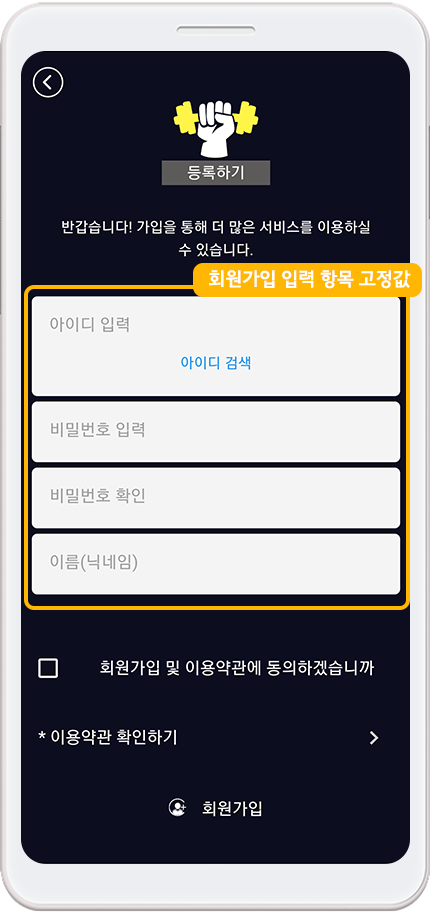

# 회원가입 양식 - 가입 항목 추가하기

**앱 회원가입 양식- 회원가입 입력 항목을 추가하여 앱에 적용하는 방법**

회원가입 양식은 별도로 설정하지 않아도 기본적으로 ‘아이디, 비밀번호, 사용자 이름’을 회원가입에서 수집합니다.

이 외에 관리자가 앱 사용자들에게 추가로 받고 싶은 정보가 있다면 회원가입양식에서 항목을 추가로 입력해서 설정할 수 있습니다.

회원가입 양식 설정에서 가입 항목을 추가하는 방법을 아래 매뉴얼을 통해 확인해주세요.

.PNG>)

\
 **회원가입 양식 설정 – 회원 가입 항목 추가하기**

[앱운영- 서비스관리- 정책관리-회원가입 양식](http://www.swing2app.co.kr/view/app\_policy)으로 이동합니다.

회원가입시 사용자에게 물어볼 수 있는 질문(항목)을 회원가입 양식 설정 페이지에서 추가할 수 있습니다.

입력 정보 – 이름, 생일, 이메일, 집주소, 성별, 전화번호를 고정 질문으로 제공하고 있구요.

그외 추가하고 싶은 정보는 ‘사용자 정의’를 선택해서 추가할 수 있습니다.

&#x20;

**\[제공하는 정보]**

\* 항목명칭 : ‘사용자정의’ 입력정보를 선택한 경우, 입력정보의 이름을 입력합니다.

\* 입력정보선택 : 입력하는 정보 형태가 일반적인 경우 이미 만들어진 입력정보(ex : 이름, 생일, 이메일 등..)를 선택하면 해당 항목에 맞는 입력양식으로 정보를 받게 됩니다.

하지만 다르게 구성(ex : 결혼기념일, 회사메일주소, 사용하는 휴대폰 기종 등..)하고싶은 경우에는 ‘사용자정의’를 선택 하셔서 항목명칭, 답변입력UI형태를 설정 해주시면 됩니다.

\* 필수입력여부 : 해당 항목을 입력해야만 가입이 가능하도록 설정합니다.

\* 답변입력UI형태 : ‘사용자정의’ 입력정보를 선택한 경우, 답변형태에 맞는 입력 UI(사용자 인터페이스)를 설정합니다.

예를 들어 결혼기념일의 경우, 항목명칭은 결혼기념일로 입력, 답변입력UI형태는 날짜를 선택하시면 됩니다.

&#x20;

**\[답변입력 UI 항목]**

1\. 전화번호 : 숫자만 입력할 수 있는 답변형태로 제공합니다.

2\. 생일 : 연도, 월, 일을 선택할 수 있습니다.

3\. 이메일 : 메일주소형식이 아닌 경우를 걸러낼 수 있습니다.

4.주소 : 주소입력형식을 제공합니다.

5.단문작성 : 간단한 문장, 단어를 입력할 수 있는 입력박스를 제공합니다.

6\. 긴문장작성(서술형) : 장문의 답변을 요구 할 때 쓰이는 입력박스를 제공합니다.

7\. 목록 중 선택 : 여러 개 항목 중 하나를 선택하게 하고 싶을 때 쓰입니다.

콤마(,)를 사용하여 항목을 구분해주세요.(ex : 사과,귤,배)

8\. (고급)정규식 텍스트 : 답변형태가 위에서 제공하는 답변입력 UI형태가 아닐 때, 정규표현식을 입력하여 답변의 형태를 제한 할 수 있습니다.

(ex : 이메일 정규식의 경우 @가 없으면 올바른 답이 아니도록 설정)

사실 이 부분은 개발자용으로 개발자용어를 활용할 경우 이용할 수 있어요.

일반사용자는 사용하지 않아도 됩니다.

.PNG>)

###  **1. 입력정보 중 ‘전화번호’를 추가하는 방법**

1\)입력정보 선택: 전화번호 선택

2\)필수 입력 여부: 필수로 입력해야 하는 질문인지 입력하지 않아도 되는 질문인지 선택합니다.

3\)\[추가] 버튼을 선택하면 항목란에 ‘전화번호’가 추가됩니다.

4\)\[정책 설정하기] 버튼을 선택하면 저장됩니다.

\*기본정보 항목은 답변입력 UI형태가 고정됩니다.

\*답변 UI 스타일을 수정하고 싶다면 입력정보를 ‘사용자 정의’로 선택하고 진행해주세요.

&#x20;

###  **2. 입력정보 중 ‘사용자정의’를 추가하는 방법**

회원가입 항목에서 제공되는 기본 입력 정보 외에 ‘사용자 정의’로 질문을 추가하는 방법입니다.

1\)항목명칭 입력: 질문하고자 하는 항목 이름을 입력해주세요.

2\)입력정보 선택: 사용자정의 선택

3\)필수 입력 여부: 필수로 입력해야 하는 질문인지 입력하지 않아도 되는 질문인지 선택합니다.

4\)답변입력 UI형태: 어떤식의 답변을 받을지 UI를 선택해주세요.

키를 묻는 질문이기 때문에 답변 UI는 ‘단문작성’을 선택했습니다.

ex) 결혼기념일의 경우, 항목명칭은 결혼기념일로 입력, 답변입력UI형태는 날짜를 선택하시면 됩니다.

5\)\[추가] 버튼을 선택하면 항목란에 ‘키’가 추가됩니다.

6\)\[정책 설정하기] 버튼을 선택하면 저장됩니다.

&#x20;

###  **3. 입력정보 중 ‘사용자정의 – 목록 중 선택’ 항목을 추가하는 방법**

회원가입 항목에서 제공되는 기본 입력 정보 외에 ‘사용자 정의’와 ‘목록 중 선택’으로 질문을 추가하는 방법입니다.

\*목록 중 선택 : 여러 개 항목 중 하나를 선택하게 하고 싶을 때 쓰입니다. 콤마(,)를 사용하여 항목을 구분해주세요.

ex) 좋아하는 과일은? = 사과, 귤, 딸기, 수박, 배, 바나나 중에서 선택

1\)항목명칭 입력: 질문하고자 하는 항목 이름을 입력해주세요.

2\)입력정보 선택: 사용자정의 선택

3\)필수 입력 여부: 필수로 입력해야 하는 질문인지 입력하지 않아도 되는 질문인지 선택합니다.

4\)답변입력 UI형태:’목록 중 선택’ 입력 란에 콤마로 구분하여 목록을 입력해주세요.

5\)\[추가] 버튼을 선택하면 항목란에 ‘희망프로그램’이 추가됩니다.

6\)\[정책 설정하기] 버튼을 선택하면 저장됩니다.

&#x20;

###  **4. 움짤 이미지로 입력 방법 확인하기**

.PNG>)

### **1.가입 항목 수정하기**

1\)수정하고자 하는 항목 선택

2\)입력정보 수정

3\)수정완료 버튼 선택

4\)정책 설정하기 버튼 선택하면 저장됩니다.

&#x20;

###  **2.가입 항목 삭제하기**

1\)삭제하고자 하는 항목 선택

2\)\[삭제] 버튼 선택

3\)\[정책 설정하기] 버튼 선택시 저장됩니다.

&#x20;

###  **3.가입 항목 순서 변경**

입력된 가입 항목 순서를 수정할 수도 있습니다.

항목 선택 후 오른쪽에 보이는 위/아래 버튼을 이용하여 순서를 변경할 수 있습니다.

변경 후 \[정책 설정하기] 버튼까지 선택해주셔야 저장됩니다.

.PNG>)

### **앱 실행화면) 스윙헬스클럽 샘플앱**

스윙 샘플앱에 적용한 회원가입 페이지입니다.

회원가입에서 설정한 항목은 앱 회원가입 페이지에서 확인할 수 있습니다.

★ 입력정보 : 전화번호, 생일, 키(단문작성), 몸무게(단문작성), 희망프로그램(헬스,GX,요가,필라테스,댄스),운동목표(긴문장작성/서술형)

&#x20;

**1.전화번호**

&#x20;

**2. 생일**

&#x20;

**3.추천 트레이너 – 문장 작성 UI (단문 작성)**

&#x20;

**4. 희망프로그램 목록 중 선택 UI**


<mark style="color:red;">**회원가입 기본 항목 수정 불가**</mark>

********

**'**회원가입 항목을 설정하지 않아도, 스윙투앱에서는 기본 항목을 고정값으로 제공하는데요.

아이디, 비밀번호, 비밀번호 확인, 이름(닉네임) 으로 제공됩니다.

**\*해당 항목들은 고정 값으로 앱 운영자가 수정을 하거나 삭제를 할 수 없습니다.**

앱 회원가입에 필요한 요구사항(모바일 앱 정보통신법 정책)으로 반영된 것이기 때문에 위의 항목을 그대로 유지하여 이용해주셔야 합니다.

****


&#x20;
