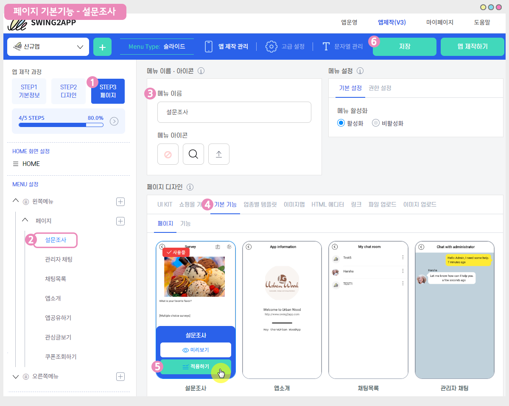
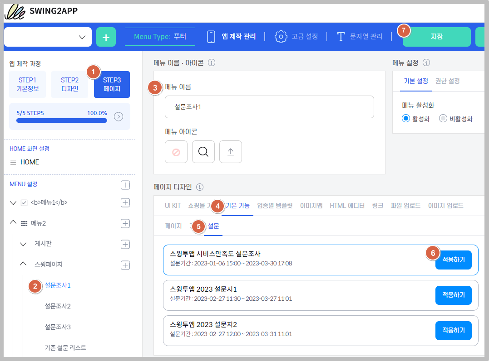
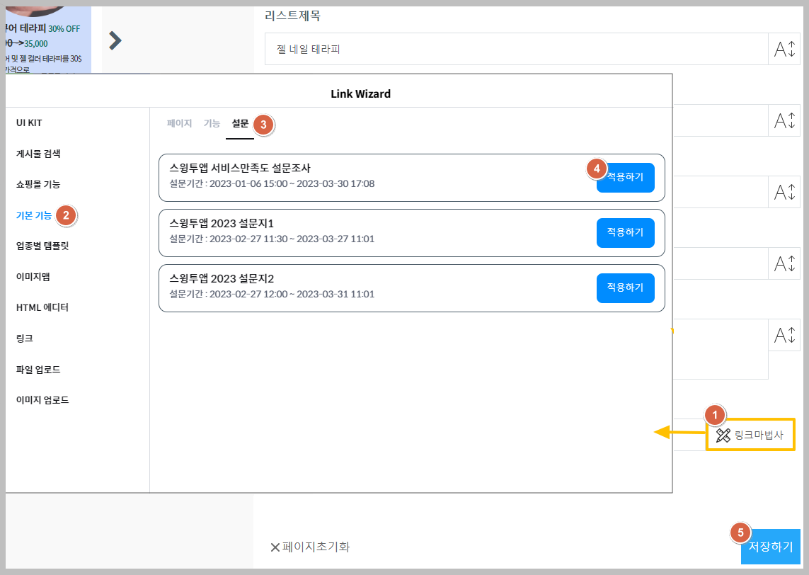
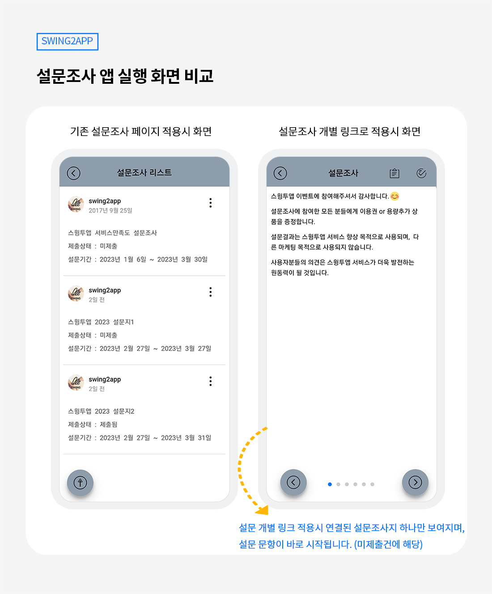

# 설문조사

<figure><figcaption></figcaption></figure>

&#x20;**설문조사 이용방법 정리**

  **설문조사지 만들기** \
앱운영 페이지 → 서비스관리 →설문관리 → \[설문 추가] 버튼을 선택 → 설문조사명, 설문기간 설정 후\
→ \[새 설문항목 추가] 버튼을 눌러서 질문 및 답변 항목을 입력해주시면 됩니다.\
\
\
 **설문지 앱에 적용하는 방법** \
만들어진 설문지는 앱에 적용해주세요.\
앱제작 페이지 → 페이지메뉴 → 메뉴추가 →메뉴이름 →\[스윙 페이지] 불러오기 → ‘설문조사’ 선택 적용 후 저장\
\
\
 **앱에서 설문 참여하기**\
앱을 실행 한뒤 설문조사에 참여할 수 있습니다.\
적용된 메뉴를 선택한 뒤 화면을 터치하면 설문에 참여할 수 있어요.\
**\*설문조사는 앱에 가입된 회원 – 사용자 등급부터 이용할 수 있어요.** \
**손님은 이용할 수 없으니 이용시 참고 부탁드려요.**\
\
\
 **사용자들이 입력한 설문 결과 확인하기**\
앱운영 페이지 → 서비스관리 →설문관리→참여 인원에서 ‘숫자’ 선택 → ‘사용자’를 선택하면 설문 결과를 확인할 수 있습니다.

<figure><figcaption></figcaption></figure>

##  STEP1.설문조사 만들기

### <mark style="color:blue;">**1. 설문관리 메뉴 → 설문추가**</mark>

1\) [**앱운영 페이지 → 서비스관리 → 설문관리**](http://www.swing2app.co.kr/view/survey) 메뉴로 이동합니다.

2\) \[설문추가] 버튼을 선택합니다.&#x20;

### <mark style="color:blue;">**2. 설문조사 관리 – 기본 정보 입력**</mark>

설문조사관리 페이지에서 설문에 필요한 기본 정보를 입력해주세요\~!!

<mark style="color:red;">**\***</mark> <mark style="color:red;"></mark><mark style="color:red;">표시로 되어 있는 항목은 필수적으로 기재해야 하는 항목입니다.</mark>

**1)설문조사명**: 설문조사를 실시할 제목을 입력합니다.

**2)기간설정**: 기간은 설문조사를 실시할 기간을 입력하는 것으로 시작일과 마감일을 날짜와 시간으로 지정합니다.

캘린더 아이콘, 시계 아이콘을 선택해서 일정을 셋팅할 수 있어요.&#x20;

**3)새 설문항목 추가**: 설문 항목관리는 설문지에 들어갈 내용을 입력하는 것으로 오른쪽에 보이는 \[**새 설문항목 추가] 버튼**을 클릭해서 작업합니다.

​+설문조사는 푸시로 설정할 수 있습니다

\+푸시설정을 선택해서 발송대상자를 선택한 뒤 제목, 내용, 이미지를 입력하면 푸시가 발송됩니다.

\+공지사항으로 많은 사용자들에게 설문조사를 알려야 한다면 푸시를 사용하는 것도 좋은 방법입니다. &#x20;

### <mark style="color:blue;">**3. 설문조사 항목 입력**</mark>

기본 설정이 끝났다면, ​설문지에 들어갈 항목을 입력해보겠습니다. ​

**1) 질문내용**: 설문지에 들어갈 질문을 입력합니다.

<mark style="color:red;">\*HTML 에디터 or 간편 에디터 선택</mark>

폰트 설정, 글자 색상, 이미지/파일/링크 첨부 등 다양한 옵션 기능을 이용할 경우 HTML에디터를 선택한 뒤 질문 내용을 입력해주세요.

간편에디터는 글 작성 옵션 기능을 이용할 수 없습니다&#x20;

**2) 안내 페이지로 사용:** 질문에 대해 답변하는 페이지가 아닌 공지글을 작성하는 용도의 안내페이지를 사용할 수 있습니다.

상세 이용방법은 아래에서 설명드릴게요

**3) 필수 항목 여부**: 필수 항목 여부는 해당 질문이 필수로 답변을 해야 하는 질문인지, 답변을 안해도 되는지를 선택하는 항목입니다.

따라서 필수로 답변을 해야 한다면 ‘ 필수답변 항목’에 체크해주세요.

**​4) 답변유형**: 답변유형은 사용자들이 답변을 고를 때 하나만 선택가능한 <mark style="color:orange;">**단일 선택**</mark>인지,

여러개 동시 선택 가능한 <mark style="color:orange;">**다중선택**</mark>인지,&#x20;

글로 입력해야 하는 **서술형 답변**인지를 선택해서 체크해놓도록 합니다.

<mark style="color:purple;">=>답변유형별 입력방법은 아래에서 설명해드릴게요!</mark>

**5) 단일선택 항목만들기**: 보기를 골라서 답변을 채우는 설문지의 경우 **‘답변항목생성’** 아이콘을 클릭해서 항목을 추가할 수 있습니다.

**​6) 저장하기**: 모든 입력이 완료되면 저장하기를 눌러주세요.

### <mark style="color:blue;">**4. 안내 페이지로 사용**</mark>

설문조사 시작시 안내(intro)페이지를 추가할 수 있습니다.

사용자들에게 어떤 설문 내용인지를 소개하고 설명하는 용도로 사용할 수 있습니다.

### <mark style="color:blue;">**5. 답변 유형별 설문지 만들기**</mark>&#x20;

**1) 답변유형- 단일 선택**

(1)질문 내용 입력

(2)필수 항목: 필수로 입력해야 하는 질문이면 ‘필수답변 항목’에 체크, 선택사항이면 체크를 풀어주세요.&#x20;

(3)답변 유형 선택 : 단일선택

(4)답변 항목 생성 : 답변 항목 생성 버튼을 선택해서 보기를 계속 추가할 수 있어요.&#x20;

(5)저장하기 버튼 완료

&#x20;<mark style="color:orange;">**GIF이미지로 단일선택 설문지를 만드는 방법을 확인해주세요**</mark>

**2)답변유형: 다중 선택**

(1)질문 내용 입력

(2)필수 항목: 필수로 입력해야 하는 질문이면 ‘필수답변 항목’에 체크, 선택사항이면 체크를 풀어주세요.&#x20;

(3)답변 유형 선택 : 다중선택

(4)답변 항목 생성 : 답변 항목 생성 버튼을 선택해서 보기를 계속 추가할 수 있어요.&#x20;

(5)저장하기 버튼 완료

<mark style="color:orange;">**GIF이미지로 다중선택 설문지를 만드는 방법을 확인해주세요**</mark>

**3)답변유형: 서술형 답변**&#x20;

(1)질문 내용 입력

(2)필수 항목 여부: 필수로 입력해야 하는 질문이면 ‘필수답변 항목’에 체크, 선택사항이면 체크를 풀어주세요.&#x20;

(3)답변 유형 선택 : 서술형&#x20;

(4)답변영역 안내문구 입력 : 사용자가 기재할 답변 영역이에요.

\*답변 작성시 참고할 수 있도록 안내 문구를 작성할 수 있어요.&#x20;

(5)저장하기 버튼 완료

<mark style="color:orange;">**GIF이미지로 서술형 설문지를 만드는 방법을 확인해주세요**</mark>

### <mark style="color:blue;">6. 설문지 작성 완료</mark>

설문지 기본 설정 및 내용입력이 모두 완료되면 **‘저장하기**‘를 눌러주세요.

설문조사 관리 페이지에 보시면, 등록완료된 설문지를 확인할 수 있습니다\~!

<figure><figcaption></figcaption></figure>

##  STEP2.앱에 설문조사 메뉴 적용하기

앱운영에서 설문조사지를 다 만들었다면, 앱에 적용해서 앱에서 실제 설문조사를 운영할 수 있어야 하겠죠?

앱에 설문조사 메뉴를 적용하는 방법을 알려드릴게요!

### <mark style="color:blue;">**1.앱제작 버전 V3 이용시**</mark>

<figure><figcaption></figcaption></figure>

앱제작 화면 이동

1\)STEP3 페이지 단계로 이동합니다.

2\)새 메뉴를 만들어주세요. (+ 모양 버튼 선택하여 메뉴 추가)

3\)메뉴 이름 입력

4\)페이지 디자인에서 \[기본 기능] -\[페이지]를 선택해주세요.

5\)‘설문조사’ 페이지를 찾아서 \[적용하기] 버튼을 선택해주세요.

(페이지에 마우스 커서를 가져다 대면 적용하기 버튼이 열립니다)

6\)화면 상단 \[저장]버튼을 누르면 앱에 적용됩니다.


미리보기 버튼을 선택하면 해당 페이지가 어떻게 보여지는지 웹 미리보기(가상머신)으로 확인가능하구요.

\*페이지 적용 후에 가상머신을 통해서도 해당 페이지가 어떻게 앱에 적용되는지 확인 가능합니다.

\*제작 단계 중 메뉴 아이콘 , 메뉴 설정은 필수 입력 항목이 아닙니다.

해당 매뉴얼에서는 입력 없이 진행했으며, 앱 제작시 필요할 경우 추가로 적용해주세요.


### <mark style="color:blue;">2.앱제작 버전 V2 이용시</mark>

앱제작 페이지 – 페이지메뉴 단계로 이동합니다.

1\) \[카테고리 추가] 버튼 선택해서 새 메뉴를 만들어주세요.

2\) 메뉴명: 메뉴 이름을 입력합니다.

3\) 메뉴 유형에서 \[스윙 페이지] 선택

4\) \[링크마법사] 버튼을 선택합니다.

5\) 링크마법사 스윙 기능 창에서 \[설문조사] 선택한 뒤,  \[반영] 버튼을 선택합니다.&#x20;

6\) \[적용] 버튼

7\) \[저장] 버튼 눌러주시면 완료됩니다.

### <mark style="color:blue;">3.추가 안내)설문조사 개별 링크 적용하기</mark>

다수의 설문조사를 등록했을 경우 위의 방법(설문조사 페이지)으로 적용시 한 화면에 모든 설문조사지가 보여집니다.

이렇게 모든 설문조사가 보여지는 것이 싫고, 하나의 설문조사(현재 진행중인)만 메뉴에 연결하고 싶다면 아래 방법으로 적용해주세요.

<figure><figcaption></figcaption></figure>

1\)앱제작 이동 STEP3페이지 선택

2\)왼쪽 화면 메뉴 선택

3\)메뉴 이름 입력

4\)'페이지 디자인' 항목에서 \[기본 기능] 선택

5\)\[설문] 선택

6\)적용하고자 하는 설문지 선택 후 \[적용하기]버튼 선택

7\)상단\[저장]버튼 선택

​

\*페이지 제작도구(웹 템플릿, 이미지 페이지, HTML에디터 적용시)에 설문지 개별링크를 적용한다면 아래 방법으로 진행해주세요.

<figure><figcaption></figcaption></figure>

페이지 제작도구 화면으로 이동해서 연결하고자 하는 메뉴 혹은 배너 등을 선택해주세요.

페이지 제작도구는 - 업종별 템플릿 페이지, 이미지 페이지, HTML 에디터 작업시 모두 적용됩니다.

1\)\[링크 마법사]버튼 선택

2\)\[기본 기능] 선택

3\)\[설문] 선택

4\)적용하고자 하는 설문지 선택 후 \[적용하기]버튼 선택

5\)저장하기 버튼 선택

6\)앱제작화면으로 돌아와서 상단 \[저장]버튼 선택해주세요.


**설문조사 개별 링크란**

하나의 설문조사만 선택해서 메뉴에 연결할 수 있도록 추가된 기능입니다.

기존에는 등록한 모든 설문조사가 한 페이지에 보여 졌지만, 업데이트 된 기능에서는 하나의 설문조사만 보여 지도록 개별 링크를 선택해서 메뉴에 연결할 수 있습니다.



**활용 TIP**

\-여러 설문지를 등록한 뒤, 특정 시기 마다 새로운 설문지를 공개할 때 일정에 맞게 하나씩 오픈하여 사용할 수 있어요.

\-아직 시작이 되지 않은 설문지가 공개되지 않도록 활용할 수 있어요.

\-메뉴별 다른 주제의 설문지를 연결해서 사용자들에게 다양한 설문조사지를 받을 때 활용할 수 있어요.


<figure><figcaption></figcaption></figure>

##  STEP3.앱 실행화면

**앱 적용까지 완료했다면 실제 앱에서 설문조사가 어떻게 실행되는지 확인해볼게요!**

설문조사 진행 전에는 상태가 ‘미제출’로 되어 있어요.

해당 항목 선택하면 설문조사지로 이동합니다.

<mark style="color:blue;">**▶ 설문조사 페이지 적용 화면 VS 설문조사 개별 링크 적용화면 비교**</mark>

<figure><figcaption></figcaption></figure>

설문조사 페이지 적용 화면과, 설문조사 개별 링크로 적용한 화면을 확인해주세요.

설문조사 페이지로 적용시 등록된 모든 설문조사가 한 페이지에 모두 활성화되어 보여지구요.

개별 링크 적용시, 연결된 하나의 설문조사만 보여지며 설문이 바로 시작됩니다.

<figure><figcaption></figcaption></figure>

##  STEP4.설문조사 항목 답변하기

### 1.안내페이지

설문조사 문항 시작전 안내(intro)페이지를 추가할 수 있습니다.

사용자들에게 어떤 설문 내용인지를 소개하고 설명하는 용도로 사용할 수 있습니다.

### 2.단일선택 항목

질문에 답변 하나만 선택할 수 있는 단일 선택 문항이구요.

### 3.다중 선택 항목

여러개의 답변을 선택할 수 있는 다중 선택 문항이에요.

### 4.서술형 답변 항목

서술형으로 사용자가 직접 답변을 입력할 수 있는 문항이에요.

이렇게 항목별로 답변을 하면서 설문조사에 응답을 할 수 있습니다.

설문조사가 완료되면 관리자에게 설문조사 결과가 전송됩니다.

제출상태도 ‘제출’로 변경되었음을 확인할 수 있죠?^^

이렇게 전송된 설문조사는  앞에 보여드린 설문조사 관리 페이지에서 관리자가 설문 결과를 확인할 수 있습니다.

<figure><figcaption></figcaption></figure>

##  STEP5.설문조사 결과 확인 & 설문조사 관리

**설문조사 결과를 확인하고 관리하는 방법도 알아야 하겠죠?**

[앱운영 페이지 → 서비스관리 → 설문관리 ](http://www.swing2app.co.kr/view/survey)메뉴로 이동합니다.

설문관리 메뉴에서 진행 중, 마감 된 설문조사를 관리할 수 있구요.

설문에 참여한 회원 관리도 가능해요.

**\*참여 인원을 선택하면 설문조사에 참여한 회원정보를 확인할 수 있으며, 회원을 선택하면 설문 결과 확인이 가능합니다.**

\[download] 버튼을 선택하면 설문결과지를 엑셀 파일로도 다운이 가능합니다.

회원을 선택하면, 해당 회원이 입력한 설문 답변리스트를 확인할 수 있습니다.

**새로운 설문을 추가하거나, 설문 마감 및 수정&삭제 기능을 모두 사용할 수 있습니다.**

**-**<mark style="color:blue;">**‘설문추가**</mark><mark style="color:blue;">‘</mark> 버튼을 선택하면 기존 설문지 외에도 새로운 설문을 추가할 수 있습니다.

**-**<mark style="color:blue;">**‘수정’**</mark> 버튼을 선택해서 질문 내용을 수정할 수 있으며, <mark style="color:blue;">‘</mark><mark style="color:blue;">**삭제**</mark><mark style="color:blue;">‘</mark> 버튼 선택하여 설문을 삭제할 수도 있습니다.

***

<mark style="color:orange;">**설문조사 공유도 가능해요**</mark>

설문조사 메뉴의 **오른쪽 상단의 점 세개 모양** 아이콘을 선택하면, 공유가 가능합니다.

카톡 공유를 선택하면, 설문조사가 카톡으로 공유됩니다!!!

이렇게 다른 사용자들에게 공유를 해서 설문조사가 진행되고 있음을 알릴 수도 있습니다\~!

설문조사 관리 기능은 스윙투앱 사용자라면 누구나 다 사용가능하시기 때문에 매뉴얼 대로 차근차근 따라하신다면 금방 앱 전문가가 되실 수 있을 거에요 ^^

***
