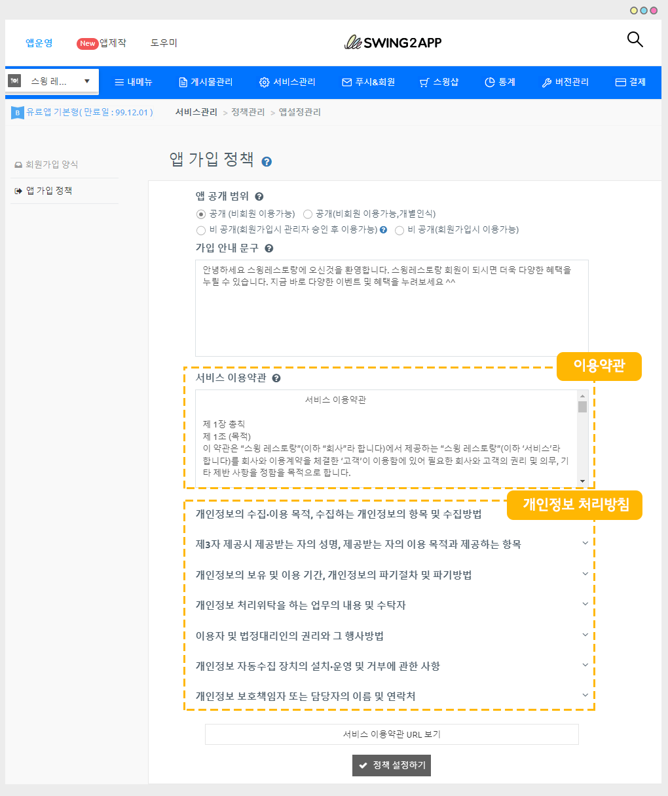

# 앱 이용약관, 개인정보취급방침

<figure><figcaption></figcaption></figure>

**이용약관? 개인정보 처리방침이란?**

앱을 이용하는 사용자들에게 어떤 정보를 수집하는지(개인정보), 앱에서의 필수 이용 정책은 무엇인지를 기재해놓은 약관입니다.

필수 정책이며, 모바일 앱에 반드시 기재해야 하는 내용입니다.



앱 이용약관과 개인 정보 취급방침은 선택사항이 아닌 필수사항으로 반드시 앱에 입력해야 하는 정책사항입니다.

회원가입에서 수집하는 정보는 무엇인지, 해당 정보를 어떻게 사용하고 폐기하는지, 개인정보 이용기간, 개인정보 보호책임자(담당자) 기재 등등 정보통신망법에 의거하여 필수로 해당 정보를 사용자에게 제공을 해야 합니다.

스윙투앱은 사용자가 개발자가 되어 직접 앱을 제작하여 만들기 때문에 이러한 정책 역시 사용자가 직접 앱에 넣어주셔야 합니다.&#x20;

커스터마이징 사용자 역시 이용약관은 앱 서비스에 맞게 직접 수정해서 사용해야 합니다.

스윙투앱에서 는 사용자분들이 직접 내용을 수정해서 작성할 수 있도록 <mark style="color:red;">앱 가입 정책페이지에 이용약관과 개인정보취급방침 내용을 작성할 수 있는 기능을 제공하고 있어요.</mark>

따라서 해당 메뉴를 어떻게 이용하는지 확인해주시면 쉽게 앱에 정책을 반영할 수 있습니다.

 (1).PNG>)

**앱 이용약관과 개인정보 처리방침은 어디서, 어떻게 보여지나요?**

.png>)

**1)앱 실행 후 회원가입 페이지에서 – \[이용약관 확인하기]를 선택하면 내용을 확인할 수 있어요.**

해당 메뉴는 앱 제작시 기본으로 셋팅되어서 제작되기 때문에 사용자가 별도로 넣을 필요는 없구요.

이용약관, 개인정보 처리방침에 들어가는 내용은 변경할 수 있습니다.

2\)앱을 플레이스토어, 앱스토어에 출시할 때에도 출시 정보란에 개인정보 취급방침 URL을 기재하게 됩니다.

필수 등록항목이기 때문에 스토어에 앱을 출시하는 분들 역시 해당 약관을 작성해서 제출해야 합니다.

 (1).PNG>)

###  **1. 앱 가입 정책 페이지 이동**

****[**앱운영 페이지 → 서비스관리 → 정책관리→ \[앱 가입 정책\]** ](http://www.swing2app.co.kr/view/app\_setting)**메뉴로 이동합니다.**

***

### **** (1).png>) **2. 이용약관, 개인정보 취급방침 내용 작성하기**

앱 가입 정책 페이지에서는 **이용약관 외에도 앱 공개 범위 및 가입 안내 문구를 수정**할 수 있는데요.

\*앱 가입정책 : 비공개 앱을 만드는 방법, 회원가입 문구를 수정하는 방법 등 자세한 이용방법은 해당 매뉴얼을 꼭\~ 참고해주시기 바랄게요.

**☞** [**앱 가입정책 이용방법 매뉴얼 확인하기**](app-subscription-policy.md)

서비스 이용약관에 ‘이용약관’ 과 ‘개인정보 처리방침’ 항목을 확인할 수 있어요.

스윙으로 앱을 제작하실 때 꼭 이용약관과 개인정보 처리방침 항목을 함께 작성해주셔야 합니다.

.png)

**이미지에서 보시듯이, 스윙은 어떤 내용으로 정책을 넣어야 할지 어려운 분들을 위해서 멘트를 기본 셋팅을 해놓았어요.**

따라서 좀더 쉽게 작성을 하실 수 있어요.

멘트 수정을 하지 않아도 본 내용이 그대로 앱 이용약관에 반영이 되는데요.

그러나 샘플로 작성해놓은 멘트이기 때문에 상호명, 개인정보책임자 담당자 이름 등 수정하셔야 할 내용이 분명히 있어요\~

내용을 확인하시고, 앱 서비스에 맞게 수정해서 사용하시길 바랍니다.

각 문항별로 오른쪽에 있는 버튼을 선택하면 내용을 작성할 수 있어요.

본 셋팅된 내용에서 어떤 앱을 제공하는지 서비스마다 내용이 달라지기 때문에 사용자가 확인하여서 수정하여 작성해주셔야 합니다.

특히 마지막의 \[개인정보 책임자 또는 담당자 이름, 연락처]는 예시로 작성해놓았기 때문에 실제 관리자로 수정하여 입력해주세요\~!

해당 페이지에서 내용을 수정한 뒤, \[정책 설정하기] 버튼을 누르면 저장됩니다.

<mark style="color:red;">**★ 앱을 처음 제작하는 분들은 꼭 정책 설정하기를 눌러주셔야 앱에 해당 정책 내용이 반영됩니다.**</mark>

<mark style="color:red;">****</mark>


개인정보 처리방침 항목은 7가지로 사용자가 직접 앱의 서비스에 맞게 작성을 해서 넣어주셔야 합니다.

2017년 11월 업데이트 된 항목이구요.

★ 모바일 어플리케이션도 개인정보 처리방침을 제공해야 합니당\~!!

해당 내용은 한국인터넷 진흥원, 방송통신위원회에서 공식적으로 내놓은 정책이구요.

위반할 경우 정보통신망법에 의거하여 벌금이 부여될 수 있으니, 꼭 작성해주세요!!


 (1).PNG>)

### **​**​ **3. 개인정보처리방침 URL 확인 및 가져오기**

작성한 서비스 이용약관은 URL로 확인할 수 있어요.

하단의 \[서비스 이용약관 URL보기]를 선택해주세요.

&#x20;

위의 이미지처럼 이용약관 내용이 담긴 새 웹페이지 창이 뜹니다.

인터넷 주소 창에 URL 주소를 복사하여 필요한 곳에 제출해주시면 됩니다.


**URL은 왜 필요한가요?**

해당 URL은 구글 플레이스토어, 앱스토어 앱 등록에 필요합니다.

구글 플레이스토어와 앱스토어 업로드 신청시 – 스토어 등록정보란에 개인정보 취급방침 URL을 기재해야 합니다.

이때 스윙투앱으로 앱을 제작하신 사용자분들은 해당 서비스이용약관 URL을 복사해서 붙혀넣으면 됩니다!!

따라서 서비스 이용약관은 스윙투에서 기본 셋팅해놓은 내용을 그대로 쓰지 마시고, 꼭 서비스에 맞게끔!! 수정하여 이용해주시기 바랍니다.

(상호명, 앱이름을 수정하지 않고 그대로 쓸 경우 문제가 생길 수 있으니 주의해주세요)

플레이스토어에 개인정보처리방침 링크를 적용하는 방법은 아래 매뉴얼을 참고해주세요.

☞ [\[구글 플레이스토어 개인정보 처리방침 적용방법 확인하기\]](https://wp.swing2app.co.kr/knowledgebase/playstore-policyurl/)


 (1).PNG>)

### **​**​ 4**. **<mark style="color:blue;">****</mark>** 서비스 이용약관 및 개인정보 처리방침 확인 – 앱 실행화면**

회원가입 창 하단에 보시면 **\*이용약관 확인하기** 버튼이 있어요.

해당 버튼을 선택하면 앱 가입정책에서 입력한 서비스 이용약관과 개인정보 처리방침 내용을 확인할 수 있어요.

 (1).PNG>)

### **​**​ 5**. 스토어별 개인정보처리방침 적용 화면 (플레이스토어, 앱스토어)**

위에서 작성한 앱 개인정보처리방침 내용이 플레이스토어, 앱스토어에서는 어떻게 적용되어 보여지는지 확인해볼게요!

****

**1) 플레이스토어 **<mark style="color:orange;">****</mark>&#x20;

플레이스토어에 출시된 앱은 **개발자 연락처 메뉴  – 개인정보처리방침**메뉴에서 확인할 수 있습니다.

선택하면 스윙투앱 앱 가입정책 – 이용약관에서 작성한 페이지가 화면으로 보여집니다.&#x20;

**2) 앱스토어**

앱스토어에 출시된 앱 역시 정보란의 **– 개인정보 취급방침** 메뉴에서 확인할 수 있습니다.

선택하면 스윙투앱 앱 가입정책 – 이용약관에서 작성한 페이지가 화면으로 보여집니다.&#x20;


<mark style="color:red;">**안내사항**</mark>

****

1\)푸시, 웹뷰앱은 사용자분의 웹사이트(홈페이지)를 앱에 연결하여 제작한 웹앱입니다.

따라서 개인정보처리방침은 사용자분의 홈페이지에서 제공하는 개인정보 처리방침 링크로 제출을 해주시면 됩니다.

스윙투앱에서 제공하는 이용약관은 일반 프로토타입 앱(슬라이드, 푸터, 탑 등)으로 제작한 사용자의 앱에서만 적용 가능합니다.

2\)이용약관은 반드시 수정하여 사용해주세요.

내용을 입력하지 않아서 생기는 문제 혹은 내용을 입력했는데 서비스와 다른 내용으로 입력해서 발생되는 문제에 대해서는 스윙투앱에서는 책임지지 않아요.

따라서 꼭 꼼꼼히 확인하여 제작해주시기 바랍니다.

3\)이용약관과 개인정보처림방침은 함께 제공하고 있습니다.

약관에 개인보에 대한 정보까지 모두 제공하고 있으니 위의 서비스 약관만 수정해서 적용하시면 개인정보처리방침 까지 모두 완료됩니다.

4\)스윙투앱에서 제공하는 이용약관은 스윙투앱으로 앱을 제작하는 사용자분들에게 제공되는 서비스에요\~!

그런데 간혹 스윙으로 앱을 제작하지 않고서, 해당 약관 URL만 가져가서 개인정보정책 링크로 사용하시는 분들이 신고 접수가 늘고 있습니다.

**당사 서비스로 앱을 제작하지 않았는데, 당사의 고유 프로그램을 쓰는 것은! 엄연히 프로그램을 무단으로 도용하는 것입니다.**

**따라서 지속적으로 필터링하여 이렇게 당사의 고유 이용정책 URL을 가져다 쓰는 분들은 구글에 신고하여 조치를 할 것입니다.**

구글에 접수되면 앱이 삭제 될 수 있으니 반드시 확인하여 주의해주시기 바랍니다\~!!




****

****
